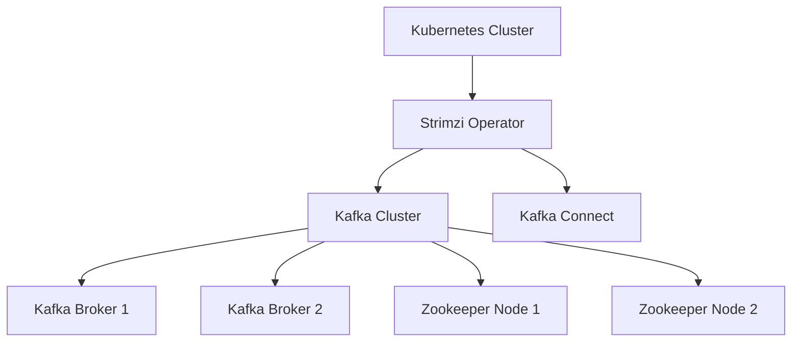
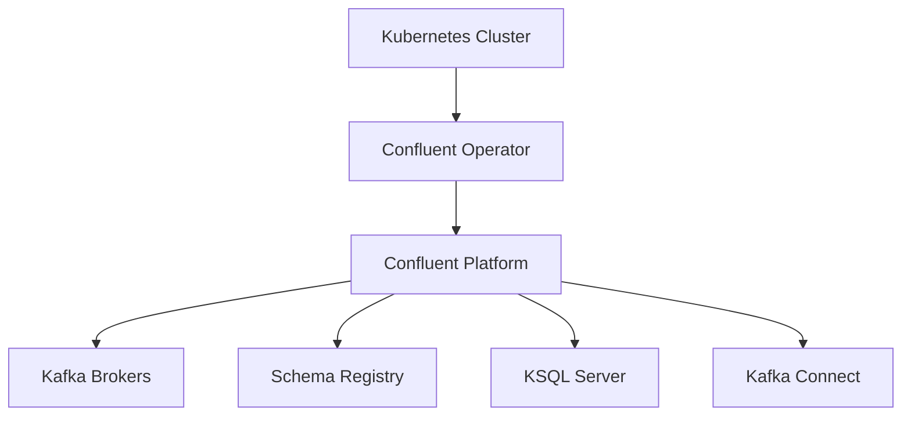

## 18.6 Kubernetes Operators for Kafka

### Introduction

As organizations increasingly adopt cloud-native architectures, Kubernetes has emerged as a leading platform for container orchestration. Apache Kafka, a distributed event streaming platform, is often deployed on Kubernetes to leverage its scalability and resilience. However, managing Kafka clusters on Kubernetes can be complex due to the intricacies of distributed systems. Kubernetes Operators, such as Strimzi and Confluent Operator, simplify this process by automating deployment, scaling, and management tasks. This section explores these operators, their features, and best practices for using them in production environments.

### Understanding Kubernetes Operators

Kubernetes Operators are software extensions that use custom resources to manage applications and their components. They encapsulate operational knowledge in code, automating complex tasks such as deployment, scaling, and upgrades. Operators leverage Kubernetes' native capabilities to manage the lifecycle of applications, ensuring they run efficiently and reliably.

#### Benefits of Using Kubernetes Operators

- **Automation**: Operators automate routine tasks, reducing manual intervention and minimizing human error.
- **Consistency**: They ensure consistent application deployment and management across environments.
- **Scalability**: Operators facilitate horizontal scaling of applications, adapting to varying workloads.
- **Resilience**: By managing application state and configuration, operators enhance system resilience and fault tolerance.

### Strimzi Kafka Operator

Strimzi is an open-source project that provides a Kubernetes Operator for deploying and managing Apache Kafka clusters. It simplifies Kafka operations on Kubernetes, offering features that streamline cluster management.

#### Key Features of Strimzi

- **Cluster Deployment**: Strimzi automates the deployment of Kafka clusters, including brokers, Zookeeper nodes, and Kafka Connect.
- **Scaling**: It supports horizontal scaling of Kafka brokers and Zookeeper nodes to handle increased workloads.
- **Rolling Updates**: Strimzi facilitates rolling updates, ensuring minimal downtime during upgrades.
- **Monitoring and Alerts**: Integration with Prometheus and Grafana provides monitoring and alerting capabilities.
- **Security**: Strimzi supports TLS encryption and authentication mechanisms like OAuth.

#### Strimzi Architecture



*Figure 1: Strimzi Architecture - The Strimzi Operator manages the lifecycle of Kafka clusters within a Kubernetes environment.*

#### Installation and Configuration

To deploy Strimzi, follow these steps:

1. **Install the Strimzi Operator**:
   ```bash
   kubectl create namespace kafka
   kubectl apply -f 'https://strimzi.io/install/latest?namespace=kafka'
   ```

2. **Deploy a Kafka Cluster**:
   ```yaml
   apiVersion: kafka.strimzi.io/v1beta2
   kind: Kafka
   metadata:
     name: my-cluster
     namespace: kafka
   spec:
     kafka:
       version: 3.0.0
       replicas: 3
       listeners:
         plain: {}
         tls: {}
       storage:
         type: persistent-claim
         size: 100Gi
         class: standard
     zookeeper:
       replicas: 3
       storage:
         type: persistent-claim
         size: 100Gi
         class: standard
     entityOperator:
       topicOperator: {}
       userOperator: {}
   ```

3. **Apply the Configuration**:
   ```bash
   kubectl apply -f kafka-cluster.yaml
   ```

### Confluent Operator

Confluent Operator is a commercial offering by Confluent that provides enterprise-grade management of Kafka clusters on Kubernetes. It extends Kubernetes capabilities to manage Confluent Platform components, offering advanced features for production environments.

#### Key Features of Confluent Operator

- **Comprehensive Management**: Supports deployment and management of the entire Confluent Platform, including Kafka, Schema Registry, and KSQL.
- **Advanced Security**: Provides robust security features, including RBAC and encryption.
- **High Availability**: Ensures high availability through automated failover and recovery mechanisms.
- **Monitoring and Logging**: Integrates with monitoring tools for comprehensive observability.
- **Enterprise Support**: Offers enterprise-grade support and SLAs.

#### Confluent Operator Architecture



*Figure 2: Confluent Operator Architecture - The Confluent Operator manages the deployment and lifecycle of Confluent Platform components within a Kubernetes environment.*

#### Installation and Configuration

To deploy Confluent Operator, follow these steps:

1. **Install the Confluent Operator**:
   ```bash
   helm repo add confluentinc https://packages.confluent.io/helm
   helm install confluent-operator confluentinc/confluent-operator
   ```

2. **Deploy a Kafka Cluster**:
   ```yaml
   apiVersion: platform.confluent.io/v1beta1
   kind: Kafka
   metadata:
     name: my-confluent-cluster
     namespace: confluent
   spec:
     replicas: 3
     listeners:
       external:
         type: loadbalancer
     storage:
       type: persistent-claim
       size: 100Gi
       class: standard
   ```

3. **Apply the Configuration**:
   ```bash
   kubectl apply -f confluent-cluster.yaml
   ```

### Automating Tasks with Operators

Kubernetes Operators like Strimzi and Confluent Operator automate various tasks, enhancing operational efficiency and reliability.

#### Deployment Automation

Operators automate the deployment of Kafka clusters, ensuring consistent and repeatable processes. They manage the creation of Kubernetes resources, such as pods, services, and persistent volumes, required for Kafka clusters.

#### Scaling and Upgrades

Operators facilitate horizontal scaling by automatically adjusting the number of Kafka brokers and Zookeeper nodes based on workload demands. They also manage rolling upgrades, ensuring minimal downtime and service disruption.

#### Monitoring and Logging

Operators integrate with monitoring and logging tools, providing insights into cluster performance and health. They enable proactive monitoring and alerting, helping teams identify and resolve issues promptly.

### Best Practices for Using Operators in Production

- **Resource Management**: Allocate sufficient resources for Kafka brokers and Zookeeper nodes to ensure optimal performance.
- **Security**: Implement robust security measures, including TLS encryption and authentication mechanisms.
- **Monitoring**: Use monitoring tools like Prometheus and Grafana to track cluster performance and health.
- **Backup and Recovery**: Implement backup and recovery strategies to safeguard data and ensure business continuity.
- **Testing**: Test operator configurations in staging environments before deploying to production.

### Conclusion

Kubernetes Operators like Strimzi and Confluent Operator simplify the deployment and management of Kafka clusters on Kubernetes platforms. By automating complex tasks, they enhance operational efficiency, scalability, and resilience. Implementing best practices ensures reliable and secure Kafka deployments, enabling organizations to leverage the full potential of Kafka in cloud-native environments.

### References and Links

- Strimzi Kafka Operator: [Strimzi Kafka Operator](https://strimzi.io/)
- Confluent Operator: [Confluent Operator](https://docs.confluent.io/operator/current/overview.html)
- Apache Kafka Documentation: [Apache Kafka Documentation](https://kafka.apache.org/documentation/)
- Confluent Documentation: [Confluent Documentation](https://docs.confluent.io/)

---

## Test Your Knowledge: Kubernetes Operators for Kafka Quiz



### What is the primary benefit of using Kubernetes Operators for Kafka?

- [x] Automation of deployment and management tasks
- [ ] Increased manual control over configurations
- [ ] Reduced need for monitoring
- [ ] Elimination of all security concerns

> **Explanation:** Kubernetes Operators automate complex deployment and management tasks, reducing manual intervention and enhancing operational efficiency.

### Which of the following is a feature of the Strimzi Kafka Operator?

- [x] Rolling updates
- [ ] Built-in data encryption
- [ ] Manual scaling only
- [ ] No support for monitoring

> **Explanation:** Strimzi supports rolling updates, allowing for minimal downtime during upgrades.

### What does the Confluent Operator provide that is particularly beneficial for enterprise environments?

- [x] Enterprise-grade support and SLAs
- [ ] Only basic Kafka deployment capabilities
- [ ] Limited monitoring options
- [ ] No integration with other Confluent Platform components

> **Explanation:** Confluent Operator offers enterprise-grade support and SLAs, making it suitable for production environments.

### How do Kubernetes Operators enhance the scalability of Kafka clusters?

- [x] By facilitating horizontal scaling
- [ ] By reducing the number of brokers
- [ ] By disabling automatic scaling
- [ ] By limiting resource allocation

> **Explanation:** Operators facilitate horizontal scaling, allowing Kafka clusters to adapt to varying workloads.

### Which tool is commonly used with Kubernetes Operators for monitoring Kafka clusters?

- [x] Prometheus
- [ ] Jenkins
- [ ] Terraform
- [ ] Ansible

> **Explanation:** Prometheus is commonly used for monitoring Kafka clusters managed by Kubernetes Operators.

### What is a key security feature supported by Strimzi?

- [x] TLS encryption
- [ ] No authentication
- [ ] Manual password management
- [ ] Limited access control

> **Explanation:** Strimzi supports TLS encryption, enhancing the security of Kafka clusters.

### Which of the following is a best practice for using Kubernetes Operators in production?

- [x] Implementing robust security measures
- [ ] Disabling monitoring tools
- [ ] Allocating minimal resources
- [ ] Avoiding backup strategies

> **Explanation:** Implementing robust security measures is essential for protecting Kafka clusters in production environments.

### What is the role of Kubernetes Operators in managing Kafka cluster upgrades?

- [x] They manage rolling upgrades
- [ ] They prevent all upgrades
- [ ] They require manual intervention for upgrades
- [ ] They only support downgrades

> **Explanation:** Operators manage rolling upgrades, ensuring minimal downtime during the process.

### Which of the following is a feature of the Confluent Operator?

- [x] High availability through automated failover
- [ ] No support for Schema Registry
- [ ] Limited to single-node deployments
- [ ] Manual logging configuration

> **Explanation:** Confluent Operator ensures high availability through automated failover mechanisms.

### True or False: Kubernetes Operators eliminate the need for monitoring Kafka clusters.

- [ ] True
- [x] False

> **Explanation:** While Kubernetes Operators automate many tasks, monitoring is still essential to ensure the health and performance of Kafka clusters.



---
