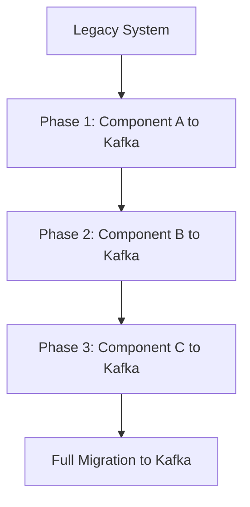
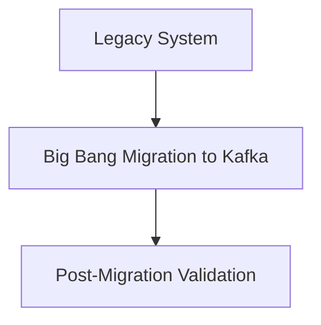
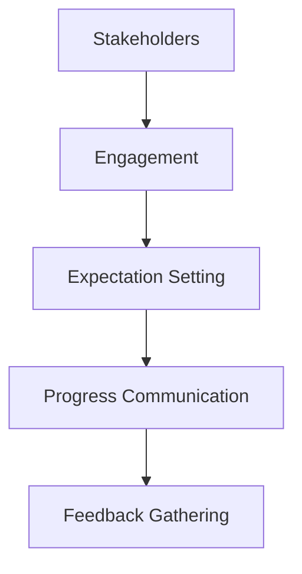

## 19.2.2 Strategies for Successful Migration

Migrating legacy systems to Apache Kafka is a transformative process that can significantly enhance an organization's data processing capabilities. However, it requires careful planning and execution to ensure a smooth transition with minimal impact on business operations. This section provides a comprehensive guide to successful migration strategies, focusing on phased migration versus big bang approaches, mapping legacy functionalities to Kafka, stakeholder involvement, and maintaining data consistency and integrity.

### Phased Migration vs. Big Bang Approach

#### Phased Migration

**Description**: A phased migration involves gradually transitioning components of a legacy system to Kafka over time. This approach minimizes risk by allowing for incremental testing and validation of each phase.

**Advantages**:
- **Reduced Risk**: By migrating in stages, you can identify and address issues early, reducing the risk of major disruptions.
- **Flexibility**: Allows for adjustments based on feedback and changing requirements.
- **Continuous Operation**: Legacy systems can continue to operate alongside Kafka, ensuring business continuity.

**Implementation Steps**:
1. **Identify Components**: Break down the legacy system into smaller, manageable components.
2. **Prioritize Migration**: Determine the order of migration based on business priorities and technical dependencies.
3. **Develop Integration Points**: Create interfaces between legacy systems and Kafka to facilitate data flow during the transition.
4. **Test and Validate**: Conduct thorough testing at each phase to ensure functionality and performance.
5. **Monitor and Adjust**: Continuously monitor the system and make necessary adjustments based on performance metrics and feedback.

**Diagram**:



**Caption**: Phased migration approach from a legacy system to Apache Kafka.

#### Big Bang Approach

**Description**: The big bang approach involves migrating the entire legacy system to Kafka in a single, comprehensive effort. This approach is suitable for systems with fewer dependencies or when a rapid transition is necessary.

**Advantages**:
- **Speed**: The entire system is migrated at once, reducing the overall timeline.
- **Simplicity**: Eliminates the need for temporary integration solutions between legacy systems and Kafka.

**Implementation Steps**:
1. **Comprehensive Planning**: Develop a detailed migration plan covering all aspects of the legacy system.
2. **Resource Allocation**: Ensure sufficient resources are available for the migration, including personnel, hardware, and software.
3. **Testing Environment**: Set up a parallel testing environment to simulate the migration process and identify potential issues.
4. **Execution**: Execute the migration plan, ensuring all components are transitioned simultaneously.
5. **Post-Migration Validation**: Conduct extensive testing to validate the new system's functionality and performance.

**Diagram**:



**Caption**: Big bang migration approach from a legacy system to Apache Kafka.

### Mapping Legacy System Functionalities to Kafka

**Description**: Mapping legacy system functionalities to Kafka involves translating existing processes and data flows into Kafka's architecture and capabilities.

**Steps**:
1. **Analyze Legacy Processes**: Document existing processes, data flows, and dependencies within the legacy system.
2. **Identify Kafka Equivalents**: Determine how Kafka can replicate or enhance these processes using its features such as topics, partitions, and consumer groups.
3. **Design Kafka Architecture**: Develop a Kafka architecture that aligns with the organization's data processing needs and goals.
4. **Implement Data Transformation**: Use tools like Kafka Connect and Kafka Streams to transform and route data from legacy systems to Kafka.
5. **Validate Functionality**: Ensure that the new Kafka-based system replicates the legacy system's functionality and meets business requirements.

**Example**:

- **Legacy Batch Processing**: Convert batch processing jobs to real-time stream processing using Kafka Streams.
- **File-Based Data Transfer**: Replace file-based data transfer with Kafka topics for real-time data ingestion and distribution.

### Stakeholder Involvement and Expectation Management

**Description**: Successful migration requires active involvement from stakeholders across the organization to ensure alignment and manage expectations.

**Steps**:
1. **Identify Stakeholders**: Determine key stakeholders, including business leaders, IT teams, and end-users.
2. **Engage Stakeholders**: Conduct regular meetings and workshops to gather input and address concerns.
3. **Set Clear Expectations**: Define the scope, timeline, and expected outcomes of the migration project.
4. **Communicate Progress**: Provide regular updates on the migration's progress and any challenges encountered.
5. **Gather Feedback**: Solicit feedback from stakeholders to identify areas for improvement and ensure satisfaction.

**Diagram**:



**Caption**: Stakeholder involvement and expectation management process.

### Maintaining Data Consistency and Integrity

**Description**: Ensuring data consistency and integrity during migration is critical to maintaining trust and reliability in the new system.

**Strategies**:
1. **Data Validation**: Implement data validation checks to ensure data accuracy and completeness during migration.
2. **Use of Schema Registry**: Leverage [1.3.3 Schema Registry]( "Schema Registry") to enforce data schemas and prevent schema evolution issues.
3. **Transactional Messaging**: Utilize Kafka's transactional messaging capabilities to ensure atomicity and consistency in data processing.
4. **Data Reconciliation**: Perform data reconciliation to compare data between legacy systems and Kafka, identifying discrepancies and resolving them.
5. **Backup and Recovery**: Implement robust backup and recovery procedures to protect data during migration.

**Example Code**:

- **Java**:

    ```java
    // Example of using Kafka transactions to ensure data consistency
    Properties props = new Properties();
    props.put(ProducerConfig.BOOTSTRAP_SERVERS_CONFIG, "localhost:9092");
    props.put(ProducerConfig.KEY_SERIALIZER_CLASS_CONFIG, "org.apache.kafka.common.serialization.StringSerializer");
    props.put(ProducerConfig.VALUE_SERIALIZER_CLASS_CONFIG, "org.apache.kafka.common.serialization.StringSerializer");
    props.put(ProducerConfig.ENABLE_IDEMPOTENCE_CONFIG, true); // Enable idempotence
    props.put(ProducerConfig.TRANSACTIONAL_ID_CONFIG, "my-transactional-id");

    KafkaProducer<String, String> producer = new KafkaProducer<>(props);
    producer.initTransactions();

    try {
        producer.beginTransaction();
        producer.send(new ProducerRecord<>("my-topic", "key", "value"));
        // Additional send operations
        producer.commitTransaction();
    } catch (ProducerFencedException | OutOfOrderSequenceException | AuthorizationException e) {
        // Fatal errors, cannot recover
        producer.close();
    } catch (KafkaException e) {
        // Abort transaction on other errors
        producer.abortTransaction();
    }
    ```

- **Scala**:

    ```scala
    import java.util.Properties
    import org.apache.kafka.clients.producer.{KafkaProducer, ProducerConfig, ProducerRecord}

    val props = new Properties()
    props.put(ProducerConfig.BOOTSTRAP_SERVERS_CONFIG, "localhost:9092")
    props.put(ProducerConfig.KEY_SERIALIZER_CLASS_CONFIG, "org.apache.kafka.common.serialization.StringSerializer")
    props.put(ProducerConfig.VALUE_SERIALIZER_CLASS_CONFIG, "org.apache.kafka.common.serialization.StringSerializer")
    props.put(ProducerConfig.ENABLE_IDEMPOTENCE_CONFIG, "true")
    props.put(ProducerConfig.TRANSACTIONAL_ID_CONFIG, "my-transactional-id")

    val producer = new KafkaProducer[String, String](props)
    producer.initTransactions()

    try {
      producer.beginTransaction()
      producer.send(new ProducerRecord[String, String]("my-topic", "key", "value"))
      // Additional send operations
      producer.commitTransaction()
    } catch {
      case e: Exception =>
        producer.abortTransaction()
    }
    ```

- **Kotlin**:

    ```kotlin
    import org.apache.kafka.clients.producer.KafkaProducer
    import org.apache.kafka.clients.producer.ProducerConfig
    import org.apache.kafka.clients.producer.ProducerRecord
    import java.util.Properties

    val props = Properties().apply {
        put(ProducerConfig.BOOTSTRAP_SERVERS_CONFIG, "localhost:9092")
        put(ProducerConfig.KEY_SERIALIZER_CLASS_CONFIG, "org.apache.kafka.common.serialization.StringSerializer")
        put(ProducerConfig.VALUE_SERIALIZER_CLASS_CONFIG, "org.apache.kafka.common.serialization.StringSerializer")
        put(ProducerConfig.ENABLE_IDEMPOTENCE_CONFIG, true)
        put(ProducerConfig.TRANSACTIONAL_ID_CONFIG, "my-transactional-id")
    }

    val producer = KafkaProducer<String, String>(props)
    producer.initTransactions()

    try {
        producer.beginTransaction()
        producer.send(ProducerRecord("my-topic", "key", "value"))
        // Additional send operations
        producer.commitTransaction()
    } catch (e: Exception) {
        producer.abortTransaction()
    }
    ```

- **Clojure**:

    ```clojure
    (require '[clojure.java.io :as io])
    (import '[org.apache.kafka.clients.producer KafkaProducer ProducerConfig ProducerRecord])

    (def props
      (doto (java.util.Properties.)
        (.put ProducerConfig/BOOTSTRAP_SERVERS_CONFIG "localhost:9092")
        (.put ProducerConfig/KEY_SERIALIZER_CLASS_CONFIG "org.apache.kafka.common.serialization.StringSerializer")
        (.put ProducerConfig/VALUE_SERIALIZER_CLASS_CONFIG "org.apache.kafka.common.serialization.StringSerializer")
        (.put ProducerConfig/ENABLE_IDEMPOTENCE_CONFIG true)
        (.put ProducerConfig/TRANSACTIONAL_ID_CONFIG "my-transactional-id")))

    (def producer (KafkaProducer. props))
    (.initTransactions producer)

    (try
      (.beginTransaction producer)
      (.send producer (ProducerRecord. "my-topic" "key" "value"))
      ;; Additional send operations
      (.commitTransaction producer)
      (catch Exception e
        (.abortTransaction producer)))
    ```

### Conclusion

Migrating legacy systems to Apache Kafka is a complex but rewarding endeavor that can unlock significant benefits in terms of scalability, real-time processing, and data integration. By carefully selecting the appropriate migration strategy, mapping legacy functionalities to Kafka, involving stakeholders, and ensuring data consistency, organizations can achieve a successful transition with minimal disruption to business operations.

### Knowledge Check: Test Your Understanding of Migration Strategies



### What is a key advantage of a phased migration approach?

- [x] Reduced risk through incremental testing
- [ ] Faster overall migration timeline
- [ ] Simplicity in execution
- [ ] Eliminates need for temporary integration solutions

> **Explanation:** A phased migration approach reduces risk by allowing for incremental testing and validation of each phase, ensuring issues can be identified and addressed early.

### In a big bang migration, what is a critical step before execution?

- [x] Setting up a parallel testing environment
- [ ] Engaging stakeholders
- [ ] Mapping legacy functionalities
- [ ] Data reconciliation

> **Explanation:** Setting up a parallel testing environment is crucial in a big bang migration to simulate the process and identify potential issues before execution.

### How can data consistency be maintained during migration?

- [x] Using Kafka's transactional messaging capabilities
- [ ] Relying solely on manual checks
- [ ] Ignoring schema evolution
- [ ] Disabling data validation

> **Explanation:** Kafka's transactional messaging capabilities ensure atomicity and consistency in data processing, maintaining data consistency during migration.

### What is the role of stakeholders in a migration project?

- [x] Providing input and addressing concerns
- [ ] Developing integration points
- [ ] Writing code for data transformation
- [ ] Setting up testing environments

> **Explanation:** Stakeholders provide input, address concerns, and ensure alignment with business goals, which is crucial for a successful migration.

### Which tool can be used for data transformation during migration?

- [x] Kafka Connect
- [ ] Apache Flink
- [ ] Hadoop
- [ ] Spark

> **Explanation:** Kafka Connect is used for data transformation and routing from legacy systems to Kafka, facilitating the migration process.

### What is a benefit of using the Schema Registry during migration?

- [x] Enforcing data schemas and preventing schema evolution issues
- [ ] Simplifying stakeholder engagement
- [ ] Speeding up the migration process
- [ ] Reducing the need for testing

> **Explanation:** The Schema Registry enforces data schemas, preventing schema evolution issues and ensuring data consistency during migration.

### What is the first step in mapping legacy system functionalities to Kafka?

- [x] Analyzing legacy processes
- [ ] Engaging stakeholders
- [ ] Developing integration points
- [ ] Setting up a testing environment

> **Explanation:** Analyzing legacy processes is the first step in mapping functionalities to Kafka, as it helps document existing processes and dependencies.

### How can data integrity be ensured during migration?

- [x] Implementing data validation checks
- [ ] Ignoring discrepancies
- [ ] Relying on manual reconciliation
- [ ] Disabling transactional messaging

> **Explanation:** Implementing data validation checks ensures data accuracy and completeness, maintaining data integrity during migration.

### What is a key consideration when choosing between phased and big bang migration?

- [x] Business priorities and technical dependencies
- [ ] Stakeholder engagement
- [ ] Data transformation tools
- [ ] Testing environment setup

> **Explanation:** Business priorities and technical dependencies are key considerations when choosing between phased and big bang migration approaches.

### True or False: The big bang approach is always faster than phased migration.

- [ ] True
- [x] False

> **Explanation:** While the big bang approach involves migrating the entire system at once, it is not always faster due to the complexity and potential for issues that can arise during execution.


