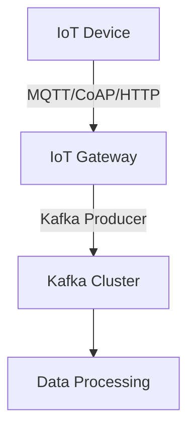

## 19.4.1 Collecting and Processing Sensor Data

### Introduction

In the era of the Internet of Things (IoT), the ability to collect and process sensor data efficiently is crucial for building responsive and intelligent systems. Apache Kafka, with its robust distributed architecture, offers a powerful platform for ingesting, processing, and analyzing real-time data from IoT devices. This section explores how to connect IoT devices to Kafka, discusses suitable data serialization formats, and provides examples of processing pipelines for sensor data. We will also cover considerations for data compression and optimization to ensure scalable and reliable data collection.

### Connecting IoT Devices to Kafka

#### IoT Gateways

IoT devices often communicate using protocols such as MQTT, CoAP, or HTTP, which are not natively supported by Kafka. To bridge this gap, IoT gateways are employed. These gateways act as intermediaries, translating device-specific protocols into Kafka-compatible messages.

- **MQTT to Kafka**: MQTT is a lightweight messaging protocol commonly used in IoT. An MQTT broker can be configured to publish messages to Kafka topics. Tools like Kafka Connect MQTT Source Connector facilitate this integration.
- **CoAP to Kafka**: CoAP (Constrained Application Protocol) is another protocol used in IoT. A CoAP-to-Kafka bridge can be implemented to convert CoAP messages into Kafka events.
- **HTTP to Kafka**: For devices that use HTTP, a RESTful API can be set up to receive data and forward it to Kafka.

#### Edge Computing

In scenarios where low latency is critical, edge computing can be leveraged. By processing data closer to the source, edge devices can filter and preprocess data before sending it to Kafka, reducing bandwidth usage and improving response times.



*Diagram 1: IoT Device to Kafka Data Flow*

### Data Serialization Formats

Choosing the right data serialization format is essential for efficient data transmission and processing. Common formats include:

- **Avro**: Avro is a compact binary format that supports schema evolution, making it ideal for IoT data where schemas may change over time.
- **Protobuf**: Google's Protocol Buffers offer efficient serialization with a focus on performance, suitable for high-throughput environments.
- **JSON**: While more verbose, JSON is human-readable and widely used, making it a good choice for debugging and scenarios where readability is prioritized.

#### Example: Avro Schema for Sensor Data

```json
{
  "type": "record",
  "name": "SensorData",
  "fields": [
    {"name": "sensorId", "type": "string"},
    {"name": "timestamp", "type": "long"},
    {"name": "temperature", "type": "float"},
    {"name": "humidity", "type": "float"}
  ]
}
```

### Processing Pipelines for Sensor Data

#### Kafka Streams

Kafka Streams is a powerful library for building real-time processing applications. It allows for complex transformations and aggregations on data streams.

- **Stateless Transformations**: Operations like filtering and mapping that do not require maintaining state.
- **Stateful Transformations**: Operations like aggregations and joins that require maintaining state across records.

#### Example: Real-Time Temperature Monitoring

**Java Example**

```java
import org.apache.kafka.streams.KafkaStreams;
import org.apache.kafka.streams.StreamsBuilder;
import org.apache.kafka.streams.kstream.KStream;

public class TemperatureMonitor {
    public static void main(String[] args) {
        StreamsBuilder builder = new StreamsBuilder();
        KStream<String, String> sensorData = builder.stream("sensor-data");

        sensorData.filter((key, value) -> {
            // Parse the JSON and check temperature
            float temperature = parseTemperature(value);
            return temperature > 30.0;
        }).to("high-temperature-alerts");

        KafkaStreams streams = new KafkaStreams(builder.build(), getConfig());
        streams.start();
    }

    private static float parseTemperature(String value) {
        // Implement JSON parsing logic
        return 0.0f;
    }

    private static Properties getConfig() {
        Properties props = new Properties();
        props.put("application.id", "temperature-monitor");
        props.put("bootstrap.servers", "localhost:9092");
        return props;
    }
}
```

**Scala Example**

```scala
import org.apache.kafka.streams.scala._
import org.apache.kafka.streams.scala.kstream._

object TemperatureMonitor extends App {
  val builder = new StreamsBuilder()
  val sensorData: KStream[String, String] = builder.stream[String, String]("sensor-data")

  sensorData.filter((_, value) => parseTemperature(value) > 30.0)
    .to("high-temperature-alerts")

  val streams = new KafkaStreams(builder.build(), getConfig)
  streams.start()

  def parseTemperature(value: String): Float = {
    // Implement JSON parsing logic
    0.0f
  }

  def getConfig: Properties = {
    val props = new Properties()
    props.put("application.id", "temperature-monitor")
    props.put("bootstrap.servers", "localhost:9092")
    props
  }
}
```

### Data Compression and Optimization

#### Compression Techniques

Data compression is crucial for reducing storage costs and improving network efficiency. Kafka supports several compression codecs:

- **GZIP**: Offers high compression ratios but may impact performance due to CPU overhead.
- **Snappy**: Provides fast compression and decompression with moderate compression ratios.
- **LZ4**: Known for its speed, suitable for scenarios where low latency is critical.

#### Optimization Strategies

- **Batch Processing**: Grouping multiple records into a single batch can reduce overhead and improve throughput.
- **Partitioning**: Proper partitioning ensures balanced load distribution across Kafka brokers, enhancing performance and scalability.

### Real-World Scenarios

#### Smart City Infrastructure

In a smart city, sensors deployed across various locations collect data on traffic, weather, and pollution levels. Kafka serves as the backbone for ingesting and processing this data in real-time, enabling city planners to make informed decisions.

#### Industrial IoT

In manufacturing, IoT devices monitor equipment health and performance. Kafka streams this data to predictive maintenance systems, reducing downtime and improving operational efficiency.

### Conclusion

Collecting and processing sensor data with Apache Kafka involves a combination of robust data ingestion, efficient serialization, and real-time processing capabilities. By leveraging Kafka's distributed architecture, organizations can build scalable and reliable systems that harness the full potential of IoT data.

## Test Your Knowledge: Advanced IoT Data Processing with Kafka Quiz



### What is the primary role of an IoT gateway in connecting devices to Kafka?

- [x] Translating device-specific protocols into Kafka-compatible messages.
- [ ] Storing data temporarily before sending it to Kafka.
- [ ] Compressing data for efficient transmission.
- [ ] Monitoring device health and performance.

> **Explanation:** IoT gateways act as intermediaries that translate protocols like MQTT, CoAP, or HTTP into Kafka-compatible messages, enabling seamless integration with Kafka.

### Which serialization format is known for supporting schema evolution, making it suitable for IoT data?

- [x] Avro
- [ ] JSON
- [ ] Protobuf
- [ ] XML

> **Explanation:** Avro is a compact binary format that supports schema evolution, making it ideal for IoT data where schemas may change over time.

### What is a key advantage of using edge computing in IoT data processing?

- [x] Reducing bandwidth usage and improving response times.
- [ ] Increasing data storage capacity.
- [ ] Enhancing data encryption.
- [ ] Simplifying device management.

> **Explanation:** Edge computing processes data closer to the source, reducing bandwidth usage and improving response times by filtering and preprocessing data before sending it to Kafka.

### Which Kafka Streams operation requires maintaining state across records?

- [x] Stateful Transformations
- [ ] Stateless Transformations
- [ ] Filtering
- [ ] Mapping

> **Explanation:** Stateful transformations, such as aggregations and joins, require maintaining state across records, unlike stateless transformations like filtering and mapping.

### Which compression codec is known for its speed and is suitable for low-latency scenarios?

- [x] LZ4
- [ ] GZIP
- [ ] Snappy
- [ ] BZIP2

> **Explanation:** LZ4 is known for its speed and is suitable for scenarios where low latency is critical, providing fast compression and decompression.

### What is the benefit of using batch processing in Kafka?

- [x] Reducing overhead and improving throughput.
- [ ] Increasing data security.
- [ ] Simplifying data serialization.
- [ ] Enhancing data visualization.

> **Explanation:** Batch processing groups multiple records into a single batch, reducing overhead and improving throughput by minimizing the number of requests.

### In a smart city scenario, what type of data might sensors collect?

- [x] Traffic, weather, and pollution levels.
- [ ] Personal health data.
- [ ] Financial transactions.
- [ ] Social media interactions.

> **Explanation:** In a smart city, sensors collect data on traffic, weather, and pollution levels to enable informed decision-making by city planners.

### Which tool facilitates the integration of MQTT with Kafka?

- [x] Kafka Connect MQTT Source Connector
- [ ] Kafka Streams
- [ ] Kafka Producer API
- [ ] Kafka Consumer API

> **Explanation:** The Kafka Connect MQTT Source Connector facilitates the integration of MQTT with Kafka by translating MQTT messages into Kafka events.

### What is a common use case for Kafka in industrial IoT?

- [x] Streaming data to predictive maintenance systems.
- [ ] Managing employee schedules.
- [ ] Processing financial transactions.
- [ ] Monitoring social media trends.

> **Explanation:** In industrial IoT, Kafka streams data from IoT devices to predictive maintenance systems, reducing downtime and improving operational efficiency.

### True or False: JSON is the most efficient serialization format for high-throughput environments.

- [ ] True
- [x] False

> **Explanation:** JSON is more verbose and less efficient compared to binary formats like Avro or Protobuf, making it less suitable for high-throughput environments.



---

This comprehensive guide provides a deep dive into the intricacies of collecting and processing sensor data using Apache Kafka, offering expert insights and practical examples to help you build robust IoT data processing systems.
