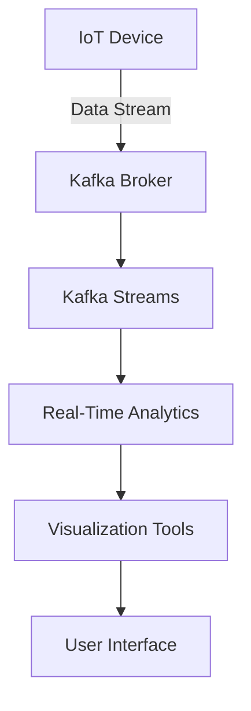

## 19.4.2 Real-Time Analytics for IoT

### Introduction

In the era of the Internet of Things (IoT), the ability to process and analyze data in real-time is crucial for deriving actionable insights and making informed decisions. Apache Kafka, with its robust streaming capabilities, has emerged as a key enabler of real-time analytics in IoT environments. This section delves into the significance of low-latency processing, explores real-time analytics applications such as anomaly detection, and provides a comprehensive guide on implementing streaming analytics using Kafka. Additionally, it addresses the challenges of handling out-of-order data and ensuring time synchronization.

### The Importance of Low-Latency Processing in IoT

Low-latency processing is vital in IoT applications where timely insights can significantly impact outcomes. For instance, in industrial IoT, real-time monitoring of machinery can prevent costly downtimes by detecting anomalies early. Similarly, in smart cities, real-time traffic data can optimize traffic flow and reduce congestion. The ability to process data with minimal delay allows organizations to respond swiftly to changing conditions, enhancing operational efficiency and improving user experiences.

### Real-Time Analytics Applications

#### Anomaly Detection

Anomaly detection is a critical application of real-time analytics in IoT. By continuously monitoring data streams, organizations can identify unusual patterns or deviations from expected behavior, which may indicate potential issues or opportunities. For example, in a smart grid, detecting anomalies in energy consumption can help identify faults or inefficiencies in the system.

#### Predictive Maintenance

Predictive maintenance leverages real-time analytics to forecast equipment failures before they occur. By analyzing sensor data from machinery, organizations can predict when maintenance is needed, reducing downtime and extending the lifespan of equipment.

#### Real-Time Monitoring and Alerts

Real-time monitoring enables organizations to track the status of assets and processes continuously. Alerts can be generated when predefined thresholds are exceeded, allowing for immediate intervention. For instance, in healthcare, real-time monitoring of patient vitals can trigger alerts for medical staff in case of emergencies.

### Implementing Streaming Analytics with Kafka

Apache Kafka, with its distributed architecture and high throughput, is well-suited for real-time analytics in IoT. Kafka Streams, a powerful stream processing library, provides the tools necessary to build real-time analytics applications.

#### Kafka Streams Overview

Kafka Streams is a client library for building applications and microservices, where the input and output data are stored in Kafka clusters. It combines the simplicity of writing and deploying standard Java and Scala applications on the client side with the benefits of Kafka's server-side cluster technology.

#### Key Features of Kafka Streams

- **Scalability**: Kafka Streams can scale horizontally by adding more instances to handle increased load.
- **Fault Tolerance**: Built-in mechanisms ensure that processing continues even in the event of failures.
- **Exactly-Once Processing**: Ensures that each record is processed exactly once, preventing data duplication.

#### Implementing a Real-Time Analytics Pipeline

To implement a real-time analytics pipeline using Kafka Streams, follow these steps:

1. **Define the Topology**: Specify the data flow, including sources, processors, and sinks.
2. **Process the Data**: Use Kafka Streams' DSL or Processor API to transform and analyze the data.
3. **Handle State**: Manage stateful operations using state stores.
4. **Deploy and Monitor**: Deploy the application and use monitoring tools to ensure it operates as expected.

#### Sample Code: Anomaly Detection in Java

```java
import org.apache.kafka.streams.KafkaStreams;
import org.apache.kafka.streams.StreamsBuilder;
import org.apache.kafka.streams.kstream.KStream;
import org.apache.kafka.streams.kstream.Predicate;

public class AnomalyDetection {
    public static void main(String[] args) {
        StreamsBuilder builder = new StreamsBuilder();
        KStream<String, Double> sensorData = builder.stream("sensor-data");

        Predicate<String, Double> isAnomaly = (key, value) -> value > 100.0;
        KStream<String, Double> anomalies = sensorData.filter(isAnomaly);

        anomalies.to("anomalies");

        KafkaStreams streams = new KafkaStreams(builder.build(), getStreamsConfig());
        streams.start();
    }

    private static Properties getStreamsConfig() {
        Properties props = new Properties();
        props.put(StreamsConfig.APPLICATION_ID_CONFIG, "anomaly-detection");
        props.put(StreamsConfig.BOOTSTRAP_SERVERS_CONFIG, "localhost:9092");
        props.put(StreamsConfig.DEFAULT_KEY_SERDE_CLASS_CONFIG, Serdes.String().getClass());
        props.put(StreamsConfig.DEFAULT_VALUE_SERDE_CLASS_CONFIG, Serdes.Double().getClass());
        return props;
    }
}
```

#### Sample Code: Anomaly Detection in Scala

```scala
import org.apache.kafka.streams.{KafkaStreams, StreamsBuilder, StreamsConfig}
import org.apache.kafka.streams.kstream.{KStream, Predicate}
import org.apache.kafka.common.serialization.Serdes

object AnomalyDetection extends App {
  val builder = new StreamsBuilder()
  val sensorData: KStream[String, Double] = builder.stream("sensor-data")

  val isAnomaly: Predicate[String, Double] = (_, value) => value > 100.0
  val anomalies: KStream[String, Double] = sensorData.filter(isAnomaly)

  anomalies.to("anomalies")

  val streams = new KafkaStreams(builder.build(), getStreamsConfig)
  streams.start()

  def getStreamsConfig: java.util.Properties = {
    val props = new java.util.Properties()
    props.put(StreamsConfig.APPLICATION_ID_CONFIG, "anomaly-detection")
    props.put(StreamsConfig.BOOTSTRAP_SERVERS_CONFIG, "localhost:9092")
    props.put(StreamsConfig.DEFAULT_KEY_SERDE_CLASS_CONFIG, Serdes.String().getClass)
    props.put(StreamsConfig.DEFAULT_VALUE_SERDE_CLASS_CONFIG, Serdes.Double().getClass)
    props
  }
}
```

#### Sample Code: Anomaly Detection in Kotlin

```kotlin
import org.apache.kafka.streams.KafkaStreams
import org.apache.kafka.streams.StreamsBuilder
import org.apache.kafka.streams.kstream.KStream
import org.apache.kafka.streams.kstream.Predicate
import org.apache.kafka.streams.StreamsConfig
import org.apache.kafka.common.serialization.Serdes

fun main() {
    val builder = StreamsBuilder()
    val sensorData: KStream<String, Double> = builder.stream("sensor-data")

    val isAnomaly = Predicate<String, Double> { _, value -> value > 100.0 }
    val anomalies = sensorData.filter(isAnomaly)

    anomalies.to("anomalies")

    val streams = KafkaStreams(builder.build(), getStreamsConfig())
    streams.start()
}

fun getStreamsConfig(): Properties {
    val props = Properties()
    props[StreamsConfig.APPLICATION_ID_CONFIG] = "anomaly-detection"
    props[StreamsConfig.BOOTSTRAP_SERVERS_CONFIG] = "localhost:9092"
    props[StreamsConfig.DEFAULT_KEY_SERDE_CLASS_CONFIG] = Serdes.String().javaClass
    props[StreamsConfig.DEFAULT_VALUE_SERDE_CLASS_CONFIG] = Serdes.Double().javaClass
    return props
}
```

#### Sample Code: Anomaly Detection in Clojure

```clojure
(ns anomaly-detection
  (:import [org.apache.kafka.streams KafkaStreams StreamsBuilder StreamsConfig]
           [org.apache.kafka.streams.kstream KStream Predicate]
           [org.apache.kafka.common.serialization Serdes]))

(defn -main [& args]
  (let [builder (StreamsBuilder.)
        sensor-data (.stream builder "sensor-data")
        is-anomaly (reify Predicate
                     (test [_ _ value] (> value 100.0)))
        anomalies (.filter sensor-data is-anomaly)]
    (.to anomalies "anomalies")
    (let [streams (KafkaStreams. (.build builder) (get-streams-config))]
      (.start streams))))

(defn get-streams-config []
  (doto (java.util.Properties.)
    (.put StreamsConfig/APPLICATION_ID_CONFIG "anomaly-detection")
    (.put StreamsConfig/BOOTSTRAP_SERVERS_CONFIG "localhost:9092")
    (.put StreamsConfig/DEFAULT_KEY_SERDE_CLASS_CONFIG (.getClass (Serdes/String)))
    (.put StreamsConfig/DEFAULT_VALUE_SERDE_CLASS_CONFIG (.getClass (Serdes/Double)))))
```

### Handling Out-of-Order Data and Time Synchronization

In IoT environments, data may arrive out of order due to network delays or device clock discrepancies. Handling out-of-order data is crucial for maintaining the accuracy of real-time analytics.

#### Strategies for Handling Out-of-Order Data

1. **Timestamps and Watermarks**: Use timestamps to track the event time and watermarks to manage lateness.
2. **Windowing**: Implement windowing techniques to group events into time-based windows, allowing for late-arriving data to be processed within a defined period.
3. **Buffering and Reordering**: Temporarily buffer data to reorder events based on their timestamps before processing.

#### Time Synchronization

Ensuring accurate time synchronization across devices is essential for reliable analytics. Use protocols such as Network Time Protocol (NTP) to synchronize clocks across IoT devices and servers.

### Visualizing Real-Time Analytics

To effectively visualize real-time analytics, consider using tools such as Grafana or Kibana. These tools can integrate with Kafka to provide dashboards and visualizations that offer insights into IoT data streams.



*Caption*: The diagram illustrates the flow of IoT data from devices through Kafka to real-time analytics and visualization tools.

### Considerations and Best Practices

- **Scalability**: Design your Kafka architecture to scale with the increasing volume of IoT data.
- **Security**: Implement security measures to protect data in transit and at rest.
- **Data Quality**: Ensure data quality by validating and cleansing data before processing.
- **Latency**: Minimize latency by optimizing Kafka configurations and network settings.

### Conclusion

Real-time analytics for IoT using Apache Kafka enables organizations to harness the full potential of their IoT data. By implementing low-latency processing, handling out-of-order data, and leveraging Kafka Streams, organizations can gain immediate insights and drive informed decision-making. As IoT continues to evolve, the ability to process and analyze data in real-time will remain a critical capability for success.

## Test Your Knowledge: Real-Time Analytics for IoT with Apache Kafka



### What is the primary benefit of low-latency processing in IoT?

- [x] Enables immediate insights and actions
- [ ] Reduces data storage costs
- [ ] Increases data accuracy
- [ ] Simplifies data integration

> **Explanation:** Low-latency processing allows organizations to derive insights and take actions in real-time, which is crucial for IoT applications.

### Which Kafka feature ensures each record is processed exactly once?

- [x] Exactly-Once Processing
- [ ] At-Least-Once Processing
- [ ] At-Most-Once Processing
- [ ] Fault Tolerance

> **Explanation:** Exactly-Once Processing in Kafka Streams ensures that each record is processed exactly once, preventing data duplication.

### What is a common application of real-time analytics in IoT?

- [x] Anomaly Detection
- [ ] Batch Processing
- [ ] Data Archiving
- [ ] Data Backup

> **Explanation:** Anomaly detection is a common application of real-time analytics, allowing organizations to identify unusual patterns in IoT data.

### How can out-of-order data be managed in Kafka Streams?

- [x] Using timestamps and watermarks
- [ ] By increasing buffer size
- [ ] Through data compression
- [ ] By reducing network latency

> **Explanation:** Timestamps and watermarks help manage out-of-order data by tracking event time and managing lateness.

### What tool can be used to visualize real-time analytics from Kafka?

- [x] Grafana
- [ ] Hadoop
- [ ] MySQL
- [ ] Jenkins

> **Explanation:** Grafana is a popular tool for visualizing real-time analytics, providing dashboards and insights into data streams.

### Which protocol is recommended for time synchronization in IoT?

- [x] Network Time Protocol (NTP)
- [ ] HTTP
- [ ] FTP
- [ ] SMTP

> **Explanation:** Network Time Protocol (NTP) is commonly used to synchronize clocks across devices and servers.

### What is a key consideration when designing Kafka architecture for IoT?

- [x] Scalability
- [ ] Color scheme
- [ ] User interface design
- [ ] Marketing strategy

> **Explanation:** Scalability is crucial to handle the increasing volume of IoT data effectively.

### Which of the following is a strategy for handling late-arriving data?

- [x] Windowing
- [ ] Compression
- [ ] Encryption
- [ ] Data replication

> **Explanation:** Windowing allows late-arriving data to be processed within a defined time period, ensuring accurate analytics.

### What is a benefit of using Kafka Streams for real-time analytics?

- [x] High throughput and fault tolerance
- [ ] Low memory usage
- [ ] Simplified data storage
- [ ] Reduced network bandwidth

> **Explanation:** Kafka Streams offers high throughput and fault tolerance, making it suitable for real-time analytics.

### True or False: Kafka can only be used for batch processing.

- [ ] True
- [x] False

> **Explanation:** Kafka is designed for both batch and real-time stream processing, making it versatile for various use cases.


