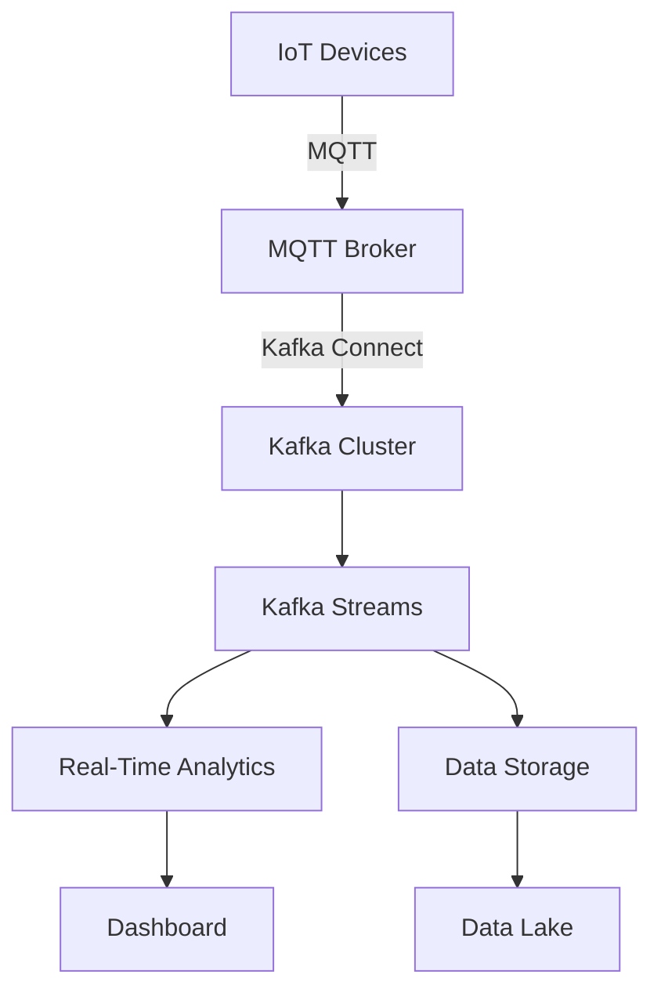

## 19.4 IoT Data Processing with Kafka

The Internet of Things (IoT) represents a paradigm shift in how data is generated, collected, and analyzed. With billions of devices connected globally, IoT applications demand robust, scalable, and real-time data processing capabilities. Apache Kafka, with its distributed architecture and high throughput, is ideally suited to meet these demands. This section explores how Kafka is leveraged in IoT applications, addressing unique challenges and providing practical examples and best practices.

### Understanding IoT Data Processing Challenges

IoT data processing presents several unique challenges:

- **Data Volume**: IoT devices generate massive amounts of data continuously. Managing this data efficiently requires systems that can handle high throughput and scale horizontally.
- **Device Heterogeneity**: IoT ecosystems consist of diverse devices with varying communication protocols and data formats. Integrating these devices into a unified data processing pipeline is complex.
- **Real-Time Analytics**: Many IoT applications, such as smart cities and industrial automation, require real-time data processing to enable immediate decision-making.
- **Data Security and Privacy**: IoT data often includes sensitive information, necessitating robust security measures to protect data integrity and privacy.

### Leveraging Kafka for IoT Data Processing

Apache Kafka addresses these challenges through its core features:

- **Scalability and High Throughput**: Kafka's distributed architecture allows it to scale horizontally, handling large volumes of data with low latency. This makes it ideal for IoT applications that require processing data from millions of devices.
- **Fault Tolerance**: Kafka's replication and partitioning mechanisms ensure data durability and availability, even in the event of node failures.
- **Integration with IoT Protocols**: Kafka can integrate with various IoT protocols, such as MQTT, to facilitate seamless data ingestion from diverse devices.
- **Real-Time Stream Processing**: Kafka Streams API enables real-time data processing and analytics, allowing IoT applications to derive insights and trigger actions instantly.

### IoT Applications Using Kafka

#### Smart Cities

Smart cities leverage IoT to enhance urban living through efficient resource management and improved services. Kafka plays a crucial role in processing data from sensors and devices deployed across the city, such as traffic lights, waste management systems, and public transport.

- **Traffic Management**: Kafka processes real-time data from traffic sensors to optimize traffic flow and reduce congestion.
- **Environmental Monitoring**: Air quality sensors send data to Kafka, enabling real-time monitoring and alerts for pollution levels.

#### Industrial Automation

In industrial settings, IoT devices monitor machinery and processes to improve efficiency and reduce downtime. Kafka facilitates the collection and analysis of data from these devices, supporting predictive maintenance and operational optimization.

- **Predictive Maintenance**: Kafka processes data from sensors attached to machinery, identifying patterns that indicate potential failures before they occur.
- **Process Optimization**: Real-time data analytics help optimize production processes, reducing waste and improving quality.

### Integrating Kafka with IoT Protocols

#### MQTT Integration

MQTT (Message Queuing Telemetry Transport) is a lightweight messaging protocol commonly used in IoT applications due to its low bandwidth requirements and support for unreliable networks. Kafka can integrate with MQTT to enhance IoT data processing capabilities.

- **Bridge MQTT and Kafka**: Use Kafka Connect to create a bridge between MQTT brokers and Kafka, allowing seamless data flow from IoT devices to Kafka topics.
- **Real-Time Data Processing**: Once data is ingested into Kafka, use Kafka Streams to process and analyze it in real-time.

**Example Code: MQTT to Kafka Integration**

- **Java**:

    ```java
    import org.apache.kafka.clients.producer.KafkaProducer;
    import org.apache.kafka.clients.producer.ProducerRecord;
    import org.eclipse.paho.client.mqttv3.*;

    public class MqttToKafkaBridge {
        private static final String MQTT_BROKER = "tcp://localhost:1883";
        private static final String KAFKA_TOPIC = "iot-data";
        private static final String KAFKA_BROKER = "localhost:9092";

        public static void main(String[] args) throws MqttException {
            MqttClient mqttClient = new MqttClient(MQTT_BROKER, MqttClient.generateClientId());
            mqttClient.connect();
            mqttClient.subscribe("sensor/temperature", (topic, message) -> {
                String payload = new String(message.getPayload());
                KafkaProducer<String, String> producer = new KafkaProducer<>(getKafkaProperties());
                producer.send(new ProducerRecord<>(KAFKA_TOPIC, payload));
                producer.close();
            });
        }

        private static Properties getKafkaProperties() {
            Properties props = new Properties();
            props.put("bootstrap.servers", KAFKA_BROKER);
            props.put("key.serializer", "org.apache.kafka.common.serialization.StringSerializer");
            props.put("value.serializer", "org.apache.kafka.common.serialization.StringSerializer");
            return props;
        }
    }
    ```

- **Scala**:

    ```scala
    import org.apache.kafka.clients.producer.{KafkaProducer, ProducerRecord}
    import org.eclipse.paho.client.mqttv3.{MqttClient, MqttMessage}

    object MqttToKafkaBridge extends App {
      val mqttBroker = "tcp://localhost:1883"
      val kafkaTopic = "iot-data"
      val kafkaBroker = "localhost:9092"

      val mqttClient = new MqttClient(mqttBroker, MqttClient.generateClientId())
      mqttClient.connect()
      mqttClient.subscribe("sensor/temperature", (topic: String, message: MqttMessage) => {
        val payload = new String(message.getPayload)
        val producer = new KafkaProducer[String, String](getKafkaProperties)
        producer.send(new ProducerRecord[String, String](kafkaTopic, payload))
        producer.close()
      })

      def getKafkaProperties: java.util.Properties = {
        val props = new java.util.Properties()
        props.put("bootstrap.servers", kafkaBroker)
        props.put("key.serializer", "org.apache.kafka.common.serialization.StringSerializer")
        props.put("value.serializer", "org.apache.kafka.common.serialization.StringSerializer")
        props
      }
    }
    ```

- **Kotlin**:

    ```kotlin
    import org.apache.kafka.clients.producer.KafkaProducer
    import org.apache.kafka.clients.producer.ProducerRecord
    import org.eclipse.paho.client.mqttv3.MqttClient
    import org.eclipse.paho.client.mqttv3.MqttMessage

    fun main() {
        val mqttBroker = "tcp://localhost:1883"
        val kafkaTopic = "iot-data"
        val kafkaBroker = "localhost:9092"

        val mqttClient = MqttClient(mqttBroker, MqttClient.generateClientId())
        mqttClient.connect()
        mqttClient.subscribe("sensor/temperature") { _, message: MqttMessage ->
            val payload = String(message.payload)
            val producer = KafkaProducer<String, String>(getKafkaProperties())
            producer.send(ProducerRecord(kafkaTopic, payload))
            producer.close()
        }
    }

    private fun getKafkaProperties(): Properties {
        return Properties().apply {
            put("bootstrap.servers", kafkaBroker)
            put("key.serializer", "org.apache.kafka.common.serialization.StringSerializer")
            put("value.serializer", "org.apache.kafka.common.serialization.StringSerializer")
        }
    }
    ```

- **Clojure**:

    ```clojure
    (ns mqtt-to-kafka-bridge
      (:import [org.apache.kafka.clients.producer KafkaProducer ProducerRecord]
               [org.eclipse.paho.client.mqttv3 MqttClient MqttMessage]))

    (def mqtt-broker "tcp://localhost:1883")
    (def kafka-topic "iot-data")
    (def kafka-broker "localhost:9092")

    (defn get-kafka-properties []
      (doto (java.util.Properties.)
        (.put "bootstrap.servers" kafka-broker)
        (.put "key.serializer" "org.apache.kafka.common.serialization.StringSerializer")
        (.put "value.serializer" "org.apache.kafka.common.serialization.StringSerializer")))

    (defn -main []
      (let [mqtt-client (MqttClient. mqtt-broker (MqttClient/generateClientId))]
        (.connect mqtt-client)
        (.subscribe mqtt-client "sensor/temperature"
                    (reify org.eclipse.paho.client.mqttv3.IMqttMessageListener
                      (messageArrived [_ topic message]
                        (let [payload (String. (.getPayload message))
                              producer (KafkaProducer. (get-kafka-properties))]
                          (.send producer (ProducerRecord. kafka-topic payload))
                          (.close producer)))))))
    ```

### Best Practices for Securing IoT Data Streams

Securing IoT data streams is critical to protect sensitive information and ensure data integrity. Here are some best practices:

- **Encryption**: Use SSL/TLS to encrypt data in transit between IoT devices and Kafka brokers.
- **Authentication**: Implement strong authentication mechanisms, such as OAuth or SASL, to verify the identity of devices and users.
- **Access Control**: Use Kafka's Access Control Lists (ACLs) to restrict access to sensitive topics and data.
- **Data Anonymization**: Anonymize sensitive data before processing to protect user privacy.
- **Monitoring and Auditing**: Continuously monitor data streams for anomalies and audit access logs to detect unauthorized access.

### Visualizing IoT Data Processing with Kafka

To better understand how Kafka fits into IoT data processing, consider the following architecture diagram:



**Diagram Description**: This diagram illustrates a typical IoT data processing architecture using Kafka. IoT devices send data to an MQTT broker, which is then ingested into a Kafka cluster using Kafka Connect. Kafka Streams processes the data in real-time, enabling analytics and storage in a data lake.

### Conclusion

Apache Kafka is a powerful tool for IoT data processing, offering scalability, fault tolerance, and real-time analytics capabilities. By integrating with IoT protocols like MQTT, Kafka can efficiently manage the vast data streams generated by IoT devices. Implementing best practices for security and data management ensures that IoT applications remain robust and secure.

## Test Your Knowledge: IoT Data Processing with Kafka Quiz



### What is a primary challenge in IoT data processing?

- [x] High data volume
- [ ] Low data volume
- [ ] Lack of data
- [ ] Simple data formats

> **Explanation:** IoT devices generate massive amounts of data continuously, making high data volume a primary challenge.

### How does Kafka address the challenge of high data volume in IoT?

- [x] By providing high throughput and scalability
- [ ] By reducing data volume
- [ ] By simplifying data formats
- [ ] By eliminating data redundancy

> **Explanation:** Kafka's distributed architecture allows it to handle large volumes of data with high throughput and scalability.

### Which protocol is commonly used in IoT applications for messaging?

- [x] MQTT
- [ ] HTTP
- [ ] FTP
- [ ] SMTP

> **Explanation:** MQTT is a lightweight messaging protocol commonly used in IoT applications due to its low bandwidth requirements.

### What is a benefit of integrating Kafka with MQTT?

- [x] Seamless data flow from IoT devices to Kafka topics
- [ ] Reduced data security
- [ ] Increased data latency
- [ ] Simplified data formats

> **Explanation:** Integrating Kafka with MQTT allows seamless data flow from IoT devices to Kafka topics, enhancing data processing capabilities.

### What is a best practice for securing IoT data streams?

- [x] Use SSL/TLS encryption
- [ ] Use plain text communication
- [ ] Disable authentication
- [ ] Allow open access to all data

> **Explanation:** Using SSL/TLS encryption is a best practice for securing data in transit between IoT devices and Kafka brokers.

### Which Kafka feature enables real-time data processing and analytics?

- [x] Kafka Streams API
- [ ] Kafka Connect
- [ ] Kafka Producer
- [ ] Kafka Consumer

> **Explanation:** Kafka Streams API enables real-time data processing and analytics, allowing applications to derive insights instantly.

### What role does Kafka Connect play in IoT data processing?

- [x] It bridges data from IoT protocols to Kafka topics
- [ ] It stores data in a database
- [ ] It visualizes data
- [ ] It encrypts data

> **Explanation:** Kafka Connect bridges data from IoT protocols like MQTT to Kafka topics, facilitating seamless data ingestion.

### What is an example of an IoT application using Kafka?

- [x] Smart city traffic management
- [ ] Email marketing
- [ ] Document editing
- [ ] Social media posting

> **Explanation:** Smart city traffic management is an example of an IoT application using Kafka to process real-time data from traffic sensors.

### Why is data anonymization important in IoT applications?

- [x] To protect user privacy
- [ ] To increase data volume
- [ ] To simplify data formats
- [ ] To reduce data latency

> **Explanation:** Data anonymization is important to protect user privacy by removing personally identifiable information from data streams.

### True or False: Kafka can only be used for batch processing in IoT applications.

- [ ] True
- [x] False

> **Explanation:** False. Kafka is used for both batch and real-time processing in IoT applications, enabling immediate data analytics and decision-making.



By mastering the integration of Kafka in IoT applications, software engineers and enterprise architects can build robust, scalable systems capable of handling the complexities of modern IoT ecosystems.
