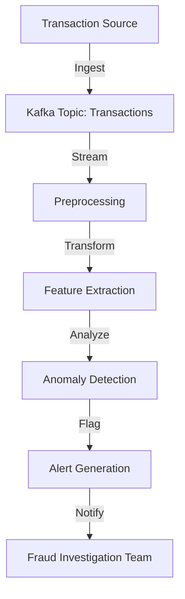

## 19.5.1 Real-Time Fraud Detection

### Introduction

Fraud detection in financial services is a critical application that requires the ability to process and analyze data in real time. The dynamic nature of fraudulent activities demands systems that can adapt quickly to new patterns and anomalies. Apache Kafka, with its robust streaming capabilities, provides an ideal platform for building scalable and efficient fraud detection systems. This section explores the challenges of real-time fraud detection, the role of Kafka Streams and other tools in fraud detection pipelines, and the integration of machine learning models. Additionally, it addresses considerations for data privacy and regulatory compliance.

### Challenges in Real-Time Fraud Detection

Detecting fraud in real time presents several challenges:

1. **Volume and Velocity of Data**: Financial institutions process millions of transactions per second. The system must handle high throughput and low latency to analyze data as it arrives.

2. **Complexity of Fraud Patterns**: Fraudsters continually evolve their tactics, requiring systems to detect both known and unknown patterns.

3. **False Positives and Negatives**: Balancing the sensitivity of detection algorithms is crucial to minimize false positives (legitimate transactions flagged as fraud) and false negatives (fraudulent transactions not detected).

4. **Scalability and Fault Tolerance**: The system must scale to accommodate growing data volumes and remain resilient to failures.

5. **Data Privacy and Compliance**: Ensuring compliance with regulations such as GDPR and PCI DSS while maintaining data privacy is paramount.

### Kafka Streams in Fraud Detection Pipelines

Kafka Streams is a powerful library for building real-time applications and microservices. It simplifies the development of streaming applications by providing a high-level DSL (Domain-Specific Language) for processing data in Kafka. Here's how Kafka Streams can be leveraged in fraud detection:

#### Stream Processing Topology

A typical fraud detection pipeline using Kafka Streams involves several stages:

- **Data Ingestion**: Transactions are ingested into Kafka topics from various sources, such as point-of-sale systems, online banking platforms, and mobile apps.

- **Preprocessing**: Data is cleaned and transformed to ensure consistency and completeness. This may involve filtering out irrelevant data, normalizing fields, and enriching transactions with additional context.

- **Feature Extraction**: Relevant features are extracted from the data to feed into machine learning models. This could include transaction amount, location, time, and user behavior patterns.

- **Anomaly Detection**: Machine learning models or rule-based systems analyze the features to detect anomalies indicative of fraud.

- **Alert Generation**: Alerts are generated for transactions flagged as potentially fraudulent, triggering further investigation or automated responses.

#### Example Kafka Streams Topology



*Caption: A typical Kafka Streams topology for real-time fraud detection.*

### Integrating Machine Learning Models

Machine learning models play a crucial role in identifying fraudulent patterns. Integrating these models into a Kafka-based pipeline involves several steps:

1. **Model Training**: Models are trained offline using historical transaction data. Techniques such as supervised learning, unsupervised learning, and reinforcement learning can be employed.

2. **Model Deployment**: Trained models are deployed as part of the streaming application. This can be done using libraries like TensorFlow, PyTorch, or Scikit-learn.

3. **Real-Time Scoring**: As transactions are processed, features are extracted and fed into the model to score each transaction in real time.

4. **Feedback Loop**: Continuous feedback from detected fraud cases is used to retrain and improve the model, adapting to new fraud patterns.

#### Sample Code: Integrating a Machine Learning Model

Below is an example of integrating a machine learning model into a Kafka Streams application using Java:

```java
import org.apache.kafka.streams.KafkaStreams;
import org.apache.kafka.streams.StreamsBuilder;
import org.apache.kafka.streams.kstream.KStream;
import org.apache.kafka.streams.kstream.KTable;
import org.apache.kafka.streams.kstream.Produced;

public class FraudDetectionApp {

    public static void main(String[] args) {
        StreamsBuilder builder = new StreamsBuilder();

        // Ingest transactions from Kafka topic
        KStream<String, Transaction> transactions = builder.stream("transactions");

        // Preprocess and extract features
        KStream<String, Features> features = transactions.mapValues(transaction -> {
            // Extract features from transaction
            return extractFeatures(transaction);
        });

        // Score transactions using a machine learning model
        KStream<String, ScoredTransaction> scoredTransactions = features.mapValues(features -> {
            // Load and apply the machine learning model
            double score = applyModel(features);
            return new ScoredTransaction(features, score);
        });

        // Filter and flag suspicious transactions
        KStream<String, ScoredTransaction> suspiciousTransactions = scoredTransactions.filter((key, scoredTransaction) -> {
            return scoredTransaction.getScore() > THRESHOLD;
        });

        // Output suspicious transactions to an alerts topic
        suspiciousTransactions.to("alerts", Produced.with(Serdes.String(), new ScoredTransactionSerde()));

        KafkaStreams streams = new KafkaStreams(builder.build(), getStreamsConfig());
        streams.start();
    }

    private static Features extractFeatures(Transaction transaction) {
        // Implement feature extraction logic
    }

    private static double applyModel(Features features) {
        // Implement model scoring logic
    }

    private static Properties getStreamsConfig() {
        // Implement Kafka Streams configuration
    }
}
```

*Explanation: This Java code demonstrates a Kafka Streams application that processes transactions, extracts features, scores them using a machine learning model, and flags suspicious transactions.*

### Considerations for Data Privacy and Regulatory Compliance

When implementing real-time fraud detection systems, it is essential to consider data privacy and regulatory compliance:

1. **Data Anonymization**: Anonymize sensitive data to protect user privacy while maintaining the ability to detect fraud.

2. **Access Controls**: Implement strict access controls to ensure that only authorized personnel can access sensitive data.

3. **Audit Trails**: Maintain detailed audit trails of data access and processing activities to comply with regulations and facilitate investigations.

4. **Compliance with Regulations**: Ensure compliance with relevant regulations such as GDPR, PCI DSS, and others by implementing necessary data protection measures.

5. **Data Retention Policies**: Define and enforce data retention policies to balance the need for historical data analysis with privacy concerns.

### Real-World Scenarios

Real-time fraud detection systems are employed in various financial services applications:

- **Credit Card Transactions**: Monitoring credit card transactions for unusual patterns or behaviors that may indicate fraud.

- **Online Banking**: Detecting unauthorized access or transactions in online banking platforms.

- **Mobile Payments**: Analyzing mobile payment transactions for signs of fraud, such as location mismatches or unusual spending patterns.

- **Insurance Claims**: Identifying fraudulent insurance claims by analyzing claim data and patterns.

### Conclusion

Apache Kafka, with its robust streaming capabilities, provides an ideal platform for building real-time fraud detection systems. By leveraging Kafka Streams and integrating machine learning models, financial institutions can detect and mitigate fraudulent activities effectively. However, it is crucial to address data privacy and regulatory compliance considerations to ensure the ethical and legal use of data.

## Test Your Knowledge: Real-Time Fraud Detection with Kafka



### What is a primary challenge in real-time fraud detection?

- [x] Handling high volume and velocity of data
- [ ] Ensuring low computational cost
- [ ] Minimizing data storage requirements
- [ ] Reducing network latency

> **Explanation:** Real-time fraud detection systems must process large volumes of data quickly to identify fraudulent activities as they occur.

### Which Kafka component is primarily used for building real-time fraud detection pipelines?

- [x] Kafka Streams
- [ ] Kafka Connect
- [ ] Kafka Producer
- [ ] Kafka Consumer

> **Explanation:** Kafka Streams is a powerful library for building real-time applications and microservices, making it ideal for fraud detection pipelines.

### What is a key benefit of integrating machine learning models into fraud detection systems?

- [x] Ability to detect both known and unknown fraud patterns
- [ ] Reduced need for data preprocessing
- [ ] Elimination of false positives
- [ ] Simplified data ingestion

> **Explanation:** Machine learning models can analyze complex patterns and adapt to new fraud tactics, enhancing the detection capabilities of the system.

### What is an essential consideration for data privacy in fraud detection systems?

- [x] Data anonymization
- [ ] Data compression
- [ ] Data replication
- [ ] Data partitioning

> **Explanation:** Anonymizing sensitive data helps protect user privacy while allowing the system to detect fraud effectively.

### Which regulation is commonly associated with data privacy in financial services?

- [x] GDPR
- [ ] HIPAA
- [ ] SOX
- [ ] FISMA

> **Explanation:** The General Data Protection Regulation (GDPR) is a key regulation governing data privacy and protection in the European Union.

### What is a common feature extracted from transaction data for fraud detection?

- [x] Transaction amount
- [ ] User's favorite color
- [ ] Device battery level
- [ ] Network bandwidth

> **Explanation:** Transaction amount is a relevant feature that can indicate unusual spending patterns, which may be indicative of fraud.

### How can feedback loops improve machine learning models in fraud detection?

- [x] By continuously retraining models with new data
- [ ] By reducing the need for feature extraction
- [ ] By eliminating false negatives
- [ ] By simplifying model deployment

> **Explanation:** Feedback loops allow models to learn from detected fraud cases and adapt to new patterns, improving their accuracy over time.

### What is a potential drawback of high sensitivity in fraud detection algorithms?

- [x] Increased false positives
- [ ] Reduced detection rate
- [ ] Lower system throughput
- [ ] Higher data storage costs

> **Explanation:** High sensitivity can lead to more legitimate transactions being flagged as fraudulent, resulting in increased false positives.

### Which tool can be used for model deployment in a Kafka-based fraud detection pipeline?

- [x] TensorFlow
- [ ] Apache Hadoop
- [ ] Apache Hive
- [ ] Apache Pig

> **Explanation:** TensorFlow is a popular library for deploying machine learning models, which can be integrated into Kafka-based pipelines for real-time scoring.

### True or False: Kafka Streams can only be used for batch processing.

- [x] False
- [ ] True

> **Explanation:** Kafka Streams is designed for real-time stream processing, making it suitable for applications like fraud detection.



---

This comprehensive guide on real-time fraud detection with Apache Kafka provides expert insights into building scalable and efficient systems. By leveraging Kafka Streams and integrating machine learning models, financial institutions can effectively detect and mitigate fraudulent activities while ensuring data privacy and regulatory compliance.
