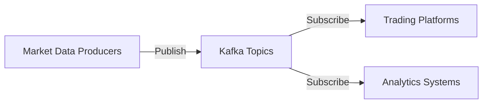
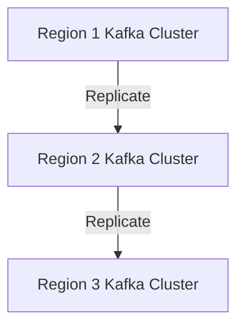

## 19.5.2 Market Data Distribution

In the fast-paced world of financial services, the ability to efficiently distribute market data is crucial for trading platforms and analytics systems. Apache Kafka, with its robust architecture and real-time processing capabilities, has emerged as a key technology in this domain. This section delves into the intricacies of market data distribution using Kafka, exploring its scalability, performance, and the challenges involved in maintaining data consistency and message ordering.

### Characteristics of Market Data

Market data is characterized by its high volume and volatility. It encompasses a wide range of information, including stock prices, trading volumes, and other financial metrics that are essential for making informed trading decisions. The data is generated continuously and must be processed in real-time to provide traders and analysts with up-to-date insights.

#### High Volume and Velocity

Market data streams are massive, often reaching millions of messages per second. This necessitates a system that can handle such high throughput without compromising on performance. Kafka's distributed architecture is well-suited for this task, allowing for horizontal scaling and efficient data ingestion.

#### Volatility and Real-Time Processing

The financial markets are inherently volatile, with prices and volumes fluctuating rapidly. This requires a system that can not only process data quickly but also adapt to sudden spikes in data volume. Kafka's ability to handle real-time data streams makes it an ideal choice for market data distribution.

### Leveraging Kafka's Scalability and Performance

Kafka's architecture is designed to provide high throughput and low latency, making it a perfect fit for market data distribution. Let's explore how Kafka's features can be leveraged to meet the demands of financial services.

#### Distributed Architecture

Kafka's distributed architecture allows it to scale horizontally by adding more brokers to the cluster. This ensures that the system can handle increasing data volumes without a drop in performance. Each broker in a Kafka cluster can handle multiple partitions, which are the basic units of parallelism in Kafka.

#### Partitioning and Replication

Partitioning is a key feature that enables Kafka to handle large volumes of data. By dividing data into partitions, Kafka allows for parallel processing, which significantly boosts throughput. Additionally, replication ensures data availability and fault tolerance, which are critical in financial applications where data loss is unacceptable.

#### Low Latency

Kafka is designed to provide low-latency data processing, which is crucial for real-time market data distribution. The system's ability to process data with minimal delay ensures that traders and analysts receive timely information, enabling them to make quick decisions.

### Architectures for Market Data Dissemination

There are several architectural patterns that can be employed to efficiently distribute market data using Kafka. Let's explore some of these patterns and their applications in financial services.

#### Pub/Sub Model

The publish/subscribe (pub/sub) model is a common pattern used in market data distribution. In this model, data producers publish messages to topics, and consumers subscribe to these topics to receive data. Kafka's pub/sub model allows for decoupled communication between producers and consumers, enabling scalability and flexibility.



*Diagram: The pub/sub model in Kafka allows for efficient market data distribution to multiple consumers.*

#### Data Enrichment and Transformation

In many cases, raw market data needs to be enriched or transformed before it can be used by consumers. Kafka Streams, a powerful stream processing library, can be used to perform real-time data transformations. This allows for the creation of enriched data streams that can be consumed by trading platforms and analytics systems.

```java
// Java example of using Kafka Streams for data transformation
StreamsBuilder builder = new StreamsBuilder();
KStream<String, MarketData> sourceStream = builder.stream("raw-market-data");

KStream<String, EnrichedMarketData> enrichedStream = sourceStream.mapValues(data -> enrichData(data));

enrichedStream.to("enriched-market-data");
```

*Java Code: Using Kafka Streams to transform raw market data into enriched data.*

#### Multi-Region Deployment

For global financial institutions, deploying Kafka across multiple regions can enhance data availability and reduce latency. Multi-region deployments involve replicating data across Kafka clusters in different geographical locations, ensuring that market data is available to consumers worldwide.



*Diagram: Multi-region deployment of Kafka for global market data distribution.*

### Challenges in Market Data Distribution

While Kafka provides a robust platform for market data distribution, there are several challenges that need to be addressed to ensure data consistency and reliability.

#### Message Ordering

Maintaining message order is critical in financial applications where the sequence of data can impact trading decisions. Kafka ensures message ordering within a partition, but ordering across partitions can be challenging. To address this, careful partitioning strategies must be employed, such as using keys that ensure related messages are sent to the same partition.

#### Data Consistency

Ensuring data consistency across distributed systems is a complex task. Kafka provides several mechanisms to achieve consistency, such as exactly-once semantics and transactional messaging. These features ensure that messages are processed exactly once, even in the event of failures.

#### Fault Tolerance

In financial services, system downtime can have significant financial implications. Kafka's replication and fault tolerance features ensure that data is not lost in the event of broker failures. Additionally, implementing robust monitoring and alerting systems can help detect and resolve issues quickly.

### Practical Applications and Real-World Scenarios

Kafka's capabilities make it a valuable tool in various real-world scenarios within the financial sector. Let's explore some practical applications of Kafka in market data distribution.

#### Trading Platforms

Trading platforms require real-time access to market data to execute trades efficiently. Kafka's low-latency data processing ensures that traders receive timely information, enabling them to make informed decisions.

#### Analytics Systems

Analytics systems rely on market data to generate insights and forecasts. Kafka's ability to handle large volumes of data makes it an ideal choice for feeding analytics systems with the necessary data.

#### Risk Management

Risk management systems use market data to assess and mitigate financial risks. Kafka's scalability and fault tolerance ensure that these systems have access to accurate and up-to-date data.

### Conclusion

Apache Kafka has revolutionized market data distribution in the financial sector, providing a scalable, reliable, and efficient platform for handling high volumes of real-time data. By leveraging Kafka's features, financial institutions can enhance their trading platforms, analytics systems, and risk management processes. However, challenges such as message ordering and data consistency must be addressed to ensure the reliability of the system.

### Knowledge Check

To reinforce your understanding of market data distribution with Kafka, try answering the following questions.

## Test Your Knowledge: Market Data Distribution with Kafka Quiz



### What is a key characteristic of market data?

- [x] High volume and velocity
- [ ] Low latency
- [ ] Static and unchanging
- [ ] Low throughput

> **Explanation:** Market data is characterized by its high volume and velocity, requiring systems that can handle large amounts of data quickly.

### How does Kafka ensure data availability in multi-region deployments?

- [x] By replicating data across clusters in different regions
- [ ] By using a single cluster for all regions
- [ ] By storing data in a central database
- [ ] By using local caches

> **Explanation:** Kafka ensures data availability in multi-region deployments by replicating data across clusters in different geographical locations.

### What is a common pattern used in market data distribution?

- [x] Publish/Subscribe model
- [ ] Request/Response model
- [ ] Peer-to-peer model
- [ ] Client-server model

> **Explanation:** The publish/subscribe model is commonly used in market data distribution to enable decoupled communication between producers and consumers.

### Which Kafka feature helps maintain message ordering within a partition?

- [x] Partitioning
- [ ] Replication
- [ ] Fault tolerance
- [ ] Data enrichment

> **Explanation:** Kafka maintains message ordering within a partition through its partitioning feature.

### What is a challenge in market data distribution?

- [x] Ensuring data consistency
- [ ] Low data volume
- [ ] High latency
- [ ] Simple data transformations

> **Explanation:** Ensuring data consistency is a challenge in market data distribution, especially in distributed systems.

### How can Kafka Streams be used in market data distribution?

- [x] For real-time data transformation and enrichment
- [ ] For storing data in a database
- [ ] For batch processing
- [ ] For data archiving

> **Explanation:** Kafka Streams can be used for real-time data transformation and enrichment, making it valuable in market data distribution.

### What is the benefit of using Kafka's exactly-once semantics?

- [x] Ensures messages are processed exactly once
- [ ] Increases data volume
- [ ] Reduces system complexity
- [ ] Enhances data latency

> **Explanation:** Kafka's exactly-once semantics ensure that messages are processed exactly once, even in the event of failures.

### Which system relies on market data for generating insights?

- [x] Analytics systems
- [ ] Trading platforms
- [ ] Risk management systems
- [ ] Monitoring systems

> **Explanation:** Analytics systems rely on market data to generate insights and forecasts.

### What is a benefit of Kafka's low-latency data processing?

- [x] Provides timely information for trading decisions
- [ ] Reduces data volume
- [ ] Simplifies data transformations
- [ ] Enhances data consistency

> **Explanation:** Kafka's low-latency data processing provides timely information, enabling quick trading decisions.

### True or False: Kafka's replication feature ensures data is not lost in the event of broker failures.

- [x] True
- [ ] False

> **Explanation:** Kafka's replication feature ensures data is not lost in the event of broker failures, providing fault tolerance.



By mastering the concepts and techniques discussed in this section, you can effectively leverage Apache Kafka for market data distribution in financial services, ensuring high performance and reliability in your systems.

---
