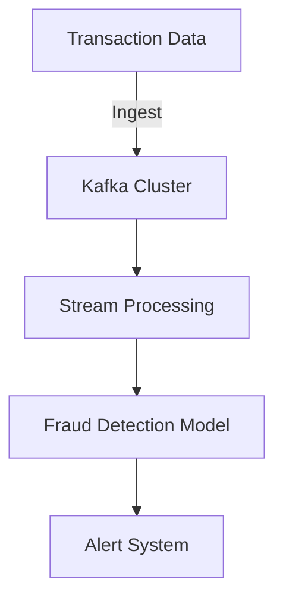

## 19.5 Financial Services Applications

Financial services are at the forefront of technological innovation, driven by the need to process vast amounts of data in real-time while maintaining stringent security and compliance standards. Apache Kafka has emerged as a critical component in the technology stack of financial institutions, enabling them to build scalable, fault-tolerant systems that can handle the demands of modern finance.

### Specific Requirements of Financial Services

Financial institutions have unique requirements that must be addressed to ensure efficient and secure operations. These include:

- **Low Latency**: Real-time processing is crucial for applications such as fraud detection and high-frequency trading, where decisions must be made in milliseconds.
- **High Throughput**: Financial systems must handle large volumes of transactions and data streams without bottlenecks.
- **Reliability and Fault Tolerance**: Systems must be resilient to failures to ensure continuous operation and data integrity.
- **Security and Compliance**: Financial data is highly sensitive, requiring robust security measures and adherence to regulations such as GDPR, PCI DSS, and others.
- **Scalability**: As data volumes grow, systems must scale seamlessly to accommodate increased loads.

### How Kafka Meets Financial Services Requirements

Apache Kafka is well-suited to meet the demands of financial services due to its distributed architecture and robust feature set. Here's how Kafka addresses these requirements:

- **Low Latency and High Throughput**: Kafka's ability to handle millions of messages per second with low latency makes it ideal for real-time applications. Its efficient storage and retrieval mechanisms ensure quick access to data.
- **Reliability and Fault Tolerance**: Kafka's replication and partitioning strategies ensure data is distributed across multiple nodes, providing redundancy and fault tolerance. This is crucial for maintaining data integrity in the event of hardware failures.
- **Security**: Kafka supports SSL/TLS encryption for data in transit and integrates with authentication protocols like SASL and OAuth, ensuring secure data transmission and access control.
- **Compliance**: Kafka's integration with schema registries and data governance tools helps maintain compliance with data regulations by enforcing data schemas and tracking data lineage.

### Examples of Financial Applications Using Kafka

#### Real-Time Fraud Detection

Fraud detection systems must analyze transactions in real-time to identify suspicious activities. Kafka's real-time processing capabilities enable financial institutions to ingest and process transaction data as it occurs, applying machine learning models to detect anomalies.

**Example Architecture**:



**Java Code Example**:

```java
import org.apache.kafka.clients.consumer.ConsumerConfig;
import org.apache.kafka.clients.consumer.KafkaConsumer;
import org.apache.kafka.clients.consumer.ConsumerRecords;
import org.apache.kafka.clients.consumer.ConsumerRecord;
import org.apache.kafka.common.serialization.StringDeserializer;

import java.util.Collections;
import java.util.Properties;

public class FraudDetectionConsumer {
    public static void main(String[] args) {
        Properties props = new Properties();
        props.put(ConsumerConfig.BOOTSTRAP_SERVERS_CONFIG, "localhost:9092");
        props.put(ConsumerConfig.GROUP_ID_CONFIG, "fraud-detection-group");
        props.put(ConsumerConfig.KEY_DESERIALIZER_CLASS_CONFIG, StringDeserializer.class.getName());
        props.put(ConsumerConfig.VALUE_DESERIALIZER_CLASS_CONFIG, StringDeserializer.class.getName());

        KafkaConsumer<String, String> consumer = new KafkaConsumer<>(props);
        consumer.subscribe(Collections.singletonList("transactions"));

        while (true) {
            ConsumerRecords<String, String> records = consumer.poll(100);
            for (ConsumerRecord<String, String> record : records) {
                // Process transaction data for fraud detection
                System.out.printf("Offset = %d, Key = %s, Value = %s%n", record.offset(), record.key(), record.value());
            }
        }
    }
}
```

#### Market Data Distribution

Financial markets generate vast amounts of data that must be distributed to traders and systems in real-time. Kafka's publish-subscribe model is ideal for distributing market data to multiple consumers efficiently.

**Scala Code Example**:

```scala
import org.apache.kafka.clients.producer.{KafkaProducer, ProducerRecord}
import java.util.Properties

object MarketDataProducer extends App {
  val props = new Properties()
  props.put("bootstrap.servers", "localhost:9092")
  props.put("key.serializer", "org.apache.kafka.common.serialization.StringSerializer")
  props.put("value.serializer", "org.apache.kafka.common.serialization.StringSerializer")

  val producer = new KafkaProducer[String, String](props)
  val topic = "market-data"

  while (true) {
    val key = "stock-ticker"
    val value = "AAPL:150.00"
    val record = new ProducerRecord[String, String](topic, key, value)
    producer.send(record)
    Thread.sleep(1000) // Simulate real-time data feed
  }
}
```

### Security Features and Compliance Considerations

Kafka's security features are essential for financial services, where data breaches can have severe consequences. Key security features include:

- **Encryption**: Kafka supports SSL/TLS for encrypting data in transit, ensuring that sensitive financial data is protected from interception.
- **Authentication**: Kafka integrates with SASL and OAuth for authenticating users and services, providing secure access control.
- **Authorization**: Kafka's Access Control Lists (ACLs) allow fine-grained permissions management, ensuring that only authorized users can access specific data.

Compliance with regulations such as GDPR and PCI DSS is critical for financial institutions. Kafka's integration with schema registries and data governance tools helps enforce data schemas and track data lineage, ensuring compliance with data protection laws.

### Pertinent Regulations Affecting Kafka Deployments in Finance

Financial institutions must comply with various regulations that impact Kafka deployments:

- **GDPR**: The General Data Protection Regulation requires organizations to protect personal data and respect privacy rights. Kafka's schema registry and data governance tools help ensure compliance by enforcing data schemas and tracking data lineage.
- **PCI DSS**: The Payment Card Industry Data Security Standard mandates secure handling of cardholder data. Kafka's encryption and access control features help meet these requirements.
- **SOX**: The Sarbanes-Oxley Act requires financial institutions to maintain accurate financial records. Kafka's fault-tolerant architecture ensures data integrity and reliability.

### Conclusion

Apache Kafka is a powerful tool for financial services, enabling institutions to build scalable, secure, and compliant systems for real-time data processing. By leveraging Kafka's robust features, financial institutions can enhance their capabilities in fraud detection, market data distribution, and more, while ensuring compliance with industry regulations.

## Test Your Knowledge: Financial Services Applications with Apache Kafka



### What is a primary requirement for financial services applications using Kafka?

- [x] Low latency
- [ ] High latency
- [ ] Low throughput
- [ ] High cost

> **Explanation:** Financial services applications require low latency to process transactions and data in real-time.

### How does Kafka ensure data integrity in financial services?

- [x] Through replication and partitioning
- [ ] By using a single broker
- [ ] By disabling fault tolerance
- [ ] By reducing data redundancy

> **Explanation:** Kafka uses replication and partitioning to distribute data across multiple nodes, ensuring data integrity and fault tolerance.

### Which Kafka feature helps in complying with GDPR?

- [x] Schema Registry
- [ ] Consumer Groups
- [ ] Topic Partitions
- [ ] Log Compaction

> **Explanation:** The Schema Registry helps enforce data schemas and track data lineage, aiding in GDPR compliance.

### What security feature does Kafka use to encrypt data in transit?

- [x] SSL/TLS
- [ ] Plaintext
- [ ] Base64
- [ ] MD5

> **Explanation:** Kafka uses SSL/TLS to encrypt data in transit, protecting it from interception.

### Which protocol does Kafka integrate with for authentication?

- [x] SASL
- [ ] HTTP
- [ ] FTP
- [ ] SMTP

> **Explanation:** Kafka integrates with SASL for authenticating users and services.

### What is a common use case for Kafka in financial services?

- [x] Real-time fraud detection
- [ ] Batch processing
- [ ] Static data storage
- [ ] Manual data entry

> **Explanation:** Real-time fraud detection is a common use case for Kafka in financial services due to its real-time processing capabilities.

### How does Kafka's publish-subscribe model benefit market data distribution?

- [x] It allows efficient distribution to multiple consumers
- [ ] It restricts data to a single consumer
- [ ] It increases data latency
- [ ] It reduces data throughput

> **Explanation:** Kafka's publish-subscribe model allows efficient distribution of market data to multiple consumers simultaneously.

### What regulation requires secure handling of cardholder data?

- [x] PCI DSS
- [ ] GDPR
- [ ] SOX
- [ ] HIPAA

> **Explanation:** PCI DSS mandates secure handling of cardholder data.

### Which Kafka feature provides fine-grained permissions management?

- [x] Access Control Lists (ACLs)
- [ ] Consumer Offsets
- [ ] Log Segmentation
- [ ] Topic Retention

> **Explanation:** Access Control Lists (ACLs) allow fine-grained permissions management in Kafka.

### True or False: Kafka's integration with data governance tools helps ensure compliance with data protection laws.

- [x] True
- [ ] False

> **Explanation:** Kafka's integration with data governance tools helps enforce data schemas and track data lineage, ensuring compliance with data protection laws.


