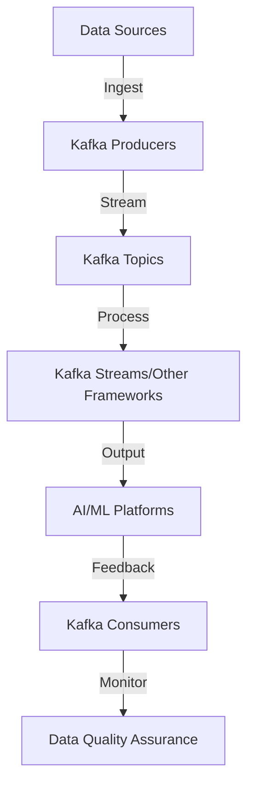

## 19.6.2 Integrating with AI and ML Platforms

### Introduction

In the rapidly evolving landscape of artificial intelligence (AI) and machine learning (ML), the ability to process and analyze data in real-time is paramount. Apache Kafka, a distributed streaming platform, plays a crucial role in facilitating this capability by enabling seamless integration with AI and ML platforms. This section delves into how Kafka supports the data needs of AI and ML systems, streams data efficiently, and addresses challenges such as data pre-processing and quality assurance.

### Data Needs of AI and ML Platforms

AI and ML platforms require vast amounts of data to train models, validate hypotheses, and make predictions. The data needs can be categorized into:

- **Training Data**: Large datasets are essential for training machine learning models. These datasets need to be diverse and representative of the real-world scenarios the models will encounter.
- **Validation and Test Data**: To ensure models generalize well, validation and test datasets are used to evaluate performance and fine-tune parameters.
- **Real-Time Data**: For applications like fraud detection, recommendation systems, and autonomous vehicles, real-time data processing is critical. Models need to ingest and process data as it arrives to make timely decisions.

### Streaming Data with Kafka

Apache Kafka excels in streaming data to and from AI and ML platforms due to its high throughput, fault tolerance, and scalability. Here's how Kafka facilitates this integration:

#### Data Ingestion

Kafka acts as a robust data ingestion layer, capturing data from various sources such as databases, IoT devices, and web applications. This data is then made available to AI and ML platforms for processing.

- **Producers**: Applications or devices that send data to Kafka topics. Producers can be configured to handle high volumes of data efficiently.
- **Topics and Partitions**: Kafka topics are used to categorize data streams. Each topic can be divided into partitions, allowing parallel processing and scalability.

#### Data Processing

Once data is ingested, it can be processed in real-time using Kafka Streams or integrated with other stream processing frameworks like Apache Flink or Apache Spark.

- **Kafka Streams**: A powerful library for building stream processing applications directly on top of Kafka. It allows for real-time data transformation and aggregation.
- **Integration with Other Frameworks**: Kafka can seamlessly integrate with frameworks like Apache Flink and Apache Spark, enabling complex data processing and analytics.

#### Data Output

Processed data can be sent to various destinations, including databases, data lakes, or directly to AI and ML platforms for model training and inference.

- **Consumers**: Applications that read data from Kafka topics. Consumers can be part of a consumer group, allowing for load balancing and fault tolerance.
- **Connectors**: Kafka Connect provides a framework for integrating Kafka with external systems, facilitating data movement between Kafka and AI/ML platforms.

### Real-Time Model Updates and Feedback Loops

One of the significant advantages of integrating Kafka with AI and ML platforms is the ability to implement real-time model updates and feedback loops. This capability is crucial for applications that require continuous learning and adaptation.

#### Real-Time Model Updates

- **Continuous Training**: Models can be retrained continuously as new data becomes available. Kafka streams the latest data to the training environment, ensuring models are always up-to-date.
- **Model Deployment**: Once trained, models can be deployed in real-time environments where they can make predictions based on incoming data streams.

#### Feedback Loops

- **Monitoring and Evaluation**: Kafka can stream prediction results back to the platform for evaluation. This feedback loop helps in monitoring model performance and identifying areas for improvement.
- **Adaptive Learning**: Based on feedback, models can be adjusted or retrained to improve accuracy and performance.

### Challenges in Integration

While Kafka provides a robust framework for integrating with AI and ML platforms, several challenges need to be addressed to ensure successful implementation.

#### Data Pre-Processing

Raw data often requires pre-processing before it can be used for training or inference. This includes cleaning, normalization, and transformation.

- **Data Cleaning**: Removing duplicates, handling missing values, and correcting errors.
- **Normalization**: Scaling data to a standard range to ensure consistent model performance.
- **Transformation**: Converting data into a format suitable for model consumption.

#### Ensuring Data Quality

High-quality data is essential for building reliable AI and ML models. Kafka's ability to handle large volumes of data necessitates robust data quality assurance mechanisms.

- **Schema Validation**: Using tools like the [Schema Registry]( "Schema Registry") to enforce data schemas and ensure consistency.
- **Data Lineage**: Tracking the origin and transformation of data to ensure transparency and traceability.
- **Anomaly Detection**: Identifying and addressing anomalies in data streams to prevent model degradation.

### Practical Applications and Real-World Scenarios

Integrating Kafka with AI and ML platforms opens up numerous possibilities for real-world applications. Here are some examples:

#### Fraud Detection

Financial institutions use Kafka to stream transaction data in real-time to ML models that detect fraudulent activities. The models are continuously updated with new data, improving their accuracy and responsiveness.

#### Recommendation Systems

E-commerce platforms leverage Kafka to stream user interaction data to recommendation engines. These engines use ML algorithms to provide personalized product recommendations, enhancing user experience and increasing sales.

#### Autonomous Vehicles

Autonomous vehicles rely on real-time data processing to make split-second decisions. Kafka streams sensor data to AI models that analyze the environment and control vehicle actions.

### Code Examples

To illustrate the integration of Kafka with AI and ML platforms, let's explore code examples in Java, Scala, Kotlin, and Clojure.

#### Java Example

```java
import org.apache.kafka.clients.producer.KafkaProducer;
import org.apache.kafka.clients.producer.ProducerRecord;
import java.util.Properties;

public class KafkaAIIntegration {
    public static void main(String[] args) {
        Properties props = new Properties();
        props.put("bootstrap.servers", "localhost:9092");
        props.put("key.serializer", "org.apache.kafka.common.serialization.StringSerializer");
        props.put("value.serializer", "org.apache.kafka.common.serialization.StringSerializer");

        KafkaProducer<String, String> producer = new KafkaProducer<>(props);
        String topic = "ai-data";

        // Simulate streaming data to Kafka
        for (int i = 0; i < 100; i++) {
            String key = "key" + i;
            String value = "value" + i;
            producer.send(new ProducerRecord<>(topic, key, value));
        }

        producer.close();
    }
}
```

#### Scala Example

```scala
import org.apache.kafka.clients.producer.{KafkaProducer, ProducerRecord}
import java.util.Properties

object KafkaAIIntegration extends App {
  val props = new Properties()
  props.put("bootstrap.servers", "localhost:9092")
  props.put("key.serializer", "org.apache.kafka.common.serialization.StringSerializer")
  props.put("value.serializer", "org.apache.kafka.common.serialization.StringSerializer")

  val producer = new KafkaProducer[String, String](props)
  val topic = "ai-data"

  // Simulate streaming data to Kafka
  for (i <- 0 until 100) {
    val key = s"key$i"
    val value = s"value$i"
    producer.send(new ProducerRecord[String, String](topic, key, value))
  }

  producer.close()
}
```

#### Kotlin Example

```kotlin
import org.apache.kafka.clients.producer.KafkaProducer
import org.apache.kafka.clients.producer.ProducerRecord
import java.util.Properties

fun main() {
    val props = Properties().apply {
        put("bootstrap.servers", "localhost:9092")
        put("key.serializer", "org.apache.kafka.common.serialization.StringSerializer")
        put("value.serializer", "org.apache.kafka.common.serialization.StringSerializer")
    }

    val producer = KafkaProducer<String, String>(props)
    val topic = "ai-data"

    // Simulate streaming data to Kafka
    for (i in 0 until 100) {
        val key = "key$i"
        val value = "value$i"
        producer.send(ProducerRecord(topic, key, value))
    }

    producer.close()
}
```

#### Clojure Example

```clojure
(require '[clojure.java.io :as io])
(import '[org.apache.kafka.clients.producer KafkaProducer ProducerRecord])

(defn kafka-ai-integration []
  (let [props (doto (java.util.Properties.)
                (.put "bootstrap.servers" "localhost:9092")
                (.put "key.serializer" "org.apache.kafka.common.serialization.StringSerializer")
                (.put "value.serializer" "org.apache.kafka.common.serialization.StringSerializer"))
        producer (KafkaProducer. props)
        topic "ai-data"]
    ;; Simulate streaming data to Kafka
    (doseq [i (range 100)]
      (let [key (str "key" i)
            value (str "value" i)]
        (.send producer (ProducerRecord. topic key value))))
    (.close producer)))

(kafka-ai-integration)
```

### Visualizing Kafka Integration with AI and ML Platforms

To better understand the integration process, let's visualize the data flow using a Mermaid.js diagram.



**Caption**: This diagram illustrates the data flow from sources through Kafka to AI/ML platforms, highlighting the feedback loop for continuous improvement.

### Conclusion

Integrating Apache Kafka with AI and ML platforms offers a powerful solution for real-time data processing and analytics. By addressing challenges such as data pre-processing and quality assurance, organizations can leverage Kafka to enhance their AI and ML capabilities, enabling applications like fraud detection, recommendation systems, and autonomous vehicles. As the demand for real-time data processing continues to grow, Kafka's role in AI and ML integration will become increasingly vital.

## Test Your Knowledge: Integrating Kafka with AI and ML Platforms



### What is a primary benefit of integrating Kafka with AI and ML platforms?

- [x] Real-time data processing
- [ ] Reduced data storage costs
- [ ] Simplified data visualization
- [ ] Enhanced data encryption

> **Explanation:** Kafka enables real-time data processing, which is crucial for AI and ML applications that require timely insights and decisions.

### Which Kafka component is responsible for categorizing data streams?

- [ ] Producers
- [x] Topics
- [ ] Consumers
- [ ] Connectors

> **Explanation:** Kafka topics are used to categorize data streams, allowing for organized data processing and retrieval.

### How does Kafka facilitate continuous model training?

- [x] By streaming new data to the training environment
- [ ] By reducing data size
- [ ] By encrypting data
- [ ] By visualizing data

> **Explanation:** Kafka streams new data to the training environment, enabling continuous model updates and improvements.

### What is a challenge in integrating Kafka with AI and ML platforms?

- [ ] High data throughput
- [x] Data pre-processing
- [ ] Fault tolerance
- [ ] Scalability

> **Explanation:** Data pre-processing is a challenge as raw data often requires cleaning, normalization, and transformation before use in AI and ML models.

### Which tool can be used for schema validation in Kafka?

- [ ] Kafka Streams
- [ ] Kafka Connect
- [x] Schema Registry
- [ ] Zookeeper

> **Explanation:** The Schema Registry is used to enforce data schemas and ensure consistency in Kafka data streams.

### What role do Kafka consumers play in the integration process?

- [ ] They produce data to Kafka topics.
- [x] They read data from Kafka topics.
- [ ] They manage Kafka clusters.
- [ ] They transform data schemas.

> **Explanation:** Kafka consumers read data from Kafka topics, allowing processed data to be utilized by AI and ML platforms.

### How can Kafka support real-time fraud detection?

- [x] By streaming transaction data to ML models
- [ ] By encrypting transaction data
- [ ] By reducing transaction data size
- [ ] By visualizing transaction data

> **Explanation:** Kafka streams transaction data to ML models, enabling real-time fraud detection and response.

### What is a feedback loop in the context of Kafka and AI integration?

- [ ] A process for encrypting data
- [ ] A method for reducing data size
- [x] A cycle of monitoring and improving model performance
- [ ] A technique for visualizing data

> **Explanation:** A feedback loop involves monitoring model performance and using insights to improve accuracy and effectiveness.

### Which of the following is a real-world application of Kafka integration with AI?

- [ ] Data encryption
- [ ] Data visualization
- [x] Autonomous vehicles
- [ ] Data storage

> **Explanation:** Autonomous vehicles use Kafka to stream sensor data to AI models for real-time decision-making.

### True or False: Kafka can only be used for batch data processing.

- [ ] True
- [x] False

> **Explanation:** Kafka is designed for real-time data processing, making it suitable for applications requiring immediate data insights.


