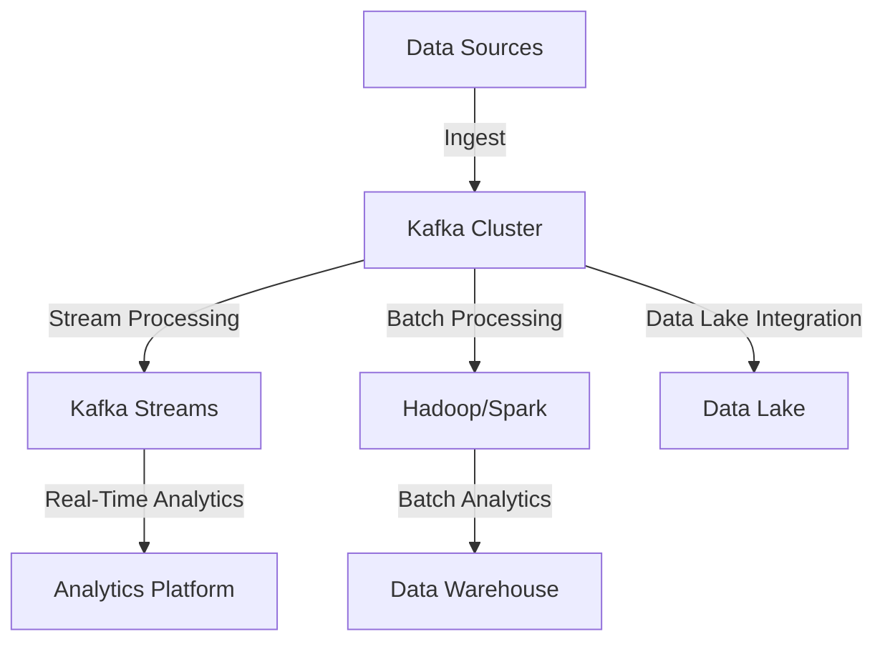

## 19.6 Big Data Pipelines and Analytics

### Introduction

Apache Kafka has emerged as a cornerstone technology in the realm of big data pipelines and analytics. Its ability to handle real-time data streams with high throughput and low latency makes it an ideal choice for integrating with data lakes, warehouses, and various analytics platforms. This section delves into the components of big data pipelines, Kafka's role in these architectures, and how it supports both batch and stream processing paradigms. Additionally, we will explore considerations for data governance and schema management, ensuring that your data pipelines are robust, scalable, and compliant with industry standards.

### Components of Big Data Pipelines

Big data pipelines are complex systems designed to ingest, process, store, and analyze large volumes of data. They typically consist of several key components:

1. **Data Ingestion**: The process of collecting and importing data from various sources into the pipeline. Kafka excels in this area by providing a distributed, fault-tolerant messaging system that can handle high-throughput data ingestion.

2. **Data Processing**: This involves transforming raw data into a format suitable for analysis. Kafka supports both stream processing, through Kafka Streams and other stream processing frameworks, and batch processing, by integrating with systems like Apache Hadoop and Apache Spark.

3. **Data Storage**: Data is stored in data lakes or warehouses for long-term retention and analysis. Kafka can seamlessly integrate with storage solutions, enabling efficient data movement and storage.

4. **Data Analysis**: The final stage involves analyzing the processed data to extract insights. Kafka's integration with analytics tools and platforms facilitates real-time and batch analytics.

### Kafka's Role in Big Data Pipelines

#### Data Ingestion with Kafka

Kafka's distributed architecture allows it to handle massive data ingestion workloads. It acts as a buffer between data producers and consumers, decoupling data sources from downstream systems. This decoupling enables scalability and flexibility in data pipelines.

- **Producers**: Applications or systems that publish data to Kafka topics. Kafka producers can be configured to handle various data formats and serialization methods, such as Avro, Protobuf, or JSON.

- **Topics and Partitions**: Kafka topics are logical channels for data streams, and partitions within topics enable parallel processing and scalability. Designing an effective partitioning strategy is crucial for optimizing performance and ensuring data locality.

- **Consumers**: Applications or systems that subscribe to Kafka topics to consume data. Kafka's consumer groups allow for load balancing and fault tolerance, ensuring that data is processed efficiently.

#### Stream Processing with Kafka

Kafka's native stream processing capabilities, through the Kafka Streams API, enable real-time data processing and analytics. Kafka Streams is a lightweight library that allows developers to build sophisticated stream processing applications with ease.

- **Stateless and Stateful Processing**: Kafka Streams supports both stateless and stateful processing, allowing for complex transformations and aggregations.

- **Windowing**: Kafka Streams provides built-in support for windowing operations, enabling time-based aggregations and analytics.

- **Exactly-Once Semantics**: Kafka Streams ensures exactly-once processing semantics, providing strong guarantees for data consistency and reliability.

#### Batch Processing with Kafka

While Kafka is primarily designed for stream processing, it can also support batch processing paradigms by integrating with batch processing frameworks like Apache Hadoop and Apache Spark.

- **Integration with Hadoop**: Kafka can be used to ingest data into Hadoop Distributed File System (HDFS) for batch processing and analysis. Tools like Kafka Connect and Apache Flume facilitate this integration.

- **Integration with Spark**: Apache Spark's structured streaming capabilities allow for seamless integration with Kafka, enabling both real-time and batch processing within the same framework.

### Integrating Kafka with Data Lakes and Warehouses

Data lakes and warehouses are essential components of modern data architectures, providing scalable storage and powerful analytics capabilities. Kafka plays a crucial role in feeding data into these systems.

#### Data Lakes

Data lakes are centralized repositories that store raw data in its native format. They provide a flexible and scalable solution for storing large volumes of data.

- **Kafka and Data Lakes**: Kafka can be used to stream data into data lakes, such as Amazon S3, Azure Data Lake Storage, or Google Cloud Storage. This integration allows for real-time data ingestion and storage.

- **Schema Management**: Managing schemas is critical when integrating Kafka with data lakes. Tools like Confluent Schema Registry help enforce schema consistency and evolution, ensuring data integrity.

#### Data Warehouses

Data warehouses are optimized for structured data and complex queries, providing fast and efficient analytics capabilities.

- **Kafka and Data Warehouses**: Kafka can be integrated with data warehouses like Amazon Redshift, Google BigQuery, or Snowflake to enable real-time data analytics. Kafka Connect provides connectors for seamless data movement.

- **Batch and Real-Time Analytics**: By integrating Kafka with data warehouses, organizations can perform both batch and real-time analytics, leveraging the strengths of each processing paradigm.

### Considerations for Data Governance and Schema Management

Data governance and schema management are critical aspects of building reliable and compliant data pipelines. They ensure data quality, consistency, and compliance with industry regulations.

#### Data Governance

- **Data Lineage**: Tracking data lineage is essential for understanding data flow and transformations within the pipeline. Kafka's integration with data governance tools enables comprehensive lineage tracking.

- **Compliance and Security**: Ensuring compliance with regulations like GDPR or CCPA is crucial. Kafka provides features like encryption, access control, and auditing to support compliance efforts.

#### Schema Management

- **Schema Evolution**: Managing schema evolution is vital for maintaining compatibility between producers and consumers. Confluent Schema Registry facilitates schema versioning and compatibility checks.

- **Serialization Formats**: Choosing the right serialization format, such as Avro, Protobuf, or JSON, impacts performance and schema management. Each format has its trade-offs in terms of efficiency and flexibility.

### Practical Applications and Real-World Scenarios

Kafka's versatility and scalability make it suitable for a wide range of big data applications. Here are some real-world scenarios where Kafka plays a pivotal role:

- **Real-Time Analytics**: Organizations use Kafka to power real-time analytics platforms, enabling instant insights and decision-making.

- **Machine Learning Pipelines**: Kafka facilitates the movement of data in machine learning pipelines, supporting both model training and inference.

- **IoT Data Processing**: Kafka's ability to handle high-throughput data streams makes it ideal for processing IoT data, enabling real-time monitoring and analytics.

- **Fraud Detection**: Financial institutions leverage Kafka for real-time fraud detection, analyzing transaction data to identify suspicious activities.

### Code Examples

To illustrate Kafka's role in big data pipelines, let's explore some code examples in Java, Scala, Kotlin, and Clojure.

#### Java Example: Kafka Producer

```java
import org.apache.kafka.clients.producer.KafkaProducer;
import org.apache.kafka.clients.producer.ProducerRecord;
import java.util.Properties;

public class KafkaProducerExample {
    public static void main(String[] args) {
        Properties props = new Properties();
        props.put("bootstrap.servers", "localhost:9092");
        props.put("key.serializer", "org.apache.kafka.common.serialization.StringSerializer");
        props.put("value.serializer", "org.apache.kafka.common.serialization.StringSerializer");

        KafkaProducer<String, String> producer = new KafkaProducer<>(props);
        for (int i = 0; i < 100; i++) {
            producer.send(new ProducerRecord<>("my-topic", Integer.toString(i), "message-" + i));
        }
        producer.close();
    }
}
```

#### Scala Example: Kafka Consumer

```scala
import org.apache.kafka.clients.consumer.{ConsumerConfig, KafkaConsumer}
import java.util.Properties
import scala.collection.JavaConverters._

object KafkaConsumerExample extends App {
  val props = new Properties()
  props.put(ConsumerConfig.BOOTSTRAP_SERVERS_CONFIG, "localhost:9092")
  props.put(ConsumerConfig.GROUP_ID_CONFIG, "my-group")
  props.put(ConsumerConfig.KEY_DESERIALIZER_CLASS_CONFIG, "org.apache.kafka.common.serialization.StringDeserializer")
  props.put(ConsumerConfig.VALUE_DESERIALIZER_CLASS_CONFIG, "org.apache.kafka.common.serialization.StringDeserializer")

  val consumer = new KafkaConsumer[String, String](props)
  consumer.subscribe(List("my-topic").asJava)

  while (true) {
    val records = consumer.poll(100)
    for (record <- records.asScala) {
      println(s"offset = ${record.offset()}, key = ${record.key()}, value = ${record.value()}")
    }
  }
}
```

#### Kotlin Example: Kafka Streams

```kotlin
import org.apache.kafka.streams.KafkaStreams
import org.apache.kafka.streams.StreamsBuilder
import org.apache.kafka.streams.StreamsConfig
import org.apache.kafka.streams.kstream.KStream
import java.util.Properties

fun main() {
    val props = Properties()
    props[StreamsConfig.APPLICATION_ID_CONFIG] = "streams-example"
    props[StreamsConfig.BOOTSTRAP_SERVERS_CONFIG] = "localhost:9092"

    val builder = StreamsBuilder()
    val source: KStream<String, String> = builder.stream("input-topic")
    source.to("output-topic")

    val streams = KafkaStreams(builder.build(), props)
    streams.start()
}
```

#### Clojure Example: Kafka Producer

```clojure
(require '[clj-kafka.producer :as producer])

(def config {"bootstrap.servers" "localhost:9092"
             "key.serializer" "org.apache.kafka.common.serialization.StringSerializer"
             "value.serializer" "org.apache.kafka.common.serialization.StringSerializer"})

(defn send-messages []
  (with-open [p (producer/producer config)]
    (doseq [i (range 100)]
      (producer/send p (producer/record "my-topic" (str i) (str "message-" i))))))

(send-messages)
```

### Visualizing Kafka's Role in Big Data Pipelines

To better understand Kafka's role in big data pipelines, let's visualize a typical architecture using a data flow diagram.



**Diagram Explanation**: This diagram illustrates how Kafka acts as a central hub in a big data pipeline, ingesting data from various sources and distributing it to stream processing, batch processing, real-time analytics, and data storage systems.

### Knowledge Check

To reinforce your understanding of Kafka's role in big data pipelines and analytics, consider the following questions:

- How does Kafka support both batch and stream processing paradigms?
- What are the key components of a big data pipeline, and where does Kafka fit in?
- How can Kafka be integrated with data lakes and warehouses for analytics?
- What are the considerations for data governance and schema management in Kafka-based pipelines?

### Conclusion

Apache Kafka's robust architecture and versatile capabilities make it an indispensable tool for building big data pipelines and analytics platforms. By integrating Kafka with data lakes, warehouses, and processing frameworks, organizations can harness the power of real-time and batch analytics to drive insights and innovation. As you continue to explore Kafka's potential, consider how these concepts can be applied to your own projects, and leverage the code examples and diagrams provided to deepen your understanding.

## Test Your Knowledge: Big Data Pipelines and Analytics with Kafka



### What is the primary role of Kafka in big data pipelines?

- [x] Data ingestion and distribution
- [ ] Data storage
- [ ] Data visualization
- [ ] Data cleaning

> **Explanation:** Kafka acts as a central hub for data ingestion and distribution, enabling seamless data flow between various components of a big data pipeline.

### Which of the following is a key feature of Kafka Streams?

- [x] Exactly-once processing semantics
- [ ] Data storage
- [ ] Data visualization
- [ ] Data cleaning

> **Explanation:** Kafka Streams provides exactly-once processing semantics, ensuring data consistency and reliability in stream processing applications.

### How does Kafka integrate with data lakes?

- [x] By streaming data into storage solutions like Amazon S3
- [ ] By storing data directly in Kafka topics
- [ ] By visualizing data in dashboards
- [ ] By cleaning data before storage

> **Explanation:** Kafka streams data into data lakes such as Amazon S3, enabling real-time data ingestion and storage.

### What is a key consideration for schema management in Kafka?

- [x] Schema evolution and compatibility
- [ ] Data visualization
- [ ] Data cleaning
- [ ] Data storage

> **Explanation:** Schema evolution and compatibility are crucial for maintaining data integrity and ensuring seamless communication between producers and consumers.

### Which serialization format is commonly used with Kafka for schema management?

- [x] Avro
- [ ] CSV
- [ ] XML
- [ ] HTML

> **Explanation:** Avro is a popular serialization format used with Kafka for schema management due to its compact binary format and support for schema evolution.

### What is the benefit of integrating Kafka with data warehouses?

- [x] Enabling real-time and batch analytics
- [ ] Storing data directly in Kafka topics
- [ ] Visualizing data in dashboards
- [ ] Cleaning data before storage

> **Explanation:** Integrating Kafka with data warehouses allows organizations to perform both real-time and batch analytics, leveraging the strengths of each processing paradigm.

### How does Kafka support batch processing?

- [x] By integrating with frameworks like Hadoop and Spark
- [ ] By storing data directly in Kafka topics
- [ ] By visualizing data in dashboards
- [ ] By cleaning data before storage

> **Explanation:** Kafka supports batch processing by integrating with frameworks like Hadoop and Spark, enabling efficient data movement and processing.

### What is a common use case for Kafka in big data analytics?

- [x] Real-time fraud detection
- [ ] Data storage
- [ ] Data visualization
- [ ] Data cleaning

> **Explanation:** Kafka is commonly used for real-time fraud detection, analyzing transaction data to identify suspicious activities.

### What is a key feature of Kafka's consumer groups?

- [x] Load balancing and fault tolerance
- [ ] Data storage
- [ ] Data visualization
- [ ] Data cleaning

> **Explanation:** Kafka's consumer groups provide load balancing and fault tolerance, ensuring efficient data processing and distribution.

### True or False: Kafka can only be used for stream processing.

- [ ] True
- [x] False

> **Explanation:** False. Kafka supports both stream and batch processing paradigms, making it a versatile tool for various data processing needs.


