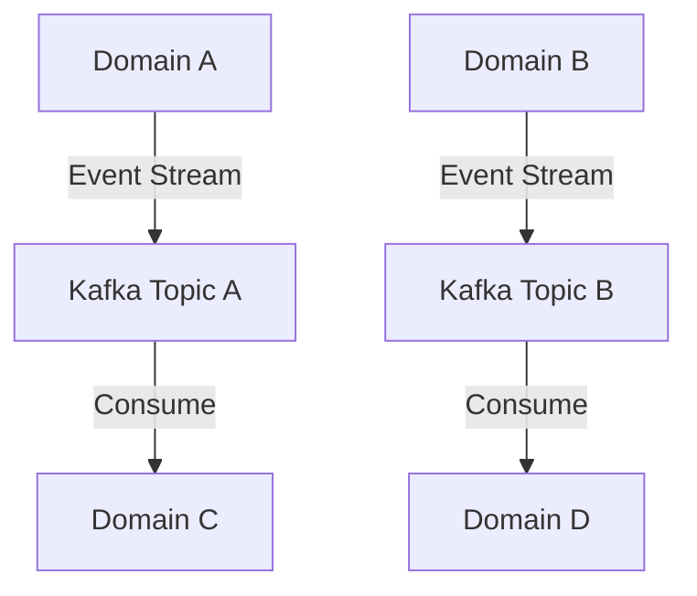
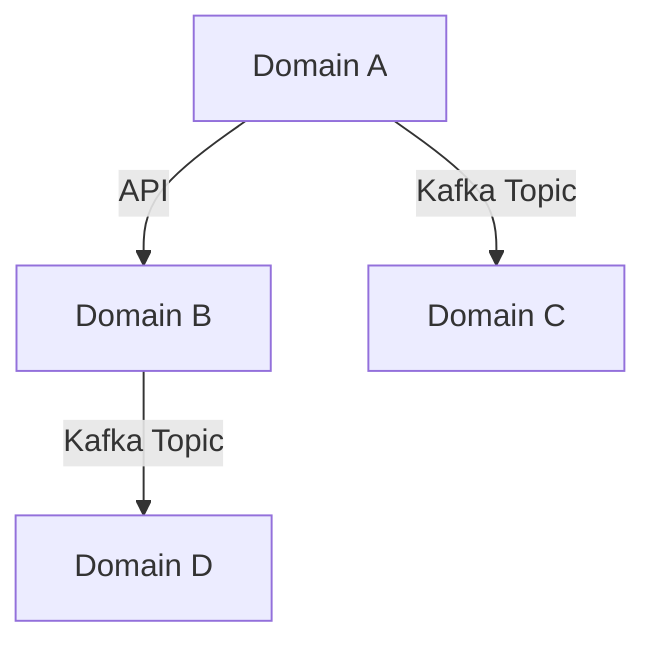
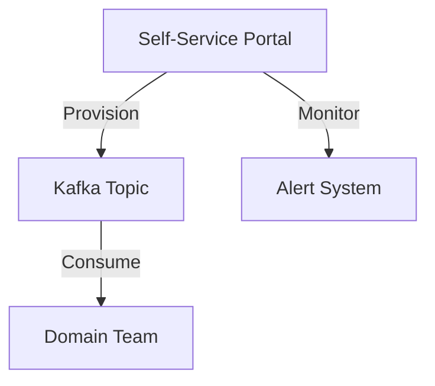

## 19.7.2 Patterns and Best Practices

Apache Kafka plays a pivotal role in modern data architectures, particularly in the context of a Data Mesh. This section delves into the patterns and best practices for effectively utilizing Kafka within a Data Mesh, ensuring scalability, reliability, and ease of use. We will explore architectural patterns, guidelines for domain boundaries, schema evolution, data validation, and the importance of automation and self-service capabilities.

### Introduction to Data Mesh and Kafka

Data Mesh is an emerging paradigm that decentralizes data ownership and architecture, promoting domain-oriented data management. Kafka, with its robust event streaming capabilities, is a natural fit for implementing Data Mesh architectures. It facilitates real-time data flow across domains, enabling seamless integration and scalability.

### Common Architectural Patterns

#### Event Streaming Per Domain

**Intent**: To decouple data producers and consumers by streaming events within domain boundaries, ensuring that each domain can operate independently.

**Motivation**: In a Data Mesh, domains are autonomous units responsible for their data. Event streaming per domain allows each domain to publish and consume events independently, promoting scalability and reducing inter-domain dependencies.

**Applicability**: Use this pattern when you need to ensure that domains can evolve independently without affecting others.

**Structure**:



**Caption**: Each domain publishes its events to a dedicated Kafka topic, which other domains can consume as needed.

**Participants**:
- **Domain A, B, C, D**: Independent domains responsible for their data.
- **Kafka Topic A, B**: Topics dedicated to each domain for event streaming.

**Collaborations**: Domains publish events to their respective Kafka topics, which other domains can consume.

**Consequences**: This pattern promotes domain autonomy and scalability but requires careful management of topic configurations and access controls.

**Implementation**:

- **Java**:

    ```java
    // Producer configuration for Domain A
    Properties props = new Properties();
    props.put("bootstrap.servers", "localhost:9092");
    props.put("key.serializer", "org.apache.kafka.common.serialization.StringSerializer");
    props.put("value.serializer", "org.apache.kafka.common.serialization.StringSerializer");

    Producer<String, String> producer = new KafkaProducer<>(props);
    producer.send(new ProducerRecord<>("DomainA_Topic", "key", "value"));
    producer.close();
    ```

- **Scala**:

    ```scala
    import org.apache.kafka.clients.producer.{KafkaProducer, ProducerRecord}
    import java.util.Properties

    val props = new Properties()
    props.put("bootstrap.servers", "localhost:9092")
    props.put("key.serializer", "org.apache.kafka.common.serialization.StringSerializer")
    props.put("value.serializer", "org.apache.kafka.common.serialization.StringSerializer")

    val producer = new KafkaProducer[String, String](props)
    producer.send(new ProducerRecord[String, String]("DomainA_Topic", "key", "value"))
    producer.close()
    ```

- **Kotlin**:

    ```kotlin
    import org.apache.kafka.clients.producer.KafkaProducer
    import org.apache.kafka.clients.producer.ProducerRecord
    import java.util.Properties

    val props = Properties().apply {
        put("bootstrap.servers", "localhost:9092")
        put("key.serializer", "org.apache.kafka.common.serialization.StringSerializer")
        put("value.serializer", "org.apache.kafka.common.serialization.StringSerializer")
    }

    val producer = KafkaProducer<String, String>(props)
    producer.send(ProducerRecord("DomainA_Topic", "key", "value"))
    producer.close()
    ```

- **Clojure**:

    ```clojure
    (require '[clj-kafka.producer :as producer])

    (def config {"bootstrap.servers" "localhost:9092"
                 "key.serializer" "org.apache.kafka.common.serialization.StringSerializer"
                 "value.serializer" "org.apache.kafka.common.serialization.StringSerializer"})

    (producer/send (producer/producer config) (producer/record "DomainA_Topic" "key" "value"))
    ```

**Sample Use Cases**: Real-time analytics, domain-specific event processing, and microservices communication.

**Related Patterns**: [4.1.1 Queue vs. Publish/Subscribe Models]( "Queue vs. Publish/Subscribe Models").

### Setting Boundaries and Interfaces Between Domains

**Guidelines**:

1. **Define Clear Domain Boundaries**: Use domain-driven design principles to delineate boundaries. Each domain should have a clear purpose and ownership of its data.

2. **Establish Interfaces**: Define APIs and event schemas that domains use to communicate. This ensures consistency and reduces coupling.

3. **Use Kafka Topics as Interfaces**: Each domain can publish and subscribe to Kafka topics, serving as the interface for data exchange.

4. **Implement Access Controls**: Use Kafka's ACLs to manage access to topics, ensuring that only authorized domains can publish or consume data.

**Diagram**:



**Caption**: Domains interact through well-defined APIs and Kafka topics, ensuring clear boundaries and interfaces.

### Best Practices for Schema Evolution and Data Validation

**Schema Evolution**:

- **Use a Schema Registry**: Utilize tools like [1.3.3 Schema Registry]( "Schema Registry") to manage and evolve schemas without breaking existing consumers.
- **Version Schemas**: Always version your schemas to handle changes gracefully.
- **Backward and Forward Compatibility**: Ensure that schema changes are backward and forward compatible to prevent disruptions.

**Data Validation**:

- **Validate at Ingress**: Validate data at the point of entry to ensure it adheres to the schema.
- **Use Validation Libraries**: Leverage libraries that can enforce schema rules and constraints.

**Implementation Example**:

- **Java**:

    ```java
    // Example of schema evolution using Avro
    String schemaString = "{\"type\":\"record\",\"name\":\"User\",\"fields\":[{\"name\":\"name\",\"type\":\"string\"}]}";
    Schema.Parser parser = new Schema.Parser();
    Schema schema = parser.parse(schemaString);

    // Validate data against schema
    GenericRecord user = new GenericData.Record(schema);
    user.put("name", "John Doe");
    ```

**Sample Use Cases**: Evolving customer data models, adding new fields to event schemas, and ensuring data integrity.

### Automation and Self-Service Capabilities

**Importance**:

- **Empower Teams**: Enable teams to manage their data pipelines without relying on centralized IT.
- **Reduce Time to Market**: Automation and self-service reduce the time required to deploy and manage data pipelines.

**Best Practices**:

1. **Automate Topic Provisioning**: Use tools like Terraform or Ansible to automate Kafka topic creation and configuration.
2. **Self-Service Portals**: Provide portals where teams can manage their Kafka resources.
3. **Monitoring and Alerts**: Implement monitoring and alerting to ensure that teams are aware of issues in real-time.

**Diagram**:



**Caption**: A self-service portal allows teams to provision and monitor Kafka topics, enhancing autonomy and efficiency.

### Conclusion

Incorporating Kafka into a Data Mesh architecture requires careful planning and adherence to best practices. By leveraging event streaming per domain, setting clear boundaries, managing schema evolution, and enabling automation and self-service, organizations can achieve scalable and reliable data architectures. These patterns and practices not only enhance the technical implementation but also empower teams to innovate and respond to business needs swiftly.

## Test Your Knowledge: Kafka Patterns and Best Practices in Data Mesh Architectures



### What is the primary benefit of using event streaming per domain in a Data Mesh architecture?

- [x] It allows domains to operate independently and scale autonomously.
- [ ] It centralizes data management for easier control.
- [ ] It reduces the need for schema evolution.
- [ ] It simplifies access control management.

> **Explanation:** Event streaming per domain ensures that each domain can operate independently, promoting scalability and reducing dependencies.

### Which tool is recommended for managing schema evolution in Kafka?

- [x] Schema Registry
- [ ] Zookeeper
- [ ] Kafka Connect
- [ ] Kafka Streams

> **Explanation:** The Schema Registry is used to manage and evolve schemas without breaking existing consumers.

### What is a key practice for setting boundaries between domains in a Data Mesh?

- [x] Define clear APIs and event schemas for communication.
- [ ] Use a single Kafka topic for all domains.
- [ ] Avoid using access controls.
- [ ] Centralize all data processing.

> **Explanation:** Defining clear APIs and event schemas ensures consistency and reduces coupling between domains.

### Why is automation important in a Data Mesh architecture?

- [x] It empowers teams to manage data pipelines independently.
- [ ] It centralizes control over data.
- [ ] It eliminates the need for schema evolution.
- [ ] It reduces the number of Kafka topics needed.

> **Explanation:** Automation enables teams to manage their data pipelines without relying on centralized IT, reducing time to market.

### Which of the following is a best practice for schema evolution?

- [x] Ensure backward and forward compatibility.
- [ ] Avoid versioning schemas.
- [ ] Use a single schema for all data types.
- [ ] Centralize schema management in one team.

> **Explanation:** Ensuring backward and forward compatibility prevents disruptions when schemas change.

### What is the role of a self-service portal in a Data Mesh?

- [x] It allows teams to provision and monitor Kafka resources independently.
- [ ] It centralizes data processing.
- [ ] It manages schema evolution.
- [ ] It reduces the need for automation.

> **Explanation:** A self-service portal empowers teams to manage their Kafka resources, enhancing autonomy and efficiency.

### How can Kafka topics serve as interfaces between domains?

- [x] By acting as the medium for data exchange between domains.
- [ ] By centralizing data storage.
- [ ] By eliminating the need for APIs.
- [ ] By reducing the number of domains.

> **Explanation:** Kafka topics serve as the interface for data exchange, allowing domains to communicate effectively.

### What is a consequence of not using access controls on Kafka topics?

- [x] Unauthorized domains may publish or consume data.
- [ ] It simplifies domain interactions.
- [ ] It reduces the need for schema evolution.
- [ ] It centralizes data management.

> **Explanation:** Without access controls, unauthorized domains may access data, leading to potential security issues.

### Which practice helps ensure data integrity in Kafka?

- [x] Validate data at the point of entry.
- [ ] Use a single schema for all data.
- [ ] Avoid using validation libraries.
- [ ] Centralize data validation in one team.

> **Explanation:** Validating data at the point of entry ensures it adheres to the schema, maintaining data integrity.

### True or False: In a Data Mesh, domains should rely on a centralized IT team for managing data pipelines.

- [ ] True
- [x] False

> **Explanation:** In a Data Mesh, domains should be empowered to manage their data pipelines independently, reducing reliance on centralized IT.


