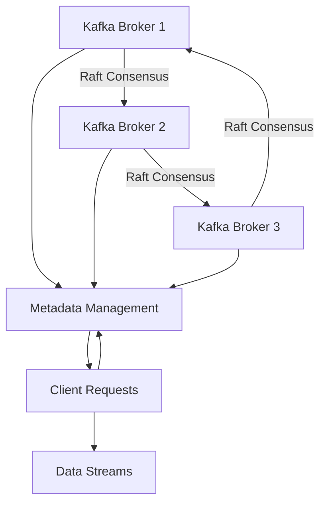

## 2.1.3.1 Motivation and Benefits of KRaft

Apache Kafka has long been a cornerstone in the realm of distributed streaming platforms, providing robust capabilities for real-time data processing. However, as Kafka deployments have grown in scale and complexity, the limitations of its reliance on Apache ZooKeeper for metadata management have become increasingly apparent. This section delves into the motivations behind Kafka's transition to the KRaft (Kafka Raft) architecture, highlighting the benefits it brings in terms of simplified operations, enhanced consistency, and improved scalability.

### Motivation for Transitioning from ZooKeeper to KRaft

#### Limitations of ZooKeeper in Kafka Deployments

ZooKeeper has been an integral part of Kafka's architecture, responsible for managing metadata and coordinating distributed processes. However, several limitations have prompted the Kafka community to explore alternatives:

1. **Complexity in Operations**: Managing a separate ZooKeeper ensemble adds operational overhead. It requires additional configuration, monitoring, and maintenance, which can complicate the deployment and management of Kafka clusters.

2. **Consistency Challenges**: ZooKeeper's eventual consistency model can lead to scenarios where metadata updates are not immediately visible across all nodes, potentially causing inconsistencies in large-scale deployments.

3. **Scalability Constraints**: As Kafka clusters grow, the load on ZooKeeper increases, potentially leading to performance bottlenecks. ZooKeeper's architecture is not inherently designed to handle the scale of metadata operations required by large Kafka deployments.

4. **Dependency Management**: Relying on an external system like ZooKeeper introduces additional dependencies, which can complicate version compatibility and upgrade processes.

#### Objectives of Introducing KRaft

The introduction of KRaft aims to address these limitations by reimagining Kafka's metadata management architecture. The primary objectives include:

1. **Unified Architecture**: By integrating metadata management directly into Kafka, KRaft eliminates the need for a separate ZooKeeper ensemble, simplifying the overall architecture.

2. **Enhanced Consistency**: KRaft leverages the Raft consensus algorithm to provide stronger consistency guarantees, ensuring that metadata updates are immediately visible across all nodes in the cluster.

3. **Improved Scalability**: The new architecture is designed to handle the demands of large-scale deployments, with optimizations that reduce the load on metadata management processes.

4. **Simplified Operations**: By reducing the number of components that need to be managed, KRaft simplifies the deployment, configuration, and monitoring of Kafka clusters.

5. **Streamlined Upgrades**: With KRaft, Kafka can evolve independently of ZooKeeper, allowing for more seamless upgrades and feature rollouts.

### Benefits of KRaft in Kafka's Architecture

#### Simplified Operations

One of the most significant benefits of KRaft is the simplification of Kafka operations. By removing the dependency on ZooKeeper, Kafka administrators can focus on managing a single system, reducing the complexity of deployment and maintenance. This simplification extends to configuration management, as there is no longer a need to synchronize settings between Kafka and ZooKeeper.

#### Stronger Consistency Guarantees

KRaft's use of the Raft consensus algorithm provides stronger consistency guarantees compared to ZooKeeper's eventual consistency model. This ensures that metadata updates, such as topic configurations and partition assignments, are immediately visible across all nodes, reducing the risk of inconsistencies and improving the reliability of Kafka deployments.

#### Improved Scalability

KRaft is designed to scale with the demands of modern data architectures. By optimizing metadata management processes, KRaft can handle the increased load of large-scale deployments without becoming a bottleneck. This scalability is crucial for organizations that rely on Kafka for mission-critical applications and need to support high-throughput data streams.

#### Enhanced Performance

By integrating metadata management directly into Kafka, KRaft reduces the latency associated with metadata operations. This integration allows for more efficient communication between brokers, leading to improved overall performance and responsiveness of Kafka clusters.

#### Streamlined Upgrades and Feature Rollouts

With KRaft, Kafka can evolve independently of ZooKeeper, allowing for more streamlined upgrades and feature rollouts. This independence enables the Kafka community to innovate more rapidly, introducing new features and improvements without being constrained by ZooKeeper's release cycle.

### Practical Applications and Real-World Scenarios

The transition to KRaft is not just a theoretical improvement; it has practical implications for real-world Kafka deployments. Here are some scenarios where KRaft's benefits are particularly evident:

1. **Large-Scale Data Pipelines**: Organizations with large-scale data pipelines can benefit from KRaft's improved scalability and performance, ensuring that their Kafka clusters can handle high-throughput data streams without bottlenecks.

2. **Mission-Critical Applications**: For applications where consistency and reliability are paramount, KRaft's stronger consistency guarantees provide peace of mind, reducing the risk of data inconsistencies and ensuring that metadata updates are immediately visible across the cluster.

3. **Simplified DevOps Processes**: By reducing the complexity of Kafka deployments, KRaft simplifies DevOps processes, allowing teams to focus on delivering value rather than managing infrastructure.

4. **Seamless Upgrades**: Organizations can take advantage of KRaft's streamlined upgrade process to adopt new Kafka features and improvements more quickly, staying at the forefront of streaming technology.

### Code Examples

To illustrate the benefits of KRaft, let's explore some code examples that demonstrate how Kafka's metadata management is simplified with KRaft. We'll provide examples in Java, Scala, Kotlin, and Clojure.

#### Java Example

```java
import org.apache.kafka.clients.admin.AdminClient;
import org.apache.kafka.clients.admin.AdminClientConfig;
import org.apache.kafka.clients.admin.NewTopic;

import java.util.Collections;
import java.util.Properties;

public class KafkaKRaftExample {
    public static void main(String[] args) {
        Properties props = new Properties();
        props.put(AdminClientConfig.BOOTSTRAP_SERVERS_CONFIG, "localhost:9092");

        try (AdminClient adminClient = AdminClient.create(props)) {
            NewTopic newTopic = new NewTopic("example-topic", 1, (short) 1);
            adminClient.createTopics(Collections.singletonList(newTopic)).all().get();
            System.out.println("Topic created successfully with KRaft.");
        } catch (Exception e) {
            e.printStackTrace();
        }
    }
}
```

#### Scala Example

```scala
import org.apache.kafka.clients.admin.{AdminClient, AdminClientConfig, NewTopic}

import java.util.Properties
import scala.jdk.CollectionConverters._

object KafkaKRaftExample extends App {
  val props = new Properties()
  props.put(AdminClientConfig.BOOTSTRAP_SERVERS_CONFIG, "localhost:9092")

  val adminClient = AdminClient.create(props)
  val newTopic = new NewTopic("example-topic", 1, 1.toShort)

  try {
    adminClient.createTopics(List(newTopic).asJava).all().get()
    println("Topic created successfully with KRaft.")
  } catch {
    case e: Exception => e.printStackTrace()
  } finally {
    adminClient.close()
  }
}
```

#### Kotlin Example

```kotlin
import org.apache.kafka.clients.admin.AdminClient
import org.apache.kafka.clients.admin.AdminClientConfig
import org.apache.kafka.clients.admin.NewTopic

fun main() {
    val props = Properties().apply {
        put(AdminClientConfig.BOOTSTRAP_SERVERS_CONFIG, "localhost:9092")
    }

    AdminClient.create(props).use { adminClient ->
        val newTopic = NewTopic("example-topic", 1, 1.toShort())
        adminClient.createTopics(listOf(newTopic)).all().get()
        println("Topic created successfully with KRaft.")
    }
}
```

#### Clojure Example

```clojure
(ns kafka-kraft-example
  (:import [org.apache.kafka.clients.admin AdminClient AdminClientConfig NewTopic]
           [java.util Properties]))

(defn create-topic []
  (let [props (doto (Properties.)
                (.put AdminClientConfig/BOOTSTRAP_SERVERS_CONFIG "localhost:9092"))
        admin-client (AdminClient/create props)
        new-topic (NewTopic. "example-topic" 1 1)]
    (try
      (.get (.all (.createTopics admin-client [new-topic])))
      (println "Topic created successfully with KRaft.")
      (catch Exception e
        (.printStackTrace e))
      (finally
        (.close admin-client)))))

(create-topic)
```

### Visualizing KRaft Architecture

To better understand the KRaft architecture and its benefits, let's visualize the key components and data flow within a Kafka cluster using KRaft.



**Caption**: The diagram illustrates the KRaft architecture, where Kafka brokers participate in a Raft consensus group to manage metadata, eliminating the need for ZooKeeper.

### References and Links

- [Apache Kafka Documentation](https://kafka.apache.org/documentation/)
- [Confluent Documentation](https://docs.confluent.io/)
- [Raft Consensus Algorithm](https://raft.github.io/)
- [ZooKeeper Documentation](https://zookeeper.apache.org/)

### Knowledge Check

To reinforce your understanding of the motivation and benefits of KRaft, consider the following questions and exercises:

1. **Explain how KRaft simplifies Kafka operations compared to ZooKeeper.**
2. **Discuss the consistency guarantees provided by KRaft and how they differ from ZooKeeper's model.**
3. **Describe a real-world scenario where KRaft's scalability benefits would be particularly valuable.**
4. **Experiment with the provided code examples by creating additional topics and observing the metadata management process.**

### Embrace the Journey

As you explore the motivations and benefits of KRaft, consider how these improvements can enhance your Kafka deployments. By understanding the architectural changes and their implications, you can leverage KRaft to build more robust, scalable, and efficient streaming platforms.

### Best Practices for Tags

- Use Specific and Relevant Tags
- Use 4 to 8 relevant and specific tags that reflect the article's content.
- Tags should reflect key topics, technologies, or concepts, such as programming languages, Kafka features, design patterns, or integration techniques discussed in the article.
- Keep tag names consistent and properly capitalized (e.g., "Apache Kafka", "Scala", "Stream Processing").
- Wrap tags in double-quotes.
- Avoid tags containing `#` characters. For example, use "CSharp" instead of "C#", use "FSharp" instead of "F#".

## Test Your Knowledge: KRaft Architecture and Benefits Quiz



### What is one of the primary motivations for transitioning from ZooKeeper to KRaft in Kafka?

- [x] Simplifying operations by eliminating the need for a separate ZooKeeper ensemble.
- [ ] Increasing the number of components to manage.
- [ ] Reducing the number of brokers in a Kafka cluster.
- [ ] Decreasing the consistency guarantees of metadata management.

> **Explanation:** KRaft simplifies operations by integrating metadata management directly into Kafka, eliminating the need for a separate ZooKeeper ensemble.

### How does KRaft improve consistency guarantees in Kafka?

- [x] By using the Raft consensus algorithm for stronger consistency.
- [ ] By relying on eventual consistency like ZooKeeper.
- [ ] By reducing the number of brokers in the cluster.
- [ ] By increasing the complexity of metadata management.

> **Explanation:** KRaft uses the Raft consensus algorithm to provide stronger consistency guarantees, ensuring metadata updates are immediately visible across all nodes.

### What is a benefit of KRaft's improved scalability?

- [x] It can handle the increased load of large-scale deployments without becoming a bottleneck.
- [ ] It reduces the number of brokers needed in a cluster.
- [ ] It decreases the complexity of metadata management.
- [ ] It limits the throughput of data streams.

> **Explanation:** KRaft's improved scalability allows it to handle the increased load of large-scale deployments, ensuring that Kafka clusters can support high-throughput data streams.

### In what way does KRaft enhance Kafka's performance?

- [x] By reducing the latency associated with metadata operations.
- [ ] By increasing the number of brokers in the cluster.
- [ ] By relying on eventual consistency like ZooKeeper.
- [ ] By decreasing the complexity of metadata management.

> **Explanation:** KRaft enhances performance by integrating metadata management directly into Kafka, reducing the latency associated with metadata operations.

### How does KRaft streamline Kafka upgrades and feature rollouts?

- [x] By allowing Kafka to evolve independently of ZooKeeper.
- [ ] By increasing the number of components to manage.
- [ ] By reducing the number of brokers in a Kafka cluster.
- [ ] By decreasing the consistency guarantees of metadata management.

> **Explanation:** KRaft allows Kafka to evolve independently of ZooKeeper, enabling more streamlined upgrades and feature rollouts.

### What is a practical application of KRaft's benefits?

- [x] Large-scale data pipelines can benefit from improved scalability and performance.
- [ ] Reducing the number of brokers in a Kafka cluster.
- [ ] Decreasing the complexity of metadata management.
- [ ] Limiting the throughput of data streams.

> **Explanation:** Large-scale data pipelines can benefit from KRaft's improved scalability and performance, ensuring that Kafka clusters can handle high-throughput data streams without bottlenecks.

### How does KRaft simplify DevOps processes?

- [x] By reducing the complexity of Kafka deployments.
- [ ] By increasing the number of components to manage.
- [ ] By reducing the number of brokers in a Kafka cluster.
- [ ] By decreasing the consistency guarantees of metadata management.

> **Explanation:** KRaft simplifies DevOps processes by reducing the complexity of Kafka deployments, allowing teams to focus on delivering value rather than managing infrastructure.

### What is a key feature of KRaft's architecture?

- [x] Integration of metadata management directly into Kafka.
- [ ] Reliance on eventual consistency like ZooKeeper.
- [ ] Increasing the number of brokers in the cluster.
- [ ] Decreasing the complexity of metadata management.

> **Explanation:** KRaft integrates metadata management directly into Kafka, eliminating the need for a separate ZooKeeper ensemble.

### How does KRaft impact Kafka's scalability?

- [x] It improves scalability by optimizing metadata management processes.
- [ ] It reduces the number of brokers needed in a cluster.
- [ ] It decreases the complexity of metadata management.
- [ ] It limits the throughput of data streams.

> **Explanation:** KRaft improves scalability by optimizing metadata management processes, allowing Kafka to handle the demands of large-scale deployments.

### True or False: KRaft allows Kafka to evolve independently of ZooKeeper.

- [x] True
- [ ] False

> **Explanation:** True. KRaft allows Kafka to evolve independently of ZooKeeper, enabling more streamlined upgrades and feature rollouts.


