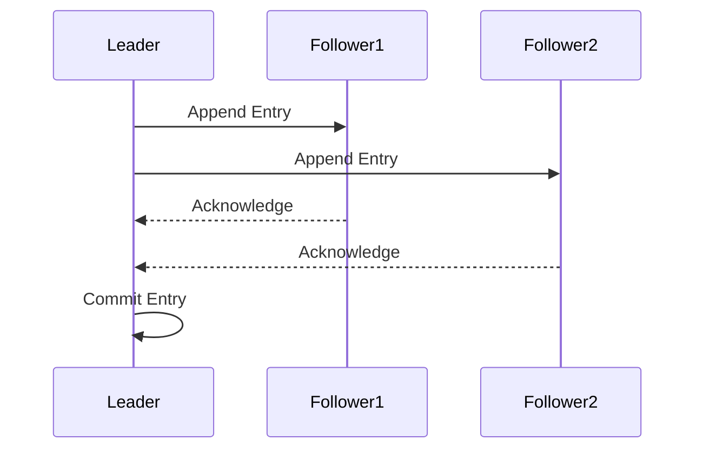
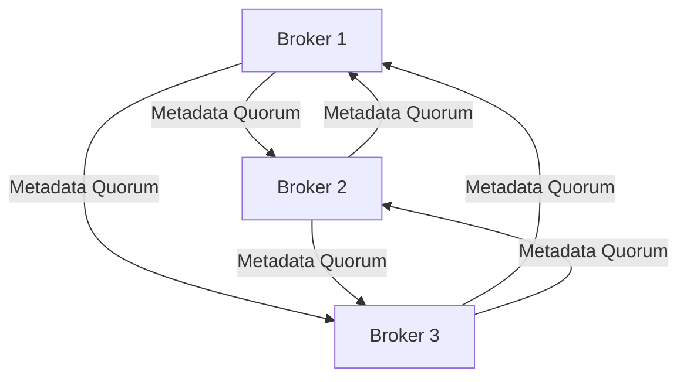

## 2.1.3.2 Architecture Changes in KRaft

### Introduction

Apache Kafka has long been a cornerstone of real-time data streaming and processing, renowned for its distributed architecture and robust capabilities. Traditionally, Kafka has relied on ZooKeeper for managing metadata and ensuring consensus across the cluster. However, the introduction of the KRaft (Kafka Raft) architecture marks a significant evolution in Kafka's design, eliminating the dependency on ZooKeeper and introducing a new internal consensus mechanism based on the Raft protocol. This section delves into the architectural changes brought about by KRaft, exploring how it enhances Kafka's scalability, reliability, and operational simplicity.

### Eliminating ZooKeeper: A New Era for Kafka

ZooKeeper has been an integral part of Kafka's architecture, responsible for managing cluster metadata, leader election, and configuration management. Despite its reliability, ZooKeeper introduces complexity and operational overhead. KRaft addresses these challenges by embedding metadata management directly within Kafka brokers, streamlining operations and reducing external dependencies.

#### Key Benefits of Removing ZooKeeper

- **Simplified Operations**: By removing the need for a separate ZooKeeper ensemble, Kafka clusters become easier to deploy, manage, and scale.
- **Reduced Latency**: Direct metadata management within Kafka brokers reduces the latency associated with ZooKeeper communication.
- **Enhanced Security**: Fewer components mean a smaller attack surface, simplifying security management.

### The Raft Protocol: Ensuring Consensus in Kafka

The Raft protocol is a consensus algorithm designed to be easy to understand and implement. It provides a robust mechanism for achieving consensus across distributed systems, ensuring that all nodes in a cluster agree on a common state. In the context of KRaft, Raft replaces ZooKeeper's role in managing metadata and leader election.

#### How Raft Works in Kafka

- **Leader Election**: Raft ensures that a single leader is elected among the brokers, responsible for managing metadata updates.
- **Log Replication**: The leader replicates log entries to follower brokers, ensuring consistency across the cluster.
- **Commitment**: Once a majority of brokers acknowledge a log entry, it is considered committed and applied to the state machine.



*Diagram 1: Raft Protocol in Kafka - Leader replicates log entries to followers, achieving consensus.*

### Metadata Quorum: Internal Management within Brokers

KRaft introduces the concept of a metadata quorum, where a subset of brokers is responsible for managing and replicating metadata. This quorum-based approach ensures high availability and fault tolerance, even in the face of broker failures.

#### Metadata Quorum in Action

- **Quorum Size**: Typically, a quorum consists of a majority of brokers, ensuring that metadata updates can be committed even if some brokers are unavailable.
- **Dynamic Membership**: Brokers can dynamically join or leave the quorum, allowing for flexible scaling and maintenance.



*Diagram 2: Metadata Quorum - Brokers participate in a quorum to manage metadata.*

### Improvements in Controller Scalability and Reliability

The KRaft architecture significantly enhances the scalability and reliability of Kafka's controller, the component responsible for managing cluster metadata and orchestrating operations.

#### Scalability Enhancements

- **Decentralized Metadata Management**: By distributing metadata management across brokers, KRaft eliminates bottlenecks associated with a centralized controller.
- **Efficient Resource Utilization**: Brokers can independently manage metadata, reducing the load on any single node and improving overall cluster performance.

#### Reliability Improvements

- **Fault Tolerance**: The Raft protocol ensures that metadata updates are replicated across multiple brokers, providing resilience against failures.
- **Consistent State**: Even in the event of broker failures, the metadata quorum ensures that the cluster maintains a consistent state.

### Practical Applications and Real-World Scenarios

The architectural changes introduced by KRaft have profound implications for real-world Kafka deployments, particularly in large-scale, mission-critical environments.

#### Use Case: High-Availability Data Pipelines

In scenarios where data availability and consistency are paramount, such as financial services or healthcare, KRaft's enhanced fault tolerance and reliability ensure that data pipelines remain operational even in the face of failures.

#### Use Case: Simplified Cloud Deployments

For organizations deploying Kafka in cloud environments, the elimination of ZooKeeper simplifies infrastructure management and reduces operational costs, making it easier to leverage managed services and scale on demand.

### Code Examples: Implementing KRaft in Kafka

To illustrate the practical implementation of KRaft, let's explore code examples in Java, Scala, Kotlin, and Clojure, demonstrating how to configure and manage a Kafka cluster using the KRaft architecture.

#### Java Example

```java
import org.apache.kafka.clients.admin.AdminClient;
import org.apache.kafka.clients.admin.AdminClientConfig;
import java.util.Properties;

public class KafkaKRaftExample {
    public static void main(String[] args) {
        Properties props = new Properties();
        props.put(AdminClientConfig.BOOTSTRAP_SERVERS_CONFIG, "localhost:9092");
        props.put(AdminClientConfig.CLIENT_ID_CONFIG, "KRaftAdminClient");

        try (AdminClient adminClient = AdminClient.create(props)) {
            // Perform administrative operations
        }
    }
}
```

#### Scala Example

```scala
import org.apache.kafka.clients.admin.{AdminClient, AdminClientConfig}
import java.util.Properties

object KafkaKRaftExample extends App {
  val props = new Properties()
  props.put(AdminClientConfig.BOOTSTRAP_SERVERS_CONFIG, "localhost:9092")
  props.put(AdminClientConfig.CLIENT_ID_CONFIG, "KRaftAdminClient")

  val adminClient = AdminClient.create(props)
  // Perform administrative operations
  adminClient.close()
}
```

#### Kotlin Example

```kotlin
import org.apache.kafka.clients.admin.AdminClient
import org.apache.kafka.clients.admin.AdminClientConfig
import java.util.Properties

fun main() {
    val props = Properties().apply {
        put(AdminClientConfig.BOOTSTRAP_SERVERS_CONFIG, "localhost:9092")
        put(AdminClientConfig.CLIENT_ID_CONFIG, "KRaftAdminClient")
    }

    AdminClient.create(props).use { adminClient ->
        // Perform administrative operations
    }
}
```

#### Clojure Example

```clojure
(require '[org.apache.kafka.clients.admin AdminClient AdminClientConfig])

(defn create-admin-client []
  (let [props (doto (java.util.Properties.)
                (.put AdminClientConfig/BOOTSTRAP_SERVERS_CONFIG "localhost:9092")
                (.put AdminClientConfig/CLIENT_ID_CONFIG "KRaftAdminClient"))]
    (AdminClient/create props)))

(with-open [admin-client (create-admin-client)]
  ;; Perform administrative operations
  )
```

### Conclusion

The transition to the KRaft architecture represents a pivotal moment in Kafka's evolution, offering significant improvements in scalability, reliability, and operational simplicity. By eliminating the dependency on ZooKeeper and leveraging the Raft protocol, KRaft empowers organizations to build more resilient and efficient data streaming solutions. As Kafka continues to evolve, the KRaft architecture will play a crucial role in shaping the future of real-time data processing.

### Knowledge Check

To reinforce your understanding of KRaft's architectural changes, consider the following questions and exercises.

## Test Your Knowledge: KRaft Architecture and Raft Protocol Quiz



### What is the primary benefit of removing ZooKeeper in KRaft?

- [x] Simplified operations and reduced latency
- [ ] Increased complexity
- [ ] Higher operational costs
- [ ] Decreased security

> **Explanation:** Removing ZooKeeper simplifies operations and reduces latency by managing metadata directly within Kafka brokers.

### How does the Raft protocol ensure consensus in Kafka?

- [x] Through leader election and log replication
- [ ] By using a centralized database
- [ ] By relying on external services
- [ ] Through manual configuration

> **Explanation:** The Raft protocol ensures consensus through leader election and log replication, maintaining consistency across the cluster.

### What is a metadata quorum in KRaft?

- [x] A subset of brokers responsible for managing metadata
- [ ] A group of external servers
- [ ] A single broker managing all metadata
- [ ] A client-side configuration

> **Explanation:** A metadata quorum is a subset of brokers that manage and replicate metadata, ensuring high availability and fault tolerance.

### Which of the following is NOT a benefit of KRaft?

- [ ] Enhanced scalability
- [x] Increased dependency on external systems
- [ ] Improved reliability
- [ ] Simplified cloud deployments

> **Explanation:** KRaft reduces dependency on external systems by eliminating ZooKeeper, enhancing scalability, reliability, and simplifying deployments.

### In KRaft, how is metadata consistency maintained?

- [x] Through the Raft protocol's log replication
- [ ] By using a centralized database
- [ ] Through manual updates
- [ ] By relying on client-side caching

> **Explanation:** Metadata consistency is maintained through the Raft protocol's log replication, ensuring all brokers have a consistent view of the metadata.

### What role does the leader play in the Raft protocol?

- [x] Managing metadata updates and log replication
- [ ] Acting as a backup server
- [ ] Handling client requests directly
- [ ] Performing data analytics

> **Explanation:** The leader in the Raft protocol manages metadata updates and replicates logs to follower brokers, ensuring consistency.

### How does KRaft improve controller scalability?

- [x] By decentralizing metadata management across brokers
- [ ] By increasing the number of controllers
- [ ] By using a larger ZooKeeper ensemble
- [ ] By reducing the number of brokers

> **Explanation:** KRaft improves scalability by decentralizing metadata management, reducing bottlenecks and distributing the load across brokers.

### What is the impact of KRaft on cloud deployments?

- [x] Simplified infrastructure management and reduced costs
- [ ] Increased complexity and higher costs
- [ ] No significant impact
- [ ] Requires additional components

> **Explanation:** KRaft simplifies infrastructure management and reduces costs by eliminating ZooKeeper, making cloud deployments more efficient.

### Which protocol does KRaft use for consensus?

- [x] Raft
- [ ] Paxos
- [ ] Two-Phase Commit
- [ ] Gossip

> **Explanation:** KRaft uses the Raft protocol for consensus, ensuring reliable metadata management and leader election.

### True or False: KRaft requires an external consensus system.

- [ ] True
- [x] False

> **Explanation:** False. KRaft eliminates the need for an external consensus system by embedding metadata management within Kafka brokers using the Raft protocol.



By understanding the architectural changes introduced by KRaft, you can leverage Kafka's full potential to build scalable, reliable, and efficient data streaming solutions. Explore further sections of this guide to deepen your knowledge and apply these concepts to real-world scenarios.
