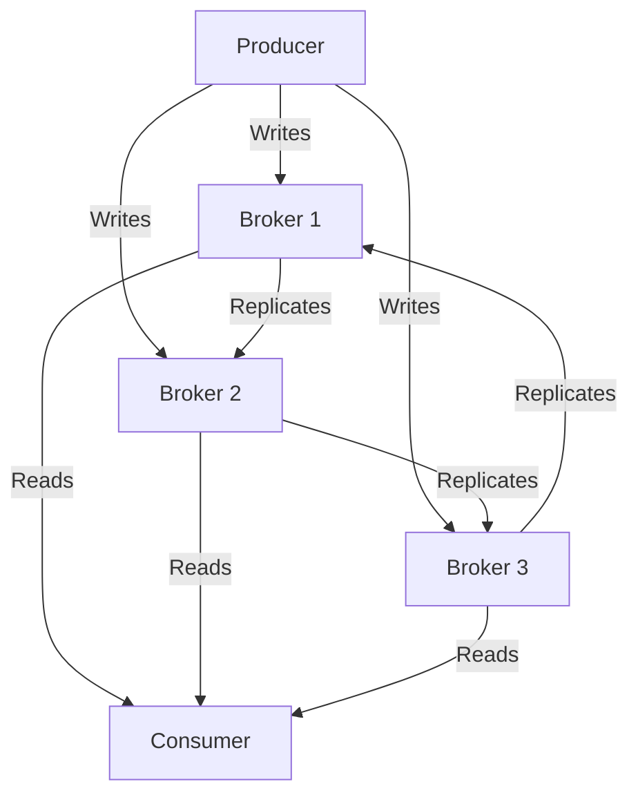

## 2.1 Kafka Clusters and Brokers

### Introduction

Apache Kafka is a distributed event streaming platform that is designed to handle real-time data feeds. At the heart of Kafka's architecture are clusters and brokers, which are essential for ensuring data is processed efficiently and reliably. This section delves into the roles of Kafka brokers within a cluster, best practices for their configuration and management, various deployment strategies, and the innovations introduced by the KRaft architecture.

### Understanding Kafka Brokers

#### Definition and Role

A Kafka broker is a server that stores and serves data. Brokers are responsible for maintaining the data in Kafka topics, handling data replication, and serving client requests. Each broker in a Kafka cluster is identified by a unique ID and can handle hundreds of thousands of reads and writes per second from thousands of clients.

- **Data Storage**: Brokers store data in partitions, which are segments of a topic. Each partition is replicated across multiple brokers to ensure fault tolerance.
- **Request Handling**: Brokers manage client requests for data reads and writes. They also coordinate with other brokers to ensure data consistency and reliability.
- **Replication Management**: Brokers are responsible for replicating data across the cluster to ensure high availability and durability.

#### Broker Configuration and Management

Proper configuration and management of brokers are crucial for maintaining a healthy Kafka cluster. Here are some best practices:

- **Resource Allocation**: Ensure that brokers have sufficient CPU, memory, and disk resources. Kafka is I/O intensive, so fast disks and ample memory are critical.
- **Replication Factor**: Set an appropriate replication factor for topics to balance between data durability and resource usage. A replication factor of three is common in production environments.
- **Log Retention**: Configure log retention policies to manage disk space usage. This can be based on time (e.g., retain logs for seven days) or size (e.g., retain up to 500GB of logs).
- **Monitoring and Alerts**: Implement monitoring solutions to track broker performance and health. Tools like Prometheus and Grafana can be used to visualize metrics and set up alerts for anomalies.
- **Security**: Secure brokers using SSL/TLS for encryption and SASL for authentication. Implement access control lists (ACLs) to manage permissions.

### Deployment Strategies

Kafka can be deployed in various environments, each with its own set of considerations. Here are some common deployment strategies:

#### On-Premises Deployment

Deploying Kafka on-premises provides complete control over the hardware and network environment. This approach is suitable for organizations with existing data centers or those with specific compliance requirements.

- **Hardware Considerations**: Choose hardware with fast disks (SSD preferred) and ample memory. Network bandwidth should be sufficient to handle peak loads.
- **Network Configuration**: Ensure low-latency network connections between brokers. Use dedicated network interfaces for Kafka traffic if possible.
- **Scalability**: Plan for future growth by provisioning additional hardware resources that can be easily integrated into the cluster.

#### Cloud Deployment

Cloud deployments offer flexibility and scalability, allowing organizations to quickly adapt to changing workloads. Popular cloud providers like AWS, Azure, and Google Cloud offer managed Kafka services.

- **Managed Services**: Consider using managed Kafka services like Amazon MSK or Confluent Cloud to offload operational overhead.
- **Cost Management**: Monitor and optimize cloud resource usage to control costs. Use auto-scaling features to adjust resources based on demand.
- **Multi-Region Deployments**: Leverage cloud infrastructure to deploy Kafka clusters across multiple regions for disaster recovery and data locality.

### The KRaft Architecture

#### Introduction to KRaft

KRaft (Kafka Raft) is a new architecture introduced in Apache Kafka to replace ZooKeeper as the metadata management system. This change simplifies the Kafka architecture and improves scalability and reliability.

- **Motivation**: The primary motivation for KRaft is to eliminate the dependency on ZooKeeper, which can be a bottleneck and a single point of failure in large clusters.
- **Benefits**: KRaft offers improved scalability, simplified operations, and better integration with cloud-native environments.

#### Architecture Changes

KRaft introduces several changes to the Kafka architecture:

- **Raft Protocol**: KRaft uses the Raft consensus algorithm to manage metadata and ensure consistency across brokers.
- **Single Process**: With KRaft, Kafka brokers manage both data and metadata, reducing the complexity of managing separate ZooKeeper nodes.
- **Improved Scalability**: KRaft allows for larger clusters by removing the ZooKeeper bottleneck.

#### Migration Path to KRaft

Migrating to KRaft requires careful planning and execution. Here are some steps to consider:

- **Compatibility**: Ensure that your Kafka version supports KRaft. As of Kafka 2.8, KRaft is available as a preview feature.
- **Testing**: Test the migration process in a staging environment to identify potential issues.
- **Incremental Migration**: Consider an incremental migration approach, where you gradually transition parts of your cluster to KRaft while monitoring performance and stability.

### Practical Applications and Real-World Scenarios

Kafka clusters and brokers are used in various real-world scenarios, including:

- **Event-Driven Microservices**: Kafka brokers facilitate communication between microservices by acting as a message broker, ensuring reliable and scalable data exchange.
- **Real-Time Data Pipelines**: Brokers handle the ingestion and processing of real-time data streams, enabling applications like fraud detection and real-time analytics.
- **Big Data Integration**: Kafka brokers integrate with big data platforms to provide a unified data pipeline for batch and stream processing. See [1.4.4 Big Data Integration]( "Big Data Integration") for more details.

### Code Examples

Below are code examples demonstrating how to configure and manage Kafka brokers in different programming languages.

#### Java

```java
import org.apache.kafka.clients.admin.AdminClient;
import org.apache.kafka.clients.admin.AdminClientConfig;
import org.apache.kafka.clients.admin.NewTopic;

import java.util.Collections;
import java.util.Properties;

public class KafkaBrokerConfig {
    public static void main(String[] args) {
        Properties config = new Properties();
        config.put(AdminClientConfig.BOOTSTRAP_SERVERS_CONFIG, "localhost:9092");

        try (AdminClient adminClient = AdminClient.create(config)) {
            NewTopic newTopic = new NewTopic("example-topic", 3, (short) 2);
            adminClient.createTopics(Collections.singletonList(newTopic));
            System.out.println("Topic created successfully.");
        }
    }
}
```

#### Scala

```scala
import org.apache.kafka.clients.admin.{AdminClient, AdminClientConfig, NewTopic}
import java.util.Properties
import scala.jdk.CollectionConverters._

object KafkaBrokerConfig extends App {
  val config = new Properties()
  config.put(AdminClientConfig.BOOTSTRAP_SERVERS_CONFIG, "localhost:9092")

  val adminClient = AdminClient.create(config)
  val newTopic = new NewTopic("example-topic", 3, 2.toShort)
  adminClient.createTopics(List(newTopic).asJava)
  println("Topic created successfully.")
  adminClient.close()
}
```

#### Kotlin

```kotlin
import org.apache.kafka.clients.admin.AdminClient
import org.apache.kafka.clients.admin.AdminClientConfig
import org.apache.kafka.clients.admin.NewTopic

fun main() {
    val config = Properties().apply {
        put(AdminClientConfig.BOOTSTRAP_SERVERS_CONFIG, "localhost:9092")
    }

    AdminClient.create(config).use { adminClient ->
        val newTopic = NewTopic("example-topic", 3, 2.toShort())
        adminClient.createTopics(listOf(newTopic))
        println("Topic created successfully.")
    }
}
```

#### Clojure

```clojure
(require '[clojure.java.io :as io])
(require '[clojure.java.jdbc :as jdbc])

(defn create-topic []
  (let [config {"bootstrap.servers" "localhost:9092"}
        admin-client (AdminClient/create config)
        new-topic (NewTopic. "example-topic" 3 (short 2))]
    (.createTopics admin-client [new-topic])
    (println "Topic created successfully.")
    (.close admin-client)))

(create-topic)
```

### Visualizing Kafka Clusters and Brokers

#### Kafka Cluster Architecture



**Caption**: This diagram illustrates a Kafka cluster with three brokers. Producers write data to the brokers, which replicate the data across the cluster. Consumers read data from the brokers.

### Knowledge Check

#### Key Takeaways

- Kafka brokers are essential for managing data storage, replication, and client requests within a Kafka cluster.
- Proper configuration and management of brokers are crucial for maintaining cluster health and performance.
- Deployment strategies vary based on organizational needs, with options for on-premises and cloud deployments.
- The KRaft architecture simplifies Kafka's metadata management by removing the dependency on ZooKeeper.

### Quiz

## Test Your Knowledge: Kafka Clusters and Brokers



### What is the primary role of a Kafka broker?

- [x] To store and serve data within a Kafka cluster.
- [ ] To manage network configurations.
- [ ] To handle user authentication.
- [ ] To provide a user interface for Kafka.

> **Explanation:** A Kafka broker is responsible for storing and serving data within a Kafka cluster, handling client requests, and managing data replication.

### Which of the following is a benefit of the KRaft architecture?

- [x] Improved scalability and simplified operations.
- [ ] Increased dependency on ZooKeeper.
- [ ] Reduced data replication.
- [ ] Enhanced user interface.

> **Explanation:** The KRaft architecture improves scalability and simplifies operations by removing the dependency on ZooKeeper and using the Raft protocol for metadata management.

### What is a common replication factor for Kafka topics in production environments?

- [x] Three
- [ ] One
- [ ] Five
- [ ] Ten

> **Explanation:** A replication factor of three is commonly used in production environments to balance data durability and resource usage.

### In a cloud deployment, what is a key advantage of using managed Kafka services?

- [x] Reduced operational overhead.
- [ ] Increased hardware control.
- [ ] Lower network latency.
- [ ] Enhanced security features.

> **Explanation:** Managed Kafka services reduce operational overhead by handling infrastructure management, allowing organizations to focus on application development.

### What is the purpose of log retention policies in Kafka?

- [x] To manage disk space usage.
- [ ] To increase data replication.
- [ ] To enhance network security.
- [ ] To improve user authentication.

> **Explanation:** Log retention policies help manage disk space usage by defining how long or how much data should be retained on disk.

### Which protocol does KRaft use for metadata management?

- [x] Raft
- [ ] Paxos
- [ ] HTTP
- [ ] TCP

> **Explanation:** KRaft uses the Raft consensus algorithm for metadata management, ensuring consistency across brokers.

### What is a key consideration when deploying Kafka on-premises?

- [x] Hardware selection and network configuration.
- [ ] Cloud service integration.
- [ ] User interface design.
- [ ] Software licensing.

> **Explanation:** When deploying Kafka on-premises, it's important to select appropriate hardware and configure the network to ensure low latency and high performance.

### How does KRaft impact the management of Kafka clusters?

- [x] It simplifies cluster management by removing the need for ZooKeeper.
- [ ] It increases the complexity of managing brokers.
- [ ] It requires additional hardware resources.
- [ ] It reduces the number of brokers needed.

> **Explanation:** KRaft simplifies cluster management by removing the dependency on ZooKeeper, allowing brokers to manage both data and metadata.

### What is a benefit of deploying Kafka in a multi-region cloud environment?

- [x] Improved disaster recovery and data locality.
- [ ] Increased hardware control.
- [ ] Lower operational costs.
- [ ] Enhanced user interface.

> **Explanation:** Deploying Kafka in a multi-region cloud environment improves disaster recovery and data locality by distributing data across multiple regions.

### True or False: Kafka brokers can handle both data storage and metadata management in the KRaft architecture.

- [x] True
- [ ] False

> **Explanation:** In the KRaft architecture, Kafka brokers handle both data storage and metadata management, eliminating the need for separate ZooKeeper nodes.


