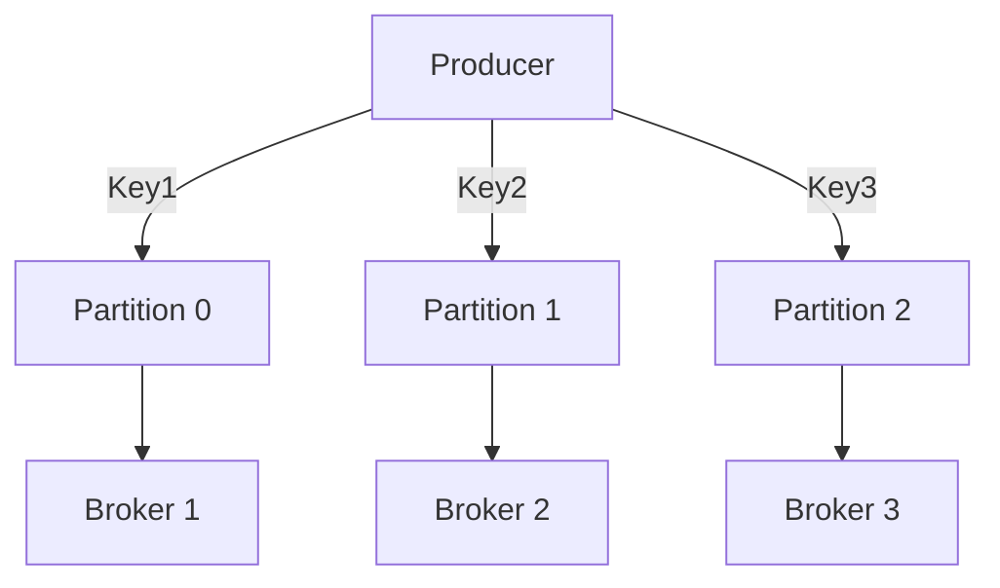

## 2.2.1 Designing Topics and Partition Strategies

Designing Kafka topics and partition strategies is a critical aspect of building scalable and efficient data streaming applications. This section delves into the intricacies of topic and partition design, providing expert insights and practical examples to help you optimize your Kafka deployments.

### Understanding Kafka Topics and Partitions

In Kafka, a **topic** is a category or feed name to which records are published. Topics are partitioned, and each partition is an ordered, immutable sequence of records that is continually appended to—a structured commit log. Partitions enable Kafka to scale horizontally by distributing data across multiple brokers.

#### Key Concepts

- **Partitions**: Each topic is divided into partitions, which are the basic unit of parallelism in Kafka. Partitions allow Kafka to scale by distributing data across multiple brokers.
- **Replication**: Each partition can be replicated across multiple brokers to ensure fault tolerance.
- **Offset**: Each record within a partition has an offset, which is a unique identifier that represents the record's position within the partition.

### Factors Influencing the Number of Partitions

The number of partitions in a Kafka topic is a crucial factor that influences throughput, consumer parallelism, and data ordering. Here are some key considerations:

#### Throughput

- **Increased Throughput**: More partitions can increase the throughput of a Kafka cluster by allowing more parallel writes and reads. Each partition can be processed independently by producers and consumers.
- **Broker Load**: Distributing partitions across brokers helps balance the load and prevents any single broker from becoming a bottleneck.

#### Consumer Parallelism

- **Parallel Processing**: More partitions allow more consumers to read from a topic in parallel, enhancing the processing speed and scalability of consumer applications.
- **Consumer Group Dynamics**: Each consumer in a consumer group can read from one or more partitions, and the number of partitions determines the maximum parallelism achievable by the consumer group.

#### Data Ordering

- **Order Guarantees**: Kafka guarantees message ordering within a partition. Therefore, the number of partitions affects the granularity of ordering guarantees.
- **Key-Based Partitioning**: Using a key to partition data ensures that all messages with the same key are sent to the same partition, preserving order for that key.

### Designing Effective Partition Strategies

Designing an effective partition strategy involves balancing the need for parallelism with the requirement for data ordering and load distribution. Here are some strategies to consider:

#### Key-Based Partitioning

- **Description**: Use a key to determine the partition for each message. This ensures that all messages with the same key are sent to the same partition.
- **Use Case**: Ideal for scenarios where order needs to be maintained for specific keys, such as user sessions or transactions.

```java
// Java example of key-based partitioning
Properties props = new Properties();
props.put("bootstrap.servers", "localhost:9092");
props.put("key.serializer", "org.apache.kafka.common.serialization.StringSerializer");
props.put("value.serializer", "org.apache.kafka.common.serialization.StringSerializer");

KafkaProducer<String, String> producer = new KafkaProducer<>(props);
ProducerRecord<String, String> record = new ProducerRecord<>("my-topic", "key", "value");
producer.send(record);
producer.close();
```

```scala
// Scala example of key-based partitioning
import org.apache.kafka.clients.producer.{KafkaProducer, ProducerRecord}

val props = new java.util.Properties()
props.put("bootstrap.servers", "localhost:9092")
props.put("key.serializer", "org.apache.kafka.common.serialization.StringSerializer")
props.put("value.serializer", "org.apache.kafka.common.serialization.StringSerializer")

val producer = new KafkaProducer[String, String](props)
val record = new ProducerRecord[String, String]("my-topic", "key", "value")
producer.send(record)
producer.close()
```

```kotlin
// Kotlin example of key-based partitioning
val props = Properties()
props["bootstrap.servers"] = "localhost:9092"
props["key.serializer"] = "org.apache.kafka.common.serialization.StringSerializer"
props["value.serializer"] = "org.apache.kafka.common.serialization.StringSerializer"

val producer = KafkaProducer<String, String>(props)
val record = ProducerRecord("my-topic", "key", "value")
producer.send(record)
producer.close()
```

```clojure
;; Clojure example of key-based partitioning
(require '[clojure.java.io :as io])
(import '[org.apache.kafka.clients.producer KafkaProducer ProducerRecord])

(def props (doto (java.util.Properties.)
             (.put "bootstrap.servers" "localhost:9092")
             (.put "key.serializer" "org.apache.kafka.common.serialization.StringSerializer")
             (.put "value.serializer" "org.apache.kafka.common.serialization.StringSerializer")))

(def producer (KafkaProducer. props))
(def record (ProducerRecord. "my-topic" "key" "value"))
(.send producer record)
(.close producer)
```

#### Custom Partitioning Strategies

- **Description**: Implement custom logic to determine the partition for each message. This can be useful for complex partitioning requirements.
- **Use Case**: Suitable for scenarios where partitioning logic is based on multiple fields or requires specific business logic.

```java
// Java example of custom partitioning
public class CustomPartitioner implements Partitioner {
    @Override
    public void configure(Map<String, ?> configs) {}

    @Override
    public int partition(String topic, Object key, byte[] keyBytes, Object value, byte[] valueBytes, Cluster cluster) {
        // Custom partition logic
        return key.hashCode() % cluster.partitionCountForTopic(topic);
    }

    @Override
    public void close() {}
}
```

```scala
// Scala example of custom partitioning
class CustomPartitioner extends Partitioner {
  override def configure(configs: java.util.Map[String, _]): Unit = {}

  override def partition(topic: String, key: Any, keyBytes: Array[Byte], value: Any, valueBytes: Array[Byte], cluster: Cluster): Int = {
    // Custom partition logic
    key.hashCode % cluster.partitionCountForTopic(topic)
  }

  override def close(): Unit = {}
}
```

```kotlin
// Kotlin example of custom partitioning
class CustomPartitioner : Partitioner {
    override fun configure(configs: Map<String, *>?) {}

    override fun partition(topic: String, key: Any?, keyBytes: ByteArray?, value: Any?, valueBytes: ByteArray?, cluster: Cluster): Int {
        // Custom partition logic
        return key.hashCode() % cluster.partitionCountForTopic(topic)
    }

    override fun close() {}
}
```

```clojure
;; Clojure example of custom partitioning
(import '[org.apache.kafka.clients.producer Partitioner]
        '[org.apache.kafka.common.Cluster])

(defn custom-partitioner []
  (proxy [Partitioner] []
    (configure [configs])
    (partition [topic key keyBytes value valueBytes cluster]
      ;; Custom partition logic
      (mod (.hashCode key) (.partitionCountForTopic cluster topic)))
    (close [])))
```

### Potential Pitfalls and Considerations

When designing partition strategies, it's important to be aware of potential pitfalls that can impact performance and scalability:

#### Uneven Data Distribution

- **Problem**: If partition keys are not evenly distributed, some partitions may receive more data than others, leading to uneven load distribution.
- **Solution**: Use a hashing function or a custom partitioner to ensure even distribution of keys across partitions.

#### Rebalancing and Consumer Assignment

- **Problem**: Changes in the number of partitions or consumers can lead to rebalancing, which may temporarily disrupt data processing.
- **Solution**: Plan for rebalancing by using consumer group management and monitoring tools to minimize downtime.

#### Impact on Data Ordering

- **Problem**: Increasing the number of partitions can affect the ordering of messages across partitions.
- **Solution**: Use key-based partitioning to maintain order for specific keys, and design applications to handle out-of-order messages if necessary.

### Visualizing Partition Strategies

To better understand how partitioning works in Kafka, consider the following diagram:



**Caption**: This diagram illustrates how a producer sends messages with different keys to different partitions, which are then distributed across brokers.

### Practical Applications and Real-World Scenarios

Partitioning strategies are critical in various real-world scenarios, such as:

- **Event-Driven Microservices**: Use partitioning to ensure that events related to the same entity are processed in order by the same consumer instance.
- **Real-Time Analytics**: Partition data by time or region to enable parallel processing of analytics workloads.
- **IoT Data Processing**: Partition data by device ID to ensure that data from the same device is processed in order.

### Best Practices for Designing Kafka Topics and Partitions

- **Plan for Scalability**: Design topics and partitions with future growth in mind. Consider the maximum number of partitions your infrastructure can support.
- **Monitor and Adjust**: Continuously monitor partition distribution and adjust strategies as needed to ensure even load distribution and optimal performance.
- **Leverage Kafka Tools**: Use Kafka's built-in tools and third-party solutions to manage and monitor partitioning strategies effectively.

### Conclusion

Designing effective Kafka topics and partition strategies is essential for building scalable and efficient data streaming applications. By understanding the factors that influence partitioning and implementing best practices, you can optimize your Kafka deployments for performance and scalability.

## Test Your Knowledge: Advanced Kafka Partition Strategies Quiz



### What is the primary benefit of increasing the number of partitions in a Kafka topic?

- [x] Increased throughput and parallelism
- [ ] Improved data ordering
- [ ] Reduced storage requirements
- [ ] Enhanced security

> **Explanation:** Increasing the number of partitions allows for more parallel writes and reads, enhancing throughput and parallelism.

### How does key-based partitioning affect data ordering in Kafka?

- [x] It preserves order for messages with the same key.
- [ ] It randomizes message order.
- [ ] It guarantees global ordering across all partitions.
- [ ] It has no effect on ordering.

> **Explanation:** Key-based partitioning ensures that all messages with the same key are sent to the same partition, preserving order for that key.

### What is a potential drawback of having too few partitions in a Kafka topic?

- [x] Limited consumer parallelism
- [ ] Increased storage costs
- [ ] Reduced data security
- [ ] Enhanced data ordering

> **Explanation:** Having too few partitions limits the number of consumers that can process data in parallel, reducing scalability.

### What is a common solution to ensure even data distribution across partitions?

- [x] Use a hashing function for partition keys.
- [ ] Increase the number of brokers.
- [ ] Decrease the number of partitions.
- [ ] Use a single partition for all data.

> **Explanation:** A hashing function can distribute keys evenly across partitions, ensuring balanced load distribution.

### What happens when the number of consumers in a consumer group exceeds the number of partitions?

- [x] Some consumers will remain idle.
- [ ] Consumers will process data out of order.
- [ ] Consumers will share partitions.
- [ ] Consumers will process duplicate messages.

> **Explanation:** If there are more consumers than partitions, some consumers will not be assigned any partitions and will remain idle.

### Why is it important to monitor partition distribution in Kafka?

- [x] To ensure even load distribution and optimal performance
- [ ] To reduce the number of brokers
- [ ] To increase data security
- [ ] To enhance data ordering

> **Explanation:** Monitoring partition distribution helps identify imbalances and optimize performance by ensuring even load distribution.

### What is a potential impact of increasing the number of partitions on data ordering?

- [x] It can affect the ordering of messages across partitions.
- [ ] It guarantees global ordering.
- [ ] It improves data security.
- [ ] It reduces storage costs.

> **Explanation:** Increasing the number of partitions can affect the ordering of messages across partitions, as Kafka only guarantees order within a partition.

### What is a key consideration when designing Kafka topics for scalability?

- [x] Plan for future growth and infrastructure capacity.
- [ ] Use a single partition for simplicity.
- [ ] Limit the number of brokers.
- [ ] Avoid using key-based partitioning.

> **Explanation:** Designing topics with future growth in mind ensures that the infrastructure can support increased data volumes and parallelism.

### How can custom partitioning strategies benefit Kafka deployments?

- [x] By implementing specific business logic for partitioning
- [ ] By reducing the number of brokers
- [ ] By increasing storage costs
- [ ] By enhancing global ordering

> **Explanation:** Custom partitioning strategies allow for the implementation of specific business logic, enabling more tailored data distribution.

### True or False: Kafka guarantees message ordering across all partitions.

- [x] False
- [ ] True

> **Explanation:** Kafka guarantees message ordering within a partition, but not across all partitions.


