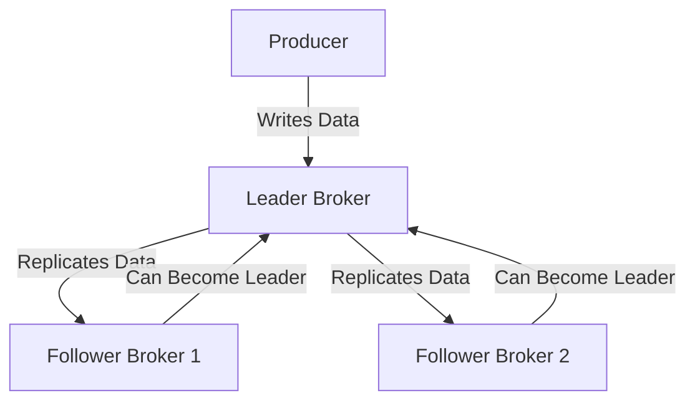

## 2.2.2 Replication Factors and Fault Tolerance

In the realm of distributed systems, ensuring data availability and consistency is paramount. Apache Kafka, a distributed event streaming platform, achieves this through its robust replication mechanism. This section delves into the intricacies of replication factors, their implications on fault tolerance, and provides guidance on setting appropriate replication levels tailored to specific needs.

### Understanding Replication Factor

The **replication factor** in Kafka is a critical configuration that determines how many copies of a partition are maintained across the cluster. Each partition in Kafka can have multiple replicas, which are distributed across different brokers to ensure data redundancy and fault tolerance.

- **Definition**: The replication factor is the number of copies of a partition that Kafka maintains across the cluster.
- **Implications**: A higher replication factor increases fault tolerance by ensuring that data remains available even if some brokers fail. However, it also increases resource consumption, as more storage and network bandwidth are required.

### How Replicas Work: Leaders and Followers

In Kafka, each partition has one **leader** and multiple **followers**. The leader is responsible for all read and write operations, while followers replicate the data from the leader to ensure consistency.

- **Leader**: The broker that handles all read and write requests for a partition. It is the primary source of truth for the partition's data.
- **Followers**: Brokers that replicate the leader's data. They maintain a copy of the partition and can take over as the leader if the current leader fails.

#### Leader and Follower Dynamics

The leader and follower dynamic is crucial for maintaining data consistency and availability. When a leader fails, one of the followers is elected as the new leader, ensuring that the partition remains available.



*Diagram: Leader and Follower Dynamics in Kafka Replication.*

### Trade-offs Between Higher Replication Factors and Resource Consumption

While a higher replication factor enhances fault tolerance, it also comes with trade-offs:

- **Increased Storage Requirements**: More replicas mean more storage space is required across the cluster.
- **Higher Network Bandwidth**: Replicating data across multiple brokers consumes additional network resources.
- **Increased Write Latency**: As data must be written to multiple replicas, write operations may experience higher latency.

#### Balancing Trade-offs

To balance these trade-offs, consider the following:

- **Critical Data**: For critical data that requires high availability, opt for a higher replication factor.
- **Resource Constraints**: If resources are limited, a lower replication factor may be necessary, but ensure that it still meets your fault tolerance requirements.
- **Performance Requirements**: Evaluate the impact of replication on write latency and adjust the replication factor accordingly.

### Recommendations for Setting Replication Factors

Setting the appropriate replication factor depends on various factors, including the criticality of the data, resource availability, and performance requirements. Here are some recommendations:

#### High Availability Scenarios

For systems that require high availability and minimal downtime, such as financial services or healthcare applications, consider a replication factor of **3** or more. This ensures that even if two brokers fail, the data remains available.

#### Cost-Sensitive Environments

In environments where cost is a significant concern, such as startups or small businesses, a replication factor of **2** may suffice. This provides a balance between fault tolerance and resource consumption.

#### Performance-Centric Applications

For applications where performance is critical, such as real-time analytics, a lower replication factor may be necessary to minimize write latency. However, ensure that the replication factor is not so low that it compromises data availability.

### Practical Applications and Real-World Scenarios

Understanding how replication factors impact fault tolerance is crucial for designing robust Kafka architectures. Let's explore some real-world scenarios:

#### Scenario 1: E-commerce Platform

An e-commerce platform requires high availability to ensure that customer orders are processed without interruption. In this case, a replication factor of **3** is recommended to provide redundancy and fault tolerance.

#### Scenario 2: Social Media Application

A social media application prioritizes performance to deliver real-time updates to users. Here, a replication factor of **2** may be sufficient, balancing performance with fault tolerance.

#### Scenario 3: Financial Trading System

A financial trading system demands both high availability and low latency. A replication factor of **3** or more is advisable, with careful monitoring of write latency to ensure performance requirements are met.

### Code Examples

To illustrate the configuration of replication factors in Kafka, let's explore code examples in Java, Scala, Kotlin, and Clojure.

#### Java Example

```java
import org.apache.kafka.clients.admin.AdminClient;
import org.apache.kafka.clients.admin.NewTopic;
import java.util.Collections;
import java.util.Properties;

public class KafkaReplicationExample {
    public static void main(String[] args) {
        Properties config = new Properties();
        config.put("bootstrap.servers", "localhost:9092");

        try (AdminClient adminClient = AdminClient.create(config)) {
            NewTopic newTopic = new NewTopic("example-topic", 3, (short) 3);
            adminClient.createTopics(Collections.singletonList(newTopic)).all().get();
            System.out.println("Topic created with replication factor 3");
        } catch (Exception e) {
            e.printStackTrace();
        }
    }
}
```

#### Scala Example

```scala
import org.apache.kafka.clients.admin.{AdminClient, NewTopic}
import java.util.Properties
import scala.jdk.CollectionConverters._

object KafkaReplicationExample extends App {
  val config = new Properties()
  config.put("bootstrap.servers", "localhost:9092")

  val adminClient = AdminClient.create(config)
  val newTopic = new NewTopic("example-topic", 3, 3.toShort)

  adminClient.createTopics(List(newTopic).asJava).all().get()
  println("Topic created with replication factor 3")
  adminClient.close()
}
```

#### Kotlin Example

```kotlin
import org.apache.kafka.clients.admin.AdminClient
import org.apache.kafka.clients.admin.NewTopic
import java.util.Properties

fun main() {
    val config = Properties().apply {
        put("bootstrap.servers", "localhost:9092")
    }

    AdminClient.create(config).use { adminClient ->
        val newTopic = NewTopic("example-topic", 3, 3.toShort())
        adminClient.createTopics(listOf(newTopic)).all().get()
        println("Topic created with replication factor 3")
    }
}
```

#### Clojure Example

```clojure
(ns kafka-replication-example
  (:import [org.apache.kafka.clients.admin AdminClient NewTopic]
           [java.util Properties]))

(defn create-topic []
  (let [config (doto (Properties.)
                 (.put "bootstrap.servers" "localhost:9092"))
        admin-client (AdminClient/create config)
        new-topic (NewTopic. "example-topic" 3 (short 3))]
    (try
      (.get (.all (.createTopics admin-client [new-topic])))
      (println "Topic created with replication factor 3")
      (finally
        (.close admin-client)))))

(create-topic)
```

### Visualizing Replication in Kafka

To further understand how replication works in Kafka, consider the following diagram illustrating the replication process:

```mermaid
graph LR;
    A[Producer] --> B[Broker 1 (Leader)];
    B --> C[Broker 2 (Follower)];
    B --> D[Broker 3 (Follower)];
    C --> E[Consumer];
    D --> E;
```

*Diagram: Kafka Replication Process with Leader and Follower Brokers.*

### Key Takeaways

- **Replication Factor**: Determines the number of copies of a partition in a Kafka cluster, impacting fault tolerance and resource consumption.
- **Leader and Followers**: The leader handles all read/write operations, while followers replicate data to ensure consistency.
- **Trade-offs**: Higher replication factors increase fault tolerance but also require more resources.
- **Recommendations**: Tailor the replication factor based on availability, cost, and performance needs.

### Knowledge Check

To reinforce your understanding of replication factors and fault tolerance in Kafka, consider the following questions:

## Test Your Knowledge: Kafka Replication Factors and Fault Tolerance Quiz



### What is the primary role of a leader in Kafka's replication mechanism?

- [x] To handle all read and write operations for a partition.
- [ ] To replicate data from followers.
- [ ] To manage consumer offsets.
- [ ] To balance load across brokers.

> **Explanation:** The leader is responsible for handling all read and write operations for a partition, ensuring data consistency and availability.

### How does a higher replication factor affect a Kafka cluster?

- [x] Increases fault tolerance.
- [ ] Decreases storage requirements.
- [ ] Reduces network bandwidth usage.
- [ ] Lowers write latency.

> **Explanation:** A higher replication factor increases fault tolerance by maintaining more copies of data across the cluster, but it also increases storage and network resource consumption.

### In which scenario is a replication factor of 3 recommended?

- [x] High availability systems.
- [ ] Cost-sensitive environments.
- [ ] Performance-centric applications.
- [ ] Low-latency systems.

> **Explanation:** A replication factor of 3 is recommended for high availability systems to ensure data remains available even if multiple brokers fail.

### What is a trade-off of setting a high replication factor?

- [x] Increased resource consumption.
- [ ] Decreased fault tolerance.
- [ ] Reduced data consistency.
- [ ] Lower storage requirements.

> **Explanation:** A high replication factor increases resource consumption, including storage and network bandwidth, due to maintaining multiple copies of data.

### Which component can become a leader if the current leader fails?

- [x] Follower broker.
- [ ] Producer.
- [ ] Consumer.
- [ ] ZooKeeper.

> **Explanation:** A follower broker can be elected as the new leader if the current leader fails, ensuring the partition remains available.

### What is the impact of replication on write latency?

- [x] Increases write latency.
- [ ] Decreases write latency.
- [ ] Has no impact on write latency.
- [ ] Only affects read latency.

> **Explanation:** Replication increases write latency as data must be written to multiple replicas, which can slow down write operations.

### Which factor should be considered when setting the replication factor?

- [x] Criticality of data.
- [ ] Number of consumers.
- [ ] Consumer offset management.
- [ ] Producer throughput.

> **Explanation:** The criticality of data should be considered when setting the replication factor to ensure appropriate fault tolerance levels.

### What is the role of followers in Kafka's replication?

- [x] To replicate data from the leader.
- [ ] To handle write operations.
- [ ] To manage consumer groups.
- [ ] To balance load across partitions.

> **Explanation:** Followers replicate data from the leader to maintain consistency and can take over as the leader if needed.

### How does Kafka ensure data consistency across replicas?

- [x] By replicating data from the leader to followers.
- [ ] By using consumer offsets.
- [ ] By balancing load across brokers.
- [ ] By managing producer throughput.

> **Explanation:** Kafka ensures data consistency by replicating data from the leader to followers, maintaining multiple copies of the data.

### True or False: A replication factor of 1 provides high fault tolerance.

- [ ] True
- [x] False

> **Explanation:** A replication factor of 1 does not provide high fault tolerance, as there is only one copy of the data, making it vulnerable to broker failures.



By understanding and configuring replication factors appropriately, you can enhance the fault tolerance and reliability of your Kafka deployments, ensuring data availability and consistency across distributed systems.
