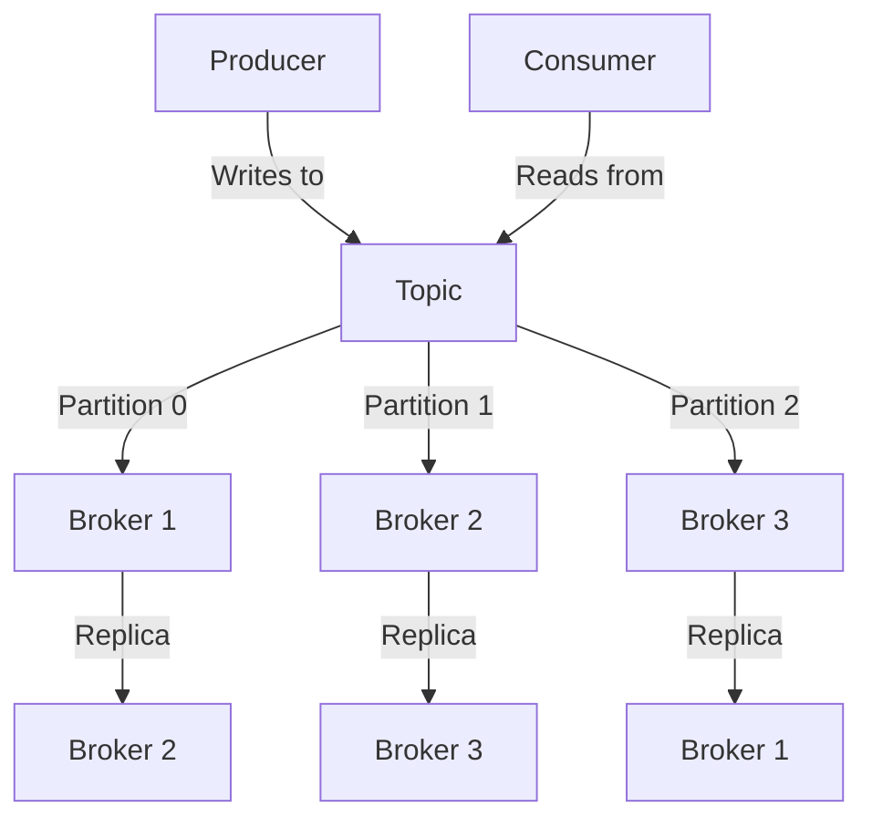

## 2.2 Topics, Partitions, and Replication

Apache Kafka is a distributed streaming platform that relies on the concepts of topics, partitions, and replication to achieve scalability, fault tolerance, and high availability. Understanding these core components is crucial for designing efficient Kafka-based systems. This section delves into the relationship between topics, partitions, and replicas, offering strategies for topic design and partitioning, and detailing how replication ensures data durability.

### Understanding Topics

**Topics** in Kafka are fundamental units of organization for data streams. They act as categories or feeds to which records are published. Each topic is identified by a unique name and can have multiple producers and consumers. Topics are the logical abstraction that allows Kafka to decouple data producers from consumers, enabling a publish-subscribe model.

#### Key Characteristics of Topics

- **Decoupling**: Topics allow producers and consumers to operate independently. Producers write data to topics without knowledge of the consumers, and consumers read from topics without knowledge of the producers.
- **Scalability**: Topics can be partitioned, allowing Kafka to handle large volumes of data and high throughput.
- **Durability**: Data in topics can be retained for a configurable period, ensuring that consumers can read data at their own pace.

### Partitions: Enhancing Parallelism and Scalability

**Partitions** are a crucial aspect of Kafka's architecture, providing a way to parallelize data processing. Each topic is divided into one or more partitions, which are ordered, immutable sequences of records. Partitions enable Kafka to scale horizontally by distributing data across multiple brokers.

#### Benefits of Partitioning

- **Parallel Processing**: By distributing partitions across multiple brokers, Kafka allows for concurrent processing of data, improving throughput and performance.
- **Load Balancing**: Partitions enable load balancing across consumers in a consumer group, ensuring that data processing is evenly distributed.
- **Ordering Guarantees**: Within a partition, records are strictly ordered, which is essential for applications that require order preservation.

#### Designing Topics and Partition Strategies

When designing topics and partitions, consider the following strategies:

1. **Determine the Number of Partitions**: The number of partitions affects parallelism and throughput. More partitions can improve performance but may increase complexity in managing offsets and rebalancing.

2. **Key-Based Partitioning**: Use keys to ensure that related records are sent to the same partition. This is useful for maintaining order for specific keys, such as user IDs or transaction IDs.

3. **Custom Partitioning**: Implement custom partitioners if the default partitioning strategy does not meet your requirements. Custom partitioners can distribute data based on specific business logic.

4. **Monitor and Adjust**: Regularly monitor partition performance and adjust the number of partitions as needed to accommodate changes in data volume or processing requirements.

### Replication: Ensuring Data Durability and Fault Tolerance

**Replication** in Kafka is the process of duplicating data across multiple brokers to ensure durability and fault tolerance. Each partition has one leader and zero or more followers, which are replicas of the leader. The leader handles all read and write requests, while followers replicate the data.

#### How Replication Works

- **Leader and Followers**: Each partition has a leader that handles all read and write operations. Followers replicate the leader's data to ensure redundancy.
- **ISR (In-Sync Replicas)**: Kafka maintains a set of in-sync replicas (ISR) that are up-to-date with the leader. If the leader fails, one of the ISR members is elected as the new leader.
- **Replication Factor**: The replication factor determines the number of copies of each partition. A higher replication factor increases fault tolerance but requires more storage and network resources.

#### Impact of Replication on Data Availability

Replication enhances data availability by ensuring that data is not lost in the event of broker failures. However, it also introduces trade-offs:

- **Increased Latency**: Replication can increase write latency, as data must be written to multiple brokers.
- **Resource Utilization**: Replication consumes additional storage and network bandwidth, which must be accounted for in capacity planning.

### Best Practices for Managing Topic Metadata

Managing topic metadata is essential for maintaining a healthy Kafka cluster. Consider the following best practices:

1. **Use Schema Registry**: Integrate with a schema registry to manage data schemas and ensure compatibility between producers and consumers. See [1.3.3 Schema Registry]( "Schema Registry") for more details.

2. **Automate Topic Management**: Use tools and scripts to automate topic creation, deletion, and configuration changes. This reduces the risk of human error and ensures consistency.

3. **Monitor Topic Health**: Regularly monitor topic metrics, such as partition size and replication lag, to identify potential issues early.

4. **Implement Access Controls**: Use Kafka's ACLs (Access Control Lists) to restrict access to topics and ensure data security.

5. **Plan for Retention**: Configure appropriate retention policies to balance data availability with storage costs. Consider the impact of retention settings on consumers and storage requirements.

### Code Examples

To illustrate these concepts, let's explore code examples in Java, Scala, Kotlin, and Clojure for creating topics, configuring partitions, and managing replication.

#### Java Example

```java
import org.apache.kafka.clients.admin.AdminClient;
import org.apache.kafka.clients.admin.NewTopic;
import java.util.Collections;
import java.util.Properties;

public class KafkaTopicExample {
    public static void main(String[] args) {
        Properties config = new Properties();
        config.put("bootstrap.servers", "localhost:9092");

        try (AdminClient adminClient = AdminClient.create(config)) {
            NewTopic newTopic = new NewTopic("example-topic", 3, (short) 2);
            adminClient.createTopics(Collections.singletonList(newTopic)).all().get();
            System.out.println("Topic created successfully.");
        } catch (Exception e) {
            e.printStackTrace();
        }
    }
}
```

#### Scala Example

```scala
import org.apache.kafka.clients.admin.{AdminClient, NewTopic}
import java.util.Properties
import scala.jdk.CollectionConverters._

object KafkaTopicExample extends App {
  val config = new Properties()
  config.put("bootstrap.servers", "localhost:9092")

  val adminClient = AdminClient.create(config)
  val newTopic = new NewTopic("example-topic", 3, 2.toShort)

  try {
    adminClient.createTopics(List(newTopic).asJava).all().get()
    println("Topic created successfully.")
  } finally {
    adminClient.close()
  }
}
```

#### Kotlin Example

```kotlin
import org.apache.kafka.clients.admin.AdminClient
import org.apache.kafka.clients.admin.NewTopic
import java.util.Properties

fun main() {
    val config = Properties().apply {
        put("bootstrap.servers", "localhost:9092")
    }

    AdminClient.create(config).use { adminClient ->
        val newTopic = NewTopic("example-topic", 3, 2.toShort())
        adminClient.createTopics(listOf(newTopic)).all().get()
        println("Topic created successfully.")
    }
}
```

#### Clojure Example

```clojure
(require '[clojure.java.io :as io])
(import '[org.apache.kafka.clients.admin AdminClient NewTopic])

(defn create-topic []
  (let [config (doto (java.util.Properties.)
                 (.put "bootstrap.servers" "localhost:9092"))
        admin-client (AdminClient/create config)
        new-topic (NewTopic. "example-topic" 3 (short 2))]
    (try
      (.get (.all (.createTopics admin-client [new-topic])))
      (println "Topic created successfully.")
      (finally
        (.close admin-client)))))

(create-topic)
```

### Visualizing Kafka's Architecture

To better understand the relationship between topics, partitions, and replication, consider the following diagram:



**Diagram Explanation**: This diagram illustrates a Kafka topic with three partitions distributed across three brokers. Each partition has a leader and a replica on different brokers, ensuring data redundancy and fault tolerance. Producers write to the topic, and consumers read from it, leveraging Kafka's distributed architecture.

### Practical Applications and Real-World Scenarios

In real-world scenarios, designing topics and partitions effectively can significantly impact the performance and reliability of Kafka-based systems. Consider the following applications:

- **Event-Driven Microservices**: Use Kafka topics to decouple microservices, allowing them to communicate asynchronously. See [1.4.1 Event-Driven Microservices]( "Event-Driven Microservices") for more insights.

- **Real-Time Data Pipelines**: Design topics and partitions to handle high-throughput data streams, enabling real-time analytics and decision-making. Explore [1.4.2 Real-Time Data Pipelines]( "Real-Time Data Pipelines") for further details.

- **Big Data Integration**: Integrate Kafka with big data platforms to ingest and process large volumes of data efficiently. Refer to [1.4.4 Big Data Integration]( "Big Data Integration") for more information.

### Knowledge Check

To reinforce your understanding of Kafka topics, partitions, and replication, consider the following questions and exercises:

1. **Quiz**: What is the primary benefit of partitioning a Kafka topic?
   - [x] It allows for parallel processing and increased throughput.
   - [ ] It reduces storage requirements.
   - [ ] It simplifies consumer configuration.

2. **Exercise**: Create a Kafka topic with five partitions and a replication factor of three. Monitor the performance and adjust the number of partitions based on your findings.

3. **Discussion**: How does replication impact data availability and fault tolerance in a Kafka cluster? Discuss the trade-offs involved.

### Summary

In this section, we explored the intricacies of Kafka topics, partitions, and replication. We discussed strategies for designing topics and partitions, examined how replication ensures data durability, and provided best practices for managing topic metadata. By understanding these core components, you can build scalable, fault-tolerant systems that leverage Kafka's distributed architecture.

## Test Your Knowledge: Kafka Topics, Partitions, and Replication Quiz



### What is the primary purpose of Kafka topics?

- [x] To categorize and organize data streams.
- [ ] To store data permanently.
- [ ] To manage consumer offsets.
- [ ] To handle data serialization.

> **Explanation:** Kafka topics are used to categorize and organize data streams, allowing producers and consumers to interact with specific data feeds.

### How do partitions enhance Kafka's scalability?

- [x] By enabling parallel processing across multiple brokers.
- [ ] By reducing the number of consumers needed.
- [ ] By increasing the replication factor.
- [ ] By simplifying producer configurations.

> **Explanation:** Partitions allow Kafka to distribute data across multiple brokers, enabling parallel processing and improving scalability.

### What is the role of the leader in Kafka replication?

- [x] To handle all read and write operations for a partition.
- [ ] To replicate data from followers.
- [ ] To manage consumer offsets.
- [ ] To store data permanently.

> **Explanation:** The leader handles all read and write operations for a partition, while followers replicate the leader's data to ensure redundancy.

### What is the impact of a higher replication factor in Kafka?

- [x] Increased fault tolerance and data durability.
- [ ] Reduced storage requirements.
- [ ] Lower network bandwidth usage.
- [ ] Faster data processing.

> **Explanation:** A higher replication factor increases fault tolerance and data durability by ensuring multiple copies of data are stored across different brokers.

### Which strategy is recommended for maintaining order for specific keys in Kafka?

- [x] Key-Based Partitioning
- [ ] Random Partitioning
- [ ] Custom Partitioning
- [ ] Round-Robin Partitioning

> **Explanation:** Key-based partitioning ensures that related records are sent to the same partition, maintaining order for specific keys.

### What is the role of the ISR (In-Sync Replicas) in Kafka?

- [x] To ensure that replicas are up-to-date with the leader.
- [ ] To manage consumer offsets.
- [ ] To handle data serialization.
- [ ] To store data permanently.

> **Explanation:** ISR ensures that replicas are up-to-date with the leader, providing redundancy and fault tolerance.

### How can you automate topic management in Kafka?

- [x] Use tools and scripts for topic creation and configuration.
- [ ] Manually create topics through the Kafka CLI.
- [ ] Rely on consumer applications to manage topics.
- [ ] Use a schema registry to automate topic management.

> **Explanation:** Automating topic management with tools and scripts reduces the risk of human error and ensures consistency.

### What is a potential drawback of increasing the number of partitions in a Kafka topic?

- [x] Increased complexity in managing offsets and rebalancing.
- [ ] Reduced data durability.
- [ ] Lower throughput.
- [ ] Simplified consumer configuration.

> **Explanation:** Increasing the number of partitions can lead to increased complexity in managing offsets and rebalancing, although it improves throughput.

### How does Kafka ensure data durability?

- [x] Through replication across multiple brokers.
- [ ] By storing data permanently in a database.
- [ ] By using a schema registry.
- [ ] By managing consumer offsets.

> **Explanation:** Kafka ensures data durability by replicating data across multiple brokers, providing redundancy and fault tolerance.

### True or False: Kafka topics can only have one partition.

- [ ] True
- [x] False

> **Explanation:** Kafka topics can have multiple partitions, which allows for parallel processing and scalability.


