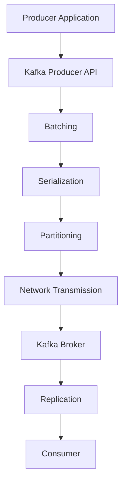

## 2.3.1 Producer Configuration and Optimization

Apache Kafka producers are pivotal in ensuring efficient data flow within a Kafka ecosystem. Configuring producers correctly is essential for achieving optimal performance, reliability, and message delivery guarantees. This section delves into the intricacies of producer configuration, offering expert guidance on balancing throughput and latency, optimizing for high-volume data production, and implementing best practices for error handling and idempotent producers.

### Key Producer Configuration Settings

#### Acknowledgments (acks)

The `acks` configuration determines the number of acknowledgments the producer requires the leader to have received before considering a request complete. This setting directly impacts the durability and reliability of message delivery.

- **acks=0**: The producer does not wait for any acknowledgment from the broker. This setting offers the lowest latency but at the cost of potential data loss.
- **acks=1**: The producer waits for the leader to write the record to its local log. This provides a balance between latency and durability.
- **acks=all**: The producer waits for the full set of in-sync replicas to acknowledge the record. This ensures the highest level of durability.

**Best Practice**: For critical data, use `acks=all` to ensure maximum data durability.

#### Retries

The `retries` configuration specifies the number of times the producer will retry sending a record if the initial send fails. Retries can help mitigate transient errors, such as network issues or broker unavailability.

- **Setting retries**: A higher number of retries increases the likelihood of successful message delivery but may also increase latency.

**Best Practice**: Set `retries` to a high number to enhance reliability, especially in unstable network conditions.

#### Batch Size

The `batch.size` configuration controls the maximum number of bytes that will be sent in a single batch. Larger batch sizes can improve throughput by reducing the number of requests sent to the broker.

- **Trade-off**: Larger batches can increase latency as the producer waits to fill the batch.

**Best Practice**: Experiment with different batch sizes to find the optimal balance between throughput and latency for your workload.

### Balancing Throughput and Latency

Achieving the right balance between throughput and latency is crucial for optimizing Kafka producer performance. Here are some strategies to consider:

- **Compression**: Use compression algorithms like `gzip` or `snappy` to reduce the size of messages, which can improve throughput. However, be aware that compression can increase CPU usage and latency.
- **Linger.ms**: This setting controls the time the producer will wait for additional messages before sending a batch. Increasing `linger.ms` can improve throughput by allowing more messages to be batched together, but it may also increase latency.
- **Buffer.memory**: This setting controls the total amount of memory available to the producer for buffering. Ensure that the buffer size is sufficient to handle peak loads without causing backpressure.

### Optimization Tips for High-Volume Data Production

For high-volume data production, consider the following optimization tips:

- **Idempotent Producers**: Enable idempotence to ensure that messages are not duplicated in the event of retries. This is particularly important for applications that require exactly-once semantics.
- **Partitioning Strategy**: Use a custom partitioner to distribute messages evenly across partitions, which can help balance load and improve throughput.
- **Asynchronous Sending**: Use asynchronous sending to allow the producer to continue processing while waiting for acknowledgments, which can improve throughput.

### Best Practices for Error Handling

Effective error handling is critical for maintaining the reliability of Kafka producers. Consider the following best practices:

- **Error Logging**: Implement comprehensive logging to capture and analyze errors, which can help identify and resolve issues quickly.
- **Backoff Strategy**: Use an exponential backoff strategy for retries to avoid overwhelming the broker with repeated requests.
- **Dead Letter Queues**: Implement dead letter queues to handle messages that cannot be processed successfully after multiple retries.

### Code Examples

Below are code examples in Java, Scala, Kotlin, and Clojure that demonstrate key producer configurations and optimizations.

#### Java

```java
import org.apache.kafka.clients.producer.KafkaProducer;
import org.apache.kafka.clients.producer.ProducerConfig;
import org.apache.kafka.clients.producer.ProducerRecord;
import org.apache.kafka.common.serialization.StringSerializer;

import java.util.Properties;

public class KafkaProducerExample {
    public static void main(String[] args) {
        Properties props = new Properties();
        props.put(ProducerConfig.BOOTSTRAP_SERVERS_CONFIG, "localhost:9092");
        props.put(ProducerConfig.ACKS_CONFIG, "all");
        props.put(ProducerConfig.RETRIES_CONFIG, 10);
        props.put(ProducerConfig.BATCH_SIZE_CONFIG, 16384);
        props.put(ProducerConfig.LINGER_MS_CONFIG, 1);
        props.put(ProducerConfig.BUFFER_MEMORY_CONFIG, 33554432);
        props.put(ProducerConfig.KEY_SERIALIZER_CLASS_CONFIG, StringSerializer.class.getName());
        props.put(ProducerConfig.VALUE_SERIALIZER_CLASS_CONFIG, StringSerializer.class.getName());

        KafkaProducer<String, String> producer = new KafkaProducer<>(props);
        for (int i = 0; i < 100; i++) {
            producer.send(new ProducerRecord<>("my-topic", Integer.toString(i), Integer.toString(i)));
        }
        producer.close();
    }
}
```

#### Scala

```scala
import org.apache.kafka.clients.producer.{KafkaProducer, ProducerConfig, ProducerRecord}
import org.apache.kafka.common.serialization.StringSerializer

import java.util.Properties

object KafkaProducerExample extends App {
  val props = new Properties()
  props.put(ProducerConfig.BOOTSTRAP_SERVERS_CONFIG, "localhost:9092")
  props.put(ProducerConfig.ACKS_CONFIG, "all")
  props.put(ProducerConfig.RETRIES_CONFIG, "10")
  props.put(ProducerConfig.BATCH_SIZE_CONFIG, "16384")
  props.put(ProducerConfig.LINGER_MS_CONFIG, "1")
  props.put(ProducerConfig.BUFFER_MEMORY_CONFIG, "33554432")
  props.put(ProducerConfig.KEY_SERIALIZER_CLASS_CONFIG, classOf[StringSerializer].getName)
  props.put(ProducerConfig.VALUE_SERIALIZER_CLASS_CONFIG, classOf[StringSerializer].getName)

  val producer = new KafkaProducer[String, String](props)
  for (i <- 0 until 100) {
    producer.send(new ProducerRecord[String, String]("my-topic", i.toString, i.toString))
  }
  producer.close()
}
```

#### Kotlin

```kotlin
import org.apache.kafka.clients.producer.KafkaProducer
import org.apache.kafka.clients.producer.ProducerConfig
import org.apache.kafka.clients.producer.ProducerRecord
import org.apache.kafka.common.serialization.StringSerializer
import java.util.Properties

fun main() {
    val props = Properties().apply {
        put(ProducerConfig.BOOTSTRAP_SERVERS_CONFIG, "localhost:9092")
        put(ProducerConfig.ACKS_CONFIG, "all")
        put(ProducerConfig.RETRIES_CONFIG, 10)
        put(ProducerConfig.BATCH_SIZE_CONFIG, 16384)
        put(ProducerConfig.LINGER_MS_CONFIG, 1)
        put(ProducerConfig.BUFFER_MEMORY_CONFIG, 33554432)
        put(ProducerConfig.KEY_SERIALIZER_CLASS_CONFIG, StringSerializer::class.java.name)
        put(ProducerConfig.VALUE_SERIALIZER_CLASS_CONFIG, StringSerializer::class.java.name)
    }

    KafkaProducer<String, String>(props).use { producer ->
        for (i in 0 until 100) {
            producer.send(ProducerRecord("my-topic", i.toString(), i.toString()))
        }
    }
}
```

#### Clojure

```clojure
(require '[clojure.java.io :as io])
(import '[org.apache.kafka.clients.producer KafkaProducer ProducerConfig ProducerRecord]
        '[org.apache.kafka.common.serialization StringSerializer])

(defn create-producer []
  (let [props (doto (java.util.Properties.)
                (.put ProducerConfig/BOOTSTRAP_SERVERS_CONFIG "localhost:9092")
                (.put ProducerConfig/ACKS_CONFIG "all")
                (.put ProducerConfig/RETRIES_CONFIG "10")
                (.put ProducerConfig/BATCH_SIZE_CONFIG "16384")
                (.put ProducerConfig/LINGER_MS_CONFIG "1")
                (.put ProducerConfig/BUFFER_MEMORY_CONFIG "33554432")
                (.put ProducerConfig/KEY_SERIALIZER_CLASS_CONFIG StringSerializer)
                (.put ProducerConfig/VALUE_SERIALIZER_CLASS_CONFIG StringSerializer))]
    (KafkaProducer. props)))

(defn send-messages [producer]
  (doseq [i (range 100)]
    (.send producer (ProducerRecord. "my-topic" (str i) (str i)))))

(defn -main []
  (let [producer (create-producer)]
    (send-messages producer)
    (.close producer)))
```

### Visualizing Kafka Producer Configuration

To better understand the flow of data and configuration settings in a Kafka producer, consider the following diagram:



**Caption**: This diagram illustrates the flow of data from a producer application through the Kafka Producer API, including batching, serialization, partitioning, and network transmission to the Kafka broker.

### References and Links

- For more details on Kafka producer configuration, refer to the [Apache Kafka Documentation](https://kafka.apache.org/documentation/#producerconfigs).
- Explore the [Confluent Documentation](https://docs.confluent.io/) for additional insights into Kafka producer optimization.
- For a deeper understanding of Kafka's architecture, see [2.1 Kafka Clusters and Brokers]( "Kafka Clusters and Brokers").

### Knowledge Check

To reinforce your understanding of Kafka producer configuration and optimization, consider the following questions and exercises:

1. **What are the trade-offs between different `acks` settings?**
2. **How can you optimize batch size for your specific workload?**
3. **Experiment with different `linger.ms` settings and observe the impact on throughput and latency.**
4. **Implement a custom partitioner and evaluate its effect on load balancing.**

### Embrace the Journey

Optimizing Kafka producer configuration is a journey that requires careful consideration of your specific use case and workload. By understanding the key configuration settings and applying best practices, you can achieve high performance, reliability, and message delivery guarantees in your Kafka ecosystem. Encourage experimentation and critical thinking as you apply these concepts to your own projects.

## Test Your Knowledge: Kafka Producer Configuration and Optimization Quiz



### What is the primary purpose of the `acks` configuration in Kafka producers?

- [x] To determine the number of acknowledgments required before considering a request complete.
- [ ] To specify the number of retries for failed messages.
- [ ] To control the batch size of messages.
- [ ] To set the compression algorithm for messages.

> **Explanation:** The `acks` configuration determines the number of acknowledgments the producer requires from the broker before considering a request complete, impacting message durability and reliability.

### Which `acks` setting provides the highest level of message durability?

- [ ] acks=0
- [ ] acks=1
- [x] acks=all
- [ ] acks=none

> **Explanation:** The `acks=all` setting ensures that the producer waits for the full set of in-sync replicas to acknowledge the record, providing the highest level of message durability.

### What is the effect of increasing the `batch.size` configuration?

- [x] It can improve throughput by reducing the number of requests sent to the broker.
- [ ] It decreases latency by sending messages immediately.
- [ ] It increases the number of retries for failed messages.
- [ ] It changes the compression algorithm used.

> **Explanation:** Increasing the `batch.size` can improve throughput by allowing more messages to be sent in a single request, reducing the number of requests sent to the broker.

### How does enabling idempotence affect Kafka producers?

- [x] It ensures that messages are not duplicated in the event of retries.
- [ ] It increases the batch size of messages.
- [ ] It decreases the number of retries for failed messages.
- [ ] It changes the compression algorithm used.

> **Explanation:** Enabling idempotence ensures that messages are not duplicated in the event of retries, which is important for applications requiring exactly-once semantics.

### What is the purpose of the `linger.ms` configuration?

- [x] To control the time the producer waits for additional messages before sending a batch.
- [ ] To set the number of retries for failed messages.
- [ ] To determine the number of acknowledgments required.
- [ ] To specify the compression algorithm for messages.

> **Explanation:** The `linger.ms` configuration controls the time the producer waits for additional messages before sending a batch, impacting throughput and latency.

### What is a best practice for handling errors in Kafka producers?

- [x] Implement comprehensive logging to capture and analyze errors.
- [ ] Increase the batch size to handle more messages.
- [ ] Decrease the number of retries for failed messages.
- [ ] Change the compression algorithm used.

> **Explanation:** Implementing comprehensive logging helps capture and analyze errors, allowing for quick identification and resolution of issues.

### Which strategy can help avoid overwhelming the broker with repeated requests?

- [x] Use an exponential backoff strategy for retries.
- [ ] Increase the batch size of messages.
- [ ] Decrease the number of retries for failed messages.
- [ ] Change the compression algorithm used.

> **Explanation:** Using an exponential backoff strategy for retries helps avoid overwhelming the broker with repeated requests by gradually increasing the wait time between retries.

### What is the benefit of using compression in Kafka producers?

- [x] It reduces the size of messages, which can improve throughput.
- [ ] It increases the number of retries for failed messages.
- [ ] It decreases the batch size of messages.
- [ ] It changes the number of acknowledgments required.

> **Explanation:** Using compression reduces the size of messages, which can improve throughput by allowing more messages to be sent in a single request.

### How can you ensure that messages are evenly distributed across partitions?

- [x] Use a custom partitioner.
- [ ] Increase the batch size of messages.
- [ ] Decrease the number of retries for failed messages.
- [ ] Change the compression algorithm used.

> **Explanation:** Using a custom partitioner can help ensure that messages are evenly distributed across partitions, improving load balancing and throughput.

### True or False: Increasing `linger.ms` always decreases latency.

- [ ] True
- [x] False

> **Explanation:** Increasing `linger.ms` can increase latency because it allows the producer to wait longer for additional messages before sending a batch, potentially improving throughput at the cost of increased latency.


