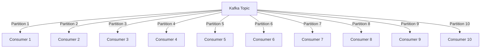

## 2.3.2 Consumer Groups and Load Balancing

In the realm of distributed systems and real-time data processing, Apache Kafka stands out as a robust platform for handling high-throughput data streams. A pivotal feature that enables Kafka's scalability and efficiency is the concept of **consumer groups**. This section delves into the mechanics of consumer groups, their role in load balancing, and how they facilitate scalable data consumption.

### Understanding Consumer Groups

**Consumer groups** are a fundamental concept in Kafka that allow multiple consumers to coordinate and share the workload of consuming messages from a set of Kafka topics. Each consumer group is identified by a unique group ID, and within a group, each consumer instance is responsible for consuming data from one or more partitions of a topic.

#### Importance of Consumer Groups

Consumer groups provide several key benefits:

- **Scalability**: By allowing multiple consumers to read from the same topic, consumer groups enable horizontal scaling. As the volume of data increases, additional consumers can be added to the group to handle the load.
- **Fault Tolerance**: If a consumer instance fails, Kafka automatically reassigns the partitions it was responsible for to other consumers in the group, ensuring continuous data processing.
- **Parallel Processing**: Each partition of a topic can be consumed by a different consumer instance, allowing for parallel processing and improved throughput.

### Partition Assignment in Consumer Groups

When a consumer group subscribes to a topic, Kafka assigns partitions to consumers within the group. This assignment is crucial for balancing the load and ensuring efficient data processing.

#### How Kafka Assigns Partitions

Kafka uses a process called **rebalancing** to assign partitions to consumers. During rebalancing, Kafka ensures that each partition is assigned to exactly one consumer within the group. The assignment strategy can vary based on the configuration, but the default strategy is the **RangeAssignor**.

- **RangeAssignor**: Partitions are divided into contiguous ranges, and each consumer is assigned a range of partitions. This strategy is simple but may lead to uneven load distribution if partitions have varying message rates.
- **RoundRobinAssignor**: Partitions are distributed in a round-robin fashion across consumers, which can lead to a more balanced load distribution.
- **StickyAssignor**: This strategy aims to minimize partition movement during rebalancing, reducing the overhead of reassigning partitions.

#### Load Balancing Mechanisms

Load balancing in Kafka is achieved through the dynamic assignment of partitions to consumers. This mechanism ensures that the workload is evenly distributed across available consumer instances, optimizing resource utilization and processing efficiency.

- **Dynamic Rebalancing**: When a consumer joins or leaves a group, Kafka triggers a rebalance to redistribute partitions. This dynamic adjustment helps maintain balanced workloads even as the number of consumers changes.
- **Consumer Lag Monitoring**: Kafka provides metrics to monitor consumer lag, which is the difference between the latest message offset and the offset of the last message processed by the consumer. Monitoring lag helps identify imbalances and optimize consumer performance.

### Scaling Consumers Using Groups

Scaling consumers in Kafka involves adjusting the number of consumer instances within a group to match the data processing requirements. This scalability is a key advantage of using consumer groups.

#### Strategies for Scaling Consumers

1. **Horizontal Scaling**: Add more consumer instances to the group to handle increased data volumes. This approach is effective when the number of partitions is greater than or equal to the number of consumers.
2. **Vertical Scaling**: Increase the processing power of existing consumer instances. This approach is useful when the number of partitions is limited, and adding more consumers would not improve performance.

#### Practical Example: Scaling Consumers

Consider a scenario where a Kafka topic has 10 partitions, and you have a consumer group with 5 consumer instances. Each consumer will be assigned 2 partitions. If the data volume increases and processing becomes a bottleneck, you can scale the consumer group by adding 5 more consumer instances. This will result in each consumer handling a single partition, improving processing efficiency.

### Code Examples

To illustrate the concepts discussed, let's explore code examples in Java, Scala, Kotlin, and Clojure for setting up consumer groups and handling load balancing.

#### Java Example

```java
import org.apache.kafka.clients.consumer.ConsumerConfig;
import org.apache.kafka.clients.consumer.KafkaConsumer;
import org.apache.kafka.clients.consumer.ConsumerRecords;
import org.apache.kafka.clients.consumer.ConsumerRecord;

import java.util.Collections;
import java.util.Properties;

public class KafkaConsumerExample {
    public static void main(String[] args) {
        Properties props = new Properties();
        props.put(ConsumerConfig.BOOTSTRAP_SERVERS_CONFIG, "localhost:9092");
        props.put(ConsumerConfig.GROUP_ID_CONFIG, "example-group");
        props.put(ConsumerConfig.KEY_DESERIALIZER_CLASS_CONFIG, "org.apache.kafka.common.serialization.StringDeserializer");
        props.put(ConsumerConfig.VALUE_DESERIALIZER_CLASS_CONFIG, "org.apache.kafka.common.serialization.StringDeserializer");

        KafkaConsumer<String, String> consumer = new KafkaConsumer<>(props);
        consumer.subscribe(Collections.singletonList("example-topic"));

        while (true) {
            ConsumerRecords<String, String> records = consumer.poll(100);
            for (ConsumerRecord<String, String> record : records) {
                System.out.printf("offset = %d, key = %s, value = %s%n", record.offset(), record.key(), record.value());
            }
        }
    }
}
```

#### Scala Example

```scala
import org.apache.kafka.clients.consumer.{ConsumerConfig, KafkaConsumer}
import java.util.Properties
import scala.collection.JavaConverters._

object KafkaConsumerExample extends App {
  val props = new Properties()
  props.put(ConsumerConfig.BOOTSTRAP_SERVERS_CONFIG, "localhost:9092")
  props.put(ConsumerConfig.GROUP_ID_CONFIG, "example-group")
  props.put(ConsumerConfig.KEY_DESERIALIZER_CLASS_CONFIG, "org.apache.kafka.common.serialization.StringDeserializer")
  props.put(ConsumerConfig.VALUE_DESERIALIZER_CLASS_CONFIG, "org.apache.kafka.common.serialization.StringDeserializer")

  val consumer = new KafkaConsumer[String, String](props)
  consumer.subscribe(List("example-topic").asJava)

  while (true) {
    val records = consumer.poll(100).asScala
    for (record <- records) {
      println(s"offset = ${record.offset()}, key = ${record.key()}, value = ${record.value()}")
    }
  }
}
```

#### Kotlin Example

```kotlin
import org.apache.kafka.clients.consumer.ConsumerConfig
import org.apache.kafka.clients.consumer.KafkaConsumer
import java.util.Properties

fun main() {
    val props = Properties().apply {
        put(ConsumerConfig.BOOTSTRAP_SERVERS_CONFIG, "localhost:9092")
        put(ConsumerConfig.GROUP_ID_CONFIG, "example-group")
        put(ConsumerConfig.KEY_DESERIALIZER_CLASS_CONFIG, "org.apache.kafka.common.serialization.StringDeserializer")
        put(ConsumerConfig.VALUE_DESERIALIZER_CLASS_CONFIG, "org.apache.kafka.common.serialization.StringDeserializer")
    }

    val consumer = KafkaConsumer<String, String>(props)
    consumer.subscribe(listOf("example-topic"))

    while (true) {
        val records = consumer.poll(100)
        for (record in records) {
            println("offset = ${record.offset()}, key = ${record.key()}, value = ${record.value()}")
        }
    }
}
```

#### Clojure Example

```clojure
(import '[org.apache.kafka.clients.consumer KafkaConsumer ConsumerConfig]
        '[java.util Properties Collections])

(defn create-consumer []
  (let [props (doto (Properties.)
                (.put ConsumerConfig/BOOTSTRAP_SERVERS_CONFIG "localhost:9092")
                (.put ConsumerConfig/GROUP_ID_CONFIG "example-group")
                (.put ConsumerConfig/KEY_DESERIALIZER_CLASS_CONFIG "org.apache.kafka.common.serialization.StringDeserializer")
                (.put ConsumerConfig/VALUE_DESERIALIZER_CLASS_CONFIG "org.apache.kafka.common.serialization.StringDeserializer"))]
    (KafkaConsumer. props)))

(defn consume-messages []
  (let [consumer (create-consumer)]
    (.subscribe consumer (Collections/singletonList "example-topic"))
    (while true
      (let [records (.poll consumer 100)]
        (doseq [record records]
          (println (str "offset = " (.offset record) ", key = " (.key record) ", value = " (.value record))))))))

(consume-messages)
```

### Visualizing Consumer Group Load Balancing

To better understand how consumer groups and load balancing work, let's visualize the process using a diagram.



**Diagram Description**: This diagram illustrates a Kafka topic with 10 partitions being consumed by a consumer group with 10 consumer instances. Each consumer is responsible for one partition, demonstrating a balanced load distribution.

### Best Practices for Consumer Groups and Load Balancing

- **Monitor Consumer Lag**: Regularly monitor consumer lag to identify potential bottlenecks and ensure timely processing of messages.
- **Optimize Partition Count**: Ensure that the number of partitions is sufficient to allow for horizontal scaling. A higher number of partitions enables more consumers to be added to the group.
- **Use StickyAssignor for Stability**: Consider using the StickyAssignor strategy to minimize partition movement during rebalancing, reducing the overhead on the system.
- **Implement Fault Tolerance**: Design your consumer applications to handle failures gracefully, ensuring that data processing continues even if some consumer instances fail.

### Knowledge Check

To reinforce your understanding of consumer groups and load balancing in Kafka, consider the following questions:

- How do consumer groups enable scalable data consumption in Kafka?
- What are the different partition assignment strategies in Kafka, and how do they affect load balancing?
- How can you scale consumer groups to handle increased data volumes?
- What are the benefits of monitoring consumer lag, and how can it be used to optimize performance?

### Conclusion

Consumer groups and load balancing are critical components of Kafka's architecture, enabling scalable, fault-tolerant, and efficient data processing. By understanding how these mechanisms work and applying best practices, you can optimize your Kafka deployments for high performance and reliability.

For further reading, refer to the [Apache Kafka Documentation](https://kafka.apache.org/documentation/) and explore related sections in this guide, such as [2.3.1 Producer Configuration and Optimization]( "Producer Configuration and Optimization") and [2.3.3 Consumer Rebalancing Protocols]( "Consumer Rebalancing Protocols").

## Test Your Knowledge: Advanced Kafka Consumer Groups Quiz



### What is the primary purpose of consumer groups in Kafka?

- [x] To enable scalable data consumption by distributing partitions among multiple consumers.
- [ ] To store messages for long-term retention.
- [ ] To manage producer configurations.
- [ ] To encrypt data in transit.

> **Explanation:** Consumer groups allow multiple consumers to share the workload of consuming messages from a topic, enabling scalable data consumption.

### Which partition assignment strategy aims to minimize partition movement during rebalancing?

- [ ] RangeAssignor
- [ ] RoundRobinAssignor
- [x] StickyAssignor
- [ ] RandomAssignor

> **Explanation:** The StickyAssignor strategy minimizes partition movement during rebalancing, reducing the overhead on the system.

### How does Kafka achieve load balancing within a consumer group?

- [x] By dynamically assigning partitions to consumers based on the number of available consumer instances.
- [ ] By using a fixed assignment of partitions to consumers.
- [ ] By replicating data across all consumers.
- [ ] By storing messages in a central database.

> **Explanation:** Kafka dynamically assigns partitions to consumers within a group, ensuring balanced workloads.

### What is consumer lag in Kafka?

- [x] The difference between the latest message offset and the offset of the last message processed by the consumer.
- [ ] The time taken to produce a message to a topic.
- [ ] The delay in message encryption.
- [ ] The number of partitions in a topic.

> **Explanation:** Consumer lag is the difference between the latest message offset and the offset of the last message processed by the consumer, indicating potential bottlenecks.

### Which of the following is a benefit of using consumer groups in Kafka?

- [x] Fault tolerance
- [ ] Increased message retention
- [ ] Reduced network latency
- [ ] Simplified producer configuration

> **Explanation:** Consumer groups provide fault tolerance by reassigning partitions to other consumers if one fails.

### How can you scale a consumer group to handle increased data volumes?

- [x] Add more consumer instances to the group.
- [ ] Reduce the number of partitions.
- [ ] Increase the message retention period.
- [ ] Decrease the consumer poll interval.

> **Explanation:** Adding more consumer instances to the group allows for handling increased data volumes by distributing the workload.

### What is the default partition assignment strategy in Kafka?

- [x] RangeAssignor
- [ ] RoundRobinAssignor
- [ ] StickyAssignor
- [ ] RandomAssignor

> **Explanation:** The default partition assignment strategy in Kafka is the RangeAssignor.

### Why is it important to monitor consumer lag?

- [x] To identify potential bottlenecks and ensure timely processing of messages.
- [ ] To reduce the number of partitions.
- [ ] To increase message retention.
- [ ] To simplify producer configuration.

> **Explanation:** Monitoring consumer lag helps identify potential bottlenecks and ensures that messages are processed in a timely manner.

### What happens when a consumer instance fails in a consumer group?

- [x] Kafka reassigns the partitions it was responsible for to other consumers in the group.
- [ ] The entire consumer group stops processing messages.
- [ ] Messages are lost.
- [ ] The producer stops sending messages.

> **Explanation:** If a consumer instance fails, Kafka reassigns the partitions it was responsible for to other consumers in the group, ensuring continuous data processing.

### True or False: Consumer groups allow for parallel processing of messages in Kafka.

- [x] True
- [ ] False

> **Explanation:** True. Consumer groups enable parallel processing by allowing each partition to be consumed by a different consumer instance.



By mastering the concepts of consumer groups and load balancing, you can effectively design and implement scalable, efficient, and fault-tolerant data processing systems using Apache Kafka.
