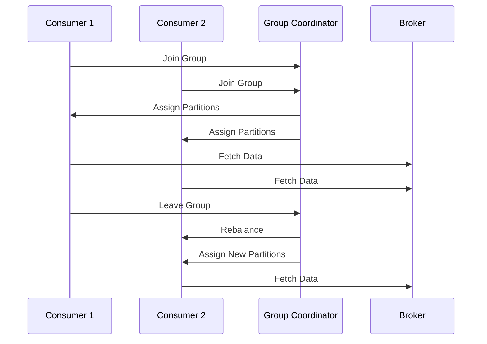

## 2.3.3 Consumer Rebalancing Protocols

In the realm of distributed systems and real-time data processing, Apache Kafka stands out as a robust platform for handling high-throughput data streams. A critical component of Kafka's architecture is its consumer rebalancing protocol, which ensures efficient load distribution across consumer instances within a consumer group. This section delves into the intricacies of consumer rebalancing, exploring what triggers a rebalance, the process itself, and enhancements in newer Kafka versions aimed at minimizing disruption.

### Understanding Consumer Rebalancing

Consumer rebalancing is a fundamental mechanism in Kafka that redistributes partitions among consumers in a group. This process is essential for maintaining load balance and ensuring fault tolerance. However, it can also introduce latency and temporary unavailability of data, making it crucial to understand and optimize.

#### What Triggers a Consumer Rebalance?

A consumer rebalance can be triggered by several events:

1. **Consumer Instance Joins or Leaves**: When a new consumer instance joins a group, or an existing one leaves, Kafka initiates a rebalance to redistribute partitions among the available consumers.

2. **Partition Count Changes**: Adding or removing partitions from a topic necessitates a rebalance to ensure all partitions are assigned to consumers.

3. **Consumer Group Metadata Changes**: Updates to consumer group configurations, such as changes in subscription patterns, can trigger a rebalance.

4. **Broker Failures**: If a broker fails, the partitions it hosted may need to be reassigned, prompting a rebalance.

5. **Manual Triggering**: Administrators can manually trigger a rebalance through Kafka's administrative tools.

### The Rebalance Process

The rebalance process involves several steps, each with implications for system performance and data availability:

1. **Detection**: The group coordinator detects a change in the consumer group state, such as a new consumer joining or an existing one leaving.

2. **Suspension**: Consumers are instructed to stop fetching data and commit their current offsets. This step is crucial to prevent data duplication or loss.

3. **Reassignment**: The group coordinator calculates a new partition assignment plan, distributing partitions among the available consumers.

4. **Notification**: Consumers are notified of their new partition assignments.

5. **Resumption**: Consumers resume data fetching based on their new assignments.

#### Implications of Rebalancing

- **Latency**: During a rebalance, data consumption is temporarily halted, leading to increased latency.
- **Data Availability**: Consumers may experience a brief period of unavailability as they transition to their new assignments.
- **Resource Utilization**: Rebalancing can be resource-intensive, particularly in large clusters with numerous partitions and consumers.

### Enhancements in Newer Kafka Versions

Recent Kafka versions have introduced several enhancements to the consumer rebalancing protocol, aimed at reducing disruption and improving efficiency.

#### Incremental Cooperative Rebalancing

One of the most significant advancements is incremental cooperative rebalancing, introduced in Kafka 2.4. This approach allows consumers to incrementally adjust their partition assignments without stopping the entire group, reducing downtime and improving overall system stability.

- **Incremental Assignment**: Instead of reassigning all partitions at once, only the necessary changes are made, minimizing disruption.
- **Cooperative Protocol**: Consumers cooperate during the rebalance, allowing for a smoother transition and less impact on data availability.

#### Sticky Assignor

The sticky assignor, introduced in Kafka 2.3, aims to minimize partition movement during rebalances. By attempting to keep partitions assigned to the same consumer as before, it reduces the overhead associated with rebalancing.

- **Partition Stickiness**: Maintains existing assignments where possible, reducing the need for data re-fetching and state rebuilding.
- **Improved Performance**: By minimizing partition movement, the sticky assignor enhances performance and reduces latency during rebalances.

### Practical Applications and Real-World Scenarios

Understanding and optimizing consumer rebalancing is crucial for building resilient, high-performance Kafka applications. Here are some practical applications and scenarios where these concepts are particularly relevant:

- **Event-Driven Microservices**: In microservices architectures, where services consume events from Kafka topics, efficient rebalancing ensures minimal disruption and consistent data flow.

- **Real-Time Analytics**: For applications that rely on real-time data processing, such as fraud detection or IoT data analysis, minimizing rebalance latency is critical to maintaining timely insights.

- **Scalable Data Pipelines**: In large-scale data pipelines, where Kafka serves as the backbone for data ingestion and processing, optimizing rebalancing can significantly enhance throughput and reliability.

### Code Examples

To illustrate the concepts discussed, let's explore code examples in Java, Scala, Kotlin, and Clojure that demonstrate consumer rebalancing and the use of the sticky assignor.

#### Java Example

```java
import org.apache.kafka.clients.consumer.ConsumerConfig;
import org.apache.kafka.clients.consumer.KafkaConsumer;
import org.apache.kafka.clients.consumer.ConsumerRebalanceListener;
import org.apache.kafka.common.TopicPartition;

import java.util.Arrays;
import java.util.Collection;
import java.util.Properties;

public class KafkaConsumerExample {
    public static void main(String[] args) {
        Properties props = new Properties();
        props.put(ConsumerConfig.BOOTSTRAP_SERVERS_CONFIG, "localhost:9092");
        props.put(ConsumerConfig.GROUP_ID_CONFIG, "example-group");
        props.put(ConsumerConfig.KEY_DESERIALIZER_CLASS_CONFIG, "org.apache.kafka.common.serialization.StringDeserializer");
        props.put(ConsumerConfig.VALUE_DESERIALIZER_CLASS_CONFIG, "org.apache.kafka.common.serialization.StringDeserializer");
        props.put(ConsumerConfig.PARTITION_ASSIGNMENT_STRATEGY_CONFIG, "org.apache.kafka.clients.consumer.StickyAssignor");

        KafkaConsumer<String, String> consumer = new KafkaConsumer<>(props);
        consumer.subscribe(Arrays.asList("example-topic"), new ConsumerRebalanceListener() {
            @Override
            public void onPartitionsRevoked(Collection<TopicPartition> partitions) {
                System.out.println("Partitions revoked: " + partitions);
            }

            @Override
            public void onPartitionsAssigned(Collection<TopicPartition> partitions) {
                System.out.println("Partitions assigned: " + partitions);
            }
        });

        while (true) {
            consumer.poll(100);
        }
    }
}
```

#### Scala Example

```scala
import org.apache.kafka.clients.consumer.{ConsumerConfig, KafkaConsumer, ConsumerRebalanceListener}
import org.apache.kafka.common.TopicPartition
import java.util.{Collections, Properties}

object KafkaConsumerExample extends App {
  val props = new Properties()
  props.put(ConsumerConfig.BOOTSTRAP_SERVERS_CONFIG, "localhost:9092")
  props.put(ConsumerConfig.GROUP_ID_CONFIG, "example-group")
  props.put(ConsumerConfig.KEY_DESERIALIZER_CLASS_CONFIG, "org.apache.kafka.common.serialization.StringDeserializer")
  props.put(ConsumerConfig.VALUE_DESERIALIZER_CLASS_CONFIG, "org.apache.kafka.common.serialization.StringDeserializer")
  props.put(ConsumerConfig.PARTITION_ASSIGNMENT_STRATEGY_CONFIG, "org.apache.kafka.clients.consumer.StickyAssignor")

  val consumer = new KafkaConsumer[String, String](props)
  consumer.subscribe(Collections.singletonList("example-topic"), new ConsumerRebalanceListener {
    override def onPartitionsRevoked(partitions: java.util.Collection[TopicPartition]): Unit = {
      println(s"Partitions revoked: $partitions")
    }

    override def onPartitionsAssigned(partitions: java.util.Collection[TopicPartition]): Unit = {
      println(s"Partitions assigned: $partitions")
    }
  })

  while (true) {
    consumer.poll(100)
  }
}
```

#### Kotlin Example

```kotlin
import org.apache.kafka.clients.consumer.ConsumerConfig
import org.apache.kafka.clients.consumer.ConsumerRebalanceListener
import org.apache.kafka.clients.consumer.KafkaConsumer
import org.apache.kafka.common.TopicPartition
import java.util.*

fun main() {
    val props = Properties()
    props[ConsumerConfig.BOOTSTRAP_SERVERS_CONFIG] = "localhost:9092"
    props[ConsumerConfig.GROUP_ID_CONFIG] = "example-group"
    props[ConsumerConfig.KEY_DESERIALIZER_CLASS_CONFIG] = "org.apache.kafka.common.serialization.StringDeserializer"
    props[ConsumerConfig.VALUE_DESERIALIZER_CLASS_CONFIG] = "org.apache.kafka.common.serialization.StringDeserializer"
    props[ConsumerConfig.PARTITION_ASSIGNMENT_STRATEGY_CONFIG] = "org.apache.kafka.clients.consumer.StickyAssignor"

    val consumer = KafkaConsumer<String, String>(props)
    consumer.subscribe(listOf("example-topic"), object : ConsumerRebalanceListener {
        override fun onPartitionsRevoked(partitions: Collection<TopicPartition>) {
            println("Partitions revoked: $partitions")
        }

        override fun onPartitionsAssigned(partitions: Collection<TopicPartition>) {
            println("Partitions assigned: $partitions")
        }
    })

    while (true) {
        consumer.poll(100)
    }
}
```

#### Clojure Example

```clojure
(import '[org.apache.kafka.clients.consumer KafkaConsumer ConsumerConfig ConsumerRebalanceListener]
        '[org.apache.kafka.common TopicPartition])

(defn kafka-consumer-example []
  (let [props (doto (java.util.Properties.)
                (.put ConsumerConfig/BOOTSTRAP_SERVERS_CONFIG "localhost:9092")
                (.put ConsumerConfig/GROUP_ID_CONFIG "example-group")
                (.put ConsumerConfig/KEY_DESERIALIZER_CLASS_CONFIG "org.apache.kafka.common.serialization.StringDeserializer")
                (.put ConsumerConfig/VALUE_DESERIALIZER_CLASS_CONFIG "org.apache.kafka.common.serialization.StringDeserializer")
                (.put ConsumerConfig/PARTITION_ASSIGNMENT_STRATEGY_CONFIG "org.apache.kafka.clients.consumer.StickyAssignor"))
        consumer (KafkaConsumer. props)]
    (.subscribe consumer ["example-topic"]
                (reify ConsumerRebalanceListener
                  (onPartitionsRevoked [_ partitions]
                    (println "Partitions revoked:" partitions))
                  (onPartitionsAssigned [_ partitions]
                    (println "Partitions assigned:" partitions))))
    (while true
      (.poll consumer 100))))

(kafka-consumer-example)
```

### Visualizing Consumer Rebalancing

To better understand the consumer rebalancing process, consider the following diagram illustrating the steps involved:



**Diagram Description**: This sequence diagram illustrates the consumer rebalancing process. When a consumer joins or leaves the group, the group coordinator initiates a rebalance, reassigning partitions to the remaining consumers.

### Best Practices for Consumer Rebalancing

- **Minimize Consumer Turnover**: Frequent joining and leaving of consumers can lead to constant rebalancing. Aim to minimize consumer turnover to reduce disruption.

- **Optimize Partition Count**: Ensure an optimal number of partitions to balance load without excessive rebalancing.

- **Leverage Incremental Rebalancing**: Use incremental cooperative rebalancing to minimize downtime and improve system stability.

- **Monitor Rebalance Metrics**: Track rebalance metrics to identify patterns and optimize configurations.

### Knowledge Check

To reinforce your understanding of consumer rebalancing protocols, consider the following questions:

## Test Your Knowledge: Kafka Consumer Rebalancing Protocols Quiz



### What is a primary trigger for a Kafka consumer rebalance?

- [x] A new consumer joins the group.
- [ ] A topic is deleted.
- [ ] A broker is restarted.
- [ ] A producer sends a message.

> **Explanation:** A consumer rebalance is triggered when a new consumer joins or leaves the group, among other events.

### What is the main advantage of incremental cooperative rebalancing?

- [x] It reduces downtime during rebalances.
- [ ] It increases partition movement.
- [ ] It simplifies consumer configuration.
- [ ] It decreases data throughput.

> **Explanation:** Incremental cooperative rebalancing reduces downtime by allowing consumers to adjust their assignments incrementally.

### Which Kafka version introduced the sticky assignor?

- [x] Kafka 2.3
- [ ] Kafka 2.0
- [ ] Kafka 2.5
- [ ] Kafka 3.0

> **Explanation:** The sticky assignor was introduced in Kafka 2.3 to minimize partition movement during rebalances.

### What is the role of the group coordinator in a rebalance?

- [x] It assigns partitions to consumers.
- [ ] It produces messages to topics.
- [ ] It manages broker configurations.
- [ ] It deletes consumer offsets.

> **Explanation:** The group coordinator is responsible for assigning partitions to consumers during a rebalance.

### How can you minimize disruption during a rebalance?

- [x] Use incremental cooperative rebalancing.
- [ ] Increase the number of partitions.
- [x] Minimize consumer turnover.
- [ ] Disable consumer offsets.

> **Explanation:** Using incremental cooperative rebalancing and minimizing consumer turnover can reduce disruption during a rebalance.

### What happens to consumers during the suspension phase of a rebalance?

- [x] They stop fetching data.
- [ ] They start producing messages.
- [ ] They delete their offsets.
- [ ] They increase their fetch size.

> **Explanation:** During the suspension phase, consumers stop fetching data to prevent duplication or loss.

### Why is partition stickiness important?

- [x] It reduces the need for data re-fetching.
- [ ] It increases consumer group size.
- [x] It minimizes partition movement.
- [ ] It simplifies broker configuration.

> **Explanation:** Partition stickiness reduces the need for data re-fetching and minimizes partition movement, enhancing performance.

### What is a potential drawback of frequent rebalancing?

- [x] Increased latency.
- [ ] Decreased partition count.
- [ ] Reduced consumer group size.
- [ ] Simplified configuration.

> **Explanation:** Frequent rebalancing can lead to increased latency due to temporary data unavailability.

### Which component detects changes in the consumer group state?

- [x] Group Coordinator
- [ ] Broker
- [ ] Producer
- [ ] Zookeeper

> **Explanation:** The group coordinator detects changes in the consumer group state and initiates a rebalance.

### True or False: Manual rebalance triggering is possible in Kafka.

- [x] True
- [ ] False

> **Explanation:** Administrators can manually trigger a rebalance using Kafka's administrative tools.



By mastering consumer rebalancing protocols, you can optimize Kafka's performance and reliability, ensuring seamless data processing in your distributed systems.
