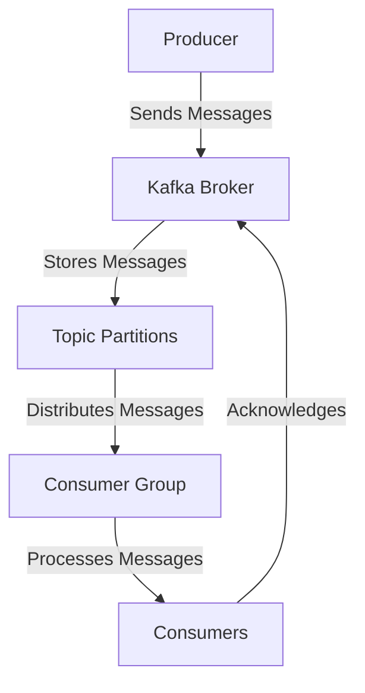

## 2.3 Producers and Consumers Internals

### Introduction

In the realm of Apache Kafka, producers and consumers are pivotal components that facilitate the flow of data within a distributed system. Understanding their internal workings is crucial for optimizing performance and ensuring reliable data processing. This section delves into the intricacies of Kafka producers and consumers, exploring configuration options, optimization techniques, load balancing, and consumer rebalancing protocols.

### Roles of Producers and Consumers in Kafka

**Producers** are responsible for publishing messages to Kafka topics. They send data to specific topics, which are then partitioned across different brokers. Producers can be configured to ensure data is sent reliably and efficiently, making them a critical component in data ingestion pipelines.

**Consumers**, on the other hand, read messages from Kafka topics. They are typically part of a consumer group, which allows for parallel processing and load balancing. Consumers can be configured to handle data at different levels of reliability, from at-most-once to exactly-once semantics.

### Producer Configuration and Optimization

#### Key Configuration Options

1. **Acks (Acknowledgments)**: This setting determines how many acknowledgments the producer requires the leader to have received before considering a request complete. The options include:
   - `acks=0`: The producer does not wait for any acknowledgment from the server.
   - `acks=1`: The leader writes the record to its local log but responds without waiting for full acknowledgment from all followers.
   - `acks=all`: The leader waits for the full set of in-sync replicas to acknowledge the record.

2. **Batch Size**: This setting controls the number of records that are sent in a single batch. Larger batch sizes can improve throughput but may increase latency.

3. **Compression Type**: Producers can compress data before sending it to Kafka. Supported compression types include `gzip`, `snappy`, `lz4`, and `zstd`. Compression can reduce network load but may increase CPU usage.

4. **Retries**: This setting specifies the number of times the producer will retry sending a record if the initial send fails. Increasing retries can improve reliability but may lead to duplicate records.

5. **Linger.ms**: This setting adds a delay before sending a batch, allowing more records to accumulate in the batch. This can improve throughput at the cost of increased latency.

#### Optimization Techniques

- **Asynchronous Sending**: Producers can send messages asynchronously, allowing them to continue processing without waiting for acknowledgments. This can significantly improve throughput.

- **Idempotent Producers**: By enabling idempotence, producers can ensure that messages are not duplicated, even if retries occur. This is crucial for maintaining exactly-once semantics.

- **Partitioning Strategies**: Producers can use custom partitioners to control how records are distributed across partitions. This can help balance load and improve performance.

### Consumer Configuration and Optimization

#### Key Configuration Options

1. **Auto Offset Reset**: This setting determines what happens when there is no initial offset in Kafka or if the current offset does not exist. Options include:
   - `earliest`: Start reading from the earliest available message.
   - `latest`: Start reading from the latest message.
   - `none`: Throw an exception if no offset is found.

2. **Fetch Min Bytes**: This setting controls the minimum amount of data that the server should return for a fetch request. Increasing this value can improve throughput by reducing the number of fetch requests.

3. **Max Poll Records**: This setting limits the number of records returned in a single poll. Adjusting this value can help manage memory usage and processing time.

4. **Session Timeout**: This setting defines the maximum time a consumer can be out of contact with the brokers before being considered dead. Adjusting this value can affect consumer group rebalancing.

#### Optimization Techniques

- **Consumer Polling**: Consumers should poll frequently to avoid session timeouts. Using a separate thread for polling can help maintain a steady flow of data.

- **Load Balancing**: By using consumer groups, Kafka can distribute the load of processing messages across multiple consumers. This allows for horizontal scaling and improved performance.

- **Manual Offset Management**: Consumers can manually commit offsets to have more control over message processing. This is useful for implementing custom retry logic or ensuring exactly-once processing.

### Managing Consumers within Consumer Groups

Consumer groups allow multiple consumers to work together to process data from a Kafka topic. Each consumer in a group is assigned a subset of the partitions, ensuring that each message is processed by only one consumer in the group.

#### Load Balancing

Kafka automatically balances the load among consumers in a group. When a new consumer joins the group, Kafka reassigns partitions to ensure an even distribution of work. This is particularly useful for scaling applications, as adding more consumers can increase throughput.

#### Consumer Rebalancing Protocols

Rebalancing is the process of redistributing partitions among consumers in a group. This can occur when:

- A new consumer joins the group.
- An existing consumer leaves the group.
- A partition is added or removed from the topic.

Rebalancing ensures that each consumer has an equal share of the workload, but it can also introduce latency and processing delays. Kafka uses the **Range** and **RoundRobin** partition assignment strategies to manage rebalancing.

### Rebalancing Protocols and Their Impact on Data Processing

Rebalancing is a critical aspect of managing consumer groups, but it can also impact data processing. During a rebalance, consumers may temporarily stop processing messages, leading to increased latency. To mitigate this, Kafka provides several strategies:

- **Sticky Assignor**: This strategy aims to minimize partition movement during rebalancing, reducing the impact on data processing.

- **Cooperative Rebalancing**: This approach allows consumers to gradually release partitions, minimizing disruption and improving stability.

- **Incremental Cooperative Rebalancing**: This is an enhancement over cooperative rebalancing, allowing for even finer-grained control over partition assignment.

### Code Examples

#### Java Producer Example

```java
import org.apache.kafka.clients.producer.KafkaProducer;
import org.apache.kafka.clients.producer.ProducerRecord;
import org.apache.kafka.clients.producer.ProducerConfig;
import org.apache.kafka.common.serialization.StringSerializer;

import java.util.Properties;

public class KafkaProducerExample {
    public static void main(String[] args) {
        Properties props = new Properties();
        props.put(ProducerConfig.BOOTSTRAP_SERVERS_CONFIG, "localhost:9092");
        props.put(ProducerConfig.KEY_SERIALIZER_CLASS_CONFIG, StringSerializer.class.getName());
        props.put(ProducerConfig.VALUE_SERIALIZER_CLASS_CONFIG, StringSerializer.class.getName());
        props.put(ProducerConfig.ACKS_CONFIG, "all");
        props.put(ProducerConfig.RETRIES_CONFIG, 3);
        props.put(ProducerConfig.LINGER_MS_CONFIG, 1);

        KafkaProducer<String, String> producer = new KafkaProducer<>(props);

        for (int i = 0; i < 10; i++) {
            ProducerRecord<String, String> record = new ProducerRecord<>("my-topic", Integer.toString(i), "message-" + i);
            producer.send(record);
        }

        producer.close();
    }
}
```

#### Scala Consumer Example

```scala
import org.apache.kafka.clients.consumer.KafkaConsumer
import org.apache.kafka.clients.consumer.ConsumerConfig
import org.apache.kafka.common.serialization.StringDeserializer

import java.util.Properties
import scala.collection.JavaConverters._

object KafkaConsumerExample {
  def main(args: Array[String]): Unit = {
    val props = new Properties()
    props.put(ConsumerConfig.BOOTSTRAP_SERVERS_CONFIG, "localhost:9092")
    props.put(ConsumerConfig.GROUP_ID_CONFIG, "my-group")
    props.put(ConsumerConfig.KEY_DESERIALIZER_CLASS_CONFIG, classOf[StringDeserializer].getName)
    props.put(ConsumerConfig.VALUE_DESERIALIZER_CLASS_CONFIG, classOf[StringDeserializer].getName)
    props.put(ConsumerConfig.AUTO_OFFSET_RESET_CONFIG, "earliest")

    val consumer = new KafkaConsumer[String, String](props)
    consumer.subscribe(List("my-topic").asJava)

    while (true) {
      val records = consumer.poll(100)
      for (record <- records.asScala) {
        println(s"Received message: ${record.value()} at offset ${record.offset()}")
      }
    }
  }
}
```

#### Kotlin Producer Example

```kotlin
import org.apache.kafka.clients.producer.KafkaProducer
import org.apache.kafka.clients.producer.ProducerConfig
import org.apache.kafka.clients.producer.ProducerRecord
import org.apache.kafka.common.serialization.StringSerializer

fun main() {
    val props = Properties().apply {
        put(ProducerConfig.BOOTSTRAP_SERVERS_CONFIG, "localhost:9092")
        put(ProducerConfig.KEY_SERIALIZER_CLASS_CONFIG, StringSerializer::class.java.name)
        put(ProducerConfig.VALUE_SERIALIZER_CLASS_CONFIG, StringSerializer::class.java.name)
        put(ProducerConfig.ACKS_CONFIG, "all")
        put(ProducerConfig.RETRIES_CONFIG, 3)
        put(ProducerConfig.LINGER_MS_CONFIG, 1)
    }

    val producer = KafkaProducer<String, String>(props)

    for (i in 0..9) {
        val record = ProducerRecord("my-topic", i.toString(), "message-$i")
        producer.send(record)
    }

    producer.close()
}
```

#### Clojure Consumer Example

```clojure
(require '[clojure.java.io :as io])
(require '[clojure.string :as str])
(import '[org.apache.kafka.clients.consumer KafkaConsumer ConsumerConfig]
        '[org.apache.kafka.common.serialization StringDeserializer])

(defn create-consumer []
  (let [props (doto (java.util.Properties.)
                (.put ConsumerConfig/BOOTSTRAP_SERVERS_CONFIG "localhost:9092")
                (.put ConsumerConfig/GROUP_ID_CONFIG "my-group")
                (.put ConsumerConfig/KEY_DESERIALIZER_CLASS_CONFIG StringDeserializer)
                (.put ConsumerConfig/VALUE_DESERIALIZER_CLASS_CONFIG StringDeserializer)
                (.put ConsumerConfig/AUTO_OFFSET_RESET_CONFIG "earliest"))]
    (KafkaConsumer. props)))

(defn consume-messages [consumer]
  (.subscribe consumer (java.util.Collections/singletonList "my-topic"))
  (while true
    (let [records (.poll consumer 100)]
      (doseq [record records]
        (println (str "Received message: " (.value record) " at offset " (.offset record)))))))

(defn -main []
  (let [consumer (create-consumer)]
    (consume-messages consumer)))
```

### Visualizing Kafka's Producer and Consumer Architecture



**Diagram Description**: This diagram illustrates the flow of messages from producers to consumers in a Kafka architecture. Producers send messages to Kafka brokers, which store them in topic partitions. Consumer groups then distribute these messages to individual consumers for processing.

### Practical Applications and Real-World Scenarios

- **Event-Driven Microservices**: Producers and consumers are integral to building event-driven microservices, where services communicate asynchronously through Kafka topics. This architecture enhances scalability and decouples services, allowing for independent development and deployment.

- **Real-Time Data Processing**: In scenarios where real-time data processing is critical, such as fraud detection or monitoring systems, optimizing producer and consumer configurations can significantly improve performance and reliability.

- **Big Data Integration**: Kafka's ability to handle large volumes of data makes it ideal for big data integration. Producers can ingest data from various sources, while consumers process and analyze this data in real-time, as discussed in [1.4.4 Big Data Integration]( "Big Data Integration").

### Conclusion

Understanding the internal workings of Kafka producers and consumers is essential for building efficient and reliable data processing systems. By optimizing configurations and leveraging consumer groups, developers can enhance performance and scalability. Rebalancing protocols further ensure that workloads are evenly distributed, minimizing disruptions and maintaining data processing efficiency.

## Test Your Knowledge: Advanced Kafka Producers and Consumers Quiz



### What is the primary role of a Kafka producer?

- [x] To publish messages to Kafka topics.
- [ ] To consume messages from Kafka topics.
- [ ] To manage consumer groups.
- [ ] To rebalance partitions.

> **Explanation:** A Kafka producer is responsible for publishing messages to Kafka topics, which are then consumed by Kafka consumers.

### Which configuration option controls the number of records sent in a single batch by a producer?

- [x] Batch Size
- [ ] Acks
- [ ] Compression Type
- [ ] Linger.ms

> **Explanation:** The Batch Size configuration option controls the number of records that are sent in a single batch by a producer.

### What is the purpose of the `acks` configuration in a Kafka producer?

- [x] To determine how many acknowledgments the producer requires before considering a request complete.
- [ ] To set the compression type for messages.
- [ ] To specify the number of retries for sending a record.
- [ ] To control the minimum amount of data returned for a fetch request.

> **Explanation:** The `acks` configuration determines how many acknowledgments the producer requires from the leader before considering a request complete.

### How do consumer groups help in load balancing?

- [x] By distributing the load of processing messages across multiple consumers.
- [ ] By increasing the batch size of messages.
- [ ] By reducing the number of retries for message processing.
- [ ] By compressing messages before sending.

> **Explanation:** Consumer groups help in load balancing by distributing the load of processing messages across multiple consumers, allowing for parallel processing.

### What happens during a consumer group rebalance?

- [x] Partitions are redistributed among consumers in the group.
- [ ] Producers stop sending messages.
- [ ] Consumers are removed from the group.
- [ ] Messages are compressed.

> **Explanation:** During a consumer group rebalance, partitions are redistributed among consumers in the group to ensure an even distribution of work.

### Which rebalancing strategy aims to minimize partition movement?

- [x] Sticky Assignor
- [ ] Range Assignor
- [ ] RoundRobin Assignor
- [ ] Cooperative Rebalancing

> **Explanation:** The Sticky Assignor strategy aims to minimize partition movement during rebalancing, reducing the impact on data processing.

### What is the benefit of using idempotent producers?

- [x] To ensure that messages are not duplicated, even if retries occur.
- [ ] To increase the batch size of messages.
- [ ] To reduce the number of fetch requests.
- [ ] To compress messages before sending.

> **Explanation:** Idempotent producers ensure that messages are not duplicated, even if retries occur, which is crucial for maintaining exactly-once semantics.

### Which configuration option determines the maximum time a consumer can be out of contact with brokers?

- [x] Session Timeout
- [ ] Fetch Min Bytes
- [ ] Max Poll Records
- [ ] Auto Offset Reset

> **Explanation:** The Session Timeout configuration option defines the maximum time a consumer can be out of contact with the brokers before being considered dead.

### What is the impact of increasing the `linger.ms` setting in a producer?

- [x] It can improve throughput at the cost of increased latency.
- [ ] It reduces the number of retries for sending a record.
- [ ] It compresses messages before sending.
- [ ] It increases the batch size of messages.

> **Explanation:** Increasing the `linger.ms` setting can improve throughput by allowing more records to accumulate in a batch, but it may increase latency.

### True or False: Kafka consumers can only read messages from the latest offset.

- [ ] True
- [x] False

> **Explanation:** False. Kafka consumers can be configured to read messages from the earliest or latest offset, depending on the `auto.offset.reset` configuration.


