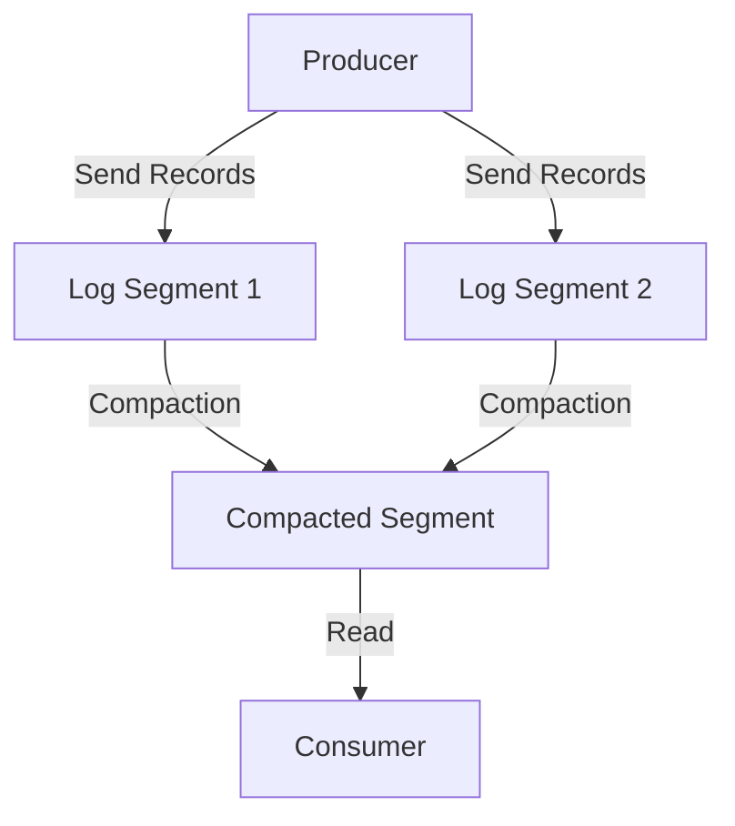

## 2.4.1 Log Segmentation and Compaction

Apache Kafka is renowned for its ability to handle high-throughput, real-time data streams with remarkable efficiency. A critical component of this capability lies in its sophisticated storage management, specifically through log segmentation and compaction. These mechanisms ensure that Kafka can maintain performance and data integrity while efficiently managing storage resources. This section delves into the details of log segmentation and compaction, providing expert insights into their configuration and practical applications.

### Understanding Log Segmentation

Log segmentation is a fundamental concept in Kafka's storage architecture. It involves dividing a Kafka topic's log into smaller, manageable segments. Each segment is a contiguous sequence of records, stored as a separate file on disk. This segmentation is crucial for several reasons:

1. **Efficient Storage Management**: By breaking down logs into segments, Kafka can efficiently manage disk space and perform operations such as deletion and compaction without affecting the entire log.

2. **Improved Performance**: Segmentation allows Kafka to handle large volumes of data by enabling parallel processing of log segments. This parallelism is vital for maintaining high throughput and low latency.

3. **Facilitated Data Retention**: Segments can be individually deleted based on retention policies, allowing Kafka to manage data lifecycle efficiently.

#### Log Segment Structure

Each log segment in Kafka consists of two main components:

- **Log File**: Contains the actual records, stored in a binary format. Each record is appended to the log file as it is produced.

- **Index File**: Maintains an index of record offsets within the log file, allowing for efficient retrieval of records.

The segmentation process is governed by configuration parameters such as `log.segment.bytes`, which defines the maximum size of a segment, and `log.segment.ms`, which specifies the maximum time a segment can remain open before being closed.

### Log Compaction: Ensuring Data Integrity

Log compaction is a mechanism in Kafka that ensures data integrity by retaining the latest value for each unique key within a log. Unlike traditional log retention, which deletes entire segments based on time or size, compaction selectively removes obsolete records, preserving only the most recent updates.

#### How Log Compaction Works

Log compaction operates on a per-topic basis and is particularly beneficial for topics where maintaining the latest state is crucial. The process involves:

1. **Identifying Obsolete Records**: Kafka scans the log segments to identify records with outdated keys. A record is considered obsolete if a newer record with the same key exists.

2. **Compacting the Log**: Obsolete records are removed, and the remaining records are rewritten into new segments. This process reduces the log size while ensuring that the latest state is preserved.

3. **Maintaining Offsets**: Kafka maintains the original offsets of records, ensuring that consumers can continue processing without disruption.

#### Benefits of Log Compaction

- **Stateful Applications**: Log compaction is ideal for applications that require maintaining the latest state, such as databases and configuration management systems.

- **Reduced Storage Requirements**: By eliminating obsolete records, compaction reduces the storage footprint, making it cost-effective.

- **Enhanced Data Integrity**: Compaction ensures that the latest data is always available, improving the reliability of stateful applications.

### Configuration Options for Log Compaction

Configuring log compaction in Kafka involves several parameters that control its behavior:

- **`log.cleanup.policy`**: Set to `compact` to enable log compaction for a topic.

- **`min.cleanable.dirty.ratio`**: Defines the minimum ratio of log that must be dirty before compaction is triggered. A lower ratio means more frequent compaction.

- **`delete.retention.ms`**: Specifies the time to retain delete markers (tombstones) before they are eligible for deletion during compaction.

- **`segment.bytes` and `segment.ms`**: Control the size and age of log segments, influencing how often compaction occurs.

### Practical Applications of Log Compaction

Log compaction is particularly useful in scenarios where maintaining the latest state is critical. Some common use cases include:

#### Change Data Capture (CDC)

In CDC systems, log compaction ensures that only the latest changes are retained, allowing downstream systems to reconstruct the current state efficiently. This is crucial for applications like database replication and synchronization.

#### Configuration Management

For systems that rely on configuration data, log compaction ensures that the latest configuration is always available, reducing the risk of inconsistencies.

#### Event Sourcing

In event-sourced architectures, log compaction helps maintain a compact representation of the current state by retaining only the latest events for each entity.

### Code Examples

To illustrate the concepts of log segmentation and compaction, let's explore code examples in Java, Scala, Kotlin, and Clojure.

#### Java Example

```java
import org.apache.kafka.clients.producer.*;
import org.apache.kafka.common.serialization.StringSerializer;
import java.util.Properties;

public class KafkaProducerExample {
    public static void main(String[] args) {
        Properties props = new Properties();
        props.put(ProducerConfig.BOOTSTRAP_SERVERS_CONFIG, "localhost:9092");
        props.put(ProducerConfig.KEY_SERIALIZER_CLASS_CONFIG, StringSerializer.class.getName());
        props.put(ProducerConfig.VALUE_SERIALIZER_CLASS_CONFIG, StringSerializer.class.getName());

        KafkaProducer<String, String> producer = new KafkaProducer<>(props);

        for (int i = 0; i < 10; i++) {
            ProducerRecord<String, String> record = new ProducerRecord<>("my-topic", "key" + i, "value" + i);
            producer.send(record);
        }

        producer.close();
    }
}
```

#### Scala Example

```scala
import org.apache.kafka.clients.producer.{KafkaProducer, ProducerConfig, ProducerRecord}
import org.apache.kafka.common.serialization.StringSerializer
import java.util.Properties

object KafkaProducerExample extends App {
  val props = new Properties()
  props.put(ProducerConfig.BOOTSTRAP_SERVERS_CONFIG, "localhost:9092")
  props.put(ProducerConfig.KEY_SERIALIZER_CLASS_CONFIG, classOf[StringSerializer].getName)
  props.put(ProducerConfig.VALUE_SERIALIZER_CLASS_CONFIG, classOf[StringSerializer].getName)

  val producer = new KafkaProducer[String, String](props)

  for (i <- 0 until 10) {
    val record = new ProducerRecord[String, String]("my-topic", s"key$i", s"value$i")
    producer.send(record)
  }

  producer.close()
}
```

#### Kotlin Example

```kotlin
import org.apache.kafka.clients.producer.KafkaProducer
import org.apache.kafka.clients.producer.ProducerConfig
import org.apache.kafka.clients.producer.ProducerRecord
import org.apache.kafka.common.serialization.StringSerializer
import java.util.Properties

fun main() {
    val props = Properties().apply {
        put(ProducerConfig.BOOTSTRAP_SERVERS_CONFIG, "localhost:9092")
        put(ProducerConfig.KEY_SERIALIZER_CLASS_CONFIG, StringSerializer::class.java.name)
        put(ProducerConfig.VALUE_SERIALIZER_CLASS_CONFIG, StringSerializer::class.java.name)
    }

    val producer = KafkaProducer<String, String>(props)

    for (i in 0 until 10) {
        val record = ProducerRecord("my-topic", "key$i", "value$i")
        producer.send(record)
    }

    producer.close()
}
```

#### Clojure Example

```clojure
(require '[clojure.java.io :as io])
(import '[org.apache.kafka.clients.producer KafkaProducer ProducerConfig ProducerRecord]
        '[org.apache.kafka.common.serialization StringSerializer])

(defn create-producer []
  (let [props (doto (java.util.Properties.)
                (.put ProducerConfig/BOOTSTRAP_SERVERS_CONFIG "localhost:9092")
                (.put ProducerConfig/KEY_SERIALIZER_CLASS_CONFIG StringSerializer)
                (.put ProducerConfig/VALUE_SERIALIZER_CLASS_CONFIG StringSerializer))]
    (KafkaProducer. props)))

(defn send-messages [producer]
  (doseq [i (range 10)]
    (.send producer (ProducerRecord. "my-topic" (str "key" i) (str "value" i)))))

(defn -main []
  (let [producer (create-producer)]
    (send-messages producer)
    (.close producer)))
```

### Visualizing Log Segmentation and Compaction

To better understand the process of log segmentation and compaction, consider the following diagram:



**Caption**: This diagram illustrates the flow of records from producers to log segments, followed by the compaction process that results in a compacted segment read by consumers.

### Best Practices for Log Segmentation and Compaction

- **Optimize Segment Size**: Choose segment sizes that balance between efficient disk usage and manageable compaction times. Smaller segments may lead to frequent compaction, while larger segments can delay the process.

- **Monitor Compaction Performance**: Regularly monitor compaction metrics to ensure that the process does not impact overall system performance.

- **Configure Retention Policies**: Align retention policies with business requirements to manage storage costs effectively while ensuring data availability.

- **Test Configuration Changes**: Before applying configuration changes in production, test them in a staging environment to understand their impact on performance and storage.

### Knowledge Check

To reinforce your understanding of log segmentation and compaction, consider the following questions:

1. What is the primary purpose of log segmentation in Kafka?
2. How does log compaction differ from traditional log retention?
3. What configuration parameters control the behavior of log compaction?
4. In what scenarios is log compaction particularly beneficial?
5. How can you monitor the performance of log compaction in a Kafka cluster?

### Conclusion

Log segmentation and compaction are pivotal to Kafka's ability to manage large volumes of data efficiently while maintaining data integrity. By understanding and configuring these mechanisms effectively, you can optimize Kafka's performance and storage management to meet the demands of modern data-driven applications.

For further reading, explore the [Apache Kafka Documentation](https://kafka.apache.org/documentation/) and consider how these concepts integrate with other aspects of Kafka's architecture, such as [2.5 Networking and Protocols]( "Networking and Protocols") and [3.1 Installation and Configuration Best Practices]( "Installation and Configuration Best Practices").

## Test Your Knowledge: Log Segmentation and Compaction in Kafka



### What is the primary benefit of log segmentation in Kafka?

- [x] Efficient storage management and improved performance
- [ ] Enhanced data security
- [ ] Simplified consumer configuration
- [ ] Increased message throughput

> **Explanation:** Log segmentation allows Kafka to manage disk space efficiently and perform operations like deletion and compaction without affecting the entire log, thus improving performance.

### How does log compaction differ from traditional log retention?

- [x] It retains only the latest value for each key
- [ ] It deletes entire segments based on time
- [ ] It archives old data to external storage
- [ ] It compresses data to save space

> **Explanation:** Log compaction selectively removes obsolete records, preserving only the most recent updates for each key, unlike traditional retention which deletes entire segments.

### Which configuration parameter enables log compaction for a Kafka topic?

- [x] `log.cleanup.policy`
- [ ] `log.segment.bytes`
- [ ] `log.retention.ms`
- [ ] `log.index.interval.bytes`

> **Explanation:** The `log.cleanup.policy` parameter is set to `compact` to enable log compaction for a Kafka topic.

### In what scenario is log compaction particularly beneficial?

- [x] Change Data Capture (CDC) systems
- [ ] Batch processing applications
- [ ] Static file storage
- [ ] Video streaming services

> **Explanation:** Log compaction is beneficial in CDC systems where maintaining the latest state is crucial for efficient data synchronization and replication.

### What does the `min.cleanable.dirty.ratio` parameter control?

- [x] The minimum ratio of log that must be dirty before compaction
- [ ] The maximum size of a log segment
- [ ] The time to retain delete markers
- [ ] The frequency of consumer rebalancing

> **Explanation:** The `min.cleanable.dirty.ratio` parameter defines the minimum ratio of log that must be dirty before compaction is triggered, influencing how often compaction occurs.

### How can you monitor the performance of log compaction in a Kafka cluster?

- [x] By tracking compaction metrics and monitoring system performance
- [ ] By analyzing consumer lag
- [ ] By reviewing producer throughput
- [ ] By checking network latency

> **Explanation:** Monitoring compaction metrics and system performance helps ensure that the compaction process does not negatively impact the overall performance of the Kafka cluster.

### What is a key advantage of using log compaction in stateful applications?

- [x] It ensures the latest data is always available
- [ ] It reduces network bandwidth usage
- [ ] It simplifies consumer group management
- [ ] It increases producer throughput

> **Explanation:** Log compaction ensures that the latest data is always available, which is crucial for stateful applications that rely on up-to-date information.

### Which of the following is a component of a Kafka log segment?

- [x] Log file and index file
- [ ] Consumer group and partition
- [ ] Producer and broker
- [ ] Topic and offset

> **Explanation:** Each log segment in Kafka consists of a log file containing records and an index file that maintains an index of record offsets.

### What role does the index file play in a Kafka log segment?

- [x] It maintains an index of record offsets for efficient retrieval
- [ ] It stores the actual records in binary format
- [ ] It manages consumer group assignments
- [ ] It compresses data for storage efficiency

> **Explanation:** The index file in a Kafka log segment maintains an index of record offsets, allowing for efficient retrieval of records.

### True or False: Log compaction can operate on a per-topic basis in Kafka.

- [x] True
- [ ] False

> **Explanation:** Log compaction can be configured to operate on a per-topic basis, allowing for selective compaction based on the needs of each topic.


