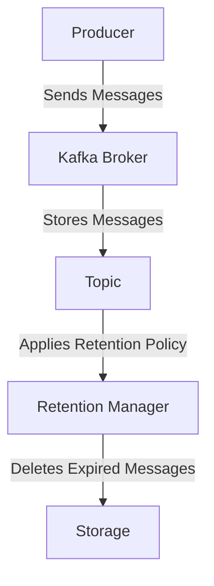

## 2.4.2 Retention Policies and Strategies

### Introduction

In the realm of data streaming and real-time processing, Apache Kafka stands out as a robust platform for managing high-throughput data pipelines. A critical aspect of Kafka's architecture is its ability to handle data retention efficiently. Retention policies in Kafka dictate how long data is stored in the system, impacting both storage costs and data availability. This section delves into the intricacies of Kafka's retention policies, exploring how they can be configured, the strategies for long-term data storage, and the considerations necessary for effective storage capacity planning.

### Purpose of Retention Policies

Retention policies in Kafka serve to manage the lifecycle of data within the system. They determine how long messages are retained in Kafka topics before being deleted. This is crucial for several reasons:

- **Storage Management**: By controlling data retention, organizations can manage storage costs and ensure that Kafka clusters do not run out of disk space.
- **Data Compliance**: Many industries have regulatory requirements dictating how long data must be retained. Kafka's retention policies can help ensure compliance with these regulations.
- **Performance Optimization**: Retaining only necessary data can improve Kafka's performance by reducing the amount of data that needs to be processed and stored.

### Configuring Retention Settings Per Topic

Kafka allows for flexible retention configurations, enabling different settings for each topic. This granularity is essential for tailoring retention policies to the specific needs of different data streams.

#### Time-Based Retention

Time-based retention policies specify how long messages should be retained in a topic. This is configured using the `retention.ms` property, which sets the retention period in milliseconds.

```java
// Java example for setting time-based retention
Properties props = new Properties();
props.put("bootstrap.servers", "localhost:9092");
props.put("key.serializer", "org.apache.kafka.common.serialization.StringSerializer");
props.put("value.serializer", "org.apache.kafka.common.serialization.StringSerializer");
props.put("retention.ms", "604800000"); // Retain data for 7 days
```

#### Size-Based Retention

Size-based retention policies limit the amount of data retained in a topic by specifying a maximum size. This is configured using the `retention.bytes` property.

```scala
// Scala example for setting size-based retention
val props = new Properties()
props.put("bootstrap.servers", "localhost:9092")
props.put("key.serializer", "org.apache.kafka.common.serialization.StringSerializer")
props.put("value.serializer", "org.apache.kafka.common.serialization.StringSerializer")
props.put("retention.bytes", "1073741824") // Retain up to 1GB of data
```

#### Log Compaction

Log compaction is another retention strategy that retains the latest value for each key, ensuring that the most recent state is always available. This is particularly useful for scenarios where the latest state of an entity is more important than the entire history.

```kotlin
// Kotlin example for enabling log compaction
val props = Properties().apply {
    put("bootstrap.servers", "localhost:9092")
    put("key.serializer", "org.apache.kafka.common.serialization.StringSerializer")
    put("value.serializer", "org.apache.kafka.common.serialization.StringSerializer")
    put("cleanup.policy", "compact")
}
```

### Strategies for Long-Term Data Storage and Compliance

For organizations that need to retain data for extended periods, Kafka's native retention policies may not suffice. Here are some strategies to consider:

#### Archiving to External Storage

One common approach is to archive Kafka data to external storage systems such as HDFS, Amazon S3, or Google Cloud Storage. This allows for long-term retention without burdening Kafka clusters.

```clojure
;; Clojure example for archiving data to S3
(def s3-client (AmazonS3ClientBuilder/defaultClient))
(def bucket-name "kafka-archive")
(def key "topic-data")

(.putObject s3-client bucket-name key (File. "/path/to/kafka/data"))
```

#### Tiered Storage

Tiered storage involves using different storage tiers for different data retention needs. For example, recent data might be stored on fast SSDs for quick access, while older data is moved to slower, cheaper storage.

#### Compliance and Data Governance

Ensuring compliance with data retention regulations requires careful planning and monitoring. Kafka's integration with schema registries and data governance tools can help enforce data policies and track data lineage.

### Considerations for Storage Capacity Planning

Effective storage capacity planning is essential to ensure that Kafka clusters can handle the expected data load without running out of space.

#### Estimating Data Volume

Estimate the volume of data that will be produced and consumed by each topic. This involves understanding the message size, the number of messages per second, and the retention period.

#### Monitoring and Alerts

Set up monitoring and alerts to track disk usage and retention metrics. Tools like Prometheus and Grafana can provide real-time insights into Kafka's storage health.

#### Scaling Strategies

Plan for scaling Kafka clusters as data volume grows. This might involve adding more brokers, increasing disk capacity, or optimizing retention settings.

### Visualizing Retention Policies

To better understand how retention policies affect Kafka's storage, consider the following diagram:



**Diagram Explanation**: This diagram illustrates the flow of messages from a producer to a Kafka broker, where they are stored in a topic. The retention manager applies the configured retention policy, deleting messages that exceed the retention criteria.

### Conclusion

Retention policies in Kafka are a powerful tool for managing data lifecycle, ensuring compliance, and optimizing storage. By configuring retention settings per topic and employing strategies for long-term data storage, organizations can effectively balance their storage and retrieval needs. Proper planning and monitoring are crucial to maintaining Kafka's performance and ensuring that storage capacity is not exceeded.

## Test Your Knowledge: Kafka Retention Policies and Strategies Quiz



### What is the primary purpose of retention policies in Kafka?

- [x] To manage the lifecycle of data within the system
- [ ] To increase the throughput of Kafka brokers
- [ ] To enhance the security of Kafka clusters
- [ ] To improve the serialization of messages

> **Explanation:** Retention policies are designed to manage how long data is stored in Kafka, impacting storage costs and data availability.

### How can you configure a time-based retention policy in Kafka?

- [x] By setting the `retention.ms` property
- [ ] By setting the `cleanup.policy` property
- [ ] By setting the `retention.bytes` property
- [ ] By setting the `log.retention.hours` property

> **Explanation:** The `retention.ms` property specifies the retention period in milliseconds for time-based retention.

### What is the benefit of using log compaction in Kafka?

- [x] It retains the latest value for each key
- [ ] It deletes all messages older than a specified time
- [ ] It compresses messages to save space
- [ ] It increases the throughput of message processing

> **Explanation:** Log compaction ensures that the latest state of an entity is always available by retaining the latest value for each key.

### Which external storage systems are commonly used for archiving Kafka data?

- [x] HDFS, Amazon S3, Google Cloud Storage
- [ ] Redis, MongoDB, Cassandra
- [ ] MySQL, PostgreSQL, Oracle
- [ ] Elasticsearch, Solr, Lucene

> **Explanation:** HDFS, Amazon S3, and Google Cloud Storage are commonly used for archiving Kafka data for long-term retention.

### What is a key consideration for storage capacity planning in Kafka?

- [x] Estimating the volume of data produced and consumed
- [ ] Increasing the number of consumer groups
- [ ] Reducing the number of partitions
- [ ] Enhancing the security protocols

> **Explanation:** Estimating data volume is crucial for ensuring that Kafka clusters can handle the expected data load without running out of space.

### Which tool can be used for monitoring Kafka's storage health?

- [x] Prometheus
- [ ] Jenkins
- [ ] Ansible
- [ ] Docker

> **Explanation:** Prometheus is a monitoring tool that can provide real-time insights into Kafka's storage health.

### What does the `retention.bytes` property control in Kafka?

- [x] The maximum size of data retained in a topic
- [ ] The maximum number of messages in a topic
- [ ] The maximum number of partitions in a topic
- [ ] The maximum number of consumer groups

> **Explanation:** The `retention.bytes` property limits the amount of data retained in a topic by specifying a maximum size.

### How does tiered storage benefit Kafka's retention strategy?

- [x] By using different storage tiers for different data retention needs
- [ ] By increasing the number of brokers in the cluster
- [ ] By reducing the number of consumer groups
- [ ] By enhancing the security protocols

> **Explanation:** Tiered storage allows for recent data to be stored on fast SSDs for quick access, while older data is moved to slower, cheaper storage.

### What is the role of the retention manager in Kafka?

- [x] To apply the configured retention policy and delete expired messages
- [ ] To increase the throughput of message processing
- [ ] To enhance the security of Kafka clusters
- [ ] To improve the serialization of messages

> **Explanation:** The retention manager applies the configured retention policy, deleting messages that exceed the retention criteria.

### True or False: Kafka's native retention policies are always sufficient for long-term data storage.

- [ ] True
- [x] False

> **Explanation:** Kafka's native retention policies may not suffice for long-term data storage, and additional strategies such as archiving to external storage may be necessary.


