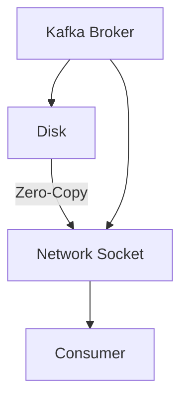

## 2.4.3 Zero-Copy Data Transfer

### Introduction

Apache Kafka is renowned for its ability to handle large volumes of data with high throughput and low latency. A critical feature that contributes to this efficiency is its use of zero-copy data transfer. This technique significantly reduces CPU overhead during data transmission, allowing Kafka to achieve superior performance. In this section, we will delve into the concept of zero-copy, explore how Kafka leverages it, and discuss its benefits and limitations.

### Understanding Zero-Copy

Zero-copy is a method of data transfer that allows data to be moved from one memory location to another without involving the CPU in the actual data copying process. This is achieved by utilizing the capabilities of the operating system to transfer data directly between the file system and network interfaces.

#### How Zero-Copy Works

In traditional data transfer methods, data is copied multiple times between user space and kernel space, consuming CPU cycles and memory bandwidth. Zero-copy eliminates these redundant copies by allowing the operating system to handle data transfer directly. This is typically achieved through system calls such as `sendfile()` in Linux, which enables the kernel to transfer data from a file descriptor to a network socket without copying it to user space.

### Zero-Copy in Kafka

Kafka employs zero-copy to optimize the transfer of data from disk to network sockets, particularly during the process of serving data to consumers. This is crucial for maintaining Kafka's high throughput and low latency characteristics.

#### Kafka's Use of Zero-Copy

When a Kafka broker reads data from disk to send to a consumer, it utilizes the zero-copy mechanism to bypass the CPU-intensive data copying process. Instead of copying data from disk to user space and then to the network socket, Kafka uses the operating system's zero-copy capabilities to transfer data directly from the disk to the network socket.

### Benefits of Zero-Copy in Kafka

The use of zero-copy in Kafka offers several advantages:

1. **Increased Throughput**: By reducing the CPU overhead associated with data copying, zero-copy allows Kafka to handle more data in less time, increasing overall throughput.

2. **Reduced CPU Utilization**: Zero-copy minimizes the CPU cycles required for data transfer, freeing up resources for other tasks and improving the efficiency of the Kafka broker.

3. **Lower Latency**: By eliminating unnecessary data copying, zero-copy reduces the time taken to transfer data from disk to network, resulting in lower latency for data delivery.

4. **Improved Resource Utilization**: With less CPU and memory bandwidth consumed by data copying, Kafka can make better use of available resources, leading to more efficient operation.

### Operating System Mechanisms

Zero-copy relies heavily on the capabilities of the underlying operating system. In Linux, the `sendfile()` system call is a common mechanism used to implement zero-copy. This call allows data to be transferred directly from a file descriptor to a socket, bypassing user space and reducing CPU involvement.

#### The Role of `sendfile()`

The `sendfile()` system call is integral to Kafka's zero-copy implementation. It enables the kernel to handle data transfer directly, leveraging the file system's ability to read data and the network stack's ability to send data without involving user space. This not only reduces CPU usage but also minimizes context switches between user space and kernel space.

### Limitations and Configuration Requirements

While zero-copy offers significant performance benefits, there are some limitations and configuration considerations to be aware of:

1. **Operating System Support**: Zero-copy relies on specific system calls and features that may not be available on all operating systems. It is primarily supported on Linux systems with the `sendfile()` system call.

2. **File System Compatibility**: The effectiveness of zero-copy can depend on the file system in use. Some file systems may not fully support zero-copy operations, potentially limiting its benefits.

3. **Network Interface Constraints**: The performance gains from zero-copy can be constrained by the capabilities of the network interface. High-speed network interfaces are required to fully leverage the benefits of zero-copy.

4. **Configuration Tuning**: To maximize the benefits of zero-copy, Kafka configurations may need to be tuned. This includes setting appropriate buffer sizes and ensuring that the operating system is configured to support zero-copy operations.

### Practical Applications and Real-World Scenarios

Zero-copy is particularly beneficial in scenarios where Kafka is used to handle large volumes of data with stringent performance requirements. This includes use cases such as:

- **Real-Time Data Pipelines**: In scenarios where data needs to be processed and delivered in real-time, zero-copy helps maintain low latency and high throughput.

- **Big Data Integration**: For applications involving large-scale data processing, such as [1.4.4 Big Data Integration]( "Big Data Integration"), zero-copy enhances Kafka's ability to efficiently handle data transfer.

- **Event-Driven Microservices**: In microservices architectures where Kafka is used for event streaming, zero-copy ensures efficient data delivery between services.

### Code Examples

To illustrate the concept of zero-copy in Kafka, let's explore some code examples in Java, Scala, Kotlin, and Clojure.

#### Java Example

```java
import org.apache.kafka.clients.producer.KafkaProducer;
import org.apache.kafka.clients.producer.ProducerRecord;
import java.util.Properties;

public class ZeroCopyProducer {
    public static void main(String[] args) {
        Properties props = new Properties();
        props.put("bootstrap.servers", "localhost:9092");
        props.put("key.serializer", "org.apache.kafka.common.serialization.StringSerializer");
        props.put("value.serializer", "org.apache.kafka.common.serialization.StringSerializer");

        KafkaProducer<String, String> producer = new KafkaProducer<>(props);

        for (int i = 0; i < 100; i++) {
            ProducerRecord<String, String> record = new ProducerRecord<>("zero-copy-topic", Integer.toString(i), "Message " + i);
            producer.send(record);
        }

        producer.close();
    }
}
```

#### Scala Example

```scala
import org.apache.kafka.clients.producer.{KafkaProducer, ProducerRecord}
import java.util.Properties

object ZeroCopyProducer extends App {
  val props = new Properties()
  props.put("bootstrap.servers", "localhost:9092")
  props.put("key.serializer", "org.apache.kafka.common.serialization.StringSerializer")
  props.put("value.serializer", "org.apache.kafka.common.serialization.StringSerializer")

  val producer = new KafkaProducer[String, String](props)

  for (i <- 0 until 100) {
    val record = new ProducerRecord[String, String]("zero-copy-topic", i.toString, s"Message $i")
    producer.send(record)
  }

  producer.close()
}
```

#### Kotlin Example

```kotlin
import org.apache.kafka.clients.producer.KafkaProducer
import org.apache.kafka.clients.producer.ProducerRecord
import java.util.Properties

fun main() {
    val props = Properties()
    props["bootstrap.servers"] = "localhost:9092"
    props["key.serializer"] = "org.apache.kafka.common.serialization.StringSerializer"
    props["value.serializer"] = "org.apache.kafka.common.serialization.StringSerializer"

    val producer = KafkaProducer<String, String>(props)

    for (i in 0 until 100) {
        val record = ProducerRecord("zero-copy-topic", i.toString(), "Message $i")
        producer.send(record)
    }

    producer.close()
}
```

#### Clojure Example

```clojure
(require '[clojure.java.io :as io])
(require '[clojure.java.shell :refer [sh]])

(defn produce-messages []
  (let [props (doto (java.util.Properties.)
                (.put "bootstrap.servers" "localhost:9092")
                (.put "key.serializer" "org.apache.kafka.common.serialization.StringSerializer")
                (.put "value.serializer" "org.apache.kafka.common.serialization.StringSerializer"))
        producer (org.apache.kafka.clients.producer.KafkaProducer. props)]
    (doseq [i (range 100)]
      (.send producer (org.apache.kafka.clients.producer.ProducerRecord. "zero-copy-topic" (str i) (str "Message " i))))
    (.close producer)))

(produce-messages)
```

### Visualizing Zero-Copy in Kafka

To better understand how zero-copy operates within Kafka, consider the following diagram illustrating the data flow:



**Caption**: This diagram shows how data is transferred directly from disk to network socket using zero-copy, bypassing user space and reducing CPU overhead.

### Conclusion

Zero-copy data transfer is a powerful technique that enhances Kafka's performance by reducing CPU overhead and improving throughput and latency. By leveraging the capabilities of the operating system, Kafka can efficiently handle large volumes of data, making it an ideal choice for real-time data processing and event-driven architectures.

### Knowledge Check

To reinforce your understanding of zero-copy data transfer in Kafka, consider the following questions and challenges.

## Test Your Knowledge: Zero-Copy Data Transfer in Kafka



### What is the primary benefit of zero-copy data transfer in Kafka?

- [x] It reduces CPU overhead during data transmission.
- [ ] It increases disk space usage.
- [ ] It simplifies code complexity.
- [ ] It enhances data security.

> **Explanation:** Zero-copy reduces CPU overhead by eliminating unnecessary data copying between user space and kernel space.

### Which system call is commonly used in Linux to implement zero-copy?

- [x] `sendfile()`
- [ ] `read()`
- [ ] `write()`
- [ ] `open()`

> **Explanation:** The `sendfile()` system call allows data to be transferred directly from a file descriptor to a network socket, enabling zero-copy.

### How does zero-copy improve Kafka's performance?

- [x] By increasing throughput and reducing latency.
- [ ] By increasing memory usage.
- [ ] By decreasing network bandwidth.
- [ ] By simplifying configuration.

> **Explanation:** Zero-copy improves performance by reducing CPU cycles needed for data copying, thus increasing throughput and reducing latency.

### What is a limitation of zero-copy in Kafka?

- [x] It requires operating system support.
- [ ] It decreases network speed.
- [ ] It increases CPU usage.
- [ ] It complicates application logic.

> **Explanation:** Zero-copy relies on specific operating system features, such as the `sendfile()` system call, which may not be available on all systems.

### In which scenarios is zero-copy particularly beneficial?

- [x] Real-time data pipelines
- [x] Big data integration
- [ ] Static data storage
- [ ] Batch processing

> **Explanation:** Zero-copy is beneficial in scenarios requiring high throughput and low latency, such as real-time data pipelines and big data integration.

### What role does the operating system play in zero-copy?

- [x] It handles data transfer directly between file systems and network interfaces.
- [ ] It increases the number of data copies.
- [ ] It manages user space memory allocation.
- [ ] It simplifies application code.

> **Explanation:** The operating system facilitates zero-copy by transferring data directly between file systems and network interfaces, bypassing user space.

### Which Kafka component primarily benefits from zero-copy?

- [x] Kafka Broker
- [ ] Kafka Producer
- [ ] Kafka Consumer
- [ ] Kafka Connect

> **Explanation:** The Kafka Broker benefits from zero-copy as it handles data transfer from disk to network sockets.

### What is the impact of zero-copy on CPU utilization?

- [x] It reduces CPU utilization.
- [ ] It increases CPU utilization.
- [ ] It has no impact on CPU utilization.
- [ ] It doubles CPU utilization.

> **Explanation:** Zero-copy reduces CPU utilization by minimizing the CPU cycles required for data copying.

### Can zero-copy be used with all file systems?

- [ ] Yes, it is compatible with all file systems.
- [x] No, some file systems may not fully support zero-copy.
- [ ] Yes, but only with specific network interfaces.
- [ ] No, it is only available on Windows systems.

> **Explanation:** The effectiveness of zero-copy can depend on the file system in use, and some may not fully support it.

### True or False: Zero-copy eliminates all data copying in Kafka.

- [ ] True
- [x] False

> **Explanation:** While zero-copy reduces unnecessary data copying, it does not eliminate all data copying, as some operations may still require it.



By understanding and leveraging zero-copy data transfer, you can optimize your Kafka deployments for maximum performance and efficiency.
