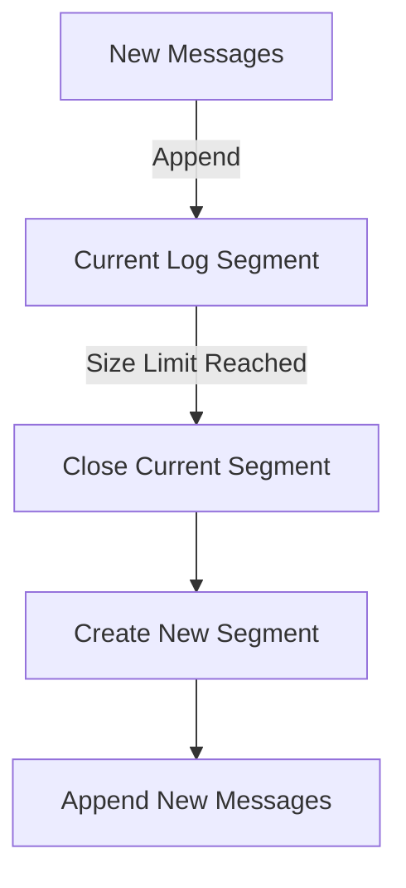

## 2.4 The Kafka Storage Layer

Apache Kafka is renowned for its robust storage capabilities, which are foundational to its role as a distributed streaming platform. This section delves into the intricacies of Kafka's storage layer, exploring how messages are stored on disk, the mechanisms of log segmentation and compaction, the configuration of data retention policies, and the performance benefits of zero-copy transfer. Understanding these concepts is crucial for expert software engineers and enterprise architects aiming to optimize Kafka's performance and reliability in real-time data processing systems.

### Kafka's Storage Architecture

Kafka's storage architecture is designed to handle high-throughput, fault-tolerant, and durable message storage. At its core, Kafka uses a distributed log-based storage system where messages are appended to a log file. Each topic in Kafka is divided into partitions, and each partition is an ordered, immutable sequence of records that is continually appended to a structured commit log.

#### How Messages Are Stored on Disk

Messages in Kafka are stored in a structured commit log format. Each partition is associated with a directory on the broker's file system. Within this directory, Kafka maintains a set of log files, each representing a segment of the partition's data. These log files are named based on the offset of the first message they contain, ensuring a clear and ordered sequence of messages.

- **Log Files**: Each log file is a sequence of messages stored in binary format. Kafka appends new messages to the end of the current log file until it reaches a predefined size limit, at which point a new log file (or segment) is created.
- **Index Files**: Alongside log files, Kafka maintains index files that map message offsets to their physical location within the log file. This indexing allows for efficient message retrieval based on offset.

### Log Segmentation

Log segmentation is a critical feature of Kafka's storage layer, enabling efficient data management and retrieval.

#### Purpose and Benefits of Log Segmentation

Log segmentation divides a partition's log into smaller, more manageable segments. This segmentation offers several benefits:

- **Efficient Data Management**: By breaking the log into segments, Kafka can efficiently manage data retention and deletion. Older segments can be deleted or compacted based on retention policies without affecting newer data.
- **Improved Performance**: Segmentation allows Kafka to handle large volumes of data without degrading performance. It enables efficient log cleaning and compaction processes, reducing the overhead of managing a single large log file.
- **Facilitated Recovery**: In the event of a broker failure, log segmentation simplifies the recovery process by allowing Kafka to replay only the necessary segments.

#### Log Segmentation in Practice

When a log segment reaches its configured size limit, Kafka closes the current segment and creates a new one. This process is seamless and does not interrupt message production or consumption.



**Diagram**: This flowchart illustrates the log segmentation process in Kafka, showing how new messages are appended to the current segment until it reaches its size limit, prompting the creation of a new segment.

### Log Compaction

Log compaction is a powerful feature that ensures Kafka retains the latest state of a record, even if older records with the same key exist.

#### Understanding Log Compaction

Log compaction is a mechanism that removes older records with the same key, retaining only the most recent record for each key. This process is particularly useful for maintaining the latest state of a system or application.

- **Use Cases**: Log compaction is ideal for scenarios where maintaining the latest state is more important than retaining the entire history of changes. Examples include maintaining the latest configuration settings, user profiles, or inventory levels.
- **Compaction Process**: Kafka periodically scans log segments and removes older records with duplicate keys. This process is performed in the background and does not impact the availability of the log.

#### Configuring Log Compaction

Log compaction can be enabled on a per-topic basis by setting the `cleanup.policy` configuration to `compact`. Additional configurations, such as `min.cleanable.dirty.ratio` and `segment.ms`, control the frequency and conditions under which compaction occurs.

```java
// Example: Configuring log compaction for a Kafka topic in Java
Properties props = new Properties();
props.put("bootstrap.servers", "localhost:9092");
props.put("key.serializer", "org.apache.kafka.common.serialization.StringSerializer");
props.put("value.serializer", "org.apache.kafka.common.serialization.StringSerializer");

AdminClient adminClient = AdminClient.create(props);
Map<String, String> topicConfig = new HashMap<>();
topicConfig.put("cleanup.policy", "compact");

NewTopic newTopic = new NewTopic("compact-topic", 1, (short) 1);
newTopic.configs(topicConfig);

adminClient.createTopics(Collections.singletonList(newTopic));
adminClient.close();
```

**Explanation**: This Java code snippet demonstrates how to configure log compaction for a Kafka topic using the Kafka AdminClient API. The `cleanup.policy` is set to `compact`, enabling log compaction for the specified topic.

### Data Retention Policies

Data retention policies in Kafka determine how long messages are retained in a topic before being deleted or compacted. These policies are crucial for managing storage space and ensuring compliance with data retention requirements.

#### Configuring Retention Policies

Kafka provides flexible retention configurations that can be set at the topic level. The primary configurations include:

- **`retention.ms`**: Specifies the maximum time (in milliseconds) that messages are retained in a topic. After this period, messages are eligible for deletion.
- **`retention.bytes`**: Defines the maximum size (in bytes) of the log before older segments are deleted. This setting ensures that the log does not exceed a specified size, regardless of the retention time.

```scala
// Example: Configuring data retention policies for a Kafka topic in Scala
import org.apache.kafka.clients.admin.{AdminClient, NewTopic}
import java.util.Properties
import scala.jdk.CollectionConverters._

val props = new Properties()
props.put("bootstrap.servers", "localhost:9092")

val adminClient = AdminClient.create(props)
val topicConfig = Map(
  "retention.ms" -> "604800000", // Retain messages for 7 days
  "retention.bytes" -> "1073741824" // Retain up to 1GB of data
).asJava

val newTopic = new NewTopic("retention-topic", 1, 1.toShort)
newTopic.configs(topicConfig)

adminClient.createTopics(List(newTopic).asJava)
adminClient.close()
```

**Explanation**: This Scala code snippet configures data retention policies for a Kafka topic. The `retention.ms` is set to retain messages for 7 days, and `retention.bytes` limits the log size to 1GB.

### Zero-Copy Transfer

Zero-copy transfer is a performance optimization technique that allows Kafka to transfer data from disk to network without copying it through the application memory. This feature significantly enhances Kafka's throughput and reduces CPU usage.

#### How Zero-Copy Transfer Works

Zero-copy transfer leverages the operating system's capabilities to transfer data directly from the file system cache to the network socket. This process bypasses the application layer, minimizing the overhead of data copying.

- **Benefits**: Zero-copy transfer reduces CPU utilization and increases data transfer rates, making Kafka highly efficient for high-throughput scenarios.
- **Implementation**: Kafka uses the `sendfile` system call on Linux systems to achieve zero-copy transfer. This call allows data to be sent directly from the file descriptor to the network socket.

```kotlin
// Example: Demonstrating zero-copy transfer in Kafka using Kotlin
fun main() {
    val props = Properties()
    props["bootstrap.servers"] = "localhost:9092"
    props["key.serializer"] = "org.apache.kafka.common.serialization.StringSerializer"
    props["value.serializer"] = "org.apache.kafka.common.serialization.StringSerializer"

    val producer = KafkaProducer<String, String>(props)
    val record = ProducerRecord("zero-copy-topic", "key", "value")
    producer.send(record) { metadata, exception ->
        if (exception == null) {
            println("Sent record to partition ${metadata.partition()} with offset ${metadata.offset()}")
        } else {
            exception.printStackTrace()
        }
    }
    producer.close()
}
```

**Explanation**: This Kotlin code snippet demonstrates sending a message to a Kafka topic. While the code itself does not directly implement zero-copy transfer, it illustrates the process of producing messages, which benefits from Kafka's zero-copy optimization.

### Practical Applications and Real-World Scenarios

Understanding Kafka's storage layer is essential for designing efficient, scalable, and fault-tolerant data processing systems. Here are some practical applications and scenarios where these concepts are applied:

- **High-Throughput Data Ingestion**: Leveraging zero-copy transfer and efficient log segmentation allows organizations to handle massive data ingestion rates without compromising performance.
- **Stateful Stream Processing**: Log compaction is crucial for maintaining the latest state in stream processing applications, ensuring that only the most recent data is processed.
- **Data Retention Compliance**: Configuring retention policies helps organizations comply with data retention regulations by automatically managing the lifecycle of stored data.

### Conclusion

Kafka's storage layer is a cornerstone of its architecture, providing the foundation for its high-performance, scalable, and durable message processing capabilities. By understanding and leveraging log segmentation, compaction, data retention policies, and zero-copy transfer, expert software engineers and enterprise architects can optimize Kafka deployments for a wide range of real-time data processing applications.

## Test Your Knowledge: Kafka Storage Layer Mastery Quiz



### How does Kafka store messages on disk?

- [x] In a structured commit log format
- [ ] In a relational database
- [ ] In a NoSQL database
- [ ] In a flat file

> **Explanation:** Kafka stores messages in a structured commit log format, where each partition is an ordered, immutable sequence of records.

### What is the primary benefit of log segmentation in Kafka?

- [x] Efficient data management and retrieval
- [ ] Increased message size
- [ ] Reduced network latency
- [ ] Improved security

> **Explanation:** Log segmentation allows Kafka to efficiently manage and retrieve data by breaking the log into smaller, more manageable segments.

### What is log compaction used for in Kafka?

- [x] Retaining the latest state of a record
- [ ] Compressing messages for storage
- [ ] Encrypting messages for security
- [ ] Reducing network traffic

> **Explanation:** Log compaction retains the latest state of a record by removing older records with the same key, ensuring only the most recent data is kept.

### How can log compaction be enabled for a Kafka topic?

- [x] By setting the `cleanup.policy` to `compact`
- [ ] By increasing the `retention.ms` value
- [ ] By enabling zero-copy transfer
- [ ] By configuring the `segment.bytes` setting

> **Explanation:** Log compaction is enabled by setting the `cleanup.policy` configuration to `compact` for the desired Kafka topic.

### What is the purpose of zero-copy transfer in Kafka?

- [x] To optimize data transfer rates and reduce CPU usage
- [ ] To encrypt data during transfer
- [ ] To compress data before sending
- [ ] To increase message size

> **Explanation:** Zero-copy transfer optimizes data transfer rates and reduces CPU usage by transferring data directly from disk to network without copying it through application memory.

### Which system call does Kafka use for zero-copy transfer on Linux?

- [x] `sendfile`
- [ ] `read`
- [ ] `write`
- [ ] `mmap`

> **Explanation:** Kafka uses the `sendfile` system call on Linux systems to achieve zero-copy transfer, allowing data to be sent directly from the file descriptor to the network socket.

### What configuration controls the maximum time messages are retained in a Kafka topic?

- [x] `retention.ms`
- [ ] `segment.bytes`
- [ ] `cleanup.policy`
- [ ] `compression.type`

> **Explanation:** The `retention.ms` configuration specifies the maximum time (in milliseconds) that messages are retained in a Kafka topic before being eligible for deletion.

### How does Kafka ensure efficient message retrieval?

- [x] By maintaining index files that map offsets to physical locations
- [ ] By storing messages in a relational database
- [ ] By compressing messages before storage
- [ ] By encrypting messages during storage

> **Explanation:** Kafka maintains index files that map message offsets to their physical location within the log file, allowing for efficient message retrieval based on offset.

### What is the impact of zero-copy transfer on Kafka's performance?

- [x] It increases throughput and reduces CPU usage
- [ ] It decreases message size
- [ ] It increases network latency
- [ ] It reduces security

> **Explanation:** Zero-copy transfer increases Kafka's throughput and reduces CPU usage by minimizing the overhead of data copying during transfer.

### True or False: Log compaction removes all older records from a Kafka topic.

- [ ] True
- [x] False

> **Explanation:** False. Log compaction removes only older records with the same key, retaining the most recent record for each key.


