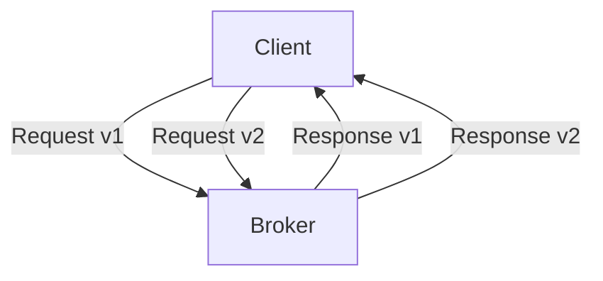

## 2.5.1 Kafka's Binary Protocol

### Introduction

Apache Kafka, a distributed event streaming platform, relies on a highly efficient binary protocol to facilitate communication between clients and brokers. This protocol is designed to handle high-throughput, low-latency data streams, making it a cornerstone of Kafka's architecture. In this section, we will delve into the design and advantages of Kafka's binary protocol, explore message framing and serialization, discuss versioning and backward compatibility, and highlight relevant protocol optimizations.

### Design and Advantages of Kafka's Binary Protocol

Kafka's binary protocol is a custom-designed protocol that operates over TCP/IP. It is optimized for performance and efficiency, enabling Kafka to handle millions of messages per second with minimal overhead. The key advantages of Kafka's binary protocol include:

- **Efficiency**: The protocol is designed to minimize the number of bytes transmitted over the network, reducing bandwidth usage and improving throughput.
- **Low Latency**: By using a binary format, Kafka can quickly serialize and deserialize messages, reducing the time taken for data to travel between clients and brokers.
- **Scalability**: The protocol supports Kafka's distributed architecture, allowing it to scale horizontally by adding more brokers and partitions.
- **Flexibility**: Kafka's protocol is versioned, allowing for backward compatibility and easy upgrades.

### Message Framing and Serialization

Message framing in Kafka's binary protocol involves structuring data into a format that can be easily transmitted over the network. Each message consists of a fixed-length header followed by a variable-length payload. The header contains metadata such as the API key, API version, correlation ID, and client ID, which are used to route and process messages.

Serialization is the process of converting data into a binary format that can be transmitted over the network. Kafka supports several serialization formats, including Avro, JSON, and Protobuf, but the binary protocol itself is agnostic to the serialization format used. This flexibility allows developers to choose the serialization format that best suits their needs.

#### Java Code Example: Message Serialization

```java
import org.apache.kafka.common.serialization.Serializer;

public class CustomSerializer implements Serializer<MyData> {
    @Override
    public byte[] serialize(String topic, MyData data) {
        // Convert MyData object to byte array
        return data.toByteArray();
    }
}
```

#### Scala Code Example: Message Serialization

```scala
import org.apache.kafka.common.serialization.Serializer

class CustomSerializer extends Serializer[MyData] {
  override def serialize(topic: String, data: MyData): Array[Byte] = {
    // Convert MyData object to byte array
    data.toByteArray
  }
}
```

#### Kotlin Code Example: Message Serialization

```kotlin
import org.apache.kafka.common.serialization.Serializer

class CustomSerializer : Serializer<MyData> {
    override fun serialize(topic: String, data: MyData): ByteArray {
        // Convert MyData object to byte array
        return data.toByteArray()
    }
}
```

#### Clojure Code Example: Message Serialization

```clojure
(ns myapp.serializer
  (:import [org.apache.kafka.common.serialization Serializer]))

(defrecord CustomSerializer []
  Serializer
  (serialize [this topic data]
    ;; Convert MyData object to byte array
    (.toByteArray data)))
```

### Versioning and Backward Compatibility

Kafka's binary protocol is versioned, which allows for backward compatibility and smooth upgrades. Each API request and response is associated with a version number, which enables clients and brokers to negotiate the protocol version to use. This versioning system ensures that new features can be added without breaking existing clients.

#### Protocol Versioning Diagram



**Caption**: This diagram illustrates how clients and brokers negotiate protocol versions for requests and responses.

### Protocol Optimizations

Kafka's binary protocol includes several optimizations to enhance performance and efficiency:

- **Batching**: Kafka supports batching of messages, which reduces the number of network round trips and improves throughput.
- **Compression**: Messages can be compressed using algorithms like GZIP, Snappy, or LZ4, reducing the amount of data transmitted over the network.
- **Zero-Copy**: Kafka leverages zero-copy technology to minimize CPU usage during data transfer, allowing data to be sent directly from disk to the network.

#### Java Code Example: Batching and Compression

```java
import org.apache.kafka.clients.producer.ProducerConfig;
import org.apache.kafka.clients.producer.KafkaProducer;
import org.apache.kafka.clients.producer.ProducerRecord;
import java.util.Properties;

Properties props = new Properties();
props.put(ProducerConfig.BOOTSTRAP_SERVERS_CONFIG, "localhost:9092");
props.put(ProducerConfig.KEY_SERIALIZER_CLASS_CONFIG, "org.apache.kafka.common.serialization.StringSerializer");
props.put(ProducerConfig.VALUE_SERIALIZER_CLASS_CONFIG, "org.apache.kafka.common.serialization.StringSerializer");
props.put(ProducerConfig.BATCH_SIZE_CONFIG, 16384);
props.put(ProducerConfig.COMPRESSION_TYPE_CONFIG, "gzip");

KafkaProducer<String, String> producer = new KafkaProducer<>(props);
ProducerRecord<String, String> record = new ProducerRecord<>("my-topic", "key", "value");
producer.send(record);
producer.close();
```

#### Scala Code Example: Batching and Compression

```scala
import org.apache.kafka.clients.producer.{KafkaProducer, ProducerConfig, ProducerRecord}
import java.util.Properties

val props = new Properties()
props.put(ProducerConfig.BOOTSTRAP_SERVERS_CONFIG, "localhost:9092")
props.put(ProducerConfig.KEY_SERIALIZER_CLASS_CONFIG, "org.apache.kafka.common.serialization.StringSerializer")
props.put(ProducerConfig.VALUE_SERIALIZER_CLASS_CONFIG, "org.apache.kafka.common.serialization.StringSerializer")
props.put(ProducerConfig.BATCH_SIZE_CONFIG, "16384")
props.put(ProducerConfig.COMPRESSION_TYPE_CONFIG, "gzip")

val producer = new KafkaProducer[String, String](props)
val record = new ProducerRecord[String, String]("my-topic", "key", "value")
producer.send(record)
producer.close()
```

#### Kotlin Code Example: Batching and Compression

```kotlin
import org.apache.kafka.clients.producer.KafkaProducer
import org.apache.kafka.clients.producer.ProducerConfig
import org.apache.kafka.clients.producer.ProducerRecord
import java.util.Properties

val props = Properties().apply {
    put(ProducerConfig.BOOTSTRAP_SERVERS_CONFIG, "localhost:9092")
    put(ProducerConfig.KEY_SERIALIZER_CLASS_CONFIG, "org.apache.kafka.common.serialization.StringSerializer")
    put(ProducerConfig.VALUE_SERIALIZER_CLASS_CONFIG, "org.apache.kafka.common.serialization.StringSerializer")
    put(ProducerConfig.BATCH_SIZE_CONFIG, 16384)
    put(ProducerConfig.COMPRESSION_TYPE_CONFIG, "gzip")
}

val producer = KafkaProducer<String, String>(props)
val record = ProducerRecord("my-topic", "key", "value")
producer.send(record)
producer.close()
```

#### Clojure Code Example: Batching and Compression

```clojure
(ns myapp.producer
  (:import [org.apache.kafka.clients.producer KafkaProducer ProducerConfig ProducerRecord]
           [java.util Properties]))

(def props
  (doto (Properties.)
    (.put ProducerConfig/BOOTSTRAP_SERVERS_CONFIG "localhost:9092")
    (.put ProducerConfig/KEY_SERIALIZER_CLASS_CONFIG "org.apache.kafka.common.serialization.StringSerializer")
    (.put ProducerConfig/VALUE_SERIALIZER_CLASS_CONFIG "org.apache.kafka.common.serialization.StringSerializer")
    (.put ProducerConfig/BATCH_SIZE_CONFIG 16384)
    (.put ProducerConfig/COMPRESSION_TYPE_CONFIG "gzip")))

(def producer (KafkaProducer. props))
(def record (ProducerRecord. "my-topic" "key" "value"))
(.send producer record)
(.close producer)
```

### Practical Applications and Real-World Scenarios

Kafka's binary protocol is used in a variety of real-world scenarios, including:

- **Event-Driven Microservices**: Kafka's efficient protocol enables microservices to communicate asynchronously, improving scalability and resilience. For more on this, see [1.4.1 Event-Driven Microservices]( "Event-Driven Microservices").
- **Real-Time Data Pipelines**: Kafka's low-latency protocol is ideal for building real-time data pipelines that process and analyze data as it arrives. Refer to [1.4.2 Real-Time Data Pipelines]( "Real-Time Data Pipelines") for more details.
- **Big Data Integration**: Kafka's protocol supports integration with big data platforms, enabling seamless data flow between systems. Explore [1.4.4 Big Data Integration]( "Big Data Integration") for further insights.

### Conclusion

Kafka's binary protocol is a critical component of its architecture, providing efficient, low-latency communication between clients and brokers. Its design, message framing, serialization, versioning, and optimizations make it well-suited for high-throughput, distributed systems. By understanding and leveraging Kafka's binary protocol, developers can build robust, scalable applications that meet the demands of modern data processing.

## Test Your Knowledge: Kafka's Binary Protocol Quiz



### What is the primary advantage of Kafka's binary protocol?

- [x] Efficiency and low latency
- [ ] High-level abstraction
- [ ] Text-based communication
- [ ] Built-in encryption

> **Explanation:** Kafka's binary protocol is designed for efficiency and low latency, enabling high-throughput communication between clients and brokers.

### How does Kafka's binary protocol handle message serialization?

- [x] It is agnostic to the serialization format used.
- [ ] It only supports JSON serialization.
- [ ] It requires custom serialization for each message.
- [ ] It uses XML serialization by default.

> **Explanation:** Kafka's binary protocol is agnostic to the serialization format, allowing developers to choose the format that best suits their needs.

### What is the purpose of versioning in Kafka's binary protocol?

- [x] To ensure backward compatibility and smooth upgrades
- [ ] To enforce strict data types
- [ ] To limit the number of clients
- [ ] To increase message size

> **Explanation:** Versioning in Kafka's binary protocol ensures backward compatibility and allows for smooth upgrades by negotiating the protocol version between clients and brokers.

### Which of the following is a protocol optimization in Kafka?

- [x] Batching and compression
- [ ] Text-based headers
- [ ] Fixed message sizes
- [ ] Manual data transfer

> **Explanation:** Kafka's protocol optimizations include batching and compression, which improve throughput and reduce network usage.

### What is the role of zero-copy technology in Kafka's protocol?

- [x] To minimize CPU usage during data transfer
- [ ] To encrypt messages
- [ ] To increase message size
- [ ] To serialize data

> **Explanation:** Zero-copy technology in Kafka minimizes CPU usage during data transfer by allowing data to be sent directly from disk to the network.

### How does Kafka's binary protocol support scalability?

- [x] By supporting Kafka's distributed architecture
- [ ] By limiting the number of brokers
- [ ] By using a single-threaded model
- [ ] By enforcing strict data types

> **Explanation:** Kafka's binary protocol supports scalability by enabling Kafka's distributed architecture, allowing it to scale horizontally with more brokers and partitions.

### What is the significance of message framing in Kafka's protocol?

- [x] It structures data for network transmission.
- [ ] It encrypts messages.
- [ ] It limits message size.
- [ ] It compresses data.

> **Explanation:** Message framing in Kafka's protocol structures data into a format that can be easily transmitted over the network, ensuring efficient communication.

### Which serialization formats are supported by Kafka's binary protocol?

- [x] Avro, JSON, Protobuf
- [ ] XML, CSV, YAML
- [ ] Only JSON
- [ ] Only Avro

> **Explanation:** Kafka's binary protocol supports various serialization formats, including Avro, JSON, and Protobuf, providing flexibility for developers.

### What is the impact of compression in Kafka's protocol?

- [x] It reduces the amount of data transmitted over the network.
- [ ] It increases message size.
- [ ] It limits the number of clients.
- [ ] It enforces strict data types.

> **Explanation:** Compression in Kafka's protocol reduces the amount of data transmitted over the network, improving efficiency and throughput.

### True or False: Kafka's binary protocol is text-based.

- [ ] True
- [x] False

> **Explanation:** False. Kafka's binary protocol is not text-based; it is a custom-designed binary protocol optimized for performance and efficiency.


