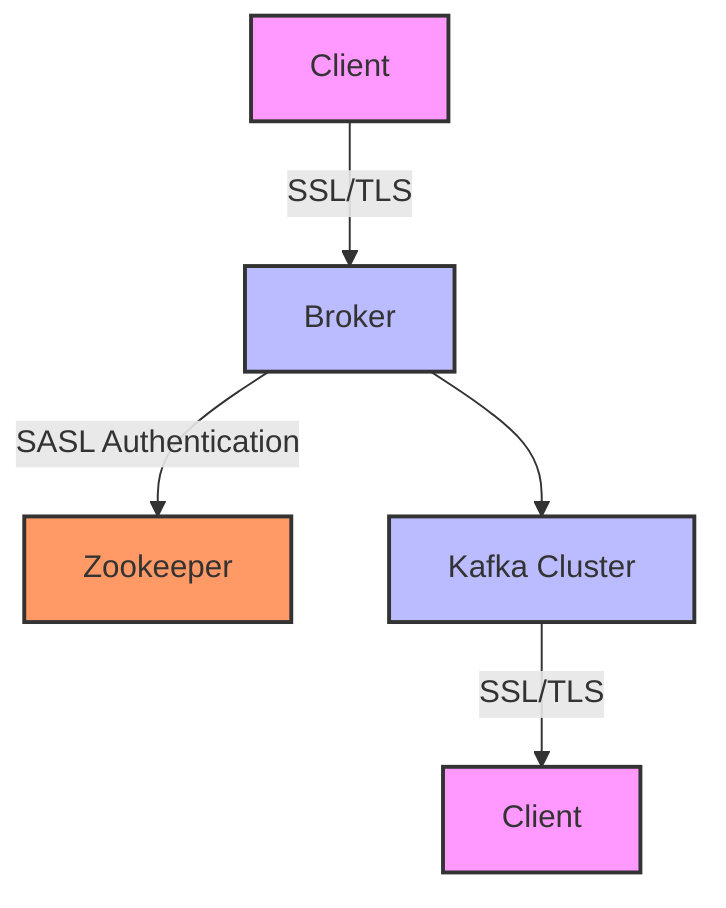

## 2.5.2 Security Protocols and Encryption

In the realm of distributed data streaming, security is paramount. Apache Kafka, a leading platform for building real-time data pipelines and streaming applications, offers robust security features to protect data in transit and ensure that only authorized clients can access the system. This section delves into the security protocols supported by Kafka, including SSL/TLS and SASL mechanisms, and provides guidance on setting up and managing these security features effectively.

### Understanding Kafka's Security Model

Kafka's security model is designed to address several key concerns:

- **Authentication**: Verifying the identity of clients (producers and consumers) and brokers.
- **Authorization**: Controlling access to Kafka resources based on authenticated identities.
- **Encryption**: Protecting data in transit from eavesdropping and tampering.
- **Integrity**: Ensuring that data is not altered during transmission.

Kafka achieves these goals through a combination of security protocols and configurations.

### Security Protocols in Kafka

Kafka supports several security protocols to authenticate clients and encrypt data in transit:

#### SSL/TLS (Secure Sockets Layer/Transport Layer Security)

SSL/TLS is a widely used protocol for securing data transmission over networks. In Kafka, SSL/TLS can be used to encrypt data between clients and brokers, ensuring that sensitive information is not exposed to unauthorized parties.

- **SSL/TLS Features**:
  - **Encryption**: Encrypts data to protect it from eavesdropping.
  - **Authentication**: Verifies the identity of clients and brokers using certificates.
  - **Integrity**: Ensures that data is not altered during transmission.

#### SASL (Simple Authentication and Security Layer)

SASL is a framework for adding authentication support to connection-based protocols. Kafka supports several SASL mechanisms:

- **SCRAM (Salted Challenge Response Authentication Mechanism)**: A modern, password-based authentication mechanism that provides strong security.
- **GSSAPI (Generic Security Services Application Program Interface)**: Often used with Kerberos, providing a robust authentication mechanism for enterprise environments.
- **PLAIN**: A simple username/password authentication mechanism, typically used in conjunction with SSL/TLS for encryption.

### Setting Up SSL/TLS Encryption

To secure Kafka communications using SSL/TLS, follow these steps:

#### Step 1: Generate SSL Certificates

1. **Create a Certificate Authority (CA)**:
   - Use a tool like OpenSSL to generate a CA certificate, which will sign the server and client certificates.

2. **Generate Server and Client Certificates**:
   - Create a key pair and certificate signing request (CSR) for each broker and client.
   - Sign the CSRs with the CA certificate to generate the server and client certificates.

#### Step 2: Configure Kafka Brokers

1. **Update Broker Configuration**:
   - Edit the `server.properties` file to enable SSL:
     ```properties
     listeners=SSL://:9093
     ssl.keystore.location=/path/to/kafka.server.keystore.jks
     ssl.keystore.password=your_keystore_password
     ssl.key.password=your_key_password
     ssl.truststore.location=/path/to/kafka.server.truststore.jks
     ssl.truststore.password=your_truststore_password
     ```

2. **Restart the Brokers**:
   - Restart each broker to apply the new configuration.

#### Step 3: Configure Kafka Clients

1. **Update Client Configuration**:
   - Configure the client to use SSL by setting the appropriate properties:
     ```java
     Properties props = new Properties();
     props.put("bootstrap.servers", "broker1:9093,broker2:9093");
     props.put("security.protocol", "SSL");
     props.put("ssl.truststore.location", "/path/to/client.truststore.jks");
     props.put("ssl.truststore.password", "your_truststore_password");
     props.put("ssl.keystore.location", "/path/to/client.keystore.jks");
     props.put("ssl.keystore.password", "your_keystore_password");
     props.put("ssl.key.password", "your_key_password");
     ```

2. **Test the Configuration**:
   - Verify that the client can connect to the broker using SSL.

### Best Practices for Securing Kafka

- **Use Strong Passwords and Encryption Algorithms**: Ensure that all passwords and encryption algorithms used in SSL/TLS and SASL configurations are strong and up-to-date.
- **Regularly Rotate Certificates and Keys**: Implement a process for regularly rotating SSL/TLS certificates and keys to minimize the risk of compromise.
- **Limit Access to Sensitive Files**: Restrict access to keystore and truststore files to only those users and processes that require it.
- **Monitor and Audit Security Logs**: Regularly review security logs to detect and respond to unauthorized access attempts.

### Common Security Pitfalls and How to Avoid Them

- **Misconfigured Certificates**: Ensure that all certificates are correctly configured and valid. Use tools like OpenSSL to verify certificate chains.
- **Weak Encryption Algorithms**: Avoid using outdated or weak encryption algorithms. Regularly review and update your security configurations.
- **Inadequate Access Controls**: Implement strict access controls to prevent unauthorized access to Kafka resources.

### Code Examples

To illustrate the implementation of security protocols in Kafka, consider the following code examples in different languages:

#### Java Example

```java
import org.apache.kafka.clients.producer.KafkaProducer;
import org.apache.kafka.clients.producer.ProducerConfig;
import org.apache.kafka.clients.producer.ProducerRecord;

import java.util.Properties;

public class SecureKafkaProducer {
    public static void main(String[] args) {
        Properties props = new Properties();
        props.put(ProducerConfig.BOOTSTRAP_SERVERS_CONFIG, "broker1:9093,broker2:9093");
        props.put("security.protocol", "SSL");
        props.put("ssl.truststore.location", "/path/to/client.truststore.jks");
        props.put("ssl.truststore.password", "your_truststore_password");
        props.put("ssl.keystore.location", "/path/to/client.keystore.jks");
        props.put("ssl.keystore.password", "your_keystore_password");
        props.put("ssl.key.password", "your_key_password");

        KafkaProducer<String, String> producer = new KafkaProducer<>(props);
        ProducerRecord<String, String> record = new ProducerRecord<>("secure-topic", "key", "value");
        producer.send(record);
        producer.close();
    }
}
```

#### Scala Example

```scala
import org.apache.kafka.clients.producer.{KafkaProducer, ProducerConfig, ProducerRecord}

import java.util.Properties

object SecureKafkaProducer extends App {
  val props = new Properties()
  props.put(ProducerConfig.BOOTSTRAP_SERVERS_CONFIG, "broker1:9093,broker2:9093")
  props.put("security.protocol", "SSL")
  props.put("ssl.truststore.location", "/path/to/client.truststore.jks")
  props.put("ssl.truststore.password", "your_truststore_password")
  props.put("ssl.keystore.location", "/path/to/client.keystore.jks")
  props.put("ssl.keystore.password", "your_keystore_password")
  props.put("ssl.key.password", "your_key_password")

  val producer = new KafkaProducer[String, String](props)
  val record = new ProducerRecord[String, String]("secure-topic", "key", "value")
  producer.send(record)
  producer.close()
}
```

#### Kotlin Example

```kotlin
import org.apache.kafka.clients.producer.KafkaProducer
import org.apache.kafka.clients.producer.ProducerConfig
import org.apache.kafka.clients.producer.ProducerRecord
import java.util.Properties

fun main() {
    val props = Properties().apply {
        put(ProducerConfig.BOOTSTRAP_SERVERS_CONFIG, "broker1:9093,broker2:9093")
        put("security.protocol", "SSL")
        put("ssl.truststore.location", "/path/to/client.truststore.jks")
        put("ssl.truststore.password", "your_truststore_password")
        put("ssl.keystore.location", "/path/to/client.keystore.jks")
        put("ssl.keystore.password", "your_keystore_password")
        put("ssl.key.password", "your_key_password")
    }

    val producer = KafkaProducer<String, String>(props)
    val record = ProducerRecord("secure-topic", "key", "value")
    producer.send(record)
    producer.close()
}
```

#### Clojure Example

```clojure
(require '[clojure.java.io :as io])
(import '[org.apache.kafka.clients.producer KafkaProducer ProducerConfig ProducerRecord])

(defn create-producer []
  (let [props (doto (java.util.Properties.)
                (.put ProducerConfig/BOOTSTRAP_SERVERS_CONFIG "broker1:9093,broker2:9093")
                (.put "security.protocol" "SSL")
                (.put "ssl.truststore.location" "/path/to/client.truststore.jks")
                (.put "ssl.truststore.password" "your_truststore_password")
                (.put "ssl.keystore.location" "/path/to/client.keystore.jks")
                (.put "ssl.keystore.password" "your_keystore_password")
                (.put "ssl.key.password" "your_key_password"))]
    (KafkaProducer. props)))

(defn send-message [producer]
  (let [record (ProducerRecord. "secure-topic" "key" "value")]
    (.send producer record)))

(defn -main []
  (let [producer (create-producer)]
    (send-message producer)
    (.close producer)))
```

### Visualizing Kafka Security Architecture

To better understand how security protocols fit into Kafka's architecture, consider the following diagram:



**Caption**: This diagram illustrates the flow of secure communication between clients and brokers in a Kafka cluster, highlighting the use of SSL/TLS for encryption and SASL for authentication.

### Conclusion

Securing Apache Kafka involves a combination of encryption, authentication, and authorization mechanisms. By implementing SSL/TLS and SASL, you can protect your data streams from unauthorized access and ensure the integrity and confidentiality of your data. Following best practices and avoiding common pitfalls will help maintain a secure Kafka environment.

## Test Your Knowledge: Kafka Security Protocols and Encryption Quiz



### Which protocol is primarily used for encrypting data in transit in Kafka?

- [x] SSL/TLS
- [ ] SASL
- [ ] HTTP
- [ ] FTP

> **Explanation:** SSL/TLS is used to encrypt data in transit, ensuring confidentiality and integrity.

### What is the role of SASL in Kafka security?

- [x] Authentication
- [ ] Encryption
- [ ] Data Compression
- [ ] Load Balancing

> **Explanation:** SASL is used for authentication, verifying the identity of clients and brokers.

### Which SASL mechanism is commonly used with Kerberos?

- [x] GSSAPI
- [ ] SCRAM
- [ ] PLAIN
- [ ] OAUTHBEARER

> **Explanation:** GSSAPI is often used with Kerberos for secure authentication in enterprise environments.

### What is a key benefit of using SSL/TLS in Kafka?

- [x] Data encryption
- [ ] Faster data processing
- [ ] Reduced latency
- [ ] Increased storage capacity

> **Explanation:** SSL/TLS encrypts data in transit, protecting it from eavesdropping and tampering.

### Which of the following is a best practice for securing Kafka?

- [x] Regularly rotate certificates and keys
- [ ] Use weak passwords for convenience
- [x] Monitor and audit security logs
- [ ] Disable encryption for performance

> **Explanation:** Regularly rotating certificates and monitoring logs are essential practices for maintaining security.

### What is the purpose of a truststore in SSL/TLS configuration?

- [x] To store trusted CA certificates
- [ ] To store private keys
- [ ] To store client credentials
- [ ] To store configuration files

> **Explanation:** A truststore contains trusted CA certificates used to verify the identity of peers.

### How can you verify that SSL/TLS is correctly configured in Kafka?

- [x] Test client-broker connections
- [ ] Check file permissions
- [x] Use OpenSSL to verify certificates
- [ ] Disable encryption temporarily

> **Explanation:** Testing connections and using OpenSSL to verify certificates are effective ways to ensure correct configuration.

### What is a common pitfall when configuring SSL/TLS in Kafka?

- [x] Misconfigured certificates
- [ ] Using strong encryption algorithms
- [ ] Regularly updating software
- [ ] Implementing access controls

> **Explanation:** Misconfigured certificates can lead to failed connections and security vulnerabilities.

### Which component is responsible for verifying client identities in Kafka?

- [x] Broker
- [ ] Zookeeper
- [ ] Producer
- [ ] Consumer

> **Explanation:** The broker is responsible for verifying client identities during authentication.

### True or False: SASL can be used for both authentication and encryption in Kafka.

- [x] True
- [ ] False

> **Explanation:** While SASL is primarily used for authentication, it can be combined with SSL/TLS for encryption.


