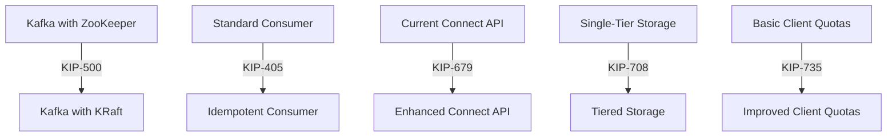

## 20.1.1 Notable KIPs in Progress

Apache Kafka, a cornerstone of modern data architectures, continuously evolves through Kafka Improvement Proposals (KIPs). These proposals are instrumental in shaping Kafka's future, addressing current limitations, and introducing new capabilities. In this section, we delve into some of the most notable KIPs currently in progress, examining their objectives, features, and potential impact on the Kafka ecosystem.

### Understanding Kafka Improvement Proposals (KIPs)

KIPs are formal documents that propose enhancements or changes to the Apache Kafka project. They provide a structured approach to introducing new features, ensuring that changes are well-documented and thoroughly reviewed by the community. Each KIP outlines the motivation, design, and implementation details of the proposed change, allowing contributors to discuss and refine the proposal before it is accepted and integrated into Kafka.

### Notable KIPs in Progress

#### KIP-500: Replace ZooKeeper with KRaft

**Purpose and Features**:  
KIP-500 aims to remove the dependency on Apache ZooKeeper for managing Kafka's metadata, replacing it with a new internal consensus protocol known as KRaft (Kafka Raft). This change is expected to simplify Kafka's architecture, improve scalability, and enhance operational simplicity.

- **Motivation**: ZooKeeper has been a critical component of Kafka's architecture, responsible for managing metadata and ensuring consistency across the cluster. However, it introduces additional complexity and operational overhead. By integrating metadata management directly into Kafka, KRaft aims to streamline operations and reduce the need for external dependencies.
- **Main Features**:
  - **Integrated Metadata Management**: KRaft handles metadata natively within Kafka, eliminating the need for an external ZooKeeper cluster.
  - **Improved Scalability**: The new architecture is designed to scale more efficiently, supporting larger clusters with reduced latency.
  - **Simplified Operations**: By removing ZooKeeper, Kafka's deployment and management become more straightforward, reducing the operational burden on administrators.

**Status and Expected Availability**:  
KIP-500 is in advanced stages of development, with several features already available in preview releases. Full integration into the main Kafka branch is expected in upcoming major releases.

**Considerations for Adoption and Compatibility**:  
Adopting KRaft will require careful planning, particularly for existing Kafka deployments that rely on ZooKeeper. Migration tools and strategies are being developed to facilitate a smooth transition. Compatibility with existing Kafka clients and applications is a key focus, ensuring minimal disruption during the migration process.

#### KIP-405: Idempotent Consumer

**Purpose and Features**:  
KIP-405 introduces the concept of an idempotent consumer, enhancing Kafka's ability to guarantee exactly-once semantics across the entire data processing pipeline.

- **Motivation**: While Kafka already supports idempotent producers and transactional messaging, ensuring exactly-once delivery at the consumer level remains a challenge. This KIP aims to close that gap, providing stronger guarantees for data consistency and reliability.
- **Main Features**:
  - **Idempotency at the Consumer Level**: Consumers can process messages exactly once, even in the face of retries or failures.
  - **Enhanced Data Consistency**: By ensuring that each message is processed only once, data integrity is maintained across distributed systems.
  - **Simplified Application Logic**: Developers can focus on business logic without worrying about duplicate message handling.

**Status and Expected Availability**:  
KIP-405 is currently under active development, with prototypes being tested in various environments. It is expected to be included in a future Kafka release, following thorough testing and community feedback.

**Considerations for Adoption and Compatibility**:  
Implementing idempotent consumers will require updates to existing consumer applications. Developers should evaluate their current message processing logic and prepare for potential changes to accommodate the new idempotency features.

#### KIP-679: Connect API Improvements

**Purpose and Features**:  
KIP-679 proposes enhancements to the Kafka Connect API, focusing on improving usability, performance, and extensibility.

- **Motivation**: Kafka Connect is a powerful tool for integrating Kafka with external systems, but its API can be complex and challenging to extend. This KIP aims to simplify the API, making it more intuitive and easier to customize.
- **Main Features**:
  - **Simplified Configuration**: New configuration options and defaults reduce the complexity of setting up connectors.
  - **Performance Enhancements**: Optimizations to the API improve throughput and reduce latency in data transfers.
  - **Extensibility Improvements**: A more modular design allows developers to create custom connectors and transformations with less effort.

**Status and Expected Availability**:  
KIP-679 is in the proposal stage, with initial designs and prototypes being reviewed by the community. It is anticipated to be part of a future Kafka release, pending approval and further development.

**Considerations for Adoption and Compatibility**:  
Existing connectors may need to be updated to take advantage of the new API features. Developers should review the proposed changes and assess their impact on current integrations.

#### KIP-708: Tiered Storage

**Purpose and Features**:  
KIP-708 introduces tiered storage capabilities to Kafka, enabling more efficient management of large data volumes.

- **Motivation**: As Kafka deployments grow, managing storage costs and performance becomes increasingly challenging. Tiered storage allows Kafka to offload older data to cheaper storage tiers, reducing costs while maintaining access to historical data.
- **Main Features**:
  - **Multi-Tier Storage Architecture**: Data can be stored across different storage tiers, such as SSDs for hot data and cloud storage for cold data.
  - **Cost-Effective Data Management**: By leveraging cheaper storage options for older data, organizations can reduce their overall storage expenses.
  - **Seamless Data Access**: Applications can access data across all storage tiers without changes to their logic.

**Status and Expected Availability**:  
KIP-708 is in active development, with several components already implemented in experimental branches. Full support for tiered storage is expected in an upcoming Kafka release.

**Considerations for Adoption and Compatibility**:  
Organizations should evaluate their storage strategies and consider how tiered storage can optimize their data management. Compatibility with existing storage solutions and infrastructure will be a key factor in adoption.

#### KIP-735: Improved Client Quotas

**Purpose and Features**:  
KIP-735 aims to enhance Kafka's client quota management, providing more granular control over resource allocation.

- **Motivation**: As Kafka usage grows, managing client resource consumption becomes critical to maintaining system performance and stability. This KIP introduces more flexible quota configurations, allowing administrators to better control client access to Kafka resources.
- **Main Features**:
  - **Granular Quota Controls**: Administrators can define quotas at a more detailed level, such as per-topic or per-consumer group.
  - **Dynamic Quota Adjustments**: Quotas can be adjusted in real-time based on system load and usage patterns.
  - **Enhanced Monitoring and Reporting**: Improved metrics and reporting tools provide better visibility into client resource consumption.

**Status and Expected Availability**:  
KIP-735 is currently being developed, with initial implementations available for testing. It is expected to be included in a future Kafka release, following community review and feedback.

**Considerations for Adoption and Compatibility**:  
Organizations should assess their current quota management practices and prepare for potential changes to leverage the new features. Compatibility with existing monitoring and management tools will be important for a smooth transition.

### Visualizing KIP Progress

To better understand the impact of these KIPs, consider the following diagram illustrating the proposed changes to Kafka's architecture and functionality:

**Diagram Description**: This diagram illustrates the transition from current Kafka features to the enhanced capabilities proposed by the notable KIPs in progress. Each arrow represents the evolution of a specific aspect of Kafka's architecture or functionality.

### Conclusion

The ongoing development of these KIPs highlights the dynamic nature of the Apache Kafka project and its commitment to addressing the needs of modern data architectures. By understanding and preparing for these changes, organizations can leverage the latest Kafka features to build more robust, scalable, and efficient data processing systems.

## Test Your Knowledge: Kafka Improvement Proposals (KIPs) Quiz



### What is the primary goal of KIP-500?

- [x] To replace ZooKeeper with KRaft for metadata management.
- [ ] To introduce tiered storage capabilities.
- [ ] To enhance client quota management.
- [ ] To improve the Kafka Connect API.

> **Explanation:** KIP-500 aims to replace ZooKeeper with KRaft, simplifying Kafka's architecture and improving scalability.

### Which KIP focuses on introducing idempotent consumers?

- [ ] KIP-500
- [x] KIP-405
- [ ] KIP-679
- [ ] KIP-708

> **Explanation:** KIP-405 introduces the concept of idempotent consumers to enhance exactly-once semantics in Kafka.

### What is the expected benefit of KIP-708?

- [ ] Improved client quota management.
- [x] Cost-effective data management through tiered storage.
- [ ] Enhanced Connect API usability.
- [ ] Simplified metadata management.

> **Explanation:** KIP-708 introduces tiered storage, allowing Kafka to manage large data volumes more cost-effectively.

### How does KIP-679 aim to improve Kafka Connect?

- [ ] By introducing idempotent consumers.
- [ ] By replacing ZooKeeper with KRaft.
- [x] By simplifying the API and enhancing performance.
- [ ] By introducing tiered storage.

> **Explanation:** KIP-679 focuses on improving the Kafka Connect API by simplifying configuration and enhancing performance.

### Which KIP is associated with improved client quota management?

- [ ] KIP-500
- [ ] KIP-405
- [ ] KIP-679
- [x] KIP-735

> **Explanation:** KIP-735 aims to enhance Kafka's client quota management with more granular controls.

### What is a key feature of KIP-500?

- [ ] Idempotent consumers.
- [x] Integrated metadata management with KRaft.
- [ ] Tiered storage architecture.
- [ ] Enhanced Connect API.

> **Explanation:** KIP-500 introduces KRaft for integrated metadata management, replacing ZooKeeper.

### What does KIP-405 aim to achieve?

- [ ] Simplified Connect API.
- [x] Idempotency at the consumer level.
- [ ] Tiered storage capabilities.
- [ ] Improved client quotas.

> **Explanation:** KIP-405 aims to provide idempotency at the consumer level, ensuring exactly-once message processing.

### Which KIP is expected to reduce storage costs?

- [ ] KIP-500
- [ ] KIP-405
- [x] KIP-708
- [ ] KIP-735

> **Explanation:** KIP-708 introduces tiered storage, which can reduce storage costs by using cheaper storage options for older data.

### What is a benefit of KIP-679?

- [ ] Improved client quota management.
- [x] Simplified configuration and enhanced performance for Kafka Connect.
- [ ] Integrated metadata management.
- [ ] Idempotent consumers.

> **Explanation:** KIP-679 aims to simplify the Kafka Connect API and improve its performance.

### True or False: KIP-735 introduces tiered storage capabilities.

- [ ] True
- [x] False

> **Explanation:** KIP-735 focuses on improving client quota management, not tiered storage.


