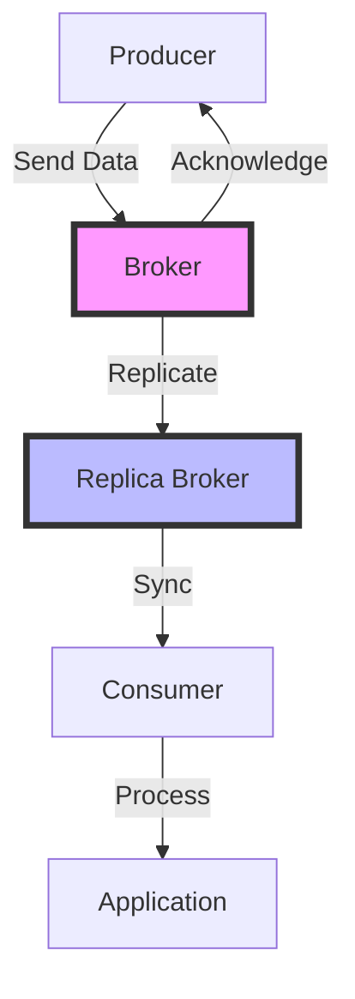
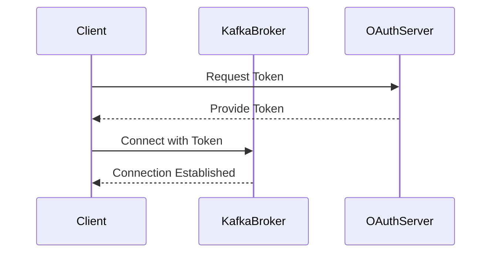

## 20.1.3 Recent Kafka Releases and Features

Apache Kafka has been at the forefront of real-time data streaming and event-driven architectures, continuously evolving to meet the demands of modern data systems. The recent Kafka 3.x releases have introduced a plethora of features and enhancements that significantly improve performance, security, and usability. This section delves into these advancements, providing expert insights into how they can be leveraged to optimize Kafka deployments.

### Overview of Kafka 3.x Releases

The Kafka 3.x series marks a significant milestone in Kafka's evolution, introducing features that enhance its robustness and flexibility. Key areas of focus include performance optimization, security enhancements, and usability improvements. These updates are designed to support the growing complexity and scale of enterprise data architectures.

#### Performance Improvements

Performance is a critical aspect of any data streaming platform, and Kafka 3.x has introduced several enhancements to boost throughput and reduce latency.

- **Improved Broker Performance**: Kafka 3.x has optimized the broker's internal mechanisms, resulting in faster data processing and reduced resource consumption. This is achieved through enhancements in the replication protocol and more efficient handling of partition leadership changes.

- **Enhanced Producer and Consumer APIs**: The producer and consumer APIs have been refined to offer better performance under high load conditions. This includes improvements in batching and compression algorithms, which reduce the overhead of data transmission.

- **Zero-Copy Data Transfer**: Kafka 3.x leverages zero-copy technology to minimize CPU usage during data transfer, significantly improving throughput. This is particularly beneficial in scenarios involving large data volumes.

- **Optimized Log Compaction**: Log compaction has been fine-tuned to operate more efficiently, reducing the time and resources required for maintaining compacted topics.

#### Security Enhancements

Security remains a top priority for Kafka, and the 3.x releases have introduced several features to bolster data protection and access control.

- **Enhanced Authentication Mechanisms**: Kafka 3.x supports advanced authentication protocols, including OAuth 2.0, providing more secure and flexible authentication options for clients and brokers.

- **Improved Access Control**: The introduction of fine-grained access control mechanisms allows for more precise management of permissions, ensuring that only authorized users can access sensitive data.

- **Data Encryption Improvements**: Kafka 3.x offers enhanced encryption capabilities, both for data at rest and in transit, ensuring compliance with stringent data protection regulations.

#### Usability Improvements

Usability is crucial for ensuring that Kafka remains accessible and manageable, even as deployments scale.

- **Simplified Configuration Management**: Kafka 3.x introduces a more intuitive configuration management system, making it easier to deploy and manage Kafka clusters. This includes better defaults and more descriptive configuration options.

- **Enhanced Monitoring and Metrics**: The monitoring capabilities of Kafka have been expanded, providing more detailed metrics and insights into cluster performance. This includes integration with popular monitoring tools like Prometheus and Grafana.

- **Improved Client Libraries**: The client libraries for Kafka have been updated to provide a more seamless integration experience across different programming languages, including Java, Scala, Kotlin, and Clojure.

### Detailed Feature Analysis

#### Performance Enhancements in Kafka 3.x

Performance improvements in Kafka 3.x are designed to address the challenges of scaling Kafka deployments to handle ever-increasing data volumes. Let's explore these enhancements in more detail.

##### Broker Performance Optimization

Kafka brokers are the backbone of any Kafka deployment, responsible for managing data storage and replication. Kafka 3.x introduces several optimizations to enhance broker performance:

- **Replication Protocol Enhancements**: The replication protocol has been optimized to reduce the latency of leader elections and improve the efficiency of data replication. This results in faster failover and more reliable data delivery.

- **Partition Leadership Improvements**: Kafka 3.x includes improvements in partition leadership management, reducing the overhead associated with leader changes and ensuring more stable cluster operations.

##### Producer and Consumer API Enhancements

The producer and consumer APIs are critical for interacting with Kafka, and Kafka 3.x introduces several enhancements to improve their performance:

- **Batching and Compression**: Kafka 3.x refines the batching and compression algorithms used by producers and consumers, reducing the overhead of data transmission and improving throughput.

- **Asynchronous Processing**: The APIs now support more efficient asynchronous processing, allowing for higher concurrency and better resource utilization.

##### Zero-Copy Data Transfer

Zero-copy data transfer is a technique that allows data to be transferred between the network and disk without being copied in memory. Kafka 3.x leverages this technology to improve throughput and reduce CPU usage:

- **Implementation Details**: Zero-copy data transfer is implemented using the `sendfile` system call, which allows data to be sent directly from the file system to the network socket.

- **Benefits**: This approach significantly reduces the CPU overhead associated with data transfer, allowing Kafka to handle larger data volumes more efficiently.

##### Log Compaction Optimization

Log compaction is a critical feature for maintaining the integrity and efficiency of Kafka topics. Kafka 3.x introduces several optimizations to improve the performance of log compaction:

- **Compaction Algorithm Improvements**: The compaction algorithm has been refined to operate more efficiently, reducing the time and resources required for maintaining compacted topics.

- **Resource Management**: Kafka 3.x includes better resource management for log compaction, ensuring that compaction operations do not interfere with normal data processing.

#### Security Enhancements in Kafka 3.x

Security is a top priority for Kafka, and the 3.x releases introduce several features to enhance data protection and access control.

##### Advanced Authentication Mechanisms

Kafka 3.x supports advanced authentication protocols, providing more secure and flexible authentication options for clients and brokers:

- **OAuth 2.0 Support**: Kafka 3.x introduces support for OAuth 2.0, allowing for more secure and flexible authentication mechanisms. This is particularly beneficial for integrating Kafka with modern identity management systems.

- **Improved SASL Mechanisms**: The SASL (Simple Authentication and Security Layer) mechanisms have been enhanced to provide better security and flexibility.

##### Fine-Grained Access Control

Access control is critical for ensuring that only authorized users can access sensitive data. Kafka 3.x introduces fine-grained access control mechanisms:

- **Role-Based Access Control (RBAC)**: Kafka 3.x supports role-based access control, allowing administrators to define roles with specific permissions and assign them to users.

- **Access Control Lists (ACLs)**: The ACL system has been enhanced to provide more precise control over who can access specific resources.

##### Data Encryption Enhancements

Data encryption is essential for protecting sensitive information. Kafka 3.x introduces several enhancements to its encryption capabilities:

- **Encryption at Rest**: Kafka 3.x supports encryption of data at rest, ensuring that data stored on disk is protected from unauthorized access.

- **Encryption in Transit**: The encryption of data in transit has been improved, providing better protection against eavesdropping and man-in-the-middle attacks.

#### Usability Improvements in Kafka 3.x

Usability is crucial for ensuring that Kafka remains accessible and manageable, even as deployments scale. Kafka 3.x introduces several features to enhance usability:

##### Simplified Configuration Management

Configuration management is a critical aspect of deploying and managing Kafka clusters. Kafka 3.x introduces a more intuitive configuration management system:

- **Better Defaults**: Kafka 3.x includes better default configuration options, making it easier to deploy and manage Kafka clusters.

- **Descriptive Configuration Options**: The configuration options have been made more descriptive, providing better guidance for administrators.

##### Enhanced Monitoring and Metrics

Monitoring is essential for ensuring the health and performance of Kafka clusters. Kafka 3.x expands its monitoring capabilities:

- **Detailed Metrics**: Kafka 3.x provides more detailed metrics and insights into cluster performance, allowing administrators to identify and address issues more effectively.

- **Integration with Monitoring Tools**: Kafka 3.x integrates with popular monitoring tools like Prometheus and Grafana, providing a more seamless monitoring experience.

##### Improved Client Libraries

Client libraries are critical for integrating Kafka with applications, and Kafka 3.x introduces several improvements to enhance their usability:

- **Seamless Integration**: The client libraries have been updated to provide a more seamless integration experience across different programming languages, including Java, Scala, Kotlin, and Clojure.

- **Enhanced Documentation**: The documentation for the client libraries has been improved, providing better guidance for developers.

### Code Examples

To illustrate the new features and enhancements in Kafka 3.x, let's explore some code examples in Java, Scala, Kotlin, and Clojure.

#### Java Example: Using OAuth 2.0 for Authentication

```java
import org.apache.kafka.clients.producer.KafkaProducer;
import org.apache.kafka.clients.producer.ProducerConfig;
import org.apache.kafka.clients.producer.ProducerRecord;
import org.apache.kafka.common.config.SaslConfigs;

import java.util.Properties;

public class OAuthProducer {
    public static void main(String[] args) {
        Properties props = new Properties();
        props.put(ProducerConfig.BOOTSTRAP_SERVERS_CONFIG, "localhost:9092");
        props.put(ProducerConfig.KEY_SERIALIZER_CLASS_CONFIG, "org.apache.kafka.common.serialization.StringSerializer");
        props.put(ProducerConfig.VALUE_SERIALIZER_CLASS_CONFIG, "org.apache.kafka.common.serialization.StringSerializer");
        props.put(SaslConfigs.SASL_MECHANISM, "OAUTHBEARER");
        props.put(SaslConfigs.SASL_JAAS_CONFIG, "org.apache.kafka.common.security.oauthbearer.OAuthBearerLoginModule required;");

        KafkaProducer<String, String> producer = new KafkaProducer<>(props);
        producer.send(new ProducerRecord<>("my-topic", "key", "value"));
        producer.close();
    }
}
```

#### Scala Example: Improved Log Compaction

```scala
import org.apache.kafka.clients.producer.{KafkaProducer, ProducerConfig, ProducerRecord}
import java.util.Properties

object LogCompactionProducer extends App {
  val props = new Properties()
  props.put(ProducerConfig.BOOTSTRAP_SERVERS_CONFIG, "localhost:9092")
  props.put(ProducerConfig.KEY_SERIALIZER_CLASS_CONFIG, "org.apache.kafka.common.serialization.StringSerializer")
  props.put(ProducerConfig.VALUE_SERIALIZER_CLASS_CONFIG, "org.apache.kafka.common.serialization.StringSerializer")
  props.put(ProducerConfig.ENABLE_IDEMPOTENCE_CONFIG, "true")

  val producer = new KafkaProducer[String, String](props)
  producer.send(new ProducerRecord[String, String]("compacted-topic", "key", "value"))
  producer.close()
}
```

#### Kotlin Example: Zero-Copy Data Transfer

```kotlin
import org.apache.kafka.clients.producer.KafkaProducer
import org.apache.kafka.clients.producer.ProducerConfig
import org.apache.kafka.clients.producer.ProducerRecord
import java.util.Properties

fun main() {
    val props = Properties().apply {
        put(ProducerConfig.BOOTSTRAP_SERVERS_CONFIG, "localhost:9092")
        put(ProducerConfig.KEY_SERIALIZER_CLASS_CONFIG, "org.apache.kafka.common.serialization.StringSerializer")
        put(ProducerConfig.VALUE_SERIALIZER_CLASS_CONFIG, "org.apache.kafka.common.serialization.StringSerializer")
        put(ProducerConfig.LINGER_MS_CONFIG, "5")
    }

    KafkaProducer<String, String>(props).use { producer ->
        producer.send(ProducerRecord("zero-copy-topic", "key", "value"))
    }
}
```

#### Clojure Example: Enhanced Monitoring

```clojure
(ns kafka.monitoring
  (:import [org.apache.kafka.clients.producer KafkaProducer ProducerConfig ProducerRecord]
           [java.util Properties]))

(defn create-producer []
  (let [props (doto (Properties.)
                (.put ProducerConfig/BOOTSTRAP_SERVERS_CONFIG "localhost:9092")
                (.put ProducerConfig/KEY_SERIALIZER_CLASS_CONFIG "org.apache.kafka.common.serialization.StringSerializer")
                (.put ProducerConfig/VALUE_SERIALIZER_CLASS_CONFIG "org.apache.kafka.common.serialization.StringSerializer"))]
    (KafkaProducer. props)))

(defn send-message [producer topic key value]
  (.send producer (ProducerRecord. topic key value)))

(defn -main []
  (let [producer (create-producer)]
    (send-message producer "monitoring-topic" "key" "value")
    (.close producer)))
```

### Visualizing Kafka 3.x Enhancements

To better understand the enhancements in Kafka 3.x, let's visualize some of the key concepts using diagrams.

#### Kafka 3.x Architecture Enhancements



**Caption**: The diagram illustrates the enhanced data flow in Kafka 3.x, highlighting the improved replication and acknowledgment processes.

#### OAuth 2.0 Authentication Flow



**Caption**: This sequence diagram depicts the OAuth 2.0 authentication flow in Kafka 3.x, showcasing the interaction between the client, Kafka broker, and OAuth server.

### Practical Applications and Real-World Scenarios

The enhancements in Kafka 3.x open up new possibilities for building robust and scalable data streaming solutions. Here are some practical applications and real-world scenarios where these features can be leveraged:

- **High-Throughput Data Pipelines**: The performance improvements in Kafka 3.x make it ideal for building high-throughput data pipelines that can handle large volumes of data with minimal latency.

- **Secure Data Streaming**: The enhanced security features ensure that sensitive data can be streamed securely, meeting compliance requirements and protecting against unauthorized access.

- **Scalable Microservices Architectures**: Kafka 3.x's usability improvements make it easier to integrate Kafka into microservices architectures, enabling scalable and resilient event-driven systems.

- **Real-Time Analytics**: The improved monitoring and metrics capabilities allow for more effective real-time analytics, providing valuable insights into data streams and system performance.

### References and Further Reading

For more detailed information on the features and enhancements introduced in Kafka 3.x, refer to the official release notes:

- [Kafka Release Notes](https://kafka.apache.org/downloads#release-notes)

### Knowledge Check

To reinforce your understanding of the recent Kafka releases and features, test your knowledge with the following quiz.

## Test Your Knowledge: Recent Kafka Releases and Features Quiz



### What is a key performance improvement in Kafka 3.x?

- [x] Zero-copy data transfer
- [ ] Increased partition size
- [ ] Reduced broker count
- [ ] Simplified consumer API

> **Explanation:** Zero-copy data transfer is a key performance improvement in Kafka 3.x, reducing CPU usage and improving throughput.

### Which authentication protocol is newly supported in Kafka 3.x?

- [x] OAuth 2.0
- [ ] Kerberos
- [ ] LDAP
- [ ] Basic Auth

> **Explanation:** Kafka 3.x introduces support for OAuth 2.0, providing more secure and flexible authentication options.

### What is the benefit of fine-grained access control in Kafka 3.x?

- [x] More precise management of permissions
- [ ] Faster data replication
- [ ] Simplified configuration
- [ ] Reduced storage requirements

> **Explanation:** Fine-grained access control allows for more precise management of permissions, ensuring that only authorized users can access sensitive data.

### How does Kafka 3.x improve log compaction?

- [x] By optimizing the compaction algorithm
- [ ] By increasing the compaction interval
- [ ] By reducing the number of partitions
- [ ] By simplifying the configuration

> **Explanation:** Kafka 3.x improves log compaction by optimizing the compaction algorithm, reducing the time and resources required for maintaining compacted topics.

### What is a usability improvement in Kafka 3.x?

- [x] Simplified configuration management
- [ ] Increased partition size
- [ ] Reduced broker count
- [ ] Enhanced consumer API

> **Explanation:** Kafka 3.x introduces simplified configuration management, making it easier to deploy and manage Kafka clusters.

### Which feature enhances Kafka's security in 3.x?

- [x] Data encryption at rest
- [ ] Increased partition size
- [ ] Reduced broker count
- [ ] Simplified consumer API

> **Explanation:** Kafka 3.x enhances security by supporting data encryption at rest, protecting stored data from unauthorized access.

### What is a key benefit of zero-copy data transfer in Kafka 3.x?

- [x] Reduced CPU usage
- [ ] Increased partition size
- [ ] Reduced broker count
- [ ] Simplified consumer API

> **Explanation:** Zero-copy data transfer reduces CPU usage, allowing Kafka to handle larger data volumes more efficiently.

### How does Kafka 3.x improve monitoring?

- [x] By providing more detailed metrics
- [ ] By increasing partition size
- [ ] By reducing broker count
- [ ] By simplifying the consumer API

> **Explanation:** Kafka 3.x improves monitoring by providing more detailed metrics and insights into cluster performance.

### What is a practical application of Kafka 3.x's performance improvements?

- [x] High-throughput data pipelines
- [ ] Simplified consumer API
- [ ] Reduced broker count
- [ ] Increased partition size

> **Explanation:** The performance improvements in Kafka 3.x make it ideal for building high-throughput data pipelines that can handle large volumes of data with minimal latency.

### True or False: Kafka 3.x supports role-based access control.

- [x] True
- [ ] False

> **Explanation:** Kafka 3.x supports role-based access control, allowing administrators to define roles with specific permissions and assign them to users.



By staying informed about the latest Kafka releases and features, you can ensure that your Kafka deployments are optimized for performance, security, and usability. Explore these enhancements and consider how they can be applied to your own projects to achieve greater efficiency and scalability.
