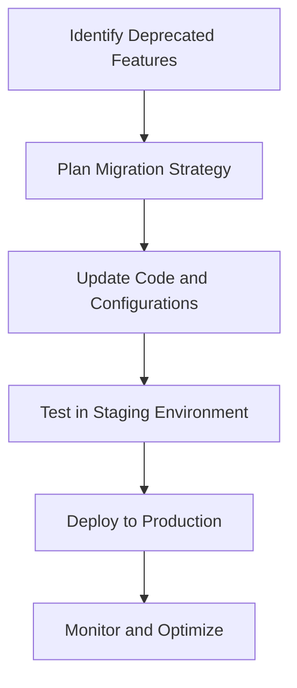

## 20.1.4 Deprecations and Migration Guides

In the fast-evolving landscape of Apache Kafka, staying abreast of deprecated features and understanding how to migrate to newer alternatives is crucial for maintaining robust and efficient systems. This section provides a detailed overview of deprecated features, the rationale behind these changes, and comprehensive migration guides to help you transition smoothly.

### Understanding Deprecations in Apache Kafka

Deprecations in Apache Kafka are part of its natural evolution, driven by the need to improve performance, security, and usability. They often result from Kafka Improvement Proposals (KIPs), which are community-driven initiatives to enhance Kafka's capabilities. Understanding these changes is essential for maintaining compatibility and leveraging new features.

#### Key Reasons for Deprecations

1. **Performance Improvements**: Older features may be replaced to optimize Kafka's throughput and latency.
2. **Security Enhancements**: Deprecated features might not meet modern security standards.
3. **Simplification and Usability**: Streamlining configurations and APIs to reduce complexity.
4. **Technological Advancements**: Adoption of newer technologies that offer better scalability and reliability.

### Major Deprecated Features and Migration Paths

#### 1. Transition from ZooKeeper to KRaft

**Background**: ZooKeeper has been a critical component of Kafka's architecture, managing metadata and ensuring cluster coordination. However, the introduction of the KRaft (Kafka Raft) protocol aims to eliminate the dependency on ZooKeeper, simplifying operations and improving scalability.

**Deprecation Details**:
- **Feature**: ZooKeeper-based metadata management.
- **KIP Reference**: [KIP-500](https://cwiki.apache.org/confluence/display/KAFKA/KIP-500%3A+Replace+ZooKeeper+with+a+Self-Managed+Metadata+Quorum)
- **Reason**: KRaft provides a more integrated and efficient metadata management system, reducing operational complexity.

**Migration Guide**:
- **Step 1**: Upgrade to a Kafka version that supports KRaft.
- **Step 2**: Configure Kafka brokers to use the KRaft mode.
- **Step 3**: Migrate metadata from ZooKeeper to KRaft using Kafka's migration tools.
- **Step 4**: Validate the migration by testing cluster operations and failover scenarios.

**Tools and Resources**:
- Kafka's official migration scripts and documentation.
- Community forums and support channels for troubleshooting.

#### 2. Deprecation of Old Consumer API

**Background**: The old consumer API, which was part of Kafka's early releases, has been replaced by the new consumer API, offering better performance and more features.

**Deprecation Details**:
- **Feature**: Old Consumer API.
- **KIP Reference**: [KIP-35](https://cwiki.apache.org/confluence/display/KAFKA/KIP-35+-+A+new+consumer+client)
- **Reason**: The new API supports consumer groups, automatic offset management, and more efficient data fetching.

**Migration Guide**:
- **Step 1**: Identify applications using the old consumer API.
- **Step 2**: Refactor code to use the new consumer API, focusing on consumer group management and offset handling.
- **Step 3**: Test the refactored applications in a staging environment to ensure compatibility and performance.
- **Step 4**: Deploy the updated applications to production, monitoring for any issues.

**Code Example**:

- **Java**:

    ```java
    // Old Consumer API
    ConsumerConnector consumer = Consumer.createJavaConsumerConnector(new ConsumerConfig(props));
    // New Consumer API
    KafkaConsumer<String, String> consumer = new KafkaConsumer<>(props);
    ```

- **Scala**:

    ```scala
    // Old Consumer API
    val consumer = Consumer.createJavaConsumerConnector(new ConsumerConfig(props))
    // New Consumer API
    val consumer = new KafkaConsumer[String, String](props)
    ```

- **Kotlin**:

    ```kotlin
    // New Consumer API
    val consumer = KafkaConsumer<String, String>(props)
    ```

- **Clojure**:

    ```clojure
    ;; New Consumer API
    (def consumer (KafkaConsumer. props))
    ```

**Tools and Resources**:
- Kafka's migration documentation.
- Sample code repositories demonstrating the new consumer API.

#### 3. Removal of Deprecated Configuration Properties

**Background**: Over time, certain configuration properties become obsolete as Kafka evolves. These properties are often replaced with more efficient or secure alternatives.

**Deprecation Details**:
- **Feature**: Deprecated configuration properties.
- **Reason**: To streamline configuration management and improve security.

**Migration Guide**:
- **Step 1**: Review Kafka release notes for deprecated properties.
- **Step 2**: Update configuration files to replace deprecated properties with recommended alternatives.
- **Step 3**: Test the updated configurations in a non-production environment.
- **Step 4**: Deploy the changes to production, ensuring all services are compatible.

**Example**:

- **Deprecated Property**: `zookeeper.connect`
- **Replacement**: Use KRaft configuration settings.

**Tools and Resources**:
- Kafka's configuration migration guides.
- Community forums for configuration best practices.

### Practical Applications and Real-World Scenarios

#### Migrating Large-Scale Deployments

In enterprise environments, migrating from deprecated features can be complex due to the scale and criticality of Kafka deployments. Here are some strategies:

- **Phased Rollout**: Gradually migrate components to minimize disruption.
- **Parallel Testing**: Run old and new systems in parallel to validate functionality.
- **Automated Testing**: Use automated tests to verify application behavior post-migration.

#### Case Study: Migrating from ZooKeeper to KRaft

A leading e-commerce platform successfully migrated its Kafka cluster from ZooKeeper to KRaft, resulting in reduced operational overhead and improved performance. Key steps included:

- **Comprehensive Planning**: Detailed migration plan with risk assessment.
- **Stakeholder Involvement**: Engaging all relevant teams to ensure alignment.
- **Continuous Monitoring**: Real-time monitoring during and after migration to detect issues.

### Visualizing the Migration Process



**Caption**: A high-level overview of the migration process from deprecated features to new alternatives in Apache Kafka.

### References and Links

- [Apache Kafka Documentation](https://kafka.apache.org/documentation/)
- [Confluent Documentation](https://docs.confluent.io/)
- [KIP-500: Replace ZooKeeper with a Self-Managed Metadata Quorum](https://cwiki.apache.org/confluence/display/KAFKA/KIP-500%3A+Replace+ZooKeeper+with+a+Self-Managed+Metadata+Quorum)
- [KIP-35: A new consumer client](https://cwiki.apache.org/confluence/display/KAFKA/KIP-35+-+A+new+consumer+client)

## Test Your Knowledge: Kafka Deprecations and Migration Strategies Quiz



### What is the primary reason for deprecating ZooKeeper in Kafka?

- [x] To simplify operations and improve scalability with KRaft.
- [ ] To reduce the cost of Kafka deployments.
- [ ] To enhance the security of Kafka clusters.
- [ ] To increase the speed of message processing.

> **Explanation:** The primary reason for deprecating ZooKeeper is to simplify operations and improve scalability by using the KRaft protocol.

### Which Kafka Improvement Proposal (KIP) addresses the transition from ZooKeeper to KRaft?

- [x] KIP-500
- [ ] KIP-35
- [ ] KIP-101
- [ ] KIP-200

> **Explanation:** KIP-500 addresses the transition from ZooKeeper to KRaft.

### What is a key benefit of the new Kafka consumer API over the old one?

- [x] Supports consumer groups and automatic offset management.
- [ ] Requires less configuration.
- [ ] Provides better integration with ZooKeeper.
- [ ] Offers higher message throughput.

> **Explanation:** The new Kafka consumer API supports consumer groups and automatic offset management, which are key benefits over the old API.

### What should be the first step in migrating from deprecated Kafka features?

- [x] Identify applications using deprecated features.
- [ ] Deploy changes to production.
- [ ] Update all configuration files.
- [ ] Test in a staging environment.

> **Explanation:** The first step in migrating from deprecated Kafka features is to identify applications using those features.

### Which tool is recommended for migrating metadata from ZooKeeper to KRaft?

- [x] Kafka's official migration scripts.
- [ ] Third-party migration tools.
- [ ] Manual configuration updates.
- [ ] Custom scripts developed in-house.

> **Explanation:** Kafka's official migration scripts are recommended for migrating metadata from ZooKeeper to KRaft.

### What is the purpose of running old and new systems in parallel during migration?

- [x] To validate functionality and ensure compatibility.
- [ ] To reduce migration costs.
- [ ] To increase system performance.
- [ ] To simplify configuration management.

> **Explanation:** Running old and new systems in parallel during migration helps validate functionality and ensure compatibility.

### Why is it important to engage stakeholders during the migration process?

- [x] To ensure alignment and address concerns.
- [ ] To reduce the cost of migration.
- [ ] To speed up the migration process.
- [ ] To avoid technical debt.

> **Explanation:** Engaging stakeholders during the migration process ensures alignment and addresses any concerns that may arise.

### What is a common strategy for minimizing disruption during large-scale migrations?

- [x] Phased rollout.
- [ ] Immediate deployment.
- [ ] Manual testing.
- [ ] Ignoring deprecated features.

> **Explanation:** A phased rollout is a common strategy for minimizing disruption during large-scale migrations.

### What is the recommended environment for testing updated configurations before production deployment?

- [x] Staging environment.
- [ ] Development environment.
- [ ] Production environment.
- [ ] Local environment.

> **Explanation:** A staging environment is recommended for testing updated configurations before production deployment.

### True or False: Deprecated configuration properties should be replaced with recommended alternatives.

- [x] True
- [ ] False

> **Explanation:** Deprecated configuration properties should be replaced with recommended alternatives to ensure compatibility and performance.



By understanding and implementing these migration strategies, you can ensure that your Kafka deployments remain robust, efficient, and aligned with the latest advancements in the platform.
