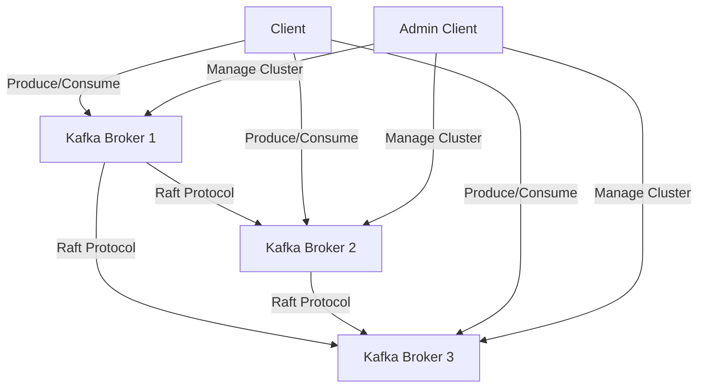

## 20.2.1 Impact of Removing ZooKeeper

### Introduction

Apache Kafka has long relied on Apache ZooKeeper for managing its distributed architecture, handling tasks such as leader election, configuration management, and metadata storage. However, as Kafka has evolved, the limitations and complexities associated with ZooKeeper have become more apparent. The introduction of the KRaft (Kafka Raft) architecture marks a significant shift in Kafka's design, aiming to eliminate the dependency on ZooKeeper. This section delves into the challenges posed by ZooKeeper, how KRaft addresses these issues, and the operational changes that come with this transition.

### Challenges Associated with ZooKeeper in Kafka

ZooKeeper has been a critical component of Kafka's architecture, but it comes with its own set of challenges:

1. **Complexity in Management**: ZooKeeper adds an additional layer of complexity to Kafka deployments. Managing a separate ZooKeeper ensemble requires expertise and can complicate the overall system architecture.

2. **Scalability Limitations**: ZooKeeper's architecture can become a bottleneck as Kafka clusters scale. It requires careful tuning and management to handle large-scale deployments effectively.

3. **Operational Overhead**: Running and maintaining ZooKeeper clusters involves significant operational overhead, including monitoring, scaling, and ensuring high availability.

4. **Latency and Performance**: ZooKeeper can introduce latency in operations such as leader election and metadata updates, impacting Kafka's performance.

5. **Single Point of Failure**: Despite its distributed nature, ZooKeeper can still become a single point of failure if not managed correctly, affecting the reliability of Kafka clusters.

### How KRaft Addresses These Challenges

The KRaft architecture is designed to overcome the limitations of ZooKeeper by integrating metadata management directly into Kafka brokers. Here's how KRaft addresses the challenges:

1. **Simplified Architecture**: By removing the dependency on ZooKeeper, KRaft simplifies Kafka's architecture. This integration reduces the number of components that need to be managed and monitored.

2. **Improved Scalability**: KRaft leverages the Raft consensus algorithm to manage metadata, allowing Kafka to scale more efficiently. This approach supports larger clusters without the bottlenecks associated with ZooKeeper.

3. **Reduced Operational Overhead**: With KRaft, there is no need to maintain a separate ZooKeeper ensemble. This reduction in components decreases the operational overhead and simplifies cluster management.

4. **Enhanced Performance**: The Raft protocol used in KRaft provides faster leader election and metadata updates, reducing latency and improving Kafka's overall performance.

5. **Increased Reliability**: KRaft's design eliminates the single point of failure associated with ZooKeeper, enhancing the reliability and fault tolerance of Kafka clusters.

### Operational Changes with KRaft

Transitioning to KRaft involves several operational changes that impact cluster setup and management:

1. **Cluster Setup**: Setting up a Kafka cluster with KRaft is more straightforward as it eliminates the need for a separate ZooKeeper ensemble. Kafka brokers now handle metadata management internally.

2. **Configuration Management**: KRaft introduces new configuration parameters specific to the Raft protocol. Administrators need to familiarize themselves with these settings to optimize cluster performance.

3. **Monitoring and Management**: Monitoring Kafka clusters with KRaft requires a shift in focus from ZooKeeper metrics to Raft-specific metrics. Tools and dashboards need to be updated to reflect these changes.

4. **Backup and Recovery**: KRaft changes the way metadata is stored and managed. Backup and recovery processes need to be adapted to ensure data integrity and availability.

5. **Security Considerations**: With the removal of ZooKeeper, security configurations need to be updated to ensure that Kafka brokers are properly secured against unauthorized access.

### Considerations for Backward Compatibility and Migration Paths

Migrating from a ZooKeeper-based Kafka cluster to KRaft requires careful planning to ensure backward compatibility and minimize disruption:

1. **Compatibility with Existing Clients**: Ensure that existing Kafka clients are compatible with the KRaft architecture. This may involve updating client libraries and testing applications for compatibility.

2. **Incremental Migration**: Consider an incremental migration strategy to transition from ZooKeeper to KRaft. This approach allows for testing and validation at each step, reducing the risk of errors.

3. **Data Migration**: Plan for the migration of metadata and configuration data from ZooKeeper to KRaft. This process should be carefully managed to prevent data loss or corruption.

4. **Testing and Validation**: Thoroughly test the new KRaft-based setup in a staging environment before deploying it to production. Validate performance, reliability, and compatibility with existing systems.

5. **Documentation and Training**: Update documentation and provide training for operations teams to ensure they are familiar with the new architecture and management practices.

### Code Examples

To illustrate the transition from ZooKeeper to KRaft, let's explore some code examples in Java, Scala, Kotlin, and Clojure that demonstrate setting up a Kafka cluster with KRaft.

#### Java Example

```java
import org.apache.kafka.clients.admin.AdminClient;
import org.apache.kafka.clients.admin.AdminClientConfig;
import java.util.Properties;

public class KafkaKRaftSetup {
    public static void main(String[] args) {
        Properties props = new Properties();
        props.put(AdminClientConfig.BOOTSTRAP_SERVERS_CONFIG, "localhost:9092");
        props.put("metadata.quorum", "raft");

        try (AdminClient adminClient = AdminClient.create(props)) {
            // Perform operations with the admin client
            System.out.println("Kafka cluster with KRaft setup successfully.");
        } catch (Exception e) {
            e.printStackTrace();
        }
    }
}
```

#### Scala Example

```scala
import org.apache.kafka.clients.admin.{AdminClient, AdminClientConfig}
import java.util.Properties

object KafkaKRaftSetup extends App {
  val props = new Properties()
  props.put(AdminClientConfig.BOOTSTRAP_SERVERS_CONFIG, "localhost:9092")
  props.put("metadata.quorum", "raft")

  val adminClient = AdminClient.create(props)
  try {
    // Perform operations with the admin client
    println("Kafka cluster with KRaft setup successfully.")
  } finally {
    adminClient.close()
  }
}
```

#### Kotlin Example

```kotlin
import org.apache.kafka.clients.admin.AdminClient
import org.apache.kafka.clients.admin.AdminClientConfig
import java.util.Properties

fun main() {
    val props = Properties().apply {
        put(AdminClientConfig.BOOTSTRAP_SERVERS_CONFIG, "localhost:9092")
        put("metadata.quorum", "raft")
    }

    AdminClient.create(props).use { adminClient ->
        // Perform operations with the admin client
        println("Kafka cluster with KRaft setup successfully.")
    }
}
```

#### Clojure Example

```clojure
(ns kafka-kraft-setup
  (:import [org.apache.kafka.clients.admin AdminClient AdminClientConfig]
           [java.util Properties]))

(defn setup-kafka-kraft []
  (let [props (doto (Properties.)
                (.put AdminClientConfig/BOOTSTRAP_SERVERS_CONFIG "localhost:9092")
                (.put "metadata.quorum" "raft"))
        admin-client (AdminClient/create props)]
    (try
      ;; Perform operations with the admin client
      (println "Kafka cluster with KRaft setup successfully.")
      (finally
        (.close admin-client)))))

(setup-kafka-kraft)
```

### Visualizing the KRaft Architecture

To better understand the KRaft architecture, let's visualize the changes in Kafka's architecture with a diagram.



**Caption**: The diagram illustrates the KRaft architecture, where Kafka brokers communicate using the Raft protocol for metadata management, eliminating the need for ZooKeeper.

### Real-World Scenarios and Practical Applications

The transition to KRaft has significant implications for real-world Kafka deployments:

1. **Large-Scale Deployments**: Organizations with large-scale Kafka deployments can benefit from the improved scalability and reduced complexity offered by KRaft.

2. **Cloud-Native Architectures**: KRaft aligns well with cloud-native architectures, simplifying deployments in containerized environments and reducing the need for additional components like ZooKeeper.

3. **High-Performance Applications**: Applications requiring low-latency and high-throughput can leverage the performance enhancements provided by KRaft.

4. **Simplified Operations**: By reducing the number of components to manage, KRaft simplifies operations and reduces the risk of configuration errors.

### Conclusion

The removal of ZooKeeper from Kafka's architecture represents a significant advancement in the evolution of Kafka. The KRaft architecture simplifies Kafka's design, enhances scalability, and reduces operational overhead. While the transition requires careful planning and consideration of backward compatibility, the benefits of KRaft make it a compelling choice for modern Kafka deployments.

## Test Your Knowledge: Impact of Removing ZooKeeper from Kafka



### What is one of the primary challenges associated with using ZooKeeper in Kafka?

- [x] Complexity in management
- [ ] Lack of security features
- [ ] Incompatibility with cloud environments
- [ ] High cost of deployment

> **Explanation:** ZooKeeper adds complexity to Kafka deployments due to the need for managing a separate ensemble.

### How does KRaft improve Kafka's scalability?

- [x] By integrating metadata management directly into Kafka brokers
- [ ] By increasing the number of ZooKeeper nodes
- [ ] By reducing the number of Kafka topics
- [ ] By using a different message format

> **Explanation:** KRaft uses the Raft consensus algorithm to manage metadata within Kafka brokers, improving scalability.

### What operational change is required when transitioning to KRaft?

- [x] Updating configuration management to reflect Raft-specific settings
- [ ] Increasing the number of ZooKeeper nodes
- [ ] Changing the message format
- [ ] Reducing the number of Kafka brokers

> **Explanation:** Transitioning to KRaft requires updating configuration management to accommodate Raft-specific settings.

### What is a benefit of removing ZooKeeper from Kafka's architecture?

- [x] Simplified architecture
- [ ] Increased complexity
- [ ] Higher operational overhead
- [ ] Reduced reliability

> **Explanation:** Removing ZooKeeper simplifies Kafka's architecture by reducing the number of components to manage.

### Which protocol does KRaft use for metadata management?

- [x] Raft
- [ ] Paxos
- [ ] Gossip
- [ ] Two-Phase Commit

> **Explanation:** KRaft uses the Raft consensus algorithm for metadata management.

### What is a key consideration for backward compatibility when migrating to KRaft?

- [x] Ensuring existing Kafka clients are compatible
- [ ] Increasing the number of Kafka topics
- [ ] Changing the message format
- [ ] Reducing the number of Kafka brokers

> **Explanation:** Ensuring that existing Kafka clients are compatible with KRaft is crucial for backward compatibility.

### How does KRaft enhance Kafka's performance?

- [x] By providing faster leader election and metadata updates
- [ ] By increasing the number of ZooKeeper nodes
- [ ] By reducing the number of Kafka topics
- [ ] By using a different message format

> **Explanation:** KRaft enhances performance through faster leader election and metadata updates using the Raft protocol.

### What is a potential drawback of using ZooKeeper in Kafka?

- [x] It can become a single point of failure
- [ ] It increases Kafka's message throughput
- [ ] It simplifies Kafka's architecture
- [ ] It reduces operational overhead

> **Explanation:** ZooKeeper can become a single point of failure if not managed correctly, affecting Kafka's reliability.

### What is a real-world application of KRaft?

- [x] Simplifying operations in cloud-native architectures
- [ ] Increasing the number of ZooKeeper nodes
- [ ] Reducing the number of Kafka topics
- [ ] Changing the message format

> **Explanation:** KRaft simplifies operations in cloud-native architectures by reducing the need for additional components like ZooKeeper.

### True or False: KRaft eliminates the need for ZooKeeper in Kafka.

- [x] True
- [ ] False

> **Explanation:** KRaft eliminates the need for ZooKeeper by integrating metadata management directly into Kafka brokers.


