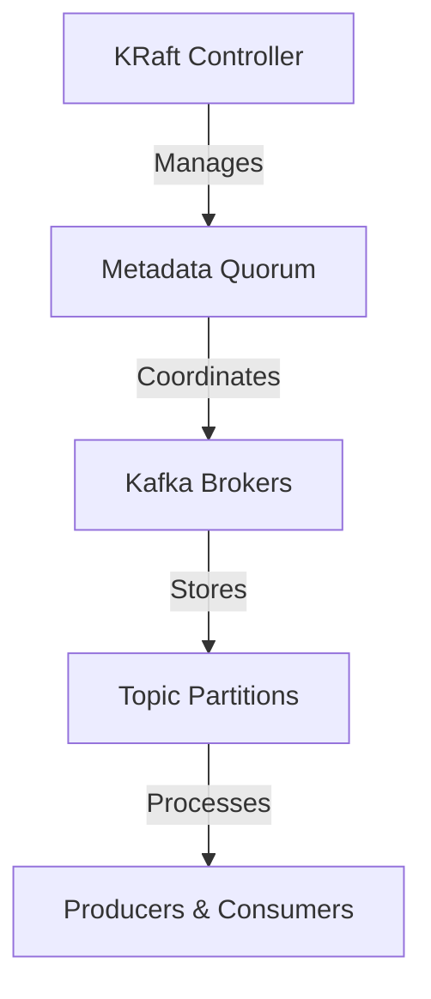

## 20.2 The KRaft Architecture and Beyond

### Introduction

Apache Kafka has long been a cornerstone of real-time data processing architectures, enabling scalable and fault-tolerant data streaming. However, as Kafka deployments have grown in size and complexity, the limitations of its reliance on ZooKeeper for metadata management have become apparent. The introduction of the KRaft (Kafka Raft metadata) architecture marks a significant evolution in Kafka's design, aiming to remove the dependency on ZooKeeper and streamline Kafka's operational model.

### Motivation for Moving Away from ZooKeeper

ZooKeeper has traditionally played a critical role in managing Kafka's metadata, including broker configurations, topic partitions, and consumer group offsets. However, this dependency introduces several challenges:

- **Complexity**: Managing a separate ZooKeeper ensemble adds operational overhead and complexity, particularly in large-scale deployments.
- **Scalability Limitations**: ZooKeeper's architecture can become a bottleneck as the number of Kafka brokers and partitions increases.
- **Operational Challenges**: Ensuring the high availability and fault tolerance of ZooKeeper itself requires careful configuration and monitoring.

The KRaft architecture addresses these challenges by integrating metadata management directly into Kafka, leveraging the Raft consensus algorithm to ensure consistency and reliability.

### Main Components and Benefits of the KRaft Architecture

#### Core Components

1. **Raft Consensus Algorithm**: KRaft utilizes the Raft consensus algorithm to manage metadata, ensuring strong consistency and fault tolerance without the need for an external system like ZooKeeper.

2. **KRaft Controllers**: These are specialized Kafka brokers responsible for managing metadata and coordinating cluster operations. They replace the role previously played by ZooKeeper.

3. **Metadata Quorum**: A group of KRaft controllers forms a metadata quorum, which is responsible for maintaining the state of the Kafka cluster.

#### Benefits

- **Simplified Architecture**: By eliminating the need for ZooKeeper, KRaft simplifies the Kafka architecture, reducing the operational burden and potential points of failure.
- **Improved Scalability**: KRaft's metadata management is designed to scale with the number of brokers and partitions, supporting larger and more complex deployments.
- **Enhanced Reliability**: The use of the Raft algorithm ensures that metadata updates are consistent and fault-tolerant, improving the overall reliability of the Kafka cluster.
- **Unified Configuration**: With KRaft, all configuration and metadata are managed within Kafka, streamlining configuration management and reducing the risk of configuration drift.

### Roadmap for Full Adoption of KRaft in Kafka

The transition to KRaft is a multi-phase process, with several key milestones:

1. **Initial Release**: The initial release of KRaft introduced the core components and allowed for testing and feedback from the community.

2. **Stabilization and Optimization**: Subsequent releases focused on stabilizing the KRaft architecture and optimizing performance for large-scale deployments.

3. **Feature Parity**: Achieving feature parity with ZooKeeper-based deployments is a critical step, ensuring that all existing Kafka features are supported under KRaft.

4. **Deprecation of ZooKeeper**: Once KRaft is fully stable and feature-complete, the plan is to deprecate ZooKeeper support, encouraging users to transition to the new architecture.

5. **Community and Ecosystem Support**: Engaging with the Kafka community and ecosystem to ensure that tools and integrations are compatible with KRaft.

### Preparing for the Transition

For organizations planning to adopt KRaft, several steps can help ensure a smooth transition:

- **Evaluate Current Deployments**: Assess the current Kafka deployment to understand the potential impact of transitioning to KRaft, including any custom integrations or dependencies on ZooKeeper.
- **Test in a Staging Environment**: Deploy KRaft in a staging environment to test compatibility and performance before rolling out to production.
- **Update Tooling and Integrations**: Ensure that any third-party tools or integrations used with Kafka are compatible with KRaft.
- **Plan for Migration**: Develop a detailed migration plan, including rollback procedures in case of issues during the transition.
- **Engage with the Community**: Participate in the Kafka community to stay informed about the latest developments and best practices for KRaft.

### Potential Implications for Existing Deployments

While the transition to KRaft offers many benefits, it also presents some challenges for existing deployments:

- **Compatibility**: Some existing tools and integrations may not be immediately compatible with KRaft, requiring updates or replacements.
- **Learning Curve**: Teams may need to invest time in learning the new architecture and operational model.
- **Migration Complexity**: Depending on the size and complexity of the deployment, migrating to KRaft may require significant planning and effort.

### Conclusion

The KRaft architecture represents a major step forward for Apache Kafka, addressing longstanding challenges associated with ZooKeeper dependency and paving the way for more scalable and reliable deployments. By understanding the motivations, benefits, and roadmap for KRaft, organizations can prepare for a successful transition and unlock the full potential of Kafka's next-generation architecture.

### Code Examples

To illustrate the transition to KRaft, let's explore some code examples in Java, Scala, Kotlin, and Clojure that demonstrate how to configure and manage a Kafka cluster using KRaft.

#### Java Example

```java
import org.apache.kafka.clients.admin.AdminClient;
import org.apache.kafka.clients.admin.AdminClientConfig;
import java.util.Properties;

public class KRaftAdminExample {
    public static void main(String[] args) {
        Properties props = new Properties();
        props.put(AdminClientConfig.BOOTSTRAP_SERVERS_CONFIG, "localhost:9092");
        try (AdminClient adminClient = AdminClient.create(props)) {
            // Perform admin operations
            System.out.println("Connected to Kafka cluster using KRaft.");
        }
    }
}
```

#### Scala Example

```scala
import org.apache.kafka.clients.admin.{AdminClient, AdminClientConfig}
import java.util.Properties

object KRaftAdminExample extends App {
  val props = new Properties()
  props.put(AdminClientConfig.BOOTSTRAP_SERVERS_CONFIG, "localhost:9092")
  val adminClient = AdminClient.create(props)
  try {
    // Perform admin operations
    println("Connected to Kafka cluster using KRaft.")
  } finally {
    adminClient.close()
  }
}
```

#### Kotlin Example

```kotlin
import org.apache.kafka.clients.admin.AdminClient
import org.apache.kafka.clients.admin.AdminClientConfig
import java.util.Properties

fun main() {
    val props = Properties().apply {
        put(AdminClientConfig.BOOTSTRAP_SERVERS_CONFIG, "localhost:9092")
    }
    AdminClient.create(props).use { adminClient ->
        // Perform admin operations
        println("Connected to Kafka cluster using KRaft.")
    }
}
```

#### Clojure Example

```clojure
(ns kraft-admin-example
  (:import (org.apache.kafka.clients.admin AdminClient AdminClientConfig)
           (java.util Properties)))

(defn connect-to-kafka []
  (let [props (doto (Properties.)
                (.put AdminClientConfig/BOOTSTRAP_SERVERS_CONFIG "localhost:9092"))
        admin-client (AdminClient/create props)]
    (try
      ;; Perform admin operations
      (println "Connected to Kafka cluster using KRaft.")
      (finally
        (.close admin-client)))))
```

### Visualizing the KRaft Architecture

To better understand the KRaft architecture, let's visualize the key components and their interactions.



**Diagram Caption**: This diagram illustrates the KRaft architecture, highlighting the role of KRaft controllers in managing the metadata quorum and coordinating Kafka brokers.

### Knowledge Check

To reinforce your understanding of the KRaft architecture and its implications, consider the following questions and challenges:

1. **What are the primary motivations for transitioning from ZooKeeper to KRaft?**
2. **How does the Raft consensus algorithm enhance metadata management in Kafka?**
3. **What are the key components of the KRaft architecture, and how do they interact?**
4. **What steps should organizations take to prepare for the transition to KRaft?**
5. **What potential challenges might arise during the migration to KRaft?**

### Quiz

## Test Your Knowledge: KRaft Architecture and Kafka's Future



### What is the primary motivation for moving away from ZooKeeper in Kafka?

- [x] To simplify the architecture and reduce operational complexity.
- [ ] To increase the number of Kafka brokers.
- [ ] To improve the speed of message processing.
- [ ] To eliminate the need for metadata management.

> **Explanation:** The primary motivation for moving away from ZooKeeper is to simplify Kafka's architecture and reduce the operational complexity associated with managing a separate ZooKeeper ensemble.

### Which algorithm does KRaft use for metadata management?

- [x] Raft consensus algorithm
- [ ] Paxos algorithm
- [ ] Two-phase commit
- [ ] Gossip protocol

> **Explanation:** KRaft uses the Raft consensus algorithm to manage metadata, ensuring strong consistency and fault tolerance.

### What is a key benefit of the KRaft architecture?

- [x] Improved scalability and reliability
- [ ] Faster message delivery
- [ ] Reduced network latency
- [ ] Increased storage capacity

> **Explanation:** A key benefit of the KRaft architecture is improved scalability and reliability, as it eliminates the ZooKeeper dependency and leverages the Raft algorithm for metadata management.

### What is the role of KRaft controllers?

- [x] Managing metadata and coordinating cluster operations
- [ ] Processing messages from producers
- [ ] Storing topic partitions
- [ ] Balancing consumer load

> **Explanation:** KRaft controllers are responsible for managing metadata and coordinating cluster operations, replacing the role previously played by ZooKeeper.

### What should organizations do to prepare for the transition to KRaft?

- [x] Evaluate current deployments and test in a staging environment
- [ ] Increase the number of Kafka brokers
- [ ] Reduce the number of topic partitions
- [ ] Eliminate all existing configurations

> **Explanation:** Organizations should evaluate their current deployments, test KRaft in a staging environment, and ensure compatibility with existing tools and integrations.

### What is a potential challenge of migrating to KRaft?

- [x] Compatibility with existing tools and integrations
- [ ] Increased message processing latency
- [ ] Reduced storage capacity
- [ ] Decreased network bandwidth

> **Explanation:** A potential challenge of migrating to KRaft is ensuring compatibility with existing tools and integrations, as some may not be immediately compatible.

### How does KRaft improve Kafka's scalability?

- [x] By integrating metadata management directly into Kafka
- [ ] By increasing the number of brokers
- [ ] By reducing the number of partitions
- [ ] By eliminating the need for producers

> **Explanation:** KRaft improves Kafka's scalability by integrating metadata management directly into Kafka, eliminating the need for a separate ZooKeeper ensemble.

### What is the purpose of the metadata quorum in KRaft?

- [x] To maintain the state of the Kafka cluster
- [ ] To process messages from producers
- [ ] To store topic partitions
- [ ] To balance consumer load

> **Explanation:** The metadata quorum in KRaft is responsible for maintaining the state of the Kafka cluster, ensuring consistency and reliability.

### What is the impact of KRaft on Kafka's architecture?

- [x] Simplifies the architecture by removing ZooKeeper dependency
- [ ] Increases the number of brokers
- [ ] Reduces message processing latency
- [ ] Increases storage capacity

> **Explanation:** KRaft simplifies Kafka's architecture by removing the dependency on ZooKeeper, reducing operational complexity and potential points of failure.

### True or False: KRaft eliminates the need for metadata management in Kafka.

- [ ] True
- [x] False

> **Explanation:** False. KRaft does not eliminate the need for metadata management; instead, it integrates metadata management directly into Kafka using the Raft consensus algorithm.



By understanding the KRaft architecture and its implications, you can prepare for the future of Apache Kafka and leverage its enhanced capabilities for building scalable, reliable, and efficient data streaming solutions.
