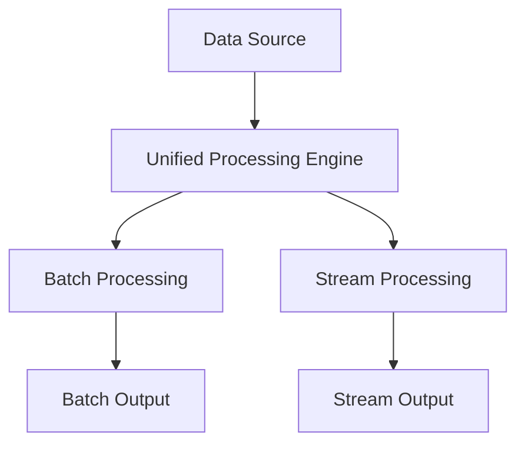

## 20.3.1 Unified Batch and Stream Processing

In the rapidly evolving landscape of data processing, the need for systems that can seamlessly handle both batch and streaming data has become increasingly apparent. Unified batch and stream processing models offer a revolutionary approach to managing data pipelines, providing a cohesive framework that simplifies complexity and enhances real-time analytics capabilities. This section delves into the benefits, challenges, and technologies associated with unified processing, with a focus on Apache Kafka's role in this paradigm shift.

### Benefits of Unified Processing

Unified processing models bring a host of advantages to data systems, particularly in environments where both historical and real-time data insights are critical. Here are some key benefits:

- **Simplified Architecture**: By integrating batch and stream processing into a single framework, organizations can reduce the complexity of their data pipelines. This simplification leads to easier maintenance, reduced operational overhead, and a more streamlined development process.

- **Consistent Data Models**: Unified processing ensures that the same data models and processing logic can be applied to both batch and streaming data. This consistency reduces the risk of discrepancies between batch and real-time analytics, leading to more reliable insights.

- **Improved Resource Utilization**: With a unified approach, resources can be dynamically allocated between batch and stream processing tasks based on demand, optimizing the use of computational resources and reducing costs.

- **Enhanced Real-Time Capabilities**: By leveraging the same infrastructure for both batch and stream processing, organizations can achieve faster time-to-insight, enabling more timely decision-making and responsiveness to changing conditions.

### Challenges in Implementing Unified Models

Despite the clear benefits, implementing unified processing models is not without its challenges. Some of the key hurdles include:

- **Complexity of Integration**: Merging batch and stream processing frameworks requires careful integration to ensure seamless operation. This can involve significant architectural changes and the need for robust data orchestration tools.

- **Data Consistency and Latency**: Ensuring data consistency across batch and streaming contexts can be challenging, particularly when dealing with late-arriving data or out-of-order events. Balancing latency requirements with consistency guarantees is a critical consideration.

- **Scalability and Performance**: Unified processing systems must be capable of scaling to handle large volumes of both historical and real-time data. This requires careful tuning and optimization to maintain performance under varying workloads.

- **Tooling and Ecosystem Support**: The availability of tools and libraries that support unified processing is still evolving. Organizations must carefully evaluate the maturity and capabilities of available solutions to ensure they meet their specific needs.

### Technologies and Projects

Several technologies and projects have emerged to support unified batch and stream processing, each with its own strengths and use cases. Key players in this space include Apache Beam and Apache Flink.

#### Apache Beam

Apache Beam is an open-source, unified model for defining both batch and streaming data processing pipelines. It provides a portable API that allows developers to write their data processing logic once and execute it on multiple execution engines, such as Apache Flink, Apache Spark, and Google Cloud Dataflow.

- **Flexibility**: Beam's model supports a wide range of data processing patterns, including windowing, aggregation, and stateful processing, making it suitable for a variety of use cases.

- **Portability**: By abstracting the underlying execution engine, Beam allows organizations to switch between different processing frameworks without rewriting their pipeline code.

- **Extensibility**: Beam's SDKs and libraries provide a rich set of features for building complex data processing workflows, including support for custom transformations and connectors.

#### Apache Flink

Apache Flink is a powerful stream processing framework that also supports batch processing, making it a natural fit for unified processing scenarios. Flink's architecture is designed to handle high-throughput, low-latency data streams, while also providing robust support for batch workloads.

- **Event-Time Processing**: Flink's advanced event-time processing capabilities allow it to handle out-of-order events and late data with precision, ensuring accurate and timely results.

- **Stateful Processing**: Flink's state management features enable complex stateful computations, such as aggregations and joins, to be performed efficiently across both batch and stream data.

- **Scalability**: Flink's distributed architecture allows it to scale horizontally, handling large volumes of data with ease.

### Use Cases for Unified Processing

Unified batch and stream processing models offer significant advantages in a variety of real-world scenarios. Here are some examples:

- **Fraud Detection**: In financial services, real-time fraud detection systems can benefit from unified processing by combining historical transaction data with real-time streams to identify suspicious patterns and anomalies.

- **IoT Analytics**: For Internet of Things (IoT) applications, unified processing enables the integration of historical sensor data with real-time telemetry, providing comprehensive insights into device performance and environmental conditions.

- **Customer 360 Views**: Retail and e-commerce companies can leverage unified processing to create a holistic view of customer behavior by combining historical purchase data with real-time interactions and engagement metrics.

- **Predictive Maintenance**: In manufacturing, unified processing can be used to analyze historical equipment data alongside real-time sensor readings, enabling predictive maintenance and reducing downtime.

### Implementation and Code Examples

To illustrate the implementation of unified batch and stream processing, let's explore some code examples using Apache Beam and Apache Flink. These examples demonstrate how to define and execute unified processing pipelines in Java, Scala, Kotlin, and Clojure.

#### Apache Beam Example

**Java**:

```java
import org.apache.beam.sdk.Pipeline;
import org.apache.beam.sdk.options.PipelineOptions;
import org.apache.beam.sdk.options.PipelineOptionsFactory;
import org.apache.beam.sdk.transforms.*;
import org.apache.beam.sdk.values.*;

public class UnifiedProcessingExample {
    public static void main(String[] args) {
        PipelineOptions options = PipelineOptionsFactory.create();
        Pipeline pipeline = Pipeline.create(options);

        PCollection<String> input = pipeline.apply("ReadData", TextIO.read().from("input.txt"));

        PCollection<String> processedData = input.apply("ProcessData", ParDo.of(new DoFn<String, String>() {
            @ProcessElement
            public void processElement(ProcessContext c) {
                String line = c.element();
                // Process each line
                c.output(line.toUpperCase());
            }
        }));

        processedData.apply("WriteData", TextIO.write().to("output.txt"));

        pipeline.run().waitUntilFinish();
    }
}
```

**Scala**:

```scala
import org.apache.beam.sdk.Pipeline
import org.apache.beam.sdk.options.PipelineOptionsFactory
import org.apache.beam.sdk.transforms.{DoFn, ParDo}
import org.apache.beam.sdk.io.TextIO

object UnifiedProcessingExample {
  def main(args: Array[String]): Unit = {
    val options = PipelineOptionsFactory.create()
    val pipeline = Pipeline.create(options)

    val input = pipeline.apply("ReadData", TextIO.read().from("input.txt"))

    val processedData = input.apply("ProcessData", ParDo.of(new DoFn[String, String] {
      override def processElement(c: DoFn[String, String]#ProcessContext): Unit = {
        val line = c.element()
        // Process each line
        c.output(line.toUpperCase)
      }
    }))

    processedData.apply("WriteData", TextIO.write().to("output.txt"))

    pipeline.run().waitUntilFinish()
  }
}
```

**Kotlin**:

```kotlin
import org.apache.beam.sdk.Pipeline
import org.apache.beam.sdk.options.PipelineOptionsFactory
import org.apache.beam.sdk.transforms.DoFn
import org.apache.beam.sdk.transforms.ParDo
import org.apache.beam.sdk.io.TextIO

fun main() {
    val options = PipelineOptionsFactory.create()
    val pipeline = Pipeline.create(options)

    val input = pipeline.apply("ReadData", TextIO.read().from("input.txt"))

    val processedData = input.apply("ProcessData", ParDo.of(object : DoFn<String, String>() {
        @ProcessElement
        fun processElement(c: ProcessContext) {
            val line = c.element()
            // Process each line
            c.output(line.toUpperCase())
        }
    }))

    processedData.apply("WriteData", TextIO.write().to("output.txt"))

    pipeline.run().waitUntilFinish()
}
```

**Clojure**:

```clojure
(ns unified-processing-example
  (:import [org.apache.beam.sdk Pipeline]
           [org.apache.beam.sdk.options PipelineOptionsFactory]
           [org.apache.beam.sdk.transforms DoFn ParDo]
           [org.apache.beam.sdk.io TextIO]))

(defn -main [& args]
  (let [options (PipelineOptionsFactory/create)
        pipeline (Pipeline/create options)
        input (.apply pipeline "ReadData" (TextIO/read/from "input.txt"))]

    (defn process-element [context]
      (let [line (.element context)]
        ;; Process each line
        (.output context (.toUpperCase line))))

    (let [processed-data (.apply input "ProcessData" (ParDo/of (reify DoFn
                                                               (processElement [_ context]
                                                                 (process-element context)))))]

      (.apply processed-data "WriteData" (TextIO/write/to "output.txt"))
      (.run pipeline)
      (.waitUntilFinish pipeline))))
```

#### Apache Flink Example

**Java**:

```java
import org.apache.flink.api.java.ExecutionEnvironment;
import org.apache.flink.api.java.DataSet;
import org.apache.flink.api.java.tuple.Tuple2;

public class UnifiedProcessingExample {
    public static void main(String[] args) throws Exception {
        final ExecutionEnvironment env = ExecutionEnvironment.getExecutionEnvironment();

        DataSet<String> text = env.readTextFile("input.txt");

        DataSet<Tuple2<String, Integer>> wordCounts = text
            .flatMap((String line, Collector<Tuple2<String, Integer>> out) -> {
                for (String word : line.split(" ")) {
                    out.collect(new Tuple2<>(word, 1));
                }
            })
            .groupBy(0)
            .sum(1);

        wordCounts.writeAsCsv("output.csv", "\n", " ");
        env.execute("Unified Batch and Stream Processing Example");
    }
}
```

**Scala**:

```scala
import org.apache.flink.api.scala._

object UnifiedProcessingExample {
  def main(args: Array[String]): Unit = {
    val env = ExecutionEnvironment.getExecutionEnvironment

    val text = env.readTextFile("input.txt")

    val wordCounts = text
      .flatMap(_.split(" "))
      .map((_, 1))
      .groupBy(0)
      .sum(1)

    wordCounts.writeAsCsv("output.csv", "\n", " ")
    env.execute("Unified Batch and Stream Processing Example")
  }
}
```

**Kotlin**:

```kotlin
import org.apache.flink.api.java.ExecutionEnvironment
import org.apache.flink.api.java.tuple.Tuple2

fun main() {
    val env = ExecutionEnvironment.getExecutionEnvironment()

    val text = env.readTextFile("input.txt")

    val wordCounts = text
        .flatMap { line -> line.split(" ").map { Tuple2(it, 1) } }
        .groupBy(0)
        .sum(1)

    wordCounts.writeAsCsv("output.csv", "\n", " ")
    env.execute("Unified Batch and Stream Processing Example")
}
```

**Clojure**:

```clojure
(ns unified-processing-example
  (:import [org.apache.flink.api.java ExecutionEnvironment]
           [org.apache.flink.api.java.tuple Tuple2]))

(defn -main [& args]
  (let [env (ExecutionEnvironment/getExecutionEnvironment)
        text (.readTextFile env "input.txt")]

    (let [word-counts (-> text
                          (.flatMap (reify org.apache.flink.api.common.functions.FlatMapFunction
                                      (flatMap [_ line out]
                                        (doseq [word (clojure.string/split line #" ")]
                                          (.collect out (Tuple2. word 1))))))
                          (.groupBy 0)
                          (.sum 1))]

      (.writeAsCsv word-counts "output.csv" "\n" " ")
      (.execute env "Unified Batch and Stream Processing Example"))))
```

### Visualizing Unified Processing

To better understand the architecture of unified batch and stream processing, consider the following diagram, which illustrates the flow of data through a unified processing pipeline:



**Caption**: This diagram shows how data from a single source can be processed through a unified engine, with separate paths for batch and stream processing, ultimately leading to distinct outputs.

### Conclusion

Unified batch and stream processing represents a significant advancement in the field of data engineering, offering a cohesive framework for managing diverse data workloads. By leveraging technologies like Apache Beam and Apache Flink, organizations can simplify their data architectures, improve resource utilization, and enhance their real-time analytics capabilities. As the ecosystem continues to evolve, unified processing models are poised to become a cornerstone of modern data systems.

## Test Your Knowledge: Unified Batch and Stream Processing Quiz



### What is a primary benefit of unified batch and stream processing?

- [x] Simplified architecture and reduced complexity
- [ ] Increased data redundancy
- [ ] Higher latency in data processing
- [ ] Separate data models for batch and stream

> **Explanation:** Unified processing simplifies architecture by integrating batch and stream processing, reducing complexity and operational overhead.

### Which technology provides a unified model for both batch and streaming data processing?

- [x] Apache Beam
- [ ] Apache Kafka
- [ ] Apache Hadoop
- [ ] Apache Cassandra

> **Explanation:** Apache Beam offers a unified model for defining both batch and streaming data processing pipelines.

### What is a challenge in implementing unified processing models?

- [x] Ensuring data consistency across batch and streaming contexts
- [ ] Lack of data processing frameworks
- [ ] Limited scalability
- [ ] High data redundancy

> **Explanation:** Ensuring data consistency across batch and streaming contexts is a challenge due to potential discrepancies in data arrival times and order.

### Which feature of Apache Flink supports unified processing scenarios?

- [x] Event-time processing
- [ ] Data replication
- [ ] Static data models
- [ ] High latency

> **Explanation:** Apache Flink's event-time processing capabilities allow it to handle out-of-order events and late data, supporting unified processing scenarios.

### What is a use case where unified processing offers significant advantages?

- [x] Real-time fraud detection
- [ ] Static report generation
- [ ] Data archiving
- [ ] Manual data entry

> **Explanation:** Real-time fraud detection benefits from unified processing by combining historical transaction data with real-time streams for comprehensive analysis.

### Which Apache Beam feature allows for execution on multiple engines?

- [x] Portable API
- [ ] Data replication
- [ ] Static data models
- [ ] High latency

> **Explanation:** Apache Beam's portable API allows developers to write their data processing logic once and execute it on multiple execution engines.

### What is a key advantage of unified processing in IoT analytics?

- [x] Integration of historical and real-time sensor data
- [ ] Increased data redundancy
- [ ] Higher latency in data processing
- [ ] Separate data models for batch and stream

> **Explanation:** Unified processing enables the integration of historical and real-time sensor data, providing comprehensive insights into device performance.

### Which of the following is a challenge in unified processing?

- [x] Complexity of integration
- [ ] Lack of data processing frameworks
- [ ] Limited scalability
- [ ] High data redundancy

> **Explanation:** The complexity of integrating batch and stream processing frameworks is a challenge in unified processing.

### What does Apache Flink's state management feature enable?

- [x] Efficient stateful computations across batch and stream data
- [ ] Data replication
- [ ] Static data models
- [ ] High latency

> **Explanation:** Apache Flink's state management features enable efficient stateful computations, such as aggregations and joins, across both batch and stream data.

### True or False: Unified processing models require separate data models for batch and stream processing.

- [ ] True
- [x] False

> **Explanation:** Unified processing models use consistent data models for both batch and stream processing, reducing discrepancies and ensuring reliable insights.


