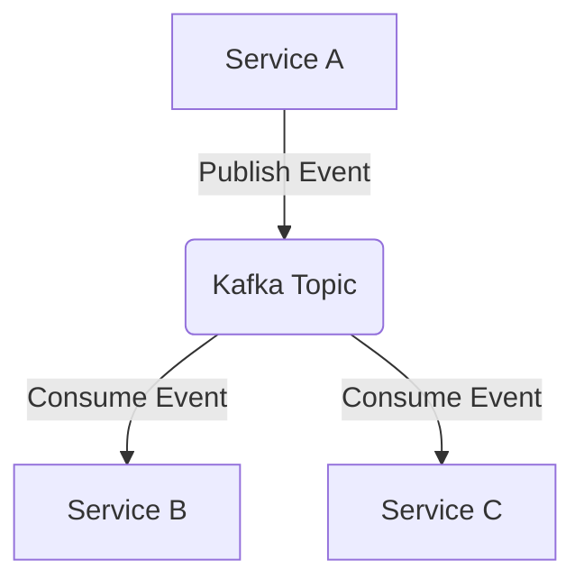
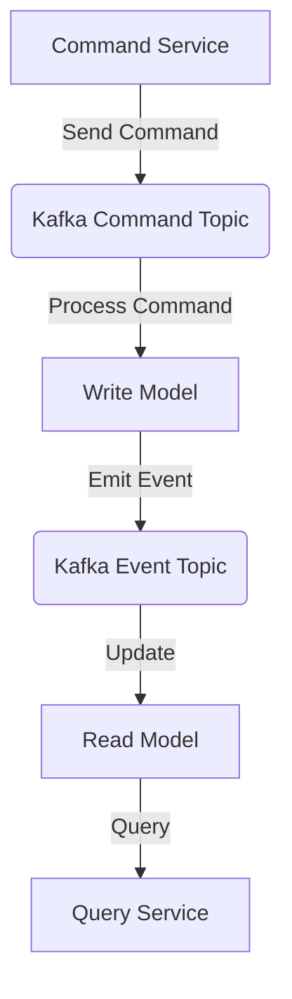
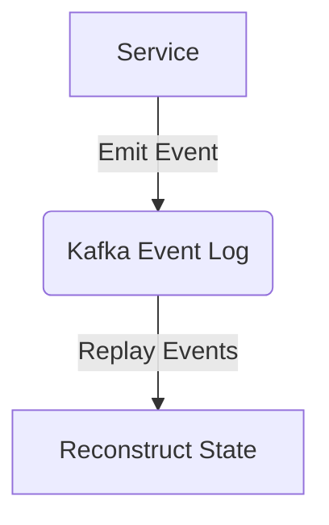

## 20.4.1 Microservices and Beyond

### Introduction

In the rapidly evolving landscape of cloud-native architectures, microservices have emerged as a dominant paradigm for building scalable and resilient applications. Apache Kafka, with its robust event streaming capabilities, plays a crucial role in facilitating communication and data sharing between microservices. This section delves into Kafka's role as an event backbone in microservices architectures, explores architectural patterns and design considerations, and highlights future trends that may influence Kafka's integration with microservices.

### Kafka as an Event Backbone in Microservices

Apache Kafka serves as a central nervous system for microservices architectures, enabling asynchronous communication and decoupling between services. By acting as an event backbone, Kafka allows microservices to publish and subscribe to events, facilitating real-time data processing and integration.

#### Key Benefits of Using Kafka in Microservices

1. **Decoupling Services**: Kafka enables loose coupling between services by allowing them to communicate through events rather than direct API calls. This decoupling enhances flexibility and scalability.

2. **Scalability**: Kafka's distributed architecture supports high throughput and fault tolerance, making it ideal for handling large volumes of events in microservices environments.

3. **Real-Time Data Processing**: Kafka's ability to process streams of data in real-time allows microservices to react to events as they occur, enabling timely decision-making and actions.

4. **Resilience and Fault Tolerance**: Kafka's replication and partitioning mechanisms ensure data durability and availability, even in the face of failures.

5. **Event Sourcing and CQRS**: Kafka supports advanced architectural patterns like Event Sourcing and Command Query Responsibility Segregation (CQRS), which are often used in microservices to maintain consistency and scalability.

### Architectural Patterns and Design Considerations

When integrating Kafka with microservices, several architectural patterns and design considerations come into play. These patterns help in structuring microservices to leverage Kafka's capabilities effectively.

#### Event-Driven Architecture

In an event-driven architecture, services communicate by producing and consuming events. Kafka acts as the event bus, allowing services to publish events to topics and subscribe to relevant topics to receive events.

- **Pattern**: Event-Driven Architecture
- **Intent**: Enable asynchronous communication between services through events.
- **Motivation**: Decouple services and improve scalability and flexibility.
- **Applicability**: Use when services need to react to changes in real-time.



*Diagram 1: Event-Driven Architecture with Kafka as the Event Bus*

#### Command Query Responsibility Segregation (CQRS)

CQRS is a pattern that separates the read and write operations of a system. Kafka can be used to implement CQRS by handling command events and updating read models asynchronously.

- **Pattern**: CQRS
- **Intent**: Separate read and write operations to optimize performance and scalability.
- **Motivation**: Improve system responsiveness and scalability by decoupling read and write operations.
- **Applicability**: Use in systems with complex read and write requirements.



*Diagram 2: Implementing CQRS with Kafka*

#### Event Sourcing

Event Sourcing is a pattern where state changes are captured as a sequence of events. Kafka's log-based storage makes it an ideal choice for implementing event sourcing.

- **Pattern**: Event Sourcing
- **Intent**: Capture state changes as a sequence of events.
- **Motivation**: Maintain a complete history of changes and enable state reconstruction.
- **Applicability**: Use in systems where auditability and traceability are important.



*Diagram 3: Event Sourcing with Kafka*

### Decoupling Services Using Kafka

Decoupling services is a fundamental principle of microservices architectures. Kafka facilitates decoupling by providing a centralized event bus that services can use to communicate without direct dependencies.

#### Example: Decoupling Order Processing and Inventory Management

Consider an e-commerce application where the order processing service needs to communicate with the inventory management service. By using Kafka, these services can be decoupled, allowing them to evolve independently.

- **Order Processing Service**: Publishes order events to a Kafka topic.
- **Inventory Management Service**: Subscribes to the order events topic and updates inventory accordingly.

```java
// Java code example for publishing an order event
Properties props = new Properties();
props.put("bootstrap.servers", "localhost:9092");
props.put("key.serializer", "org.apache.kafka.common.serialization.StringSerializer");
props.put("value.serializer", "org.apache.kafka.common.serialization.StringSerializer");

Producer<String, String> producer = new KafkaProducer<>(props);
producer.send(new ProducerRecord<>("order-events", "orderId", "Order Created"));
producer.close();
```

```scala
// Scala code example for consuming an order event
val props = new Properties()
props.put("bootstrap.servers", "localhost:9092")
props.put("group.id", "inventory-service")
props.put("key.deserializer", "org.apache.kafka.common.serialization.StringDeserializer")
props.put("value.deserializer", "org.apache.kafka.common.serialization.StringDeserializer")

val consumer = new KafkaConsumer[String, String](props)
consumer.subscribe(Collections.singletonList("order-events"))

while (true) {
  val records = consumer.poll(Duration.ofMillis(100))
  for (record <- records.asScala) {
    println(s"Received order event: ${record.value()}")
    // Update inventory based on order event
  }
}
```

### Future Trends in Microservices and Kafka

As microservices architectures continue to evolve, several trends are likely to impact Kafka's role in these environments.

#### Serverless Architectures

The rise of serverless computing is influencing how microservices are designed and deployed. Kafka's integration with serverless platforms, such as AWS Lambda and Azure Functions, allows for event-driven serverless architectures.

- **Trend**: Serverless Architectures
- **Impact on Kafka**: Kafka can trigger serverless functions, enabling scalable and cost-effective event processing.

#### Service Mesh and Observability

Service mesh technologies, such as Istio and Linkerd, are becoming integral to microservices architectures. Kafka's role in providing observability and tracing capabilities is crucial for monitoring and managing microservices.

- **Trend**: Service Mesh and Observability
- **Impact on Kafka**: Kafka can be used to collect and analyze telemetry data, enhancing observability in microservices environments.

#### Edge Computing

Edge computing is pushing computation closer to data sources. Kafka's lightweight deployment options and integration with edge devices make it suitable for edge computing scenarios.

- **Trend**: Edge Computing
- **Impact on Kafka**: Kafka can facilitate real-time data processing and analytics at the edge, reducing latency and bandwidth usage.

### Conclusion

Apache Kafka is a powerful tool for building microservices architectures, providing a robust event backbone that enables decoupling, scalability, and real-time data processing. By leveraging architectural patterns such as Event-Driven Architecture, CQRS, and Event Sourcing, developers can design microservices that are resilient, scalable, and flexible. As microservices continue to evolve, Kafka's role will expand, integrating with emerging trends like serverless computing, service mesh, and edge computing.

## Test Your Knowledge: Kafka's Role in Microservices Architectures



### What is the primary benefit of using Kafka in microservices architectures?

- [x] Decoupling services through asynchronous communication
- [ ] Increasing the number of direct API calls
- [ ] Reducing the need for data storage
- [ ] Simplifying service dependencies

> **Explanation:** Kafka enables decoupling by allowing services to communicate asynchronously through events, reducing direct dependencies.

### Which architectural pattern separates read and write operations in a system?

- [ ] Event Sourcing
- [x] CQRS
- [ ] Event-Driven Architecture
- [ ] Microservices

> **Explanation:** CQRS (Command Query Responsibility Segregation) separates read and write operations to optimize performance and scalability.

### How does Kafka support event sourcing?

- [x] By capturing state changes as a sequence of events
- [ ] By directly modifying the database
- [ ] By reducing the number of events
- [ ] By eliminating the need for logs

> **Explanation:** Kafka's log-based storage makes it ideal for capturing state changes as a sequence of events, supporting event sourcing.

### What is a key trend impacting Kafka's role in microservices?

- [ ] Monolithic architectures
- [x] Serverless computing
- [ ] Batch processing
- [ ] Manual scaling

> **Explanation:** Serverless computing is a key trend, and Kafka's integration with serverless platforms enables scalable event-driven architectures.

### In an event-driven architecture, what role does Kafka play?

- [x] Event bus for asynchronous communication
- [ ] Direct API call handler
- [ ] Database replacement
- [ ] Static configuration manager

> **Explanation:** Kafka acts as an event bus, facilitating asynchronous communication between services in an event-driven architecture.

### What is the benefit of using Kafka for edge computing?

- [x] Facilitating real-time data processing at the edge
- [ ] Increasing latency
- [ ] Centralizing all data processing
- [ ] Reducing data security

> **Explanation:** Kafka's lightweight deployment options enable real-time data processing at the edge, reducing latency and bandwidth usage.

### How does Kafka enhance observability in microservices?

- [x] By collecting and analyzing telemetry data
- [ ] By reducing the number of logs
- [ ] By eliminating the need for monitoring tools
- [ ] By simplifying code complexity

> **Explanation:** Kafka can collect and analyze telemetry data, enhancing observability and monitoring in microservices environments.

### What is the role of Kafka in a CQRS pattern?

- [x] Handling command events and updating read models
- [ ] Directly querying the database
- [ ] Reducing the number of services
- [ ] Simplifying command processing

> **Explanation:** In a CQRS pattern, Kafka handles command events and updates read models asynchronously, separating read and write operations.

### Which of the following is NOT a benefit of using Kafka in microservices?

- [ ] Scalability
- [ ] Real-time data processing
- [ ] Resilience and fault tolerance
- [x] Increasing direct service dependencies

> **Explanation:** Kafka reduces direct service dependencies by enabling asynchronous communication through events.

### True or False: Kafka can be used to implement both Event Sourcing and CQRS patterns.

- [x] True
- [ ] False

> **Explanation:** Kafka's log-based storage and event streaming capabilities make it suitable for implementing both Event Sourcing and CQRS patterns.


