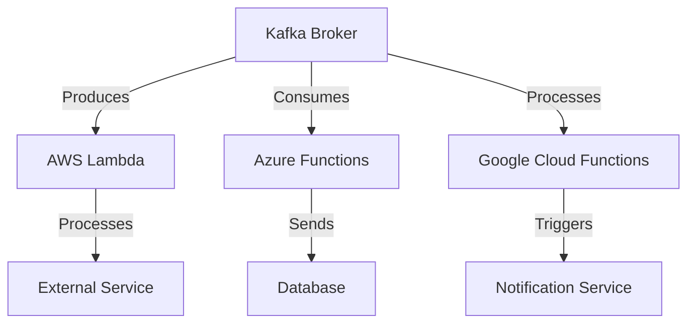

## 20.4.2 Serverless and Function-as-a-Service

### Introduction

Serverless computing and Function-as-a-Service (FaaS) have revolutionized the way applications are developed and deployed, offering a paradigm where developers can focus on writing code without worrying about the underlying infrastructure. This section explores how Apache Kafka integrates with serverless models and FaaS platforms, enabling event-driven architectures that are scalable, cost-effective, and easy to manage.

### Understanding Serverless Computing and FaaS

#### Principles of Serverless Computing

Serverless computing is a cloud-computing execution model where the cloud provider dynamically manages the allocation and provisioning of servers. A serverless application runs in stateless compute containers that are event-triggered, ephemeral, and fully managed by the cloud provider. Key principles include:

- **No Server Management**: Developers do not need to provision, scale, or manage any servers.
- **Event-Driven Execution**: Functions are triggered by events, such as HTTP requests, database changes, or message queue updates.
- **Automatic Scaling**: Functions automatically scale up or down based on the number of incoming requests.
- **Pay-per-Use**: Users are charged based on the execution time and resources consumed by their functions.

#### Function-as-a-Service (FaaS)

FaaS is a category within serverless computing that allows developers to execute code in response to events without managing server infrastructure. Popular FaaS platforms include AWS Lambda, Azure Functions, and Google Cloud Functions. These platforms provide:

- **Rapid Deployment**: Functions can be deployed quickly without the need for complex infrastructure setup.
- **Language Support**: Support for multiple programming languages, including Java, Python, Node.js, and more.
- **Integration with Cloud Services**: Seamless integration with other cloud services for building comprehensive applications.

### Integrating Kafka with Serverless Functions

Apache Kafka is a distributed event streaming platform capable of handling trillions of events a day. Integrating Kafka with serverless functions can enhance the capabilities of event-driven architectures by providing a robust, scalable, and fault-tolerant messaging backbone.

#### Challenges in Integration

1. **Latency and Throughput**: Serverless functions may introduce latency due to cold starts, and managing high throughput can be challenging.
2. **State Management**: Serverless functions are stateless by design, which can complicate stateful stream processing.
3. **Cost Management**: Frequent invocations and high data transfer can lead to increased costs.
4. **Security and Compliance**: Ensuring secure data transfer and compliance with regulations can be complex.

#### Solutions and Best Practices

- **Warm Starts**: Use techniques to minimize cold starts, such as keeping functions warm or using provisioned concurrency.
- **State Management**: Leverage external state stores like Amazon DynamoDB or Redis to manage state.
- **Cost Optimization**: Monitor function invocations and optimize code to reduce execution time and data transfer.
- **Security**: Use encryption and secure APIs to protect data in transit and at rest.

### Practical Examples

#### AWS Lambda

AWS Lambda is a serverless compute service that runs code in response to events and automatically manages the underlying compute resources.

**Example: Consuming Kafka Messages with AWS Lambda**

```java
// Java AWS Lambda function to consume Kafka messages
public class KafkaLambdaHandler implements RequestHandler<KafkaEvent, String> {
    @Override
    public String handleRequest(KafkaEvent event, Context context) {
        for (KafkaEvent.KafkaEventRecord record : event.getRecords()) {
            String message = record.getValue();
            // Process the message
            System.out.println("Received message: " + message);
        }
        return "Processed " + event.getRecords().size() + " messages.";
    }
}
```

**Considerations**:
- **Throughput**: Use batch processing to handle multiple messages in a single invocation.
- **Latency**: Minimize cold starts by configuring provisioned concurrency.

#### Azure Functions

Azure Functions is a serverless compute service that enables code execution triggered by events occurring in Azure or third-party services.

**Example: Producing Kafka Messages with Azure Functions**

```scala
// Scala Azure Function to produce messages to Kafka
import com.microsoft.azure.functions.annotation._
import com.microsoft.azure.functions._
import org.apache.kafka.clients.producer.{KafkaProducer, ProducerRecord}

class KafkaProducerFunction {
    @FunctionName("KafkaProducer")
    def run(
        @HttpTrigger(name = "req", methods = Array(HttpMethod.GET), authLevel = AuthorizationLevel.ANONYMOUS) request: HttpRequestMessage[Optional[String]],
        context: ExecutionContext): HttpResponseMessage = {
        
        val props = new Properties()
        props.put("bootstrap.servers", "your-kafka-broker:9092")
        props.put("key.serializer", "org.apache.kafka.common.serialization.StringSerializer")
        props.put("value.serializer", "org.apache.kafka.common.serialization.StringSerializer")
        
        val producer = new KafkaProducer[String, String](props)
        val record = new ProducerRecord[String, String]("your-topic", "key", "value")
        
        producer.send(record)
        producer.close()
        
        request.createResponseBuilder(HttpStatus.OK).body("Message sent to Kafka").build()
    }
}
```

**Considerations**:
- **Scalability**: Azure Functions can scale out to handle high loads, but ensure Kafka brokers can handle the increased traffic.
- **Cost**: Monitor the number of function executions to manage costs effectively.

#### Google Cloud Functions

Google Cloud Functions is a lightweight, event-driven compute solution that allows you to create small, single-purpose functions that respond to cloud events.

**Example: Processing Kafka Events with Google Cloud Functions**

```kotlin
// Kotlin Google Cloud Function to process Kafka events
import com.google.cloud.functions.HttpFunction
import com.google.cloud.functions.HttpRequest
import com.google.cloud.functions.HttpResponse
import org.apache.kafka.clients.consumer.KafkaConsumer
import java.util.Properties

class KafkaConsumerFunction : HttpFunction {
    override fun service(request: HttpRequest, response: HttpResponse) {
        val props = Properties()
        props["bootstrap.servers"] = "your-kafka-broker:9092"
        props["group.id"] = "your-group-id"
        props["key.deserializer"] = "org.apache.kafka.common.serialization.StringDeserializer"
        props["value.deserializer"] = "org.apache.kafka.common.serialization.StringDeserializer"

        val consumer = KafkaConsumer<String, String>(props)
        consumer.subscribe(listOf("your-topic"))

        val records = consumer.poll(Duration.ofMillis(1000))
        for (record in records) {
            // Process each record
            println("Received message: ${record.value()}")
        }
        consumer.close()
        
        response.writer.write("Processed Kafka messages")
    }
}
```

**Considerations**:
- **Latency**: Optimize function code to reduce execution time and improve response times.
- **Integration**: Use Google Cloud Pub/Sub as an intermediary for better integration with Google Cloud Functions.

### Considerations for Throughput, Latency, and Cost

- **Throughput**: Ensure Kafka brokers and serverless functions can handle the expected message volume. Use partitioning and consumer groups to distribute load.
- **Latency**: Minimize cold starts and optimize function code for faster execution. Consider using provisioned concurrency for critical functions.
- **Cost**: Monitor and optimize function invocations and data transfer to manage costs. Use cost-effective storage solutions for state management.

### Visualizing Kafka and Serverless Integration



**Diagram**: This diagram illustrates how Kafka brokers interact with various serverless functions across different cloud platforms, enabling seamless event-driven processing.

### Conclusion

Integrating Apache Kafka with serverless computing models and Function-as-a-Service platforms offers a powerful approach to building scalable and efficient event-driven architectures. By understanding the challenges and implementing best practices, developers can leverage the strengths of both Kafka and serverless technologies to create robust, cost-effective solutions.

## Test Your Knowledge: Serverless and Function-as-a-Service with Kafka



### What is a key benefit of serverless computing?

- [x] No server management is required.
- [ ] It requires manual scaling.
- [ ] It is always cheaper than traditional hosting.
- [ ] It only supports one programming language.

> **Explanation:** Serverless computing abstracts server management, allowing developers to focus on code without worrying about infrastructure.

### Which of the following is a challenge when integrating Kafka with serverless functions?

- [x] Latency due to cold starts.
- [ ] Lack of language support.
- [ ] Inability to handle events.
- [ ] High availability issues.

> **Explanation:** Cold starts can introduce latency in serverless functions, impacting performance.

### How can you minimize cold starts in AWS Lambda?

- [x] Use provisioned concurrency.
- [ ] Increase function memory.
- [ ] Use more threads.
- [ ] Reduce function size.

> **Explanation:** Provisioned concurrency keeps functions warm, reducing latency from cold starts.

### What is a common use case for integrating Kafka with Google Cloud Functions?

- [x] Processing Kafka events.
- [ ] Hosting static websites.
- [ ] Running machine learning models.
- [ ] Managing databases.

> **Explanation:** Google Cloud Functions can be used to process events from Kafka, enabling real-time data processing.

### Which cloud service is used as an intermediary for better integration with Google Cloud Functions?

- [x] Google Cloud Pub/Sub
- [ ] Google Cloud Storage
- [ ] Google BigQuery
- [ ] Google Cloud SQL

> **Explanation:** Google Cloud Pub/Sub can be used to bridge Kafka and Google Cloud Functions for seamless integration.

### What is a key consideration for managing costs in serverless architectures?

- [x] Monitoring function invocations.
- [ ] Increasing function size.
- [ ] Using more threads.
- [ ] Reducing memory allocation.

> **Explanation:** Monitoring invocations helps manage costs by identifying and optimizing high-frequency functions.

### Which programming language is not typically supported by FaaS platforms?

- [ ] Java
- [ ] Python
- [ ] Node.js
- [x] COBOL

> **Explanation:** FaaS platforms commonly support modern languages like Java, Python, and Node.js, but not COBOL.

### What is the primary advantage of using FaaS for event-driven architectures?

- [x] Automatic scaling based on demand.
- [ ] Manual server management.
- [ ] Fixed pricing.
- [ ] Limited language support.

> **Explanation:** FaaS automatically scales functions based on demand, making it ideal for event-driven architectures.

### How can state be managed in serverless functions?

- [x] Using external state stores like DynamoDB.
- [ ] Storing state in function memory.
- [ ] Using local file systems.
- [ ] Keeping state in environment variables.

> **Explanation:** External state stores like DynamoDB are used to manage state in stateless serverless functions.

### True or False: Serverless functions are always the most cost-effective solution.

- [ ] True
- [x] False

> **Explanation:** While serverless functions can be cost-effective, high-frequency invocations and data transfer can lead to increased costs.



---
