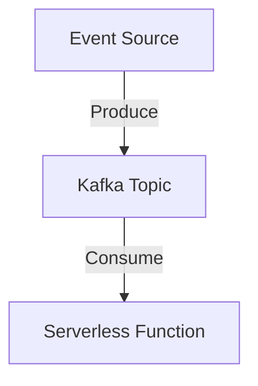
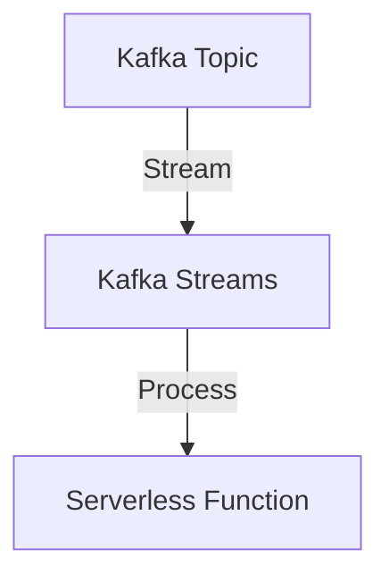
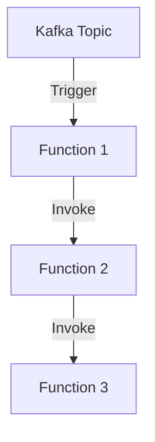

## 20.4.4 Event-Driven Serverless Patterns

In the rapidly evolving landscape of cloud-native architectures, the combination of Apache Kafka and serverless computing offers a powerful paradigm for building scalable and responsive applications. This section delves into the architectural patterns that leverage Kafka's robust event streaming capabilities alongside serverless functions, enabling developers to create systems that are both efficient and adaptable to varying workloads.

### Introduction to Event-Driven Serverless Patterns

Event-driven serverless patterns are architectural designs that utilize events to trigger serverless functions, which are stateless, ephemeral compute services that execute code in response to events. These patterns are particularly effective in scenarios where scalability, cost-efficiency, and rapid development cycles are critical. By integrating Apache Kafka, a distributed event streaming platform, with serverless functions, developers can build systems that handle real-time data processing, complex workflows, and dynamic scaling with ease.

#### Key Concepts

- **Event Ingestion**: The process of capturing and storing events from various sources in Kafka topics.
- **Stream Processing**: Real-time processing of data streams to extract insights or trigger actions.
- **Workflow Orchestration**: Coordinating multiple serverless functions to achieve complex business processes.

### Event Ingestion Patterns

Event ingestion is the first step in building an event-driven architecture. It involves capturing events from various sources and storing them in Kafka topics for further processing. This pattern is crucial for applications that require real-time data processing and analytics.

#### Pattern: Simple Event Ingestion

- **Intent**: Capture and store events from multiple sources in Kafka topics.
- **Motivation**: Enable real-time data processing and analytics by ingesting events as they occur.
- **Applicability**: Use this pattern when you need to process events from diverse sources, such as IoT devices, web applications, or databases.

**Structure**:



- **Caption**: Simple event ingestion pattern where events from various sources are produced to Kafka topics and consumed by serverless functions.

**Implementation**:

- **Java**:

    ```java
    import org.apache.kafka.clients.producer.KafkaProducer;
    import org.apache.kafka.clients.producer.ProducerRecord;
    import java.util.Properties;

    public class EventProducer {
        public static void main(String[] args) {
            Properties props = new Properties();
            props.put("bootstrap.servers", "localhost:9092");
            props.put("key.serializer", "org.apache.kafka.common.serialization.StringSerializer");
            props.put("value.serializer", "org.apache.kafka.common.serialization.StringSerializer");

            KafkaProducer<String, String> producer = new KafkaProducer<>(props);
            ProducerRecord<String, String> record = new ProducerRecord<>("events", "key", "value");

            producer.send(record);
            producer.close();
        }
    }
    ```

- **Scala**:

    ```scala
    import org.apache.kafka.clients.producer.{KafkaProducer, ProducerRecord}
    import java.util.Properties

    object EventProducer extends App {
      val props = new Properties()
      props.put("bootstrap.servers", "localhost:9092")
      props.put("key.serializer", "org.apache.kafka.common.serialization.StringSerializer")
      props.put("value.serializer", "org.apache.kafka.common.serialization.StringSerializer")

      val producer = new KafkaProducer[String, String](props)
      val record = new ProducerRecord[String, String]("events", "key", "value")

      producer.send(record)
      producer.close()
    }
    ```

- **Kotlin**:

    ```kotlin
    import org.apache.kafka.clients.producer.KafkaProducer
    import org.apache.kafka.clients.producer.ProducerRecord
    import java.util.Properties

    fun main() {
        val props = Properties().apply {
            put("bootstrap.servers", "localhost:9092")
            put("key.serializer", "org.apache.kafka.common.serialization.StringSerializer")
            put("value.serializer", "org.apache.kafka.common.serialization.StringSerializer")
        }

        KafkaProducer<String, String>(props).use { producer ->
            val record = ProducerRecord("events", "key", "value")
            producer.send(record)
        }
    }
    ```

- **Clojure**:

    ```clojure
    (require '[clojure.java.io :as io])
    (import '[org.apache.kafka.clients.producer KafkaProducer ProducerRecord])

    (defn create-producer []
      (let [props (doto (java.util.Properties.)
                    (.put "bootstrap.servers" "localhost:9092")
                    (.put "key.serializer" "org.apache.kafka.common.serialization.StringSerializer")
                    (.put "value.serializer" "org.apache.kafka.common.serialization.StringSerializer"))]
        (KafkaProducer. props)))

    (defn send-event [producer]
      (let [record (ProducerRecord. "events" "key" "value")]
        (.send producer record)))

    (with-open [producer (create-producer)]
      (send-event producer))
    ```

**Sample Use Cases**:

- **IoT Data Collection**: Ingest data from IoT sensors for real-time monitoring and analytics.
- **User Activity Tracking**: Capture user interactions on a website for behavioral analysis.

### Stream Processing Patterns

Stream processing involves real-time analysis and transformation of data streams. By using Kafka Streams or other stream processing frameworks, serverless functions can process data as it arrives, enabling applications to respond to events in real-time.

#### Pattern: Real-Time Stream Processing

- **Intent**: Process data streams in real-time to extract insights or trigger actions.
- **Motivation**: Enable applications to react to events as they occur, providing timely insights and actions.
- **Applicability**: Use this pattern for applications that require immediate processing of data, such as fraud detection or recommendation systems.

**Structure**:



- **Caption**: Real-time stream processing pattern where data from Kafka topics is processed by Kafka Streams and serverless functions.

**Implementation**:

- **Java**:

    ```java
    import org.apache.kafka.streams.KafkaStreams;
    import org.apache.kafka.streams.StreamsBuilder;
    import org.apache.kafka.streams.StreamsConfig;
    import org.apache.kafka.streams.kstream.KStream;

    import java.util.Properties;

    public class StreamProcessor {
        public static void main(String[] args) {
            Properties props = new Properties();
            props.put(StreamsConfig.APPLICATION_ID_CONFIG, "stream-processor");
            props.put(StreamsConfig.BOOTSTRAP_SERVERS_CONFIG, "localhost:9092");

            StreamsBuilder builder = new StreamsBuilder();
            KStream<String, String> stream = builder.stream("input-topic");
            stream.foreach((key, value) -> System.out.println("Processing: " + key + " -> " + value));

            KafkaStreams streams = new KafkaStreams(builder.build(), props);
            streams.start();
        }
    }
    ```

- **Scala**:

    ```scala
    import org.apache.kafka.streams.{KafkaStreams, StreamsBuilder, StreamsConfig}
    import org.apache.kafka.streams.kstream.KStream

    import java.util.Properties

    object StreamProcessor extends App {
      val props = new Properties()
      props.put(StreamsConfig.APPLICATION_ID_CONFIG, "stream-processor")
      props.put(StreamsConfig.BOOTSTRAP_SERVERS_CONFIG, "localhost:9092")

      val builder = new StreamsBuilder()
      val stream: KStream[String, String] = builder.stream("input-topic")
      stream.foreach((key, value) => println(s"Processing: $key -> $value"))

      val streams = new KafkaStreams(builder.build(), props)
      streams.start()
    }
    ```

- **Kotlin**:

    ```kotlin
    import org.apache.kafka.streams.KafkaStreams
    import org.apache.kafka.streams.StreamsBuilder
    import org.apache.kafka.streams.StreamsConfig
    import org.apache.kafka.streams.kstream.KStream
    import java.util.Properties

    fun main() {
        val props = Properties().apply {
            put(StreamsConfig.APPLICATION_ID_CONFIG, "stream-processor")
            put(StreamsConfig.BOOTSTRAP_SERVERS_CONFIG, "localhost:9092")
        }

        val builder = StreamsBuilder()
        val stream: KStream<String, String> = builder.stream("input-topic")
        stream.foreach { key, value -> println("Processing: $key -> $value") }

        KafkaStreams(builder.build(), props).use { streams -> streams.start() }
    }
    ```

- **Clojure**:

    ```clojure
    (require '[org.apache.kafka.streams KafkaStreams StreamsBuilder StreamsConfig]
             '[org.apache.kafka.streams.kstream KStream])

    (defn create-streams []
      (let [props (doto (java.util.Properties.)
                    (.put StreamsConfig/APPLICATION_ID_CONFIG "stream-processor")
                    (.put StreamsConfig/BOOTSTRAP_SERVERS_CONFIG "localhost:9092"))
            builder (StreamsBuilder.)]
        (doto (.stream builder "input-topic")
          (.foreach (fn [key value] (println "Processing:" key "->" value))))
        (KafkaStreams. (.build builder) props)))

    (with-open [streams (create-streams)]
      (.start streams))
    ```

**Sample Use Cases**:

- **Fraud Detection**: Analyze transaction streams in real-time to detect fraudulent activities.
- **Recommendation Systems**: Process user activity streams to provide personalized recommendations.

### Workflow Orchestration Patterns

Workflow orchestration involves coordinating multiple serverless functions to achieve complex business processes. This pattern is essential for applications that require the execution of a series of tasks in response to events.

#### Pattern: Event-Driven Workflow Orchestration

- **Intent**: Coordinate multiple serverless functions to execute complex workflows in response to events.
- **Motivation**: Enable the automation of business processes by orchestrating tasks triggered by events.
- **Applicability**: Use this pattern for applications that require complex workflows, such as order processing or customer onboarding.

**Structure**:



- **Caption**: Event-driven workflow orchestration pattern where serverless functions are triggered and coordinated by events from Kafka topics.

**Implementation**:

- **Java**:

    ```java
    // Example of a serverless function triggered by Kafka events
    public class WorkflowFunction {
        public void handleEvent(String event) {
            // Process the event and trigger the next function
            System.out.println("Handling event: " + event);
            // Invoke next function in the workflow
        }
    }
    ```

- **Scala**:

    ```scala
    // Example of a serverless function triggered by Kafka events
    object WorkflowFunction {
      def handleEvent(event: String): Unit = {
        // Process the event and trigger the next function
        println(s"Handling event: $event")
        // Invoke next function in the workflow
      }
    }
    ```

- **Kotlin**:

    ```kotlin
    // Example of a serverless function triggered by Kafka events
    class WorkflowFunction {
        fun handleEvent(event: String) {
            // Process the event and trigger the next function
            println("Handling event: $event")
            // Invoke next function in the workflow
        }
    }
    ```

- **Clojure**:

    ```clojure
    ;; Example of a serverless function triggered by Kafka events
    (defn handle-event [event]
      ;; Process the event and trigger the next function
      (println "Handling event:" event)
      ;; Invoke next function in the workflow
    )
    ```

**Sample Use Cases**:

- **Order Processing**: Automate the order fulfillment process by orchestrating inventory checks, payment processing, and shipping.
- **Customer Onboarding**: Coordinate tasks such as account creation, verification, and welcome messaging.

### Considerations for Idempotency, Error Handling, and State Management

When designing event-driven serverless architectures, it's crucial to address challenges related to idempotency, error handling, and state management.

#### Idempotency

- **Definition**: Idempotency ensures that an operation can be performed multiple times without changing the result beyond the initial application.
- **Importance**: In distributed systems, events may be delivered more than once. Ensuring idempotency prevents duplicate processing.
- **Strategies**: Use unique identifiers for events, maintain state in external storage, and design functions to handle repeated invocations gracefully.

#### Error Handling

- **Definition**: Error handling involves detecting, managing, and recovering from errors that occur during event processing.
- **Importance**: Robust error handling ensures system reliability and availability.
- **Strategies**: Implement retry mechanisms, use dead letter queues for failed events, and monitor error rates to identify issues.

#### State Management

- **Definition**: State management involves maintaining and accessing the state of an application across multiple invocations of serverless functions.
- **Importance**: Serverless functions are stateless by nature, so external state management is necessary for maintaining context.
- **Strategies**: Use stateful services like databases or distributed caches, leverage Kafka Streams for stateful processing, and design functions to retrieve and update state efficiently.

### Cost and Performance Optimization Strategies

Optimizing costs and performance is essential for maximizing the benefits of event-driven serverless architectures.

#### Cost Optimization

- **Pay-per-Use Model**: Serverless functions charge based on execution time and resources used. Optimize function code to reduce execution time and resource consumption.
- **Event Filtering**: Use Kafka's filtering capabilities to reduce the number of events processed by serverless functions, minimizing unnecessary invocations.
- **Batch Processing**: Process events in batches to reduce the number of function invocations and improve cost efficiency.

#### Performance Optimization

- **Cold Start Mitigation**: Minimize cold start latency by keeping serverless functions warm or using provisioned concurrency.
- **Parallel Processing**: Leverage Kafka's partitioning to process events in parallel, increasing throughput and reducing latency.
- **Resource Allocation**: Allocate appropriate resources (memory, CPU) to serverless functions based on workload requirements to ensure optimal performance.

### Conclusion

Event-driven serverless patterns offer a powerful approach to building scalable, responsive applications by combining the strengths of Apache Kafka and serverless computing. By leveraging patterns such as event ingestion, stream processing, and workflow orchestration, developers can create systems that efficiently handle real-time data processing and complex workflows. Addressing considerations for idempotency, error handling, and state management ensures the reliability and robustness of these architectures. Additionally, optimizing costs and performance allows organizations to maximize the benefits of serverless computing while maintaining efficiency and scalability.

### Further Reading

- [Apache Kafka Documentation](https://kafka.apache.org/documentation/)
- [Confluent Documentation](https://docs.confluent.io/)
- [AWS Lambda](https://aws.amazon.com/lambda/)
- [Azure Functions](https://azure.microsoft.com/en-us/services/functions/)
- [Google Cloud Functions](https://cloud.google.com/functions)

## Test Your Knowledge: Event-Driven Serverless Patterns Quiz



### What is the primary benefit of using event-driven serverless patterns with Apache Kafka?

- [x] Scalability and responsiveness
- [ ] Reduced development time
- [ ] Lower infrastructure costs
- [ ] Simplified codebase

> **Explanation:** Event-driven serverless patterns with Apache Kafka provide scalability and responsiveness by allowing systems to handle varying workloads efficiently.

### Which pattern involves capturing and storing events from various sources in Kafka topics?

- [x] Simple Event Ingestion
- [ ] Real-Time Stream Processing
- [ ] Event-Driven Workflow Orchestration
- [ ] Batch Processing

> **Explanation:** Simple Event Ingestion captures and stores events from various sources in Kafka topics for further processing.

### In the context of serverless architectures, what does idempotency ensure?

- [x] An operation can be performed multiple times without changing the result beyond the initial application.
- [ ] Errors are automatically corrected.
- [ ] State is maintained across function invocations.
- [ ] Functions execute faster.

> **Explanation:** Idempotency ensures that an operation can be performed multiple times without changing the result beyond the initial application, preventing duplicate processing.

### What is a common strategy for handling errors in event-driven serverless architectures?

- [x] Implementing retry mechanisms
- [ ] Increasing function memory
- [ ] Using synchronous processing
- [ ] Reducing event size

> **Explanation:** Implementing retry mechanisms is a common strategy for handling errors, ensuring reliability and availability.

### Which of the following is a cost optimization strategy for serverless functions?

- [x] Event Filtering
- [ ] Increasing function timeout
- [x] Batch Processing
- [ ] Using larger instances

> **Explanation:** Event Filtering and Batch Processing are cost optimization strategies that reduce unnecessary function invocations and improve efficiency.

### How can cold start latency be minimized in serverless functions?

- [x] Keeping functions warm
- [ ] Increasing function memory
- [ ] Using synchronous processing
- [ ] Reducing event size

> **Explanation:** Keeping functions warm minimizes cold start latency by ensuring that functions are ready to execute without delay.

### What is the role of Kafka Streams in real-time stream processing?

- [x] Processing data streams in real-time
- [ ] Storing events for later processing
- [x] Enabling stateful processing
- [ ] Reducing event size

> **Explanation:** Kafka Streams processes data streams in real-time and enables stateful processing, allowing applications to react to events as they occur.

### Which pattern is essential for applications requiring complex workflows?

- [x] Event-Driven Workflow Orchestration
- [ ] Simple Event Ingestion
- [ ] Real-Time Stream Processing
- [ ] Batch Processing

> **Explanation:** Event-Driven Workflow Orchestration coordinates multiple serverless functions to execute complex workflows in response to events.

### What is a key consideration when designing event-driven serverless architectures?

- [x] Idempotency
- [ ] Increasing function memory
- [ ] Using synchronous processing
- [ ] Reducing event size

> **Explanation:** Idempotency is a key consideration to ensure that operations can be performed multiple times without changing the result beyond the initial application.

### True or False: Serverless functions are inherently stateful.

- [ ] True
- [x] False

> **Explanation:** Serverless functions are inherently stateless, requiring external state management for maintaining context across invocations.


