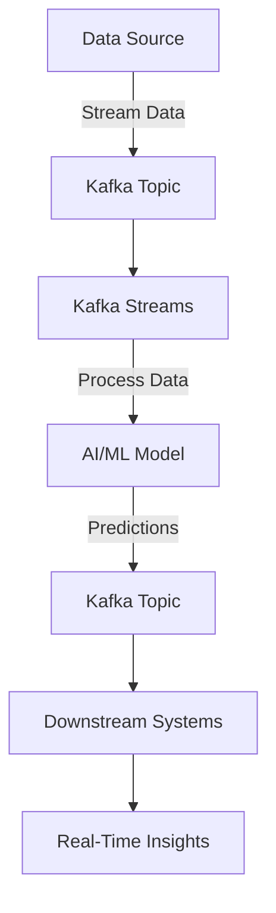

## 20.5.1 Intelligent Stream Processing

### Introduction

Intelligent Stream Processing (ISP) represents the convergence of real-time data processing with machine learning (ML) and artificial intelligence (AI). This integration empowers systems to make instantaneous decisions, predictions, and recommendations by analyzing data as it flows through the system. Apache Kafka, with its robust stream processing capabilities, serves as a foundational platform for deploying and scaling AI/ML models in real-time environments. This section delves into the applications, frameworks, challenges, and best practices of leveraging Kafka for intelligent stream processing.

### Applications of Intelligent Stream Processing

#### Fraud Detection

Fraud detection is a critical application of ISP, where AI models analyze transaction streams to identify anomalies indicative of fraudulent activity. By processing data in real-time, organizations can prevent fraud before it occurs, minimizing financial losses and enhancing security.

#### Personalization

In the realm of personalization, ISP enables the delivery of tailored content and recommendations to users based on their real-time interactions and historical data. This is particularly valuable in e-commerce and media streaming services, where personalized experiences drive user engagement and satisfaction.

#### Predictive Maintenance

Predictive maintenance leverages ISP to monitor equipment and predict failures before they occur. By analyzing sensor data streams, AI models can identify patterns that precede equipment malfunctions, allowing for timely maintenance and reducing downtime.

### Kafka's Role in Deploying and Scaling ML Models

Apache Kafka provides a scalable and fault-tolerant platform for deploying ML models in real-time. Its distributed architecture ensures that data is processed efficiently, while its integration capabilities allow for seamless interaction with various ML frameworks and libraries.

#### Model Deployment

Deploying ML models within a Kafka ecosystem involves several steps, including model training, serialization, and integration with Kafka Streams or Kafka Connect. Models can be deployed as microservices that consume data from Kafka topics, process it, and produce predictions or insights back into Kafka.

#### Scaling Models

Kafka's ability to handle high-throughput data streams makes it ideal for scaling ML models. By partitioning data and distributing processing across multiple nodes, Kafka ensures that models can handle large volumes of data without performance degradation.

### Frameworks and Libraries for Intelligent Stream Processing

Several frameworks and libraries facilitate the integration of AI/ML with Kafka, enabling intelligent stream processing.

#### TensorFlow

TensorFlow is a popular open-source library for building and deploying ML models. It can be integrated with Kafka to process data streams and make real-time predictions. TensorFlow Serving, a flexible serving system, allows for the deployment of models in production environments.

#### PyTorch

PyTorch, known for its dynamic computation graph and ease of use, is another powerful library for ML. It can be used in conjunction with Kafka to develop and deploy models that require real-time inference capabilities.

#### Apache Flink

Apache Flink is a stream processing framework that supports complex event processing and stateful computations. It integrates with Kafka to provide a robust platform for deploying AI/ML models in real-time applications.

### Challenges in Intelligent Stream Processing

#### Model Updating

One of the primary challenges in ISP is updating models without disrupting the system. Continuous learning and model retraining are essential to ensure that models remain accurate and relevant. Kafka's support for schema evolution and versioning can aid in managing model updates.

#### Data Drift

Data drift occurs when the statistical properties of the input data change over time, leading to model degradation. Monitoring data streams for drift and implementing strategies to adapt models dynamically is crucial for maintaining model performance.

### Code Examples

Below are code examples demonstrating how to integrate ML models with Kafka for intelligent stream processing.

#### Java Example with Kafka Streams and TensorFlow

```java
import org.apache.kafka.streams.KafkaStreams;
import org.apache.kafka.streams.StreamsBuilder;
import org.apache.kafka.streams.kstream.KStream;
import org.tensorflow.SavedModelBundle;
import org.tensorflow.Tensor;

public class FraudDetectionApp {
    public static void main(String[] args) {
        StreamsBuilder builder = new StreamsBuilder();
        KStream<String, String> transactions = builder.stream("transactions");

        transactions.foreach((key, value) -> {
            // Load TensorFlow model
            try (SavedModelBundle model = SavedModelBundle.load("model-dir", "serve")) {
                // Prepare input tensor
                Tensor<Float> inputTensor = Tensor.create(new float[][]{{parseTransaction(value)}}, Float.class);
                // Run model
                Tensor<Float> result = model.session().runner().feed("input", inputTensor).fetch("output").run().get(0);
                // Process result
                float prediction = result.floatValue();
                if (prediction > 0.5) {
                    System.out.println("Fraud detected for transaction: " + key);
                }
            }
        });

        KafkaStreams streams = new KafkaStreams(builder.build(), new Properties());
        streams.start();
    }

    private static float[] parseTransaction(String transaction) {
        // Parse transaction data into feature array
        return new float[]{/* feature values */};
    }
}
```

#### Scala Example with Kafka Streams and PyTorch

```scala
import org.apache.kafka.streams.scala._
import org.apache.kafka.streams.scala.kstream._
import torch._

object PredictiveMaintenanceApp extends App {
  val builder = new StreamsBuilder()
  val sensorData: KStream[String, String] = builder.stream[String, String]("sensor-data")

  sensorData.foreach { (key, value) =>
    // Load PyTorch model
    val model = Module.load("model.pt")
    // Prepare input tensor
    val inputTensor = Tensor(TensorOptions().dtype(torch.float32)).fromBlob(parseSensorData(value))
    // Run model
    val result = model.forward(inputTensor)
    // Process result
    if (result.item[Float] > 0.5) {
      println(s"Maintenance required for equipment: $key")
    }
  }

  val streams = new KafkaStreams(builder.build(), new Properties())
  streams.start()

  def parseSensorData(data: String): Array[Float] = {
    // Parse sensor data into feature array
    Array(/* feature values */)
  }
}
```

#### Kotlin Example with Kafka Streams and TensorFlow

```kotlin
import org.apache.kafka.streams.KafkaStreams
import org.apache.kafka.streams.StreamsBuilder
import org.apache.kafka.streams.kstream.KStream
import org.tensorflow.SavedModelBundle
import org.tensorflow.Tensor

fun main() {
    val builder = StreamsBuilder()
    val userInteractions: KStream<String, String> = builder.stream("user-interactions")

    userInteractions.foreach { key, value ->
        // Load TensorFlow model
        SavedModelBundle.load("model-dir", "serve").use { model ->
            // Prepare input tensor
            val inputTensor = Tensor.create(arrayOf(parseUserInteraction(value)), Float::class.java)
            // Run model
            val result = model.session().runner().feed("input", inputTensor).fetch("output").run()[0]
            // Process result
            val recommendation = result.floatValue()
            if (recommendation > 0.5) {
                println("Recommendation for user: $key")
            }
        }
    }

    val streams = KafkaStreams(builder.build(), Properties())
    streams.start()
}

fun parseUserInteraction(interaction: String): FloatArray {
    // Parse user interaction data into feature array
    return floatArrayOf(/* feature values */)
}
```

#### Clojure Example with Kafka Streams and PyTorch

```clojure
(ns predictive-maintenance.core
  (:require [org.apache.kafka.streams :as ks]
            [org.apache.kafka.streams.kstream :as kstream]
            [torch :as torch]))

(defn -main [& args]
  (let [builder (ks/streams-builder)
        sensor-data (kstream/stream builder "sensor-data")]

    (kstream/foreach sensor-data
      (fn [key value]
        ;; Load PyTorch model
        (let [model (torch/load "model.pt")
              ;; Prepare input tensor
              input-tensor (torch/from-blob (parse-sensor-data value) {:dtype torch/float32})]
          ;; Run model
          (let [result (torch/forward model input-tensor)]
            ;; Process result
            (when (> (torch/item result) 0.5)
              (println (str "Maintenance required for equipment: " key)))))))

    (let [streams (ks/kafka-streams (ks/build builder) (java.util.Properties.))]
      (.start streams))))

(defn parse-sensor-data [data]
  ;; Parse sensor data into feature array
  (float-array [/* feature values */]))
```

### Visualizing Intelligent Stream Processing

To better understand the flow of data and the integration of AI/ML models within a Kafka ecosystem, consider the following diagram:



**Diagram Description**: This diagram illustrates the flow of data from a source into a Kafka topic, where it is processed by Kafka Streams. The processed data is then fed into an AI/ML model for predictions, which are subsequently published to another Kafka topic for consumption by downstream systems, ultimately providing real-time insights.

### Best Practices for Intelligent Stream Processing

- **Model Monitoring**: Continuously monitor model performance and data quality to detect drift and degradation.
- **Scalability**: Design systems to scale horizontally, leveraging Kafka's partitioning capabilities.
- **Fault Tolerance**: Implement robust error handling and recovery mechanisms to ensure system reliability.
- **Security**: Secure data streams and model endpoints to protect sensitive information.

### Conclusion

Intelligent Stream Processing with Kafka enables organizations to harness the power of AI and ML for real-time decision-making and insights. By integrating advanced models with Kafka's robust streaming capabilities, businesses can enhance their operations, improve customer experiences, and gain a competitive edge. As AI and ML technologies continue to evolve, the potential for intelligent stream processing will only grow, offering new opportunities for innovation and efficiency.

## Test Your Knowledge: Intelligent Stream Processing with Kafka Quiz



### What is a primary application of Intelligent Stream Processing in fraud detection?

- [x] Identifying anomalies in transaction streams
- [ ] Generating static reports
- [ ] Archiving historical data
- [ ] Scheduling batch jobs

> **Explanation:** Intelligent Stream Processing is used to identify anomalies in transaction streams in real-time, which is crucial for fraud detection.

### How does Kafka support the scaling of ML models?

- [x] By partitioning data and distributing processing
- [ ] By storing data in a single node
- [ ] By limiting data throughput
- [ ] By using only synchronous processing

> **Explanation:** Kafka supports scaling by partitioning data and distributing processing across multiple nodes, allowing for high throughput and efficient model scaling.

### Which framework is known for its dynamic computation graph and ease of use?

- [ ] TensorFlow
- [x] PyTorch
- [ ] Apache Flink
- [ ] Apache Beam

> **Explanation:** PyTorch is known for its dynamic computation graph, which allows for flexible model development and ease of use.

### What challenge does data drift present in Intelligent Stream Processing?

- [x] Model degradation over time
- [ ] Increased data storage costs
- [ ] Reduced data throughput
- [ ] Simplified model updates

> **Explanation:** Data drift leads to model degradation over time as the statistical properties of input data change, affecting model accuracy.

### Which of the following is a best practice for Intelligent Stream Processing?

- [x] Continuously monitor model performance
- [ ] Store all data in memory
- [ ] Use a single-threaded processing model
- [ ] Disable security features

> **Explanation:** Continuously monitoring model performance is a best practice to ensure models remain accurate and effective.

### What is the role of Kafka Streams in Intelligent Stream Processing?

- [x] Processing data in real-time
- [ ] Storing data long-term
- [ ] Scheduling batch jobs
- [ ] Generating static reports

> **Explanation:** Kafka Streams is used for processing data in real-time, enabling intelligent stream processing applications.

### Which library is used for building and deploying ML models in the provided Java example?

- [x] TensorFlow
- [ ] PyTorch
- [ ] Apache Flink
- [ ] Apache Beam

> **Explanation:** The Java example uses TensorFlow to build and deploy ML models for intelligent stream processing.

### What is a key benefit of using Kafka for Intelligent Stream Processing?

- [x] High throughput and fault tolerance
- [ ] Low data retention
- [ ] Single-node processing
- [ ] Limited scalability

> **Explanation:** Kafka provides high throughput and fault tolerance, making it ideal for intelligent stream processing applications.

### How can model updates be managed in a Kafka ecosystem?

- [x] Using schema evolution and versioning
- [ ] By stopping all data streams
- [ ] By deleting old models
- [ ] By using only static models

> **Explanation:** Schema evolution and versioning help manage model updates without disrupting the system.

### True or False: Intelligent Stream Processing can only be used for fraud detection.

- [ ] True
- [x] False

> **Explanation:** Intelligent Stream Processing has a wide range of applications beyond fraud detection, including personalization and predictive maintenance.


