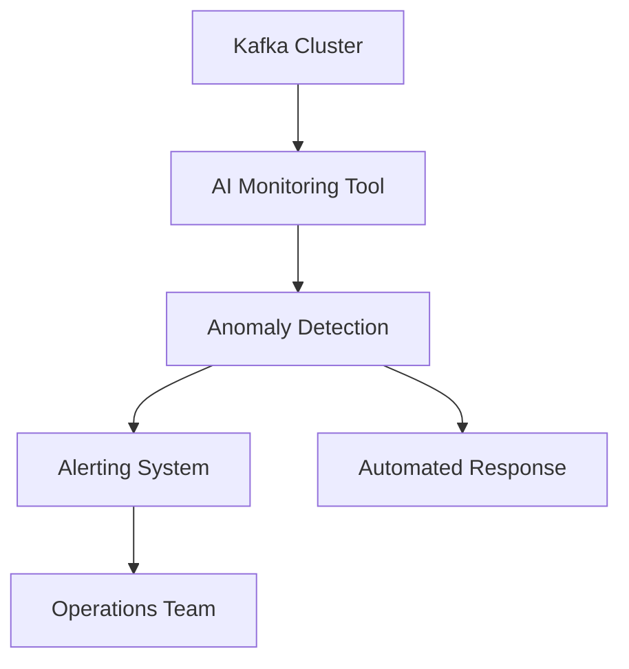

## 20.5.2 Automated Operations with AI

In the rapidly evolving landscape of distributed systems, Apache Kafka stands out as a robust platform for real-time data processing. However, managing Kafka clusters at scale presents significant challenges, including maintaining performance, ensuring reliability, and minimizing downtime. Leveraging Artificial Intelligence (AI) for automated operations offers a transformative approach to addressing these challenges. This section delves into how AI can automate Kafka operations, enhancing efficiency, reducing human error, and bolstering system resilience.

### AI-Driven Tools for Kafka Monitoring and Management

AI-driven tools are revolutionizing the way Kafka clusters are monitored and managed. These tools utilize machine learning algorithms to analyze vast amounts of operational data, providing insights that were previously unattainable through traditional methods.

#### AI-Powered Monitoring

AI-powered monitoring tools continuously analyze Kafka's operational metrics, such as throughput, latency, and error rates. By learning the normal behavior of the system, these tools can detect anomalies that may indicate potential issues.

- **Example**: A machine learning model trained on historical Kafka metrics can identify deviations from normal patterns, such as sudden spikes in latency or unexpected drops in throughput. This proactive anomaly detection allows for timely interventions, preventing minor issues from escalating into major outages.



*Diagram: AI-powered monitoring system for Kafka clusters, illustrating the flow from anomaly detection to automated responses and alerts.*

#### Predictive Maintenance

Predictive maintenance leverages AI to forecast potential failures before they occur. By analyzing trends in Kafka's operational data, AI models can predict when components are likely to fail, allowing for preemptive maintenance.

- **Example**: An AI model might predict that a broker is likely to experience disk failure based on increasing I/O latency and error rates. This prediction enables the operations team to replace the disk before it fails, avoiding downtime.

### Anomaly Detection in Operational Data

Anomaly detection is a critical aspect of AI-driven Kafka operations. It involves identifying patterns in data that do not conform to expected behavior. AI models, particularly those based on unsupervised learning, are adept at detecting such anomalies.

#### Techniques for Anomaly Detection

1. **Statistical Methods**: These involve using statistical tests to identify deviations from normal distributions.
2. **Machine Learning Models**: Algorithms such as clustering and neural networks can learn complex patterns and identify anomalies.
3. **Hybrid Approaches**: Combining statistical and machine learning methods can enhance detection accuracy.

- **Code Example**: Implementing anomaly detection using a simple clustering algorithm in Python.

```python
from sklearn.cluster import DBSCAN
import numpy as np

# Sample Kafka metrics data
data = np.array([[0.1, 0.2], [0.15, 0.25], [0.2, 0.3], [10, 10]])  # Last point is an anomaly

# DBSCAN clustering
db = DBSCAN(eps=0.3, min_samples=2).fit(data)
labels = db.labels_

# Identify anomalies
anomalies = data[labels == -1]
print("Anomalies detected:", anomalies)
```

*Explanation: This code uses DBSCAN, a clustering algorithm, to identify anomalies in Kafka metrics data. The point `[10, 10]` is detected as an anomaly.*

### Predictive Maintenance and Automated Scaling

AI not only aids in anomaly detection but also plays a pivotal role in predictive maintenance and automated scaling, ensuring that Kafka clusters operate efficiently and reliably.

#### Predictive Maintenance

Predictive maintenance involves using AI to predict when maintenance should be performed on Kafka components to prevent failures. This approach reduces downtime and maintenance costs.

- **Implementation**: Use time-series forecasting models to predict future states of Kafka components based on historical data.

```scala
import com.cloudera.sparkts.models.ARIMA
import org.apache.spark.mllib.linalg.Vectors

// Sample time-series data for broker disk usage
val data = Vectors.dense(Array(100.0, 105.0, 110.0, 120.0, 130.0))

// Fit ARIMA model
val arimaModel = ARIMA.fitModel(1, 0, 1, data)

// Forecast future disk usage
val forecast = arimaModel.forecast(data, 5)
println("Forecasted disk usage:", forecast)
```

*Explanation: This Scala code uses an ARIMA model to forecast future disk usage for a Kafka broker, aiding in predictive maintenance.*

#### Automated Scaling

Automated scaling involves dynamically adjusting the resources allocated to Kafka clusters based on current demand. AI models can predict traffic patterns and scale resources accordingly.

- **Example**: An AI model predicts a surge in traffic during peak hours and automatically provisions additional brokers to handle the load.

```kotlin
fun scaleKafkaCluster(currentLoad: Double, threshold: Double) {
    if (currentLoad > threshold) {
        println("Scaling up Kafka cluster...")
        // Code to add more brokers
    } else {
        println("Current resources are sufficient.")
    }
}

// Simulate current load
val currentLoad = 0.8
val threshold = 0.75
scaleKafkaCluster(currentLoad, threshold)
```

*Explanation: This Kotlin function checks the current load on a Kafka cluster and scales up resources if the load exceeds a predefined threshold.*

### Potential Risks and Human Oversight

While AI-driven automation offers numerous benefits, it also introduces potential risks that must be managed through human oversight.

#### Risks of AI Automation

1. **Over-Reliance on AI**: Relying solely on AI can lead to complacency and a lack of human intervention when needed.
2. **Model Bias**: AI models may exhibit bias if trained on incomplete or skewed data.
3. **False Positives/Negatives**: Anomalies may be incorrectly identified, leading to unnecessary interventions or missed issues.

#### Ensuring Human Oversight

- **Human-in-the-Loop**: Incorporate human oversight in AI-driven processes to validate decisions and intervene when necessary.
- **Regular Audits**: Conduct regular audits of AI models and their outputs to ensure accuracy and fairness.
- **Continuous Learning**: Update AI models with new data to improve their accuracy and adapt to changing conditions.

### Conclusion

AI-driven automation is transforming Kafka operations, offering unprecedented efficiency, reliability, and scalability. By leveraging AI for monitoring, predictive maintenance, and automated scaling, organizations can enhance their Kafka deployments while minimizing human error. However, it is crucial to maintain human oversight to manage potential risks and ensure that AI-driven processes align with organizational goals.

### Knowledge Check

To reinforce your understanding of AI-driven automation in Kafka operations, consider the following questions and challenges:

- How can AI improve the efficiency of Kafka cluster management?
- What are the potential risks associated with AI-driven automation, and how can they be mitigated?
- Implement a simple anomaly detection algorithm for Kafka metrics in your preferred programming language.
- Discuss the role of predictive maintenance in enhancing Kafka's reliability.

### References and Further Reading

- [Apache Kafka Documentation](https://kafka.apache.org/documentation/)
- [Confluent Documentation](https://docs.confluent.io/)
- [Machine Learning for Predictive Maintenance](https://www.ibm.com/cloud/learn/predictive-maintenance)
- [AI in Operations: A Practical Guide](https://www.gartner.com/en/documents/3989517)

## Test Your Knowledge: AI-Driven Automation in Kafka Operations Quiz



### How does AI improve Kafka monitoring?

- [x] By detecting anomalies in real-time
- [ ] By increasing data throughput
- [ ] By reducing the number of brokers
- [ ] By eliminating the need for human operators

> **Explanation:** AI improves Kafka monitoring by detecting anomalies in real-time, allowing for proactive interventions.

### What is predictive maintenance in the context of Kafka?

- [x] Forecasting potential failures to perform preemptive maintenance
- [ ] Automatically scaling Kafka clusters based on load
- [ ] Reducing the number of brokers during low traffic
- [ ] Increasing data retention periods

> **Explanation:** Predictive maintenance involves forecasting potential failures to perform preemptive maintenance, reducing downtime and costs.

### Which AI technique is commonly used for anomaly detection?

- [x] Clustering algorithms
- [ ] Linear regression
- [ ] Decision trees
- [ ] Genetic algorithms

> **Explanation:** Clustering algorithms are commonly used for anomaly detection as they can identify patterns that deviate from the norm.

### What is a potential risk of AI-driven automation?

- [x] Over-reliance on AI leading to complacency
- [ ] Increased manual intervention
- [ ] Reduced system performance
- [ ] Decreased data security

> **Explanation:** Over-reliance on AI can lead to complacency, where human operators may not intervene when necessary.

### How can human oversight be ensured in AI-driven processes?

- [x] Incorporating human-in-the-loop mechanisms
- [ ] Eliminating manual audits
- [x] Conducting regular audits of AI models
- [ ] Reducing human intervention

> **Explanation:** Human oversight can be ensured by incorporating human-in-the-loop mechanisms and conducting regular audits of AI models.

### What is the role of automated scaling in Kafka operations?

- [x] Dynamically adjusting resources based on demand
- [ ] Increasing data retention periods
- [ ] Reducing the number of brokers
- [ ] Eliminating the need for monitoring

> **Explanation:** Automated scaling dynamically adjusts resources based on demand, ensuring efficient resource utilization.

### How can AI models be kept accurate and fair?

- [x] Regularly updating models with new data
- [ ] Reducing the amount of training data
- [x] Conducting audits to check for bias
- [ ] Eliminating human oversight

> **Explanation:** AI models can be kept accurate and fair by regularly updating them with new data and conducting audits to check for bias.

### What is a hybrid approach to anomaly detection?

- [x] Combining statistical and machine learning methods
- [ ] Using only statistical methods
- [ ] Using only machine learning methods
- [ ] Eliminating all manual interventions

> **Explanation:** A hybrid approach to anomaly detection combines statistical and machine learning methods to enhance detection accuracy.

### What is the benefit of using AI for Kafka operations?

- [x] Improved efficiency and reduced human error
- [ ] Increased manual intervention
- [ ] Reduced system performance
- [ ] Decreased data security

> **Explanation:** AI improves efficiency and reduces human error in Kafka operations, enhancing overall system performance.

### True or False: AI-driven automation eliminates the need for human operators in Kafka operations.

- [ ] True
- [x] False

> **Explanation:** False. While AI-driven automation enhances efficiency, human oversight is still necessary to manage potential risks and ensure alignment with organizational goals.


