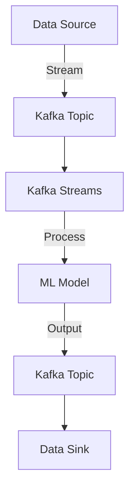

## 20.5 Impact of Machine Learning and AI on Kafka Applications

### Introduction

The integration of machine learning (ML) and artificial intelligence (AI) into Apache Kafka applications is revolutionizing the way data is processed and analyzed in real-time. As enterprises increasingly rely on data-driven insights, the ability to apply ML and AI to streaming data enables more intelligent, responsive, and automated systems. This section explores the trends, applications, and considerations for incorporating ML and AI into Kafka-based systems, focusing on real-time analytics, anomaly detection, predictive scaling, and more.

### Trends in Applying ML/AI to Data Streams

#### Real-Time Analytics

Real-time analytics is a critical application of ML and AI in Kafka environments. By processing data as it arrives, organizations can gain immediate insights and make timely decisions. This capability is particularly valuable in sectors such as finance, healthcare, and e-commerce, where rapid response times can significantly impact outcomes.

- **Example**: In financial trading, real-time analytics powered by ML models can detect market trends and anomalies, enabling traders to make informed decisions quickly.

#### Anomaly Detection

Anomaly detection involves identifying unusual patterns or outliers in data streams, which can indicate potential issues such as fraud, system failures, or security breaches. ML algorithms, such as clustering and neural networks, are well-suited for this task, as they can learn to recognize normal behavior and flag deviations.

- **Example**: In cybersecurity, anomaly detection models can monitor network traffic in real-time, alerting administrators to potential threats as they occur.

#### Predictive Maintenance

Predictive maintenance leverages ML models to forecast equipment failures before they happen, reducing downtime and maintenance costs. By analyzing sensor data streams, these models can predict when a machine is likely to fail and schedule maintenance proactively.

- **Example**: In manufacturing, predictive maintenance models can analyze data from IoT sensors on production equipment, predicting failures and optimizing maintenance schedules.

### Enhancing Operational Aspects of Kafka with AI

#### Predictive Scaling

Predictive scaling uses AI to anticipate changes in workload and adjust resources accordingly. This capability is crucial for maintaining performance and cost-efficiency in Kafka deployments, especially in cloud environments where resource allocation can be dynamic.

- **Example**: An AI model can predict traffic spikes in an e-commerce application during a sale event, automatically scaling Kafka clusters to handle the increased load.

#### Failure Prediction

AI can enhance Kafka's reliability by predicting potential failures in the system. By analyzing logs and performance metrics, AI models can identify patterns that precede failures, allowing for preemptive action.

- **Example**: In a Kafka deployment, an AI model might detect early signs of broker failure, triggering alerts and initiating failover procedures to minimize downtime.

### AI-Driven Kafka Applications

#### Intelligent Stream Processing

Intelligent stream processing involves applying ML models directly to data streams to perform tasks such as classification, regression, and clustering. This approach allows for real-time decision-making and automation.

- **Example**: A retail company might use intelligent stream processing to categorize customer interactions in real-time, personalizing recommendations and improving customer experience.

#### Automated Data Enrichment

Automated data enrichment uses AI to enhance data streams with additional context or information. This process can involve tasks such as entity recognition, sentiment analysis, and language translation.

- **Example**: In a customer service application, AI models can analyze chat logs in real-time, extracting key entities and sentiments to provide agents with actionable insights.

### Considerations for Integrating ML Models into Streaming Pipelines

#### Model Deployment and Management

Deploying ML models in a streaming environment requires careful consideration of factors such as latency, scalability, and model updates. Tools like TensorFlow Serving and MLflow can facilitate model deployment and management.

- **Example**: A company might use TensorFlow Serving to deploy a sentiment analysis model in a Kafka Streams application, ensuring low-latency predictions.

#### Data Preprocessing and Feature Engineering

Effective ML models rely on high-quality data, making preprocessing and feature engineering critical steps in the pipeline. Techniques such as normalization, encoding, and feature selection can improve model performance.

- **Example**: In a fraud detection system, preprocessing might involve normalizing transaction amounts and encoding categorical variables to enhance model accuracy.

#### Monitoring and Retraining

Continuous monitoring and retraining of ML models are essential to maintain their accuracy and relevance. As data streams evolve, models must adapt to new patterns and trends.

- **Example**: An e-commerce platform might monitor the performance of its recommendation engine, retraining the model periodically to account for changing customer preferences.

### Code Examples

#### Java Example: Real-Time Anomaly Detection with Kafka Streams

```java
import org.apache.kafka.streams.KafkaStreams;
import org.apache.kafka.streams.StreamsBuilder;
import org.apache.kafka.streams.kstream.KStream;

public class AnomalyDetection {
    public static void main(String[] args) {
        StreamsBuilder builder = new StreamsBuilder();
        KStream<String, String> sourceStream = builder.stream("input-topic");

        KStream<String, String> anomalies = sourceStream.filter((key, value) -> {
            // Simple anomaly detection logic
            return value.contains("anomaly");
        });

        anomalies.to("anomaly-topic");

        KafkaStreams streams = new KafkaStreams(builder.build(), new Properties());
        streams.start();
    }
}
```

#### Scala Example: Predictive Maintenance with Kafka Streams

```scala
import org.apache.kafka.streams.scala._
import org.apache.kafka.streams.scala.kstream._

object PredictiveMaintenance extends App {
  val builder = new StreamsBuilder()
  val sourceStream: KStream[String, String] = builder.stream[String, String]("sensor-data")

  val maintenanceAlerts = sourceStream.filter((key, value) => {
    // Predictive maintenance logic
    value.contains("maintenance")
  })

  maintenanceAlerts.to("maintenance-alerts")

  val streams = new KafkaStreams(builder.build(), new Properties())
  streams.start()
}
```

#### Kotlin Example: Intelligent Stream Processing

```kotlin
import org.apache.kafka.streams.KafkaStreams
import org.apache.kafka.streams.StreamsBuilder
import org.apache.kafka.streams.kstream.KStream

fun main() {
    val builder = StreamsBuilder()
    val sourceStream: KStream<String, String> = builder.stream("customer-interactions")

    val personalizedRecommendations = sourceStream.mapValues { value ->
        // Intelligent processing logic
        "Recommendation for $value"
    }

    personalizedRecommendations.to("recommendations")

    val streams = KafkaStreams(builder.build(), Properties())
    streams.start()
}
```

#### Clojure Example: Automated Data Enrichment

```clojure
(ns data-enrichment
  (:require [org.apache.kafka.streams :as ks]
            [org.apache.kafka.streams.kstream :as kstream]))

(defn enrich-data [value]
  ;; Enrichment logic
  (str "Enriched " value))

(defn -main []
  (let [builder (ks/StreamsBuilder.)
        source-stream (.stream builder "raw-data")]
    (-> source-stream
        (kstream/mapValues enrich-data)
        (.to "enriched-data"))

    (let [streams (ks/KafkaStreams. (.build builder) (java.util.Properties.))]
      (.start streams))))
```

### Visualizing AI-Driven Kafka Applications



**Diagram**: This diagram illustrates the flow of data from a source through Kafka, where it is processed by a Kafka Streams application that applies an ML model, and then outputs the results to another Kafka topic.

### Key Takeaways

- **Integration of ML and AI into Kafka applications** enables real-time analytics, anomaly detection, and predictive maintenance.
- **AI enhances operational aspects** of Kafka, such as predictive scaling and failure prediction.
- **Considerations for ML integration** include model deployment, data preprocessing, and continuous monitoring.
- **Practical applications** demonstrate the power of AI-driven Kafka systems in various industries.

## Test Your Knowledge: Machine Learning and AI in Kafka Applications Quiz



### What is a primary benefit of integrating ML models into Kafka applications?

- [x] Real-time decision-making
- [ ] Reduced data storage costs
- [ ] Simplified data architecture
- [ ] Increased data redundancy

> **Explanation:** Integrating ML models into Kafka applications allows for real-time decision-making by processing data as it arrives.

### Which AI application in Kafka is used to identify unusual patterns in data streams?

- [ ] Predictive scaling
- [x] Anomaly detection
- [ ] Data enrichment
- [ ] Intelligent stream processing

> **Explanation:** Anomaly detection involves identifying unusual patterns or outliers in data streams.

### What is predictive scaling in the context of Kafka?

- [ ] Scaling Kafka clusters based on historical data
- [x] Anticipating workload changes and adjusting resources
- [ ] Reducing the number of Kafka brokers
- [ ] Increasing the number of Kafka topics

> **Explanation:** Predictive scaling uses AI to anticipate changes in workload and adjust resources accordingly.

### How can AI enhance Kafka's reliability?

- [ ] By increasing the number of partitions
- [x] By predicting potential failures
- [ ] By simplifying consumer group management
- [ ] By reducing network latency

> **Explanation:** AI can enhance Kafka's reliability by predicting potential failures in the system.

### What is a key consideration when deploying ML models in streaming environments?

- [x] Latency and scalability
- [ ] Data redundancy
- [ ] Topic naming conventions
- [ ] Broker configuration

> **Explanation:** Deploying ML models in streaming environments requires careful consideration of latency and scalability.

### Which tool can facilitate model deployment and management in Kafka applications?

- [ ] Apache Zookeeper
- [ ] Kafka Connect
- [x] TensorFlow Serving
- [ ] Apache Flink

> **Explanation:** TensorFlow Serving can facilitate model deployment and management in Kafka applications.

### What is the role of data preprocessing in ML pipelines?

- [ ] To increase data redundancy
- [x] To improve model performance
- [ ] To simplify data architecture
- [ ] To reduce data storage costs

> **Explanation:** Data preprocessing and feature engineering are critical steps to improve model performance.

### Why is continuous monitoring important for ML models in Kafka applications?

- [ ] To reduce network latency
- [ ] To simplify consumer group management
- [x] To maintain accuracy and relevance
- [ ] To increase the number of partitions

> **Explanation:** Continuous monitoring and retraining of ML models are essential to maintain their accuracy and relevance.

### What is an example of AI-driven Kafka application?

- [ ] Topic replication
- [x] Intelligent stream processing
- [ ] Broker configuration
- [ ] Consumer group management

> **Explanation:** Intelligent stream processing involves applying ML models directly to data streams for real-time decision-making.

### True or False: AI can be used to automate data enrichment in Kafka applications.

- [x] True
- [ ] False

> **Explanation:** AI can automate data enrichment by enhancing data streams with additional context or information.



---
