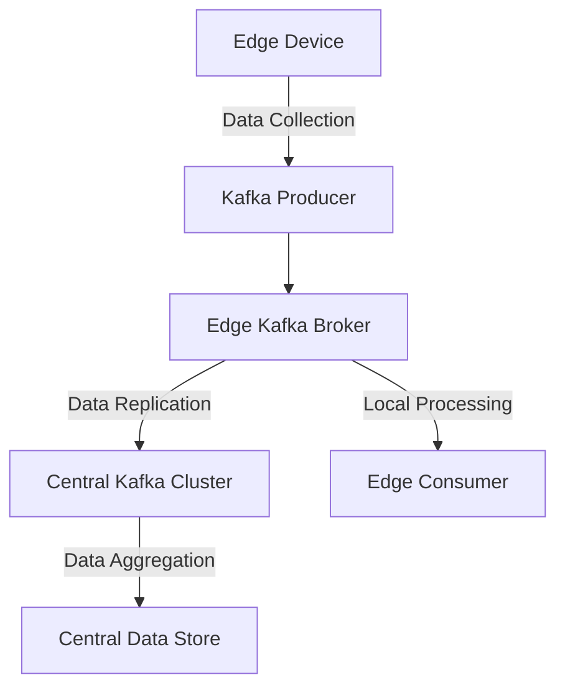

## 20.6.1 Deploying Kafka at the Edge

Edge computing represents a paradigm shift in data processing, where computation and data storage are performed closer to the data source rather than relying on a centralized data center. This approach reduces latency, conserves bandwidth, and enhances real-time data processing capabilities. Deploying Apache Kafka at the edge involves configuring lightweight Kafka instances that can operate efficiently under hardware and resource constraints typical of edge environments.

### Understanding Edge Computing Constraints

Edge computing environments often face several constraints that differ significantly from traditional data centers:

- **Limited Hardware Resources**: Edge devices typically have less processing power, memory, and storage compared to centralized servers.
- **Intermittent Connectivity**: Network connectivity at the edge can be unreliable, necessitating robust data synchronization mechanisms.
- **Energy Efficiency**: Edge devices may rely on battery power, requiring energy-efficient operations.
- **Scalability Challenges**: Scaling at the edge involves managing numerous distributed nodes, each with unique constraints.

### Optimizing Kafka for Edge Deployments

To deploy Kafka effectively at the edge, it is crucial to optimize its configuration to accommodate these constraints. Here are some strategies:

#### 1. Resource Allocation and Configuration

- **Memory Management**: Configure Kafka to use minimal memory by adjusting heap sizes and disabling unnecessary features. Use the `-Xms` and `-Xmx` JVM options to set the initial and maximum heap size.
  
- **Disk Usage**: Optimize log retention policies to manage disk space efficiently. Use log compaction and set appropriate retention periods to prevent disk overflow.

- **Network Configuration**: Tune network settings to handle intermittent connectivity. Adjust `linger.ms` and `batch.size` to optimize network usage.

#### 2. Lightweight Kafka Distributions

Consider using lightweight Kafka distributions or alternatives that are specifically designed for edge environments. These distributions are optimized for low-resource scenarios and can run on devices with limited capabilities.

#### 3. Containerization and Orchestration

Containerization is a powerful tool for deploying Kafka at the edge. It allows for consistent deployment across different environments and simplifies resource management.

- **Docker**: Use Docker to containerize Kafka instances, ensuring they are lightweight and portable. Docker images can be tailored to include only necessary components, reducing the overall footprint.

- **Kubernetes**: Employ Kubernetes for orchestrating Kafka deployments at the edge. Kubernetes can manage resource allocation, scaling, and failover, even in resource-constrained environments.

- **K3s**: Consider using K3s, a lightweight Kubernetes distribution, specifically designed for edge computing and IoT devices.

#### 4. Connectivity and Data Synchronization

Ensuring reliable data synchronization between edge devices and central clusters is critical:

- **Data Replication**: Use Kafka's replication features to ensure data durability and availability across edge nodes.

- **Offline Capabilities**: Implement mechanisms to handle data buffering and synchronization during network outages. Kafka's log-based architecture can store data locally until connectivity is restored.

- **Edge-to-Cloud Integration**: Establish secure and efficient data pipelines between edge devices and central data centers. Use Kafka Connect for seamless integration with various data sources and sinks.

### Practical Applications and Real-World Scenarios

Deploying Kafka at the edge is particularly beneficial in scenarios where real-time data processing and low latency are critical. Here are some examples:

- **Internet of Things (IoT)**: In IoT applications, edge devices collect and process sensor data in real-time, reducing the need for constant communication with a central server.

- **Smart Cities**: Edge computing enables smart city applications to process data locally, such as traffic management systems that adjust signals based on real-time traffic conditions.

- **Industrial Automation**: In manufacturing, edge devices can monitor equipment and perform predictive maintenance by analyzing data locally, minimizing downtime.

### Code Examples

To illustrate the deployment of Kafka at the edge, let's explore code examples in Java, Scala, Kotlin, and Clojure. These examples demonstrate how to configure Kafka producers and consumers for edge environments.

#### Java Example

```java
import org.apache.kafka.clients.producer.KafkaProducer;
import org.apache.kafka.clients.producer.ProducerConfig;
import org.apache.kafka.clients.producer.ProducerRecord;
import org.apache.kafka.common.serialization.StringSerializer;

import java.util.Properties;

public class EdgeKafkaProducer {
    public static void main(String[] args) {
        Properties props = new Properties();
        props.put(ProducerConfig.BOOTSTRAP_SERVERS_CONFIG, "edge-broker:9092");
        props.put(ProducerConfig.KEY_SERIALIZER_CLASS_CONFIG, StringSerializer.class.getName());
        props.put(ProducerConfig.VALUE_SERIALIZER_CLASS_CONFIG, StringSerializer.class.getName());
        props.put(ProducerConfig.LINGER_MS_CONFIG, 5);
        props.put(ProducerConfig.BATCH_SIZE_CONFIG, 16384);

        KafkaProducer<String, String> producer = new KafkaProducer<>(props);

        for (int i = 0; i < 100; i++) {
            ProducerRecord<String, String> record = new ProducerRecord<>("edge-topic", Integer.toString(i), "Edge message " + i);
            producer.send(record);
        }

        producer.close();
    }
}
```

#### Scala Example

```scala
import org.apache.kafka.clients.producer.{KafkaProducer, ProducerConfig, ProducerRecord}
import org.apache.kafka.common.serialization.StringSerializer

import java.util.Properties

object EdgeKafkaProducer {
  def main(args: Array[String]): Unit = {
    val props = new Properties()
    props.put(ProducerConfig.BOOTSTRAP_SERVERS_CONFIG, "edge-broker:9092")
    props.put(ProducerConfig.KEY_SERIALIZER_CLASS_CONFIG, classOf[StringSerializer].getName)
    props.put(ProducerConfig.VALUE_SERIALIZER_CLASS_CONFIG, classOf[StringSerializer].getName)
    props.put(ProducerConfig.LINGER_MS_CONFIG, "5")
    props.put(ProducerConfig.BATCH_SIZE_CONFIG, "16384")

    val producer = new KafkaProducer[String, String](props)

    for (i <- 0 until 100) {
      val record = new ProducerRecord[String, String]("edge-topic", i.toString, s"Edge message $i")
      producer.send(record)
    }

    producer.close()
  }
}
```

#### Kotlin Example

```kotlin
import org.apache.kafka.clients.producer.KafkaProducer
import org.apache.kafka.clients.producer.ProducerConfig
import org.apache.kafka.clients.producer.ProducerRecord
import org.apache.kafka.common.serialization.StringSerializer
import java.util.Properties

fun main() {
    val props = Properties().apply {
        put(ProducerConfig.BOOTSTRAP_SERVERS_CONFIG, "edge-broker:9092")
        put(ProducerConfig.KEY_SERIALIZER_CLASS_CONFIG, StringSerializer::class.java.name)
        put(ProducerConfig.VALUE_SERIALIZER_CLASS_CONFIG, StringSerializer::class.java.name)
        put(ProducerConfig.LINGER_MS_CONFIG, 5)
        put(ProducerConfig.BATCH_SIZE_CONFIG, 16384)
    }

    val producer = KafkaProducer<String, String>(props)

    for (i in 0 until 100) {
        val record = ProducerRecord("edge-topic", i.toString(), "Edge message $i")
        producer.send(record)
    }

    producer.close()
}
```

#### Clojure Example

```clojure
(require '[clojure.java.io :as io])
(import '[org.apache.kafka.clients.producer KafkaProducer ProducerConfig ProducerRecord]
        '[org.apache.kafka.common.serialization StringSerializer])

(defn create-producer []
  (let [props (doto (java.util.Properties.)
                (.put ProducerConfig/BOOTSTRAP_SERVERS_CONFIG "edge-broker:9092")
                (.put ProducerConfig/KEY_SERIALIZER_CLASS_CONFIG StringSerializer)
                (.put ProducerConfig/VALUE_SERIALIZER_CLASS_CONFIG StringSerializer)
                (.put ProducerConfig/LINGER_MS_CONFIG "5")
                (.put ProducerConfig/BATCH_SIZE_CONFIG "16384"))]
    (KafkaProducer. props)))

(defn send-messages [producer]
  (doseq [i (range 100)]
    (let [record (ProducerRecord. "edge-topic" (str i) (str "Edge message " i))]
      (.send producer record))))

(defn -main []
  (let [producer (create-producer)]
    (send-messages producer)
    (.close producer)))
```

### Visualizing Kafka at the Edge

To better understand the architecture of deploying Kafka at the edge, consider the following diagram illustrating the data flow and components involved:



**Diagram Caption**: This diagram illustrates the flow of data from edge devices to a central Kafka cluster, highlighting local processing and data replication.

### Key Considerations and Best Practices

- **Security**: Ensure data security at the edge by implementing encryption and access controls. Refer to [12.3 Data Encryption and Compliance]( "Data Encryption and Compliance") for more details.

- **Monitoring and Management**: Implement monitoring tools to track the performance and health of edge deployments. Use lightweight monitoring solutions that can run on edge devices.

- **Scalability**: Design edge deployments to scale horizontally by adding more nodes as needed. Consider using Kafka's partitioning and replication features to distribute load effectively.

- **Data Governance**: Maintain data governance policies to ensure data quality and compliance with regulations. See [6.4 Data Governance and Lineage in Kafka]( "Data Governance and Lineage in Kafka") for guidance.

### Knowledge Check

To reinforce your understanding of deploying Kafka at the edge, consider the following questions:

1. What are the primary constraints of edge computing environments?
2. How can Kafka configurations be optimized for low-resource scenarios?
3. What role does containerization play in deploying Kafka at the edge?
4. How can data synchronization be managed between edge devices and central clusters?
5. What are some practical applications of deploying Kafka at the edge?

### Conclusion

Deploying Kafka at the edge presents unique challenges and opportunities. By optimizing configurations, leveraging containerization, and ensuring robust connectivity, Kafka can effectively support real-time data processing in edge environments. As edge computing continues to evolve, Kafka's role in enabling distributed, low-latency data processing will become increasingly vital.

## Test Your Knowledge: Deploying Kafka at the Edge Quiz



### What is a primary constraint of edge computing environments?

- [x] Limited hardware resources
- [ ] Unlimited network bandwidth
- [ ] Centralized data processing
- [ ] High energy consumption

> **Explanation:** Edge computing environments often have limited hardware resources, such as processing power and memory, compared to centralized data centers.

### How can Kafka configurations be optimized for low-resource scenarios?

- [x] Adjusting heap sizes and disabling unnecessary features
- [ ] Increasing log retention indefinitely
- [ ] Using maximum memory allocation
- [ ] Ignoring network settings

> **Explanation:** Optimizing Kafka configurations involves adjusting heap sizes, disabling unnecessary features, and tuning network settings to accommodate low-resource environments.

### What tool is recommended for containerizing Kafka instances at the edge?

- [x] Docker
- [ ] VirtualBox
- [ ] VMware
- [ ] Hyper-V

> **Explanation:** Docker is a popular tool for containerizing Kafka instances, providing a lightweight and portable solution suitable for edge deployments.

### How can data synchronization be managed between edge devices and central clusters?

- [x] Using Kafka's replication features
- [ ] Relying solely on real-time connectivity
- [ ] Disabling data buffering
- [ ] Ignoring network outages

> **Explanation:** Kafka's replication features ensure data durability and availability, allowing for effective data synchronization between edge devices and central clusters.

### What is a practical application of deploying Kafka at the edge?

- [x] Real-time IoT data processing
- [ ] Centralized batch processing
- [ ] High-latency data storage
- [ ] Offline data archiving

> **Explanation:** Deploying Kafka at the edge is particularly beneficial for real-time IoT data processing, where low latency and local data handling are critical.

### Which Kubernetes distribution is designed for edge computing?

- [x] K3s
- [ ] OpenShift
- [ ] Minikube
- [ ] Rancher

> **Explanation:** K3s is a lightweight Kubernetes distribution specifically designed for edge computing and IoT devices.

### What is a key benefit of edge computing?

- [x] Reduced latency
- [ ] Increased centralization
- [ ] Higher energy consumption
- [ ] Unlimited storage

> **Explanation:** Edge computing reduces latency by processing data closer to the source, minimizing the need for data to travel to a central data center.

### What should be considered for securing data at the edge?

- [x] Implementing encryption and access controls
- [ ] Disabling security features
- [ ] Relying on physical security only
- [ ] Ignoring data privacy regulations

> **Explanation:** Ensuring data security at the edge involves implementing encryption and access controls to protect sensitive information.

### How can edge deployments be scaled?

- [x] Adding more nodes
- [ ] Increasing vertical scaling
- [ ] Reducing partitioning
- [ ] Limiting replication

> **Explanation:** Edge deployments can be scaled horizontally by adding more nodes, leveraging Kafka's partitioning and replication features to distribute load effectively.

### True or False: Edge computing environments typically have unlimited network bandwidth.

- [ ] True
- [x] False

> **Explanation:** Edge computing environments often have limited network bandwidth, requiring efficient data handling and synchronization strategies.


