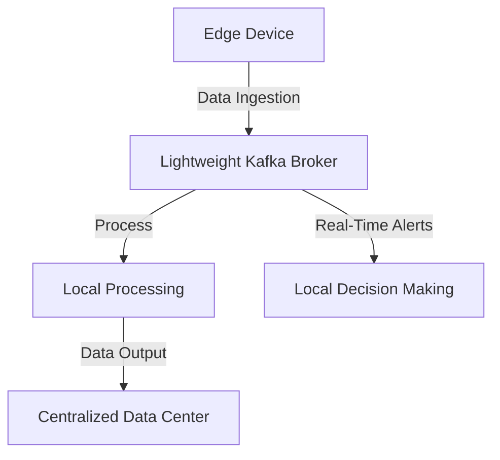

## 20.6.4 Lightweight Kafka Deployments

### Introduction

As the demand for real-time data processing grows, the need for lightweight Kafka deployments becomes increasingly critical, especially in edge computing environments. Edge computing involves processing data closer to where it is generated, such as IoT devices, to reduce latency and bandwidth usage. This section explores strategies for deploying Apache Kafka in resource-constrained environments, introduces Kafka alternatives optimized for the edge, and provides practical guidance on minimizing Kafka's footprint through configuration.

### Kafka Alternatives for Edge Computing

#### Embedded Kafka

**Embedded Kafka** is a lightweight version of Kafka that can be run within applications, making it suitable for testing and development environments. While not designed for production use, it provides a minimal setup that can be useful for edge scenarios where full Kafka capabilities are unnecessary.

- **Use Cases**: Embedded Kafka is ideal for local development, testing, and small-scale applications where a full Kafka cluster is overkill.
- **Limitations**: It lacks the robustness and scalability of a full Kafka deployment, making it unsuitable for high-throughput or mission-critical applications.

#### Redpanda

**Redpanda** is a Kafka-compatible streaming platform designed for simplicity and performance. It eliminates the need for ZooKeeper and is optimized for low-latency and high-throughput workloads, making it a strong candidate for edge deployments.

- **Features**: Redpanda offers a single-binary deployment, reducing complexity and resource consumption. It supports Kafka APIs, allowing seamless integration with existing Kafka applications.
- **Advantages**: Redpanda's architecture is designed to minimize latency and maximize resource efficiency, making it suitable for edge environments where resources are limited.

#### Other Alternatives

- **Pulsar**: Apache Pulsar is another distributed messaging system that offers features like multi-tenancy and geo-replication, which can be beneficial in edge scenarios.
- **NATS**: A lightweight messaging system designed for simplicity and performance, suitable for microservices and IoT applications.

### Minimizing Kafka's Footprint

To deploy Kafka in edge environments, it's essential to minimize its resource usage. This can be achieved through careful configuration and optimization.

#### Configuration Strategies

1. **Broker Configuration**: Reduce the number of brokers to the minimum required for fault tolerance. Configure brokers with minimal resources, focusing on CPU and memory constraints typical of edge devices.

2. **Topic and Partition Management**: Limit the number of topics and partitions to reduce overhead. Use compacted topics where possible to minimize storage requirements.

3. **Retention Policies**: Implement aggressive data retention policies to limit the amount of data stored on edge devices. Use log compaction to retain only the latest state of data.

4. **Compression**: Enable compression for messages to reduce network and storage usage. Choose a compression algorithm that balances performance and resource consumption.

5. **Network Optimization**: Optimize network settings to handle intermittent connectivity and limited bandwidth typical of edge environments.

#### Tailoring Kafka Components

1. **Producers and Consumers**: Optimize producer and consumer configurations for low-latency and low-resource usage. Use asynchronous processing to improve throughput without increasing resource demands.

2. **Kafka Connect**: Use lightweight connectors and minimize the number of tasks to reduce resource usage. Consider using Kafka Connect in standalone mode for simplicity.

3. **Kafka Streams**: Optimize Kafka Streams applications by minimizing stateful operations and using in-memory state stores where possible.

### Code Examples

#### Java Example: Configuring a Lightweight Kafka Producer

```java
import org.apache.kafka.clients.producer.KafkaProducer;
import org.apache.kafka.clients.producer.ProducerConfig;
import org.apache.kafka.clients.producer.ProducerRecord;
import org.apache.kafka.common.serialization.StringSerializer;

import java.util.Properties;

public class LightweightKafkaProducer {
    public static void main(String[] args) {
        Properties props = new Properties();
        props.put(ProducerConfig.BOOTSTRAP_SERVERS_CONFIG, "localhost:9092");
        props.put(ProducerConfig.KEY_SERIALIZER_CLASS_CONFIG, StringSerializer.class.getName());
        props.put(ProducerConfig.VALUE_SERIALIZER_CLASS_CONFIG, StringSerializer.class.getName());
        props.put(ProducerConfig.COMPRESSION_TYPE_CONFIG, "lz4");
        props.put(ProducerConfig.BATCH_SIZE_CONFIG, 16384);
        props.put(ProducerConfig.LINGER_MS_CONFIG, 1);

        KafkaProducer<String, String> producer = new KafkaProducer<>(props);

        for (int i = 0; i < 100; i++) {
            producer.send(new ProducerRecord<>("lightweight-topic", Integer.toString(i), "message-" + i));
        }

        producer.close();
    }
}
```

#### Scala Example: Configuring a Lightweight Kafka Consumer

```scala
import org.apache.kafka.clients.consumer.{ConsumerConfig, KafkaConsumer}
import org.apache.kafka.common.serialization.StringDeserializer

import java.util.Properties
import scala.collection.JavaConverters._

object LightweightKafkaConsumer extends App {
  val props = new Properties()
  props.put(ConsumerConfig.BOOTSTRAP_SERVERS_CONFIG, "localhost:9092")
  props.put(ConsumerConfig.GROUP_ID_CONFIG, "lightweight-consumer-group")
  props.put(ConsumerConfig.KEY_DESERIALIZER_CLASS_CONFIG, classOf[StringDeserializer].getName)
  props.put(ConsumerConfig.VALUE_DESERIALIZER_CLASS_CONFIG, classOf[StringDeserializer].getName)
  props.put(ConsumerConfig.AUTO_OFFSET_RESET_CONFIG, "earliest")

  val consumer = new KafkaConsumer[String, String](props)
  consumer.subscribe(List("lightweight-topic").asJava)

  while (true) {
    val records = consumer.poll(100)
    for (record <- records.asScala) {
      println(s"Received message: ${record.value()} at offset ${record.offset()}")
    }
  }
}
```

#### Kotlin Example: Configuring a Lightweight Kafka Streams Application

```kotlin
import org.apache.kafka.streams.KafkaStreams
import org.apache.kafka.streams.StreamsBuilder
import org.apache.kafka.streams.StreamsConfig
import org.apache.kafka.streams.kstream.KStream
import java.util.Properties

fun main() {
    val props = Properties()
    props[StreamsConfig.APPLICATION_ID_CONFIG] = "lightweight-streams-app"
    props[StreamsConfig.BOOTSTRAP_SERVERS_CONFIG] = "localhost:9092"
    props[StreamsConfig.DEFAULT_KEY_SERDE_CLASS_CONFIG] = "org.apache.kafka.common.serialization.Serdes\$StringSerde"
    props[StreamsConfig.DEFAULT_VALUE_SERDE_CLASS_CONFIG] = "org.apache.kafka.common.serialization.Serdes\$StringSerde"

    val builder = StreamsBuilder()
    val sourceStream: KStream<String, String> = builder.stream("lightweight-topic")
    sourceStream.foreach { key, value -> println("Processing message: $value") }

    val streams = KafkaStreams(builder.build(), props)
    streams.start()
}
```

#### Clojure Example: Configuring a Lightweight Kafka Producer

```clojure
(ns lightweight-kafka-producer
  (:require [clojure.java.io :as io])
  (:import (org.apache.kafka.clients.producer KafkaProducer ProducerConfig ProducerRecord)
           (org.apache.kafka.common.serialization StringSerializer)))

(defn create-producer []
  (let [props (doto (java.util.Properties.)
                (.put ProducerConfig/BOOTSTRAP_SERVERS_CONFIG "localhost:9092")
                (.put ProducerConfig/KEY_SERIALIZER_CLASS_CONFIG StringSerializer)
                (.put ProducerConfig/VALUE_SERIALIZER_CLASS_CONFIG StringSerializer)
                (.put ProducerConfig/COMPRESSION_TYPE_CONFIG "lz4")
                (.put ProducerConfig/BATCH_SIZE_CONFIG 16384)
                (.put ProducerConfig/LINGER_MS_CONFIG 1))]
    (KafkaProducer. props)))

(defn send-messages [producer]
  (doseq [i (range 100)]
    (.send producer (ProducerRecord. "lightweight-topic" (str i) (str "message-" i)))))

(defn -main []
  (let [producer (create-producer)]
    (send-messages producer)
    (.close producer)))
```

### Practical Applications and Real-World Scenarios

1. **IoT Deployments**: Lightweight Kafka deployments are ideal for IoT scenarios where data is generated at the edge and needs to be processed locally to reduce latency and bandwidth usage.

2. **Remote Monitoring**: In remote monitoring applications, deploying Kafka at the edge allows for real-time data processing and decision-making without relying on centralized data centers.

3. **Smart Cities**: Smart city applications can benefit from lightweight Kafka deployments to process data from various sensors and devices in real-time, enabling faster response times and improved resource management.

### Visualizing Lightweight Kafka Deployments



**Diagram Description**: This diagram illustrates a typical lightweight Kafka deployment on an edge device. Data is ingested by a lightweight Kafka broker, processed locally, and either sent to a centralized data center or used for real-time decision-making.

### References and Further Reading

- [Apache Kafka Documentation](https://kafka.apache.org/documentation/)
- [Redpanda Documentation](https://vectorized.io/docs/)
- [Apache Pulsar Documentation](https://pulsar.apache.org/docs/)
- [NATS Documentation](https://nats.io/documentation/)

## Test Your Knowledge: Lightweight Kafka Deployments Quiz



### Which Kafka alternative is designed for low-latency and high-throughput workloads?

- [x] Redpanda
- [ ] Embedded Kafka
- [ ] Apache Pulsar
- [ ] NATS

> **Explanation:** Redpanda is optimized for low-latency and high-throughput workloads, making it suitable for edge deployments.

### What is a key advantage of using Embedded Kafka?

- [x] It provides a minimal setup for testing and development.
- [ ] It is suitable for high-throughput production environments.
- [ ] It offers built-in geo-replication.
- [ ] It supports multi-tenancy.

> **Explanation:** Embedded Kafka is ideal for local development and testing due to its minimal setup requirements.

### How can Kafka's footprint be minimized in edge deployments?

- [x] By reducing the number of brokers and partitions.
- [ ] By increasing the number of topics.
- [ ] By disabling compression.
- [ ] By using a single-binary deployment.

> **Explanation:** Reducing the number of brokers and partitions helps minimize Kafka's resource usage in edge environments.

### Which configuration setting helps reduce network and storage usage in Kafka?

- [x] Compression
- [ ] Increasing batch size
- [ ] Disabling log compaction
- [ ] Using synchronous processing

> **Explanation:** Enabling compression reduces the amount of data transmitted over the network and stored on disk.

### What is a practical application of lightweight Kafka deployments?

- [x] IoT data processing
- [ ] High-frequency trading
- [ ] Large-scale data warehousing
- [ ] Batch processing

> **Explanation:** Lightweight Kafka deployments are ideal for IoT scenarios where data is processed locally at the edge.

### Which Kafka component can be optimized by minimizing stateful operations?

- [x] Kafka Streams
- [ ] Kafka Connect
- [ ] Kafka Broker
- [ ] Kafka Producer

> **Explanation:** Minimizing stateful operations in Kafka Streams can help optimize resource usage in edge environments.

### What is a benefit of using Redpanda over traditional Kafka in edge deployments?

- [x] Single-binary deployment
- [ ] Built-in multi-tenancy
- [ ] Support for ZooKeeper
- [ ] High memory usage

> **Explanation:** Redpanda's single-binary deployment reduces complexity and resource consumption, making it suitable for edge environments.

### Which of the following is NOT a Kafka alternative mentioned for edge computing?

- [x] RabbitMQ
- [ ] Redpanda
- [ ] Apache Pulsar
- [ ] NATS

> **Explanation:** RabbitMQ is not mentioned as a Kafka alternative for edge computing in this section.

### What is a common use case for lightweight Kafka deployments?

- [x] Remote monitoring
- [ ] Centralized data processing
- [ ] Batch analytics
- [ ] High-frequency trading

> **Explanation:** Lightweight Kafka deployments are commonly used in remote monitoring applications to enable real-time data processing at the edge.

### True or False: Redpanda requires ZooKeeper for operation.

- [ ] True
- [x] False

> **Explanation:** Redpanda eliminates the need for ZooKeeper, simplifying deployment and reducing resource usage.



By understanding and implementing lightweight Kafka deployments, you can effectively leverage Kafka's capabilities in edge computing environments, enabling real-time data processing and decision-making closer to the source of data generation.
