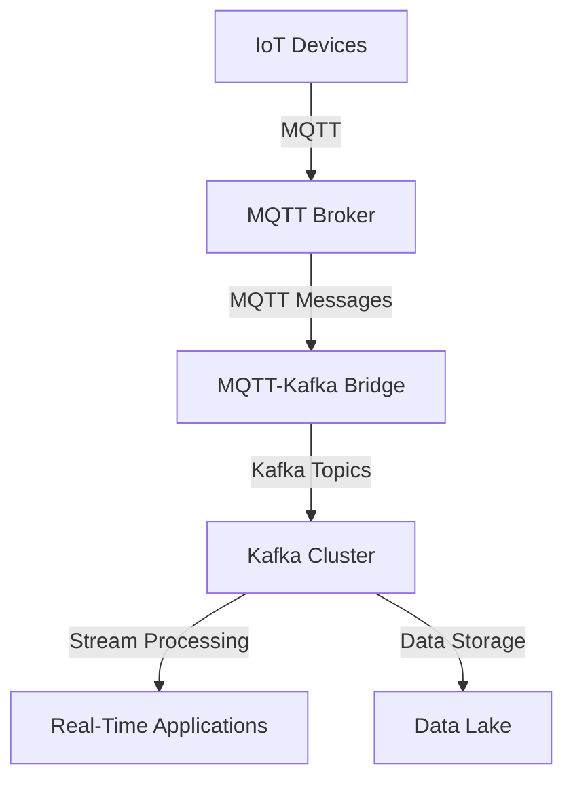

## 20.6.5 Integration with MQTT and Other IoT Protocols

### Introduction

In the rapidly evolving landscape of the Internet of Things (IoT), the ability to seamlessly integrate various protocols and platforms is crucial for building robust and scalable systems. Apache Kafka, known for its high throughput and fault-tolerant capabilities, is increasingly being used to handle real-time data streams from IoT devices. MQTT (Message Queuing Telemetry Transport) is a lightweight messaging protocol designed for constrained devices and low-bandwidth, high-latency networks. This section explores how Kafka can interoperate with MQTT and other IoT protocols, enabling seamless data flow between devices and enterprise systems.

### Understanding MQTT and Kafka Protocols

#### MQTT Protocol

MQTT is a lightweight, publish-subscribe network protocol that transports messages between devices. It is designed for environments where a small code footprint is required, and network bandwidth is at a premium. MQTT is particularly well-suited for IoT applications due to its low overhead and efficient message delivery.

- **Key Features of MQTT**:
  - **Lightweight**: Minimal packet overhead, making it ideal for low-bandwidth scenarios.
  - **Publish/Subscribe Model**: Decouples message producers from consumers, enhancing scalability.
  - **Quality of Service (QoS) Levels**: Provides three levels of message delivery assurance: At most once (0), At least once (1), and Exactly once (2).
  - **Retained Messages**: Allows the broker to store the last message sent to a topic and deliver it to new subscribers.
  - **Last Will and Testament (LWT)**: Notifies other clients about an ungraceful client disconnection.

#### Kafka Protocol

Apache Kafka is a distributed event streaming platform capable of handling trillions of events a day. It is designed to provide a unified, high-throughput, low-latency platform for handling real-time data feeds.

- **Key Features of Kafka**:
  - **High Throughput**: Capable of handling large volumes of data with low latency.
  - **Scalability**: Easily scales horizontally by adding more brokers.
  - **Durability**: Ensures data is replicated across multiple nodes for fault tolerance.
  - **Stream Processing**: Provides Kafka Streams API for building real-time applications.
  - **Decoupled Architecture**: Producers and consumers are decoupled, allowing for flexible data processing.

### Bridging MQTT Messages to Kafka Topics

To integrate MQTT with Kafka, one must bridge MQTT messages to Kafka topics. This can be achieved using various methods, including connectors and brokers. Below, we explore some common approaches.

#### Using Kafka Connect MQTT

Kafka Connect is a framework for connecting Kafka with external systems, including databases, key-value stores, search indexes, and file systems. The Kafka Connect MQTT connector allows you to stream data from MQTT brokers into Kafka topics.

- **Setting Up Kafka Connect MQTT**:
  1. **Install Kafka Connect**: Ensure Kafka Connect is installed and configured.
  2. **Configure the MQTT Source Connector**: Define the connection settings for the MQTT broker, including the broker URL, topics to subscribe to, and QoS levels.
  3. **Deploy the Connector**: Use the Kafka Connect REST API to deploy and manage the connector.

- **Example Configuration**:

    ```json
    {
      "name": "mqtt-source-connector",
      "config": {
        "connector.class": "io.confluent.connect.mqtt.MqttSourceConnector",
        "mqtt.server.uri": "tcp://mqtt-broker:1883",
        "mqtt.topics": "sensor-data",
        "kafka.topic": "iot-sensor-data",
        "mqtt.qos": "1",
        "tasks.max": "1"
      }
    }
    ```

- **Explanation**: This configuration sets up an MQTT source connector that listens to the `sensor-data` topic on the MQTT broker and publishes the messages to the `iot-sensor-data` Kafka topic with a QoS level of 1.

#### Using MQTT-Kafka Bridge

An MQTT-Kafka bridge is a standalone application that subscribes to MQTT topics and publishes the messages to Kafka topics. This approach is suitable for scenarios where Kafka Connect is not available or when custom processing is required.

- **Example Implementation**:

    - **Java**:

        ```java
        import org.apache.kafka.clients.producer.KafkaProducer;
        import org.apache.kafka.clients.producer.ProducerRecord;
        import org.eclipse.paho.client.mqttv3.*;

        public class MqttKafkaBridge {
            private static final String MQTT_BROKER = "tcp://mqtt-broker:1883";
            private static final String KAFKA_TOPIC = "iot-sensor-data";
            private static final String MQTT_TOPIC = "sensor-data";

            public static void main(String[] args) throws MqttException {
                MqttClient mqttClient = new MqttClient(MQTT_BROKER, MqttClient.generateClientId());
                mqttClient.connect();
                mqttClient.subscribe(MQTT_TOPIC, (topic, msg) -> {
                    String payload = new String(msg.getPayload());
                    KafkaProducer<String, String> producer = new KafkaProducer<>(getKafkaProperties());
                    producer.send(new ProducerRecord<>(KAFKA_TOPIC, payload));
                    producer.close();
                });
            }

            private static Properties getKafkaProperties() {
                Properties props = new Properties();
                props.put("bootstrap.servers", "localhost:9092");
                props.put("key.serializer", "org.apache.kafka.common.serialization.StringSerializer");
                props.put("value.serializer", "org.apache.kafka.common.serialization.StringSerializer");
                return props;
            }
        }
        ```

    - **Scala**:

        ```scala
        import org.apache.kafka.clients.producer.{KafkaProducer, ProducerRecord}
        import org.eclipse.paho.client.mqttv3.{MqttClient, MqttMessage}

        object MqttKafkaBridge extends App {
          val mqttBroker = "tcp://mqtt-broker:1883"
          val kafkaTopic = "iot-sensor-data"
          val mqttTopic = "sensor-data"

          val mqttClient = new MqttClient(mqttBroker, MqttClient.generateClientId())
          mqttClient.connect()
          mqttClient.subscribe(mqttTopic, (topic: String, msg: MqttMessage) => {
            val payload = new String(msg.getPayload)
            val producer = new KafkaProducer[String, String](getKafkaProperties)
            producer.send(new ProducerRecord[String, String](kafkaTopic, payload))
            producer.close()
          })

          def getKafkaProperties: java.util.Properties = {
            val props = new java.util.Properties()
            props.put("bootstrap.servers", "localhost:9092")
            props.put("key.serializer", "org.apache.kafka.common.serialization.StringSerializer")
            props.put("value.serializer", "org.apache.kafka.common.serialization.StringSerializer")
            props
          }
        }
        ```

    - **Kotlin**:

        ```kotlin
        import org.apache.kafka.clients.producer.KafkaProducer
        import org.apache.kafka.clients.producer.ProducerRecord
        import org.eclipse.paho.client.mqttv3.MqttClient
        import org.eclipse.paho.client.mqttv3.MqttMessage

        fun main() {
            val mqttBroker = "tcp://mqtt-broker:1883"
            val kafkaTopic = "iot-sensor-data"
            val mqttTopic = "sensor-data"

            val mqttClient = MqttClient(mqttBroker, MqttClient.generateClientId())
            mqttClient.connect()
            mqttClient.subscribe(mqttTopic) { _, msg: MqttMessage ->
                val payload = String(msg.payload)
                val producer = KafkaProducer<String, String>(getKafkaProperties())
                producer.send(ProducerRecord(kafkaTopic, payload))
                producer.close()
            }
        }

        fun getKafkaProperties(): Properties {
            val props = Properties()
            props["bootstrap.servers"] = "localhost:9092"
            props["key.serializer"] = "org.apache.kafka.common.serialization.StringSerializer"
            props["value.serializer"] = "org.apache.kafka.common.serialization.StringSerializer"
            return props
        }
        ```

    - **Clojure**:

        ```clojure
        (ns mqtt-kafka-bridge
          (:import [org.apache.kafka.clients.producer KafkaProducer ProducerRecord]
                   [org.eclipse.paho.client.mqttv3 MqttClient MqttMessage]))

        (defn get-kafka-properties []
          (doto (java.util.Properties.)
            (.put "bootstrap.servers" "localhost:9092")
            (.put "key.serializer" "org.apache.kafka.common.serialization.StringSerializer")
            (.put "value.serializer" "org.apache.kafka.common.serialization.StringSerializer")))

        (defn -main []
          (let [mqtt-broker "tcp://mqtt-broker:1883"
                kafka-topic "iot-sensor-data"
                mqtt-topic "sensor-data"
                mqtt-client (MqttClient. mqtt-broker (MqttClient/generateClientId))]
            (.connect mqtt-client)
            (.subscribe mqtt-client mqtt-topic
                        (reify org.eclipse.paho.client.mqttv3.IMqttMessageListener
                          (messageArrived [_ _ msg]
                            (let [payload (String. (.getPayload msg))
                                  producer (KafkaProducer. (get-kafka-properties))]
                              (.send producer (ProducerRecord. kafka-topic payload))
                              (.close producer)))))))
        ```

- **Explanation**: These code examples demonstrate how to create an MQTT-Kafka bridge using different programming languages. The bridge subscribes to an MQTT topic and publishes the messages to a Kafka topic.

### Considerations for Quality of Service (QoS) and Message Ordering

When integrating MQTT with Kafka, it is essential to consider the Quality of Service (QoS) levels and message ordering to ensure reliable and consistent data flow.

#### Quality of Service (QoS)

MQTT provides three levels of QoS to ensure message delivery:

- **QoS 0 (At most once)**: The message is delivered at most once, with no acknowledgment required. This is the fastest but least reliable level.
- **QoS 1 (At least once)**: The message is delivered at least once, with acknowledgment required. This level ensures that the message is received but may result in duplicates.
- **QoS 2 (Exactly once)**: The message is delivered exactly once, with a four-step handshake process. This is the most reliable but slowest level.

When bridging MQTT to Kafka, it is crucial to choose the appropriate QoS level based on the application's requirements. For example, if message duplication is acceptable, QoS 1 may be suitable. However, for critical applications where message duplication is not acceptable, QoS 2 should be used.

#### Message Ordering

Kafka guarantees message ordering within a partition. However, when integrating with MQTT, message ordering may be affected by the QoS level and network conditions. To maintain message ordering, consider the following strategies:

- **Use a Single Partition**: Ensure that all messages from a specific MQTT topic are published to a single Kafka partition.
- **Implement Custom Partitioning**: Use a custom partitioning strategy to route messages to specific partitions based on message keys or other attributes.
- **Monitor Network Conditions**: Monitor network latency and adjust the QoS level accordingly to minimize message reordering.

### Practical Applications and Real-World Scenarios

Integrating Kafka with MQTT and other IoT protocols enables a wide range of practical applications and real-world scenarios, including:

- **Smart Home Automation**: Collect and process data from smart home devices, such as thermostats, lights, and security cameras, to enable real-time automation and monitoring.
- **Industrial IoT (IIoT)**: Monitor and analyze data from industrial sensors and equipment to optimize production processes and reduce downtime.
- **Connected Vehicles**: Stream data from connected vehicles to enable real-time traffic monitoring, predictive maintenance, and enhanced driver assistance systems.
- **Healthcare IoT**: Collect and analyze data from medical devices and wearables to improve patient care and enable remote monitoring.

### Visualizing the Integration

To better understand the integration between MQTT and Kafka, consider the following architecture diagram:



**Caption**: This diagram illustrates the flow of data from IoT devices to a Kafka cluster via an MQTT broker and MQTT-Kafka bridge. The data is then processed in real-time by applications and stored in a data lake for further analysis.

### Conclusion

Integrating Apache Kafka with MQTT and other IoT protocols is a powerful approach to building scalable and reliable IoT systems. By leveraging the strengths of both protocols, organizations can achieve seamless data flow between devices and enterprise systems, enabling real-time analytics and decision-making. When implementing this integration, it is essential to consider factors such as QoS levels and message ordering to ensure data consistency and reliability.

## Test Your Knowledge: Integrating Kafka with MQTT and IoT Protocols



### What is the primary advantage of using MQTT in IoT applications?

- [x] Lightweight protocol with minimal overhead
- [ ] High throughput and scalability
- [ ] Built-in stream processing capabilities
- [ ] Strong data durability

> **Explanation:** MQTT is designed to be lightweight with minimal overhead, making it ideal for IoT applications with constrained devices and low-bandwidth networks.

### Which QoS level in MQTT ensures that a message is delivered exactly once?

- [ ] QoS 0
- [ ] QoS 1
- [x] QoS 2
- [ ] QoS 3

> **Explanation:** QoS 2 ensures that a message is delivered exactly once, using a four-step handshake process to guarantee delivery without duplication.

### What is a common method for bridging MQTT messages to Kafka topics?

- [x] Using Kafka Connect MQTT
- [ ] Using Kafka Streams API
- [ ] Using Kafka Consumer API
- [ ] Using Kafka Producer API

> **Explanation:** Kafka Connect MQTT is a common method for bridging MQTT messages to Kafka topics, allowing seamless integration between the two protocols.

### How does Kafka ensure message ordering within a topic?

- [ ] By using QoS levels
- [ ] By using multiple partitions
- [x] By using partitions
- [ ] By using stream processing

> **Explanation:** Kafka ensures message ordering within a partition, meaning messages are ordered as they are produced within each partition.

### What is a key consideration when integrating MQTT with Kafka?

- [x] Quality of Service (QoS) levels
- [ ] Stream processing capabilities
- [ ] Data serialization formats
- [ ] Network bandwidth

> **Explanation:** Quality of Service (QoS) levels are a key consideration when integrating MQTT with Kafka, as they determine the reliability and ordering of message delivery.

### Which MQTT feature allows the broker to store the last message sent to a topic?

- [x] Retained Messages
- [ ] Last Will and Testament
- [ ] QoS Levels
- [ ] Message Ordering

> **Explanation:** Retained Messages allow the MQTT broker to store the last message sent to a topic and deliver it to new subscribers.

### What is the role of the MQTT-Kafka bridge?

- [x] To subscribe to MQTT topics and publish messages to Kafka topics
- [ ] To process and analyze data in real-time
- [ ] To store data in a data lake
- [ ] To manage Kafka clusters

> **Explanation:** The MQTT-Kafka bridge subscribes to MQTT topics and publishes the messages to Kafka topics, enabling integration between the two protocols.

### Which programming language is NOT shown in the MQTT-Kafka bridge code examples?

- [ ] Java
- [ ] Scala
- [ ] Kotlin
- [x] Python

> **Explanation:** Python is not shown in the MQTT-Kafka bridge code examples provided in this section.

### What is a practical application of integrating Kafka with MQTT in the healthcare industry?

- [x] Remote monitoring of medical devices
- [ ] Real-time traffic monitoring
- [ ] Predictive maintenance of industrial equipment
- [ ] Smart home automation

> **Explanation:** In the healthcare industry, integrating Kafka with MQTT enables remote monitoring of medical devices and wearables, improving patient care.

### True or False: Kafka guarantees message ordering across all partitions in a topic.

- [ ] True
- [x] False

> **Explanation:** Kafka guarantees message ordering within a partition, but not across all partitions in a topic.



By understanding and implementing the integration of Kafka with MQTT and other IoT protocols, you can harness the power of real-time data processing and build advanced IoT solutions that drive innovation and efficiency.

---
