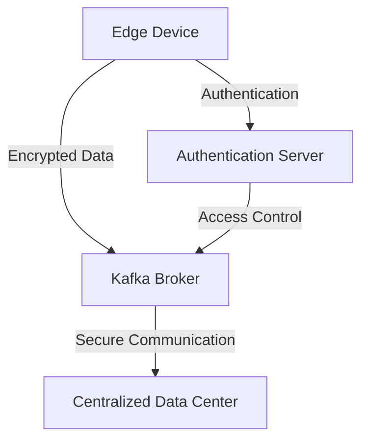

## 20.6.6 Security Considerations at the Edge

As edge computing becomes increasingly prevalent, deploying Apache Kafka in these environments presents unique security challenges. Edge deployments often occur in less controlled environments, exposing systems to risks such as physical tampering, unsecured networks, and limited oversight. This section explores the security considerations necessary for protecting Kafka deployments at the edge, providing expert recommendations and best practices.

### Understanding the Risks

#### Physical Tampering

Edge devices are often located in remote or public areas, making them susceptible to physical tampering. Unauthorized access to hardware can lead to data breaches, system manipulation, or device theft.

#### Unsecured Networks

Edge environments frequently rely on public or less secure networks, increasing the risk of data interception and unauthorized access. Without proper encryption and authentication, sensitive data can be exposed to malicious actors.

#### Limited Oversight

The distributed nature of edge computing means that devices may operate with minimal human oversight. This can lead to delayed detection of security incidents and challenges in maintaining consistent security policies across all devices.

### Securing Kafka at the Edge

#### Encryption

Implement encryption to protect data both at rest and in transit. Use SSL/TLS to encrypt data transmitted between Kafka brokers and clients, ensuring that sensitive information remains confidential.

- **Java Example**:

    ```java
    Properties props = new Properties();
    props.put("security.protocol", "SSL");
    props.put("ssl.truststore.location", "/path/to/truststore.jks");
    props.put("ssl.truststore.password", "password");
    props.put("ssl.keystore.location", "/path/to/keystore.jks");
    props.put("ssl.keystore.password", "password");
    ```

- **Scala Example**:

    ```scala
    val props = new Properties()
    props.put("security.protocol", "SSL")
    props.put("ssl.truststore.location", "/path/to/truststore.jks")
    props.put("ssl.truststore.password", "password")
    props.put("ssl.keystore.location", "/path/to/keystore.jks")
    props.put("ssl.keystore.password", "password")
    ```

- **Kotlin Example**:

    ```kotlin
    val props = Properties().apply {
        put("security.protocol", "SSL")
        put("ssl.truststore.location", "/path/to/truststore.jks")
        put("ssl.truststore.password", "password")
        put("ssl.keystore.location", "/path/to/keystore.jks")
        put("ssl.keystore.password", "password")
    }
    ```

- **Clojure Example**:

    ```clojure
    (def props
      {"security.protocol" "SSL"
       "ssl.truststore.location" "/path/to/truststore.jks"
       "ssl.truststore.password" "password"
       "ssl.keystore.location" "/path/to/keystore.jks"
       "ssl.keystore.password" "password"})
    ```

#### Authentication

Use robust authentication mechanisms to verify the identity of clients and brokers. Implement SASL (Simple Authentication and Security Layer) to add an additional layer of security.

- **Java Example**:

    ```java
    props.put("sasl.mechanism", "PLAIN");
    props.put("security.protocol", "SASL_SSL");
    props.put("sasl.jaas.config", "org.apache.kafka.common.security.plain.PlainLoginModule required username=\"user\" password=\"password\";");
    ```

#### Best Practices for Firmware Updates and Vulnerability Management

Regularly update firmware and software to patch vulnerabilities. Implement automated update mechanisms to ensure that all devices are running the latest security patches.

- **Automated Update Strategy**: Use tools like Ansible or Puppet to automate the deployment of updates across all edge devices, reducing the risk of human error and ensuring consistency.

#### Regulatory Considerations

Edge deployments must comply with data protection regulations such as GDPR and CCPA. Ensure that data processing at the edge adheres to these regulations by implementing data anonymization and encryption techniques.

- **Data Anonymization**: Use techniques like tokenization or pseudonymization to protect personal data while maintaining its utility for analysis.

### Practical Applications and Real-World Scenarios

#### Use Case: Smart City Infrastructure

In smart city deployments, edge devices collect and process data from various sensors. Ensuring the security of this data is critical to maintaining public trust and compliance with regulations.

- **Solution**: Implement end-to-end encryption and robust authentication to protect data from collection to processing.

#### Use Case: Industrial IoT

In industrial settings, edge devices monitor and control critical infrastructure. Security breaches can lead to operational disruptions or safety hazards.

- **Solution**: Use network segmentation and access controls to limit the impact of potential breaches.

### Visualizing Security Architecture



**Diagram Description**: This diagram illustrates a secure Kafka deployment at the edge, highlighting encrypted data transmission, secure communication with the central data center, and authentication processes.

### Conclusion

Securing Kafka deployments at the edge requires a comprehensive approach that addresses physical, network, and software vulnerabilities. By implementing encryption, authentication, and regular updates, organizations can protect their data and systems in distributed environments. Additionally, adhering to regulatory requirements ensures compliance and builds trust with stakeholders.

## Test Your Knowledge: Security Considerations for Kafka at the Edge



### What is a primary risk associated with edge computing environments?

- [x] Physical tampering
- [ ] High latency
- [ ] Limited storage capacity
- [ ] Excessive power consumption

> **Explanation:** Edge devices are often located in less secure environments, making them susceptible to physical tampering.

### Which encryption protocol is recommended for securing data in transit in Kafka deployments?

- [x] SSL/TLS
- [ ] AES
- [ ] RSA
- [ ] SHA-256

> **Explanation:** SSL/TLS is used to encrypt data transmitted between Kafka brokers and clients, ensuring confidentiality.

### What is the role of SASL in Kafka security?

- [x] Authentication
- [ ] Encryption
- [ ] Data compression
- [ ] Load balancing

> **Explanation:** SASL provides a mechanism for authenticating clients and brokers in Kafka.

### Why is it important to regularly update firmware on edge devices?

- [x] To patch vulnerabilities
- [ ] To increase storage capacity
- [ ] To improve network speed
- [ ] To reduce power consumption

> **Explanation:** Regular updates patch vulnerabilities, ensuring that devices are protected against known security threats.

### What is a recommended practice for managing firmware updates on edge devices?

- [x] Automated update mechanisms
- [ ] Manual updates by technicians
- [ ] Updates only when necessary
- [ ] No updates required

> **Explanation:** Automated update mechanisms ensure consistency and reduce the risk of human error.

### Which regulation must be considered when processing personal data at the edge in the EU?

- [x] GDPR
- [ ] HIPAA
- [ ] PCI DSS
- [ ] SOX

> **Explanation:** GDPR is a data protection regulation that applies to the processing of personal data in the EU.

### What technique can be used to protect personal data while maintaining its utility for analysis?

- [x] Data anonymization
- [ ] Data compression
- [ ] Data duplication
- [ ] Data fragmentation

> **Explanation:** Data anonymization protects personal data while allowing it to be used for analysis.

### What is a benefit of using network segmentation in edge deployments?

- [x] Limiting the impact of potential breaches
- [ ] Increasing data throughput
- [ ] Reducing hardware costs
- [ ] Simplifying network architecture

> **Explanation:** Network segmentation limits the impact of potential breaches by isolating different parts of the network.

### What is the primary purpose of access controls in Kafka deployments?

- [x] To restrict unauthorized access
- [ ] To increase data processing speed
- [ ] To enhance data visualization
- [ ] To simplify data storage

> **Explanation:** Access controls restrict unauthorized access, protecting sensitive data and systems.

### True or False: Edge devices should operate with minimal human oversight to ensure security.

- [ ] True
- [x] False

> **Explanation:** While edge devices may operate with minimal oversight, security measures must be in place to monitor and manage potential threats.



By understanding and implementing these security considerations, organizations can effectively protect their Kafka deployments at the edge, ensuring data integrity, confidentiality, and compliance with regulatory standards.

---
