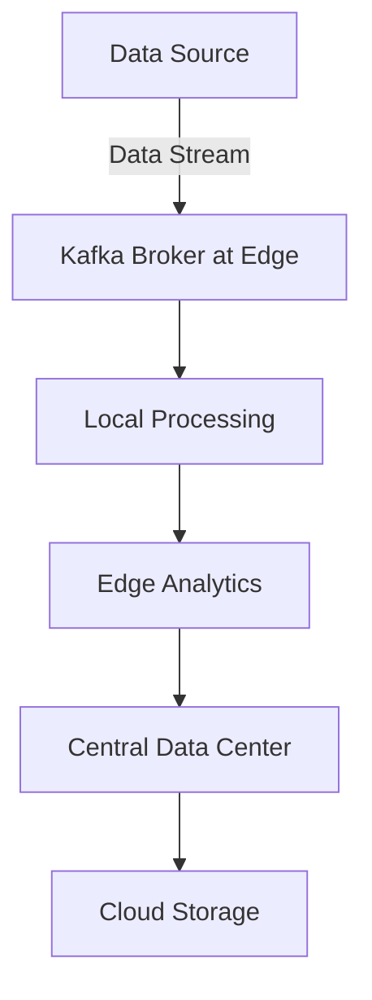
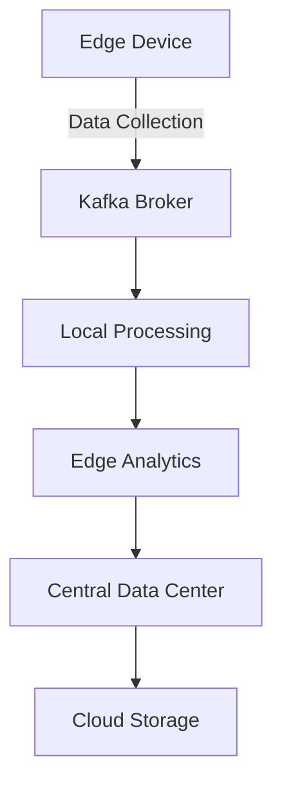

## 20.6 Kafka and Edge Computing

### Introduction to Edge Computing

Edge computing represents a paradigm shift in how data is processed and analyzed. Unlike traditional cloud computing, where data is sent to centralized data centers for processing, edge computing brings computation and data storage closer to the data sources. This approach significantly reduces latency, minimizes bandwidth usage, and enhances real-time data processing capabilities.

#### Benefits of Edge Computing

1. **Reduced Latency**: By processing data closer to the source, edge computing minimizes the time it takes for data to travel, leading to faster response times.
2. **Bandwidth Optimization**: Edge computing reduces the need to transfer large volumes of data to centralized locations, conserving bandwidth.
3. **Enhanced Privacy and Security**: Processing data locally can improve data privacy and security by limiting the exposure of sensitive information.
4. **Scalability**: Edge computing allows for scalable data processing by distributing workloads across multiple edge devices.
5. **Reliability**: Local processing can continue even if the connection to the central data center is lost, ensuring continuous operation.

### Deploying Kafka at the Edge

Apache Kafka, known for its robust distributed messaging capabilities, is well-suited for edge computing environments. Kafka's ability to handle high-throughput data streams and provide fault tolerance makes it an ideal choice for real-time data processing at the edge.

#### Key Considerations for Kafka Deployment at the Edge

- **Lightweight Deployment**: Edge devices often have limited resources. Deploying Kafka in a lightweight manner is crucial to ensure efficient operation.
- **Data Replication and Fault Tolerance**: Kafka's replication capabilities can be leveraged to ensure data availability and fault tolerance in edge environments.
- **Network Connectivity**: Edge deployments may face intermittent connectivity. Kafka's ability to handle network partitions gracefully is essential.
- **Security**: Implementing robust security measures is critical to protect data at the edge.

#### Example Architecture



*Caption: A typical edge computing architecture with Kafka, where data is processed locally before being sent to a central data center.*

### Use Cases for Kafka in Edge Computing

#### Internet of Things (IoT)

In IoT scenarios, devices generate vast amounts of data that need to be processed in real-time. Kafka can be deployed on edge devices to collect, process, and analyze data streams from sensors and actuators, enabling real-time decision-making.

**Example**: A smart city application where Kafka processes data from traffic sensors to optimize traffic flow and reduce congestion.

#### Industrial Automation

In industrial settings, machinery and equipment generate data that must be analyzed quickly to ensure efficient operations. Kafka can be used to monitor equipment health and predict maintenance needs, reducing downtime and improving productivity.

**Example**: A manufacturing plant using Kafka to analyze data from production lines to detect anomalies and prevent equipment failures.

#### Retail and Point of Sale (POS) Systems

Retail environments can benefit from edge computing by processing transaction data locally to provide real-time insights into sales trends and inventory levels. Kafka can facilitate the collection and analysis of POS data at the edge.

**Example**: A retail chain using Kafka to process sales data at each store, providing immediate feedback on inventory levels and customer preferences.

### Challenges in Edge Computing with Kafka

1. **Resource Constraints**: Edge devices often have limited computational power and storage capacity, requiring efficient resource management.
2. **Network Reliability**: Edge environments may experience unreliable network connections, necessitating robust handling of network partitions.
3. **Data Security**: Ensuring data security and privacy at the edge is critical, especially in sensitive applications.
4. **Scalability**: Managing the scalability of Kafka deployments across numerous edge devices can be complex.
5. **Integration with Central Systems**: Seamlessly integrating edge-processed data with central data centers and cloud services is essential for holistic data analysis.

### Implementing Kafka at the Edge: Code Examples

#### Java Example

```java
import org.apache.kafka.clients.producer.KafkaProducer;
import org.apache.kafka.clients.producer.ProducerRecord;
import java.util.Properties;

public class EdgeKafkaProducer {
    public static void main(String[] args) {
        Properties props = new Properties();
        props.put("bootstrap.servers", "edge-broker:9092");
        props.put("key.serializer", "org.apache.kafka.common.serialization.StringSerializer");
        props.put("value.serializer", "org.apache.kafka.common.serialization.StringSerializer");

        KafkaProducer<String, String> producer = new KafkaProducer<>(props);
        for (int i = 0; i < 100; i++) {
            producer.send(new ProducerRecord<>("edge-topic", Integer.toString(i), "Edge data " + i));
        }
        producer.close();
    }
}
```

*Explanation*: This Java code demonstrates a simple Kafka producer that sends data to a Kafka broker deployed at the edge. The producer sends 100 messages to the "edge-topic".

#### Scala Example

```scala
import org.apache.kafka.clients.producer.{KafkaProducer, ProducerRecord}
import java.util.Properties

object EdgeKafkaProducer extends App {
  val props = new Properties()
  props.put("bootstrap.servers", "edge-broker:9092")
  props.put("key.serializer", "org.apache.kafka.common.serialization.StringSerializer")
  props.put("value.serializer", "org.apache.kafka.common.serialization.StringSerializer")

  val producer = new KafkaProducer[String, String](props)
  for (i <- 0 until 100) {
    producer.send(new ProducerRecord[String, String]("edge-topic", i.toString, s"Edge data $i"))
  }
  producer.close()
}
```

*Explanation*: This Scala example mirrors the Java code, illustrating how to produce messages to a Kafka broker at the edge using Scala's concise syntax.

#### Kotlin Example

```kotlin
import org.apache.kafka.clients.producer.KafkaProducer
import org.apache.kafka.clients.producer.ProducerRecord
import java.util.Properties

fun main() {
    val props = Properties().apply {
        put("bootstrap.servers", "edge-broker:9092")
        put("key.serializer", "org.apache.kafka.common.serialization.StringSerializer")
        put("value.serializer", "org.apache.kafka.common.serialization.StringSerializer")
    }

    KafkaProducer<String, String>(props).use { producer ->
        for (i in 0 until 100) {
            producer.send(ProducerRecord("edge-topic", i.toString(), "Edge data $i"))
        }
    }
}
```

*Explanation*: The Kotlin example showcases the use of Kotlin's `apply` function for setting properties and demonstrates a producer sending messages to an edge-deployed Kafka broker.

#### Clojure Example

```clojure
(require '[clojure.java.io :as io])
(import '[org.apache.kafka.clients.producer KafkaProducer ProducerRecord])

(defn create-producer []
  (let [props (doto (java.util.Properties.)
                (.put "bootstrap.servers" "edge-broker:9092")
                (.put "key.serializer" "org.apache.kafka.common.serialization.StringSerializer")
                (.put "value.serializer" "org.apache.kafka.common.serialization.StringSerializer"))]
    (KafkaProducer. props)))

(defn send-messages [producer]
  (doseq [i (range 100)]
    (.send producer (ProducerRecord. "edge-topic" (str i) (str "Edge data " i)))))

(defn -main []
  (let [producer (create-producer)]
    (send-messages producer)
    (.close producer)))
```

*Explanation*: This Clojure example demonstrates creating a Kafka producer and sending messages to an edge-deployed Kafka broker using Clojure's functional programming style.

### Visualizing Kafka's Role in Edge Computing

#### Kafka's Architecture at the Edge



*Caption: Kafka's architecture in an edge computing scenario, illustrating data flow from edge devices to central data centers.*

### Best Practices for Kafka at the Edge

1. **Optimize Resource Usage**: Use lightweight Kafka configurations to minimize resource consumption on edge devices.
2. **Implement Robust Security**: Ensure data encryption and secure communication channels to protect sensitive information.
3. **Leverage Kafka's Fault Tolerance**: Utilize Kafka's replication and partitioning features to enhance data availability and reliability.
4. **Plan for Network Partitions**: Design systems to handle network disruptions gracefully, ensuring continuous operation.
5. **Integrate with Central Systems**: Establish seamless integration between edge and central systems for comprehensive data analysis.

### Conclusion

Kafka's integration with edge computing opens new possibilities for real-time data processing and analytics. By deploying Kafka at the edge, organizations can reduce latency, optimize bandwidth, and enhance data privacy and security. However, challenges such as resource constraints, network reliability, and data security must be addressed to fully realize the benefits of edge computing with Kafka.

## Test Your Knowledge: Kafka and Edge Computing Quiz



### What is a primary benefit of deploying Kafka at the edge?

- [x] Reduced latency in data processing
- [ ] Increased data storage capacity
- [ ] Higher network bandwidth usage
- [ ] Centralized data processing

> **Explanation:** Deploying Kafka at the edge reduces latency by processing data closer to the source, minimizing the time it takes for data to travel.

### Which of the following is a challenge unique to edge computing environments?

- [x] Resource constraints on edge devices
- [ ] Unlimited network bandwidth
- [ ] Centralized data storage
- [ ] High computational power

> **Explanation:** Edge devices often have limited resources, making resource constraints a unique challenge in edge computing environments.

### How does Kafka handle network partitions in edge environments?

- [x] By gracefully managing network disruptions
- [ ] By increasing data replication
- [ ] By reducing data throughput
- [ ] By centralizing data processing

> **Explanation:** Kafka is designed to handle network partitions gracefully, ensuring continuous operation even during network disruptions.

### What role does Kafka play in IoT edge computing scenarios?

- [x] Collecting and processing data streams from sensors
- [ ] Storing large volumes of data centrally
- [ ] Increasing network latency
- [ ] Reducing data security

> **Explanation:** In IoT scenarios, Kafka collects and processes data streams from sensors, enabling real-time decision-making.

### Which programming language is NOT used in the provided code examples for Kafka at the edge?

- [ ] Java
- [ ] Scala
- [ ] Kotlin
- [x] Python

> **Explanation:** The provided code examples include Java, Scala, Kotlin, and Clojure, but not Python.

### What is a key consideration when deploying Kafka at the edge?

- [x] Lightweight deployment to minimize resource usage
- [ ] Maximizing data storage on edge devices
- [ ] Centralizing data processing
- [ ] Increasing network latency

> **Explanation:** Lightweight deployment is crucial to minimize resource usage on edge devices, which often have limited computational power.

### How can Kafka enhance data privacy and security at the edge?

- [x] By processing data locally and limiting exposure
- [ ] By centralizing data processing
- [ ] By increasing data replication
- [ ] By reducing data encryption

> **Explanation:** Processing data locally at the edge can enhance privacy and security by limiting the exposure of sensitive information.

### What is a common use case for Kafka in industrial automation?

- [x] Monitoring equipment health and predicting maintenance needs
- [ ] Centralizing data storage
- [ ] Increasing network latency
- [ ] Reducing data security

> **Explanation:** Kafka can be used in industrial automation to monitor equipment health and predict maintenance needs, reducing downtime and improving productivity.

### Which of the following is NOT a benefit of edge computing?

- [ ] Reduced latency
- [ ] Bandwidth optimization
- [ ] Enhanced privacy and security
- [x] Increased centralization

> **Explanation:** Edge computing reduces latency, optimizes bandwidth, and enhances privacy and security by processing data closer to the source, rather than increasing centralization.

### True or False: Kafka's replication capabilities can be leveraged to ensure data availability at the edge.

- [x] True
- [ ] False

> **Explanation:** Kafka's replication capabilities can be leveraged to ensure data availability and fault tolerance in edge environments.



---

This comprehensive guide section explores the integration of Kafka with edge computing, providing insights into its benefits, challenges, and practical applications. By understanding these concepts, expert software engineers and enterprise architects can effectively leverage Kafka to enhance real-time data processing at the edge.
