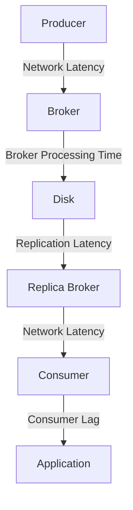

## 20.9.1 Latency Constraints

### Introduction

Apache Kafka is renowned for its ability to handle high-throughput data streams with reliability and scalability. However, when it comes to latency, Kafka presents certain constraints that need to be understood and managed, especially in scenarios requiring ultra-low latency. This section delves into the factors contributing to latency in Kafka, typical latency ranges, and strategies to optimize performance. We will also explore scenarios where Kafka may not meet latency requirements and suggest configurations or alternatives to mitigate latency issues.

### Factors Contributing to Latency in Kafka

Understanding the sources of latency in Kafka is crucial for optimizing performance. Several factors contribute to latency, including:

1. **Network Latency**: The time taken for data to travel across the network from producers to brokers and from brokers to consumers. Network configuration and bandwidth can significantly impact latency.

2. **Broker Processing Time**: The time brokers take to process messages, which includes writing messages to disk and replicating them across the cluster. This is influenced by factors such as disk I/O performance and broker configuration.

3. **Replication Latency**: Kafka's replication mechanism ensures data durability and availability, but it also introduces latency as messages are copied to multiple brokers.

4. **Consumer Lag**: The delay between when a message is produced and when it is consumed. This can be affected by consumer processing speed and the configuration of consumer groups.

5. **Batching and Compression**: While batching and compression can improve throughput, they can also introduce latency as data is accumulated before being sent.

6. **Garbage Collection**: Java's garbage collection can pause Kafka processes, leading to increased latency. Tuning JVM settings is essential to minimize this impact.

7. **Configuration Settings**: Various Kafka configurations, such as `linger.ms`, `acks`, and `fetch.min.bytes`, can affect latency. Fine-tuning these settings is critical for optimizing performance.

### Typical Latency Ranges Achievable

Kafka is designed to handle high-throughput workloads, often at the expense of latency. Typical latency ranges for Kafka can vary based on the deployment and configuration:

- **Low Latency**: With optimal configuration and infrastructure, Kafka can achieve latencies in the range of 2-10 milliseconds. This is suitable for many real-time applications but may not suffice for ultra-low latency requirements.

- **Moderate Latency**: In standard configurations, latencies can range from 10-100 milliseconds. This is acceptable for applications where near-real-time processing is sufficient.

- **High Latency**: In scenarios with suboptimal configurations or high network latency, latencies can exceed 100 milliseconds, which may not be suitable for time-sensitive applications.

### Applications Where Kafka May Not Meet Latency Requirements

While Kafka is a powerful tool for many use cases, there are scenarios where its latency constraints may not align with application requirements:

- **High-Frequency Trading**: Applications requiring sub-millisecond latency, such as high-frequency trading platforms, may find Kafka's latency too high.

- **Real-Time Gaming**: Multiplayer online games that require instant feedback may struggle with Kafka's latency.

- **Telecommunications**: Systems requiring immediate call routing or message delivery may need lower latency than Kafka can provide.

### Strategies to Reduce Latency

To optimize Kafka for low-latency applications, consider the following strategies:

1. **Optimize Network Configuration**: Ensure low-latency network connections between producers, brokers, and consumers. Use dedicated network interfaces and optimize network settings.

2. **Tune Broker Configuration**: Adjust broker settings such as `num.network.threads`, `num.io.threads`, and `log.flush.interval.messages` to reduce processing time.

3. **Minimize Replication Latency**: Use asynchronous replication where possible and adjust `min.insync.replicas` to balance durability with latency.

4. **Optimize Consumer Configuration**: Configure consumers with low `fetch.min.bytes` and `fetch.max.wait.ms` to reduce consumer lag.

5. **Reduce Batching and Compression**: While these improve throughput, they can increase latency. Adjust `batch.size` and `linger.ms` to find a balance.

6. **JVM Tuning**: Optimize garbage collection settings to minimize pauses. Consider using the G1 or ZGC garbage collectors for better performance.

7. **Use Kafka Streams**: For stream processing, Kafka Streams can be optimized for low latency by configuring state stores and windowing appropriately.

### Alternatives to Kafka for Ultra-Low Latency

For applications where Kafka's latency is a bottleneck, consider the following alternatives:

- **Apache Pulsar**: Offers lower latency with features like multi-tenancy and geo-replication.

- **RabbitMQ**: Provides lower latency for smaller message sizes and simpler use cases.

- **ZeroMQ**: A high-performance asynchronous messaging library that can achieve sub-millisecond latencies.

- **Custom Solutions**: In some cases, building a custom messaging solution tailored to specific latency requirements may be necessary.

### Code Examples

To illustrate latency optimization, let's explore code examples in Java, Scala, Kotlin, and Clojure.

#### Java Example

```java
import org.apache.kafka.clients.producer.*;

import java.util.Properties;

public class LowLatencyProducer {
    public static void main(String[] args) {
        Properties props = new Properties();
        props.put(ProducerConfig.BOOTSTRAP_SERVERS_CONFIG, "localhost:9092");
        props.put(ProducerConfig.ACKS_CONFIG, "1"); // Reduce latency by using acks=1
        props.put(ProducerConfig.LINGER_MS_CONFIG, "0"); // Send messages immediately
        props.put(ProducerConfig.BATCH_SIZE_CONFIG, "16384"); // Smaller batch size
        props.put(ProducerConfig.KEY_SERIALIZER_CLASS_CONFIG, "org.apache.kafka.common.serialization.StringSerializer");
        props.put(ProducerConfig.VALUE_SERIALIZER_CLASS_CONFIG, "org.apache.kafka.common.serialization.StringSerializer");

        Producer<String, String> producer = new KafkaProducer<>(props);

        for (int i = 0; i < 100; i++) {
            producer.send(new ProducerRecord<>("low-latency-topic", Integer.toString(i), Integer.toString(i)));
        }

        producer.close();
    }
}
```

#### Scala Example

```scala
import org.apache.kafka.clients.producer.{KafkaProducer, ProducerConfig, ProducerRecord}
import java.util.Properties

object LowLatencyProducer extends App {
  val props = new Properties()
  props.put(ProducerConfig.BOOTSTRAP_SERVERS_CONFIG, "localhost:9092")
  props.put(ProducerConfig.ACKS_CONFIG, "1")
  props.put(ProducerConfig.LINGER_MS_CONFIG, "0")
  props.put(ProducerConfig.BATCH_SIZE_CONFIG, "16384")
  props.put(ProducerConfig.KEY_SERIALIZER_CLASS_CONFIG, "org.apache.kafka.common.serialization.StringSerializer")
  props.put(ProducerConfig.VALUE_SERIALIZER_CLASS_CONFIG, "org.apache.kafka.common.serialization.StringSerializer")

  val producer = new KafkaProducer[String, String](props)

  for (i <- 0 until 100) {
    producer.send(new ProducerRecord[String, String]("low-latency-topic", i.toString, i.toString))
  }

  producer.close()
}
```

#### Kotlin Example

```kotlin
import org.apache.kafka.clients.producer.KafkaProducer
import org.apache.kafka.clients.producer.ProducerConfig
import org.apache.kafka.clients.producer.ProducerRecord
import java.util.Properties

fun main() {
    val props = Properties()
    props[ProducerConfig.BOOTSTRAP_SERVERS_CONFIG] = "localhost:9092"
    props[ProducerConfig.ACKS_CONFIG] = "1"
    props[ProducerConfig.LINGER_MS_CONFIG] = "0"
    props[ProducerConfig.BATCH_SIZE_CONFIG] = "16384"
    props[ProducerConfig.KEY_SERIALIZER_CLASS_CONFIG] = "org.apache.kafka.common.serialization.StringSerializer"
    props[ProducerConfig.VALUE_SERIALIZER_CLASS_CONFIG] = "org.apache.kafka.common.serialization.StringSerializer"

    val producer = KafkaProducer<String, String>(props)

    for (i in 0 until 100) {
        producer.send(ProducerRecord("low-latency-topic", i.toString(), i.toString()))
    }

    producer.close()
}
```

#### Clojure Example

```clojure
(require '[clojure.java.io :as io])
(import '[org.apache.kafka.clients.producer KafkaProducer ProducerConfig ProducerRecord])

(defn create-producer []
  (let [props (doto (java.util.Properties.)
                (.put ProducerConfig/BOOTSTRAP_SERVERS_CONFIG "localhost:9092")
                (.put ProducerConfig/ACKS_CONFIG "1")
                (.put ProducerConfig/LINGER_MS_CONFIG "0")
                (.put ProducerConfig/BATCH_SIZE_CONFIG "16384")
                (.put ProducerConfig/KEY_SERIALIZER_CLASS_CONFIG "org.apache.kafka.common.serialization.StringSerializer")
                (.put ProducerConfig/VALUE_SERIALIZER_CLASS_CONFIG "org.apache.kafka.common.serialization.StringSerializer"))]
    (KafkaProducer. props)))

(defn send-messages [producer]
  (doseq [i (range 100)]
    (.send producer (ProducerRecord. "low-latency-topic" (str i) (str i)))))

(defn -main []
  (let [producer (create-producer)]
    (send-messages producer)
    (.close producer)))
```

### Visualizing Kafka Latency

To better understand Kafka's latency constraints, consider the following diagram illustrating the data flow and potential latency points in a Kafka cluster:



**Caption**: This diagram shows the data flow in a Kafka cluster, highlighting potential latency points such as network latency, broker processing time, and replication latency.

### Conclusion

Latency is a critical consideration when using Apache Kafka, especially for applications requiring real-time data processing. By understanding the factors contributing to latency and implementing strategies to optimize performance, you can effectively manage Kafka's latency constraints. For applications with ultra-low latency requirements, consider alternative solutions or custom implementations. 

## Test Your Knowledge: Apache Kafka Latency Optimization Quiz



### What is a primary factor contributing to latency in Kafka?

- [x] Network Latency
- [ ] Message Size
- [ ] Topic Name
- [ ] Consumer Group ID

> **Explanation:** Network latency is a significant factor as it affects the time taken for data to travel between producers, brokers, and consumers.

### Which configuration setting can help reduce producer latency in Kafka?

- [x] `linger.ms`
- [ ] `fetch.min.bytes`
- [ ] `min.insync.replicas`
- [ ] `log.retention.ms`

> **Explanation:** `linger.ms` controls the time a producer waits before sending a batch of messages, affecting latency.

### What is a typical latency range achievable with Kafka in an optimized setup?

- [x] 2-10 milliseconds
- [ ] 50-100 milliseconds
- [ ] 100-200 milliseconds
- [ ] 500-1000 milliseconds

> **Explanation:** With optimal configuration, Kafka can achieve latencies in the range of 2-10 milliseconds.

### Which application might struggle with Kafka's latency constraints?

- [x] High-Frequency Trading
- [ ] Batch Data Processing
- [ ] Log Aggregation
- [ ] Data Archiving

> **Explanation:** High-frequency trading requires sub-millisecond latency, which Kafka may not be able to provide.

### How can replication latency be minimized in Kafka?

- [x] Use asynchronous replication
- [ ] Increase `fetch.min.bytes`
- [ ] Enable SSL encryption
- [ ] Increase `log.retention.ms`

> **Explanation:** Asynchronous replication can reduce the time taken to replicate messages across brokers.

### What alternative to Kafka offers lower latency for messaging?

- [x] ZeroMQ
- [ ] Apache Hadoop
- [ ] Elasticsearch
- [ ] MongoDB

> **Explanation:** ZeroMQ is known for its high-performance and low-latency messaging capabilities.

### Which JVM garbage collector is recommended for reducing latency in Kafka?

- [x] G1 Garbage Collector
- [ ] CMS Garbage Collector
- [ ] Serial Garbage Collector
- [ ] Parallel Garbage Collector

> **Explanation:** The G1 Garbage Collector is designed to minimize pause times, reducing latency.

### What is the impact of increasing `batch.size` on latency?

- [x] Increases latency
- [ ] Decreases latency
- [ ] Has no effect on latency
- [ ] Improves network throughput

> **Explanation:** Increasing `batch.size` can increase latency as more messages are accumulated before being sent.

### Which Kafka feature can be optimized for low-latency stream processing?

- [x] Kafka Streams
- [ ] Kafka Connect
- [ ] Schema Registry
- [ ] Zookeeper

> **Explanation:** Kafka Streams can be configured for low-latency processing by optimizing state stores and windowing.

### True or False: Kafka is always the best choice for ultra-low latency applications.

- [x] False
- [ ] True

> **Explanation:** While Kafka is excellent for high-throughput scenarios, it may not always meet the ultra-low latency requirements of certain applications.


