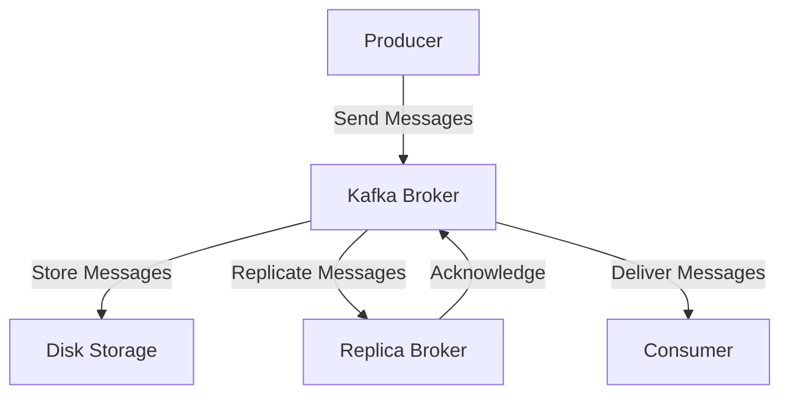

## 20.9 Understanding Kafka's Limitations

Apache Kafka has become a cornerstone in the realm of distributed systems and real-time data processing. Its robust architecture and scalability make it a popular choice for building event-driven systems and data pipelines. However, like any technology, Kafka is not without its limitations. Understanding these limitations is crucial for software engineers and enterprise architects to make informed decisions when designing systems. This section delves into the key limitations of Kafka, offering insights into potential workarounds and alternative solutions.

### Latency Constraints

#### Description

Kafka is designed to handle high-throughput, low-latency data streaming. However, certain use cases may expose latency constraints that can impact performance. These constraints often arise from Kafka's reliance on disk-based storage and network communication.

#### Technical Insights

1. **Disk I/O Overhead**: Kafka's reliance on disk storage for durability introduces latency. Although Kafka uses efficient I/O operations, such as zero-copy transfer, disk access can still be a bottleneck, especially in high-throughput scenarios.

2. **Network Latency**: Kafka's distributed nature means that data must traverse the network between producers, brokers, and consumers. Network latency can vary based on the infrastructure and geographical distribution of the Kafka cluster.

3. **Replication Overhead**: Kafka's replication mechanism ensures fault tolerance but adds latency as data must be replicated across multiple brokers before being acknowledged.

#### Mitigation Strategies

- **Optimize Disk I/O**: Use SSDs instead of HDDs to reduce disk access times. Configure Kafka to use page cache effectively to minimize disk reads.

- **Network Optimization**: Deploy Kafka clusters in close proximity to reduce network latency. Use dedicated network links or virtual private clouds (VPCs) for better performance.

- **Tuning Replication**: Adjust the replication factor based on the criticality of data. For less critical data, a lower replication factor can reduce latency.

#### Comparison with Other Technologies

- **Apache Pulsar**: Offers lower latency in certain scenarios due to its architecture, which separates compute and storage.

- **RabbitMQ**: Provides lower latency for small message sizes but may not scale as efficiently as Kafka for high-throughput workloads.

### Small Message Overhead

#### Description

Kafka is optimized for handling large volumes of data, but small messages can introduce inefficiencies. The overhead associated with managing metadata and maintaining offsets can become significant when dealing with a high volume of small messages.

#### Technical Insights

1. **Metadata Management**: Each message in Kafka carries metadata, which can become a significant overhead when dealing with small messages.

2. **Offset Management**: Kafka maintains offsets for each message, which can lead to increased storage and processing overhead for small messages.

3. **Batching Limitations**: Kafka's batching mechanism is less effective with small messages, leading to increased network and disk I/O operations.

#### Mitigation Strategies

- **Batching**: Aggregate small messages into larger batches before sending them to Kafka. This reduces the overhead associated with metadata and offsets.

- **Compression**: Use compression algorithms like Snappy or GZIP to reduce the size of small messages, thereby minimizing storage and network overhead.

- **Alternative Protocols**: Consider using protocols like gRPC or HTTP/2 for small message communication, which may offer better efficiency for certain use cases.

#### Comparison with Other Technologies

- **Apache Pulsar**: Handles small messages more efficiently due to its architecture, which allows for more granular message management.

- **RabbitMQ**: Better suited for small message sizes due to its lightweight protocol and efficient message routing.

### Handling Large Messages

#### Description

Kafka is not inherently designed to handle large messages efficiently. Large messages can lead to increased latency, higher memory usage, and potential out-of-memory errors.

#### Technical Insights

1. **Memory Usage**: Large messages consume more memory, which can lead to increased garbage collection and potential out-of-memory errors.

2. **Network Bandwidth**: Transmitting large messages over the network can saturate bandwidth, leading to increased latency and potential data loss.

3. **Broker Load**: Large messages can increase the load on Kafka brokers, leading to performance degradation and potential downtime.

#### Mitigation Strategies

- **Chunking**: Break large messages into smaller chunks before sending them to Kafka. Reassemble the chunks on the consumer side.

- **External Storage**: Store large payloads in an external storage system (e.g., Amazon S3, HDFS) and send a reference or pointer to Kafka.

- **Compression**: Use compression to reduce the size of large messages, minimizing memory and network usage.

#### Comparison with Other Technologies

- **Apache Pulsar**: Offers better support for large messages through its tiered storage architecture.

- **Amazon Kinesis**: Provides built-in support for large message handling with its extended data retention capabilities.

### Kafka's Architecture and Data Flow

To better understand Kafka's limitations, it's essential to visualize its architecture and data flow. The following diagram illustrates Kafka's core components and their interactions:

**Diagram Caption**: This diagram illustrates the flow of messages from producers to brokers, storage, replication, and finally to consumers in a Kafka cluster.

### Other Considerations

#### Latency Constraints

- **Description**: Kafka's architecture is optimized for high throughput, but this can come at the cost of increased latency, especially in scenarios requiring real-time processing.

- **Mitigation**: Optimize configurations, such as batch size and linger.ms, to balance throughput and latency. Consider using Kafka Streams for processing to reduce end-to-end latency.

#### Small Message Overhead

- **Description**: Kafka's efficiency decreases with a high volume of small messages due to the overhead of managing metadata and offsets.

- **Mitigation**: Aggregate small messages into larger batches before sending them to Kafka. Use compression to reduce message size.

#### Handling Large Messages

- **Description**: Kafka is not designed to handle large messages efficiently, which can lead to increased memory usage and potential out-of-memory errors.

- **Mitigation**: Break large messages into smaller chunks or store large payloads externally and send references to Kafka.

### Conclusion

Understanding Kafka's limitations is crucial for designing efficient and reliable systems. By recognizing these challenges and implementing appropriate mitigation strategies, software engineers and enterprise architects can leverage Kafka's strengths while minimizing its weaknesses. Additionally, considering alternative technologies for specific use cases can lead to more optimal solutions.

## Test Your Knowledge: Kafka Limitations and Mitigation Strategies Quiz



### What is a primary cause of latency in Kafka?

- [x] Disk I/O overhead
- [ ] Lack of replication
- [ ] High CPU usage
- [ ] Insufficient memory

> **Explanation:** Kafka's reliance on disk storage for durability introduces latency due to disk I/O operations.

### How can small message overhead be mitigated in Kafka?

- [x] Batching small messages
- [ ] Increasing replication factor
- [ ] Reducing partition count
- [ ] Using larger brokers

> **Explanation:** Aggregating small messages into larger batches reduces the overhead associated with metadata and offsets.

### What is a recommended strategy for handling large messages in Kafka?

- [x] Chunking large messages
- [ ] Increasing broker memory
- [ ] Reducing replication factor
- [ ] Using smaller partitions

> **Explanation:** Breaking large messages into smaller chunks helps manage memory usage and network bandwidth.

### Which technology offers better support for large messages compared to Kafka?

- [x] Apache Pulsar
- [ ] RabbitMQ
- [ ] Apache Flink
- [ ] Apache Storm

> **Explanation:** Apache Pulsar's tiered storage architecture provides better support for large messages.

### What is a potential drawback of using Kafka for real-time processing?

- [x] Increased latency
- [ ] Lack of scalability
- [ ] Poor fault tolerance
- [ ] Limited throughput

> **Explanation:** Kafka's architecture is optimized for high throughput, which can lead to increased latency in real-time processing scenarios.

### How can network latency be reduced in a Kafka deployment?

- [x] Deploying clusters in close proximity
- [ ] Increasing partition count
- [ ] Reducing broker count
- [ ] Using larger messages

> **Explanation:** Deploying Kafka clusters in close proximity reduces network latency by minimizing the distance data must travel.

### What is a common issue when handling a high volume of small messages in Kafka?

- [x] Metadata overhead
- [ ] Insufficient disk space
- [ ] High CPU usage
- [ ] Network congestion

> **Explanation:** The overhead associated with managing metadata and offsets becomes significant with a high volume of small messages.

### Which compression algorithm is recommended for reducing message size in Kafka?

- [x] Snappy
- [ ] LZ4
- [ ] Brotli
- [ ] Zstandard

> **Explanation:** Snappy is a commonly used compression algorithm in Kafka for reducing message size.

### What is a benefit of using external storage for large payloads in Kafka?

- [x] Reduced memory usage
- [ ] Increased latency
- [ ] Higher throughput
- [ ] Better fault tolerance

> **Explanation:** Storing large payloads externally reduces memory usage and potential out-of-memory errors in Kafka.

### True or False: Kafka is always the best choice for all real-time data processing needs.

- [x] False
- [ ] True

> **Explanation:** While Kafka is a powerful tool for many scenarios, it may not be the best choice for all real-time data processing needs due to its limitations.



By understanding and addressing Kafka's limitations, you can design more effective and efficient systems that leverage Kafka's strengths while mitigating its weaknesses. Consider alternative technologies and strategies where appropriate to achieve the best results for your specific use case.

---
