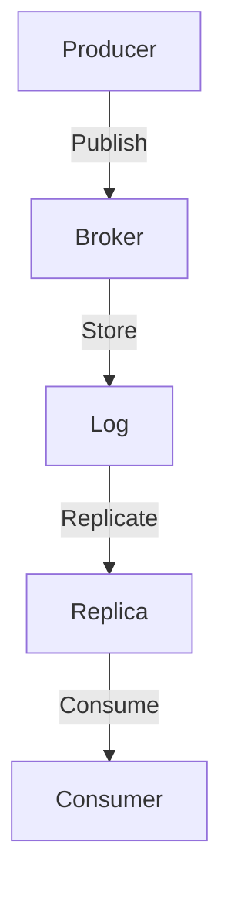

## B. Configuration Reference Sheets

**Description**: This section presents summarized reference sheets of essential Kafka configuration parameters for brokers, producers, consumers, and Kafka Streams, aiding in quick lookup and tuning. This guide is tailored for expert software engineers and enterprise architects who seek to optimize Kafka deployments for performance, reliability, and scalability.

---

### 1. Broker Configuration

The broker is the core component of Kafka, responsible for message storage and retrieval. Proper configuration of brokers is crucial for achieving high throughput and fault tolerance.

#### 1.1 General Broker Settings

- **`broker.id`**: Unique identifier for each broker in the cluster. Default is `0`. Ensure each broker has a unique ID.
- **`log.dirs`**: Directories where Kafka stores log data. Default is `/tmp/kafka-logs`. Use multiple directories for better I/O performance.
- **`num.network.threads`**: Number of threads handling network requests. Default is `3`. Increase for high network traffic.
- **`num.io.threads`**: Number of threads handling I/O operations. Default is `8`. Adjust based on disk performance.

#### 1.2 Log Configuration

- **`log.retention.hours`**: Duration to retain logs. Default is `168` hours (7 days). Adjust based on storage capacity and data retention policies.
- **`log.segment.bytes`**: Size of a single log segment file. Default is `1GB`. Smaller sizes can improve recovery time.
- **`log.cleanup.policy`**: Policy for log cleanup. Options are `delete` and `compact`. Use `compact` for topics requiring deduplication.

#### 1.3 Replication Configuration

- **`default.replication.factor`**: Default replication factor for topics. Default is `1`. Increase for higher fault tolerance.
- **`min.insync.replicas`**: Minimum number of replicas in sync for a write to succeed. Default is `1`. Set higher for stronger durability guarantees.

#### 1.4 Security Configuration

- **`ssl.keystore.location`**: Path to the keystore file for SSL. Ensure proper file permissions.
- **`sasl.mechanism.inter.broker.protocol`**: SASL mechanism for inter-broker communication. Options include `GSSAPI`, `PLAIN`, `SCRAM-SHA-256`, etc.

### 2. Producer Configuration

Producers are responsible for publishing messages to Kafka topics. Configuration affects message delivery guarantees and performance.

#### 2.1 General Producer Settings

- **`bootstrap.servers`**: List of broker addresses for initial connection. Ensure all brokers are reachable.
- **`acks`**: Number of acknowledgments required for a request. Options are `0`, `1`, `all`. Use `all` for strongest delivery guarantees.

#### 2.2 Performance Tuning

- **`batch.size`**: Size of batches for sending messages. Default is `16KB`. Larger batches can improve throughput.
- **`linger.ms`**: Time to wait before sending a batch. Default is `0`. Increase to allow more messages per batch.
- **`compression.type`**: Compression algorithm for messages. Options are `none`, `gzip`, `snappy`, `lz4`, `zstd`. Use `gzip` or `lz4` for better compression ratios.

#### 2.3 Reliability and Ordering

- **`enable.idempotence`**: Ensures exactly-once delivery semantics. Default is `false`. Enable for critical applications.
- **`max.in.flight.requests.per.connection`**: Maximum number of unacknowledged requests per connection. Default is `5`. Set to `1` for strict ordering.

### 3. Consumer Configuration

Consumers read messages from Kafka topics. Configuration impacts message consumption patterns and load balancing.

#### 3.1 General Consumer Settings

- **`group.id`**: Identifier for the consumer group. Ensure uniqueness across different applications.
- **`auto.offset.reset`**: Behavior when there is no initial offset. Options are `latest`, `earliest`, `none`. Use `earliest` for processing from the beginning.

#### 3.2 Performance Tuning

- **`fetch.min.bytes`**: Minimum amount of data to fetch in a request. Default is `1`. Increase for higher throughput.
- **`max.poll.records`**: Maximum number of records returned in a single poll. Default is `500`. Adjust based on processing capacity.

#### 3.3 Reliability and Fault Tolerance

- **`enable.auto.commit`**: Automatically commit offsets. Default is `true`. Disable for manual offset management.
- **`session.timeout.ms`**: Timeout for detecting consumer failures. Default is `10000` ms. Adjust based on network latency.

### 4. Kafka Streams Configuration

Kafka Streams is a client library for building real-time applications and microservices. Configuration affects state management and processing guarantees.

#### 4.1 General Streams Settings

- **`application.id`**: Unique identifier for the Kafka Streams application. Ensure uniqueness to avoid conflicts.
- **`bootstrap.servers`**: List of broker addresses for initial connection. Ensure all brokers are reachable.

#### 4.2 State Management

- **`state.dir`**: Directory for storing state. Default is `/tmp/kafka-streams`. Use a dedicated directory for production environments.
- **`cache.max.bytes.buffering`**: Maximum cache size for buffering records. Default is `10485760` (10MB). Increase for better performance.

#### 4.3 Processing Guarantees

- **`processing.guarantee`**: Level of processing guarantees. Options are `at_least_once`, `exactly_once`. Use `exactly_once` for critical applications.
- **`commit.interval.ms`**: Frequency of committing processed records. Default is `30000` ms. Decrease for lower latency.

### 5. Practical Applications and Real-World Scenarios

Understanding Kafka configuration is crucial for optimizing deployments. Here are some practical applications and scenarios:

- **High Throughput Applications**: Adjust `batch.size` and `linger.ms` for producers to increase throughput.
- **Fault-Tolerant Systems**: Increase `replication.factor` and `min.insync.replicas` for brokers to enhance durability.
- **Real-Time Analytics**: Use Kafka Streams with `exactly_once` processing guarantees for accurate analytics.

### 6. Visualizing Kafka Configuration

To better understand Kafka's architecture and data flow, consider the following diagram:

**Caption**: This diagram illustrates the flow of data from producers to brokers, storage in logs, replication to replicas, and consumption by consumers.

### 7. References and Links

For further reading and detailed configuration options, refer to the following resources:

- [Apache Kafka Documentation](https://kafka.apache.org/documentation/)
- [Confluent Documentation](https://docs.confluent.io/)

### 8. Knowledge Check

To reinforce your understanding of Kafka configuration, consider the following questions:

## Test Your Knowledge: Kafka Configuration Mastery Quiz



### What is the default value for `log.retention.hours` in Kafka broker configuration?

- [ ] 24 hours
- [ ] 72 hours
- [x] 168 hours
- [ ] 240 hours

> **Explanation:** The default value for `log.retention.hours` is 168 hours, which equals 7 days.

### Which configuration ensures exactly-once delivery semantics in Kafka producers?

- [ ] `acks=0`
- [ ] `acks=1`
- [x] `enable.idempotence=true`
- [ ] `compression.type=gzip`

> **Explanation:** Setting `enable.idempotence=true` ensures exactly-once delivery semantics in Kafka producers.

### What is the purpose of the `group.id` configuration in Kafka consumers?

- [x] To identify the consumer group
- [ ] To set the number of partitions
- [ ] To define the replication factor
- [ ] To specify the broker address

> **Explanation:** The `group.id` configuration is used to identify the consumer group in Kafka.

### Which setting in Kafka Streams controls the frequency of committing processed records?

- [ ] `state.dir`
- [ ] `cache.max.bytes.buffering`
- [x] `commit.interval.ms`
- [ ] `application.id`

> **Explanation:** The `commit.interval.ms` setting controls the frequency of committing processed records in Kafka Streams.

### What is the recommended setting for `acks` to achieve the strongest delivery guarantees in Kafka producers?

- [ ] `acks=0`
- [ ] `acks=1`
- [x] `acks=all`
- [ ] `acks=none`

> **Explanation:** Setting `acks=all` ensures the strongest delivery guarantees in Kafka producers.

### Which configuration parameter in Kafka brokers specifies the size of a single log segment file?

- [ ] `log.retention.hours`
- [x] `log.segment.bytes`
- [ ] `log.cleanup.policy`
- [ ] `log.dirs`

> **Explanation:** The `log.segment.bytes` parameter specifies the size of a single log segment file in Kafka brokers.

### What is the default value for `max.poll.records` in Kafka consumers?

- [ ] 100
- [ ] 250
- [x] 500
- [ ] 1000

> **Explanation:** The default value for `max.poll.records` in Kafka consumers is 500.

### Which Kafka Streams configuration option provides exactly-once processing guarantees?

- [ ] `state.dir`
- [ ] `cache.max.bytes.buffering`
- [x] `processing.guarantee=exactly_once`
- [ ] `commit.interval.ms`

> **Explanation:** Setting `processing.guarantee=exactly_once` provides exactly-once processing guarantees in Kafka Streams.

### What is the purpose of the `sasl.mechanism.inter.broker.protocol` configuration in Kafka brokers?

- [ ] To specify the log retention policy
- [ ] To define the number of network threads
- [x] To set the SASL mechanism for inter-broker communication
- [ ] To configure the replication factor

> **Explanation:** The `sasl.mechanism.inter.broker.protocol` configuration sets the SASL mechanism for inter-broker communication in Kafka brokers.

### True or False: Increasing the `batch.size` in Kafka producers can improve throughput.

- [x] True
- [ ] False

> **Explanation:** Increasing the `batch.size` allows more messages to be sent in a single batch, which can improve throughput.



---

By understanding and applying these Kafka configuration settings, you can optimize your Kafka deployments for various use cases, ensuring high performance, reliability, and scalability.
