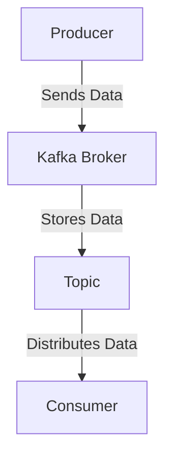
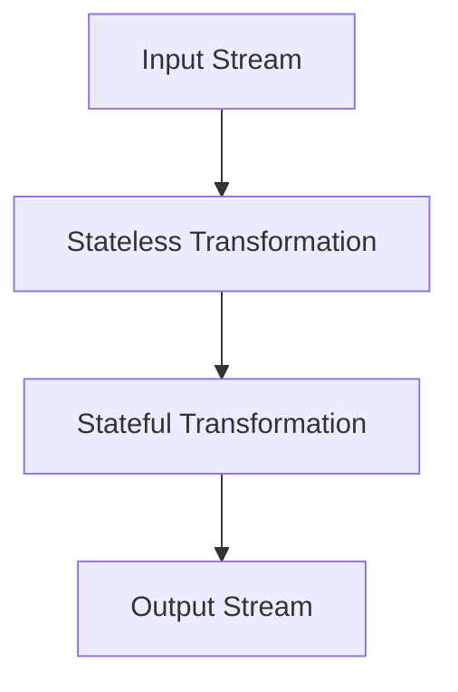

## E. Sample Code and GitHub Repositories

In this section, we provide a comprehensive collection of sample code and GitHub repositories that illustrate the concepts discussed throughout the guide. These resources are designed to help you explore practical implementations of Apache Kafka design patterns, best practices, and integration techniques. By engaging with these examples, you can deepen your understanding of Kafka's capabilities and apply them to your own projects.

### 1. Introduction to Sample Code Repositories

The following repositories contain a variety of code samples, including producers, consumers, and Kafka Streams applications. Each repository is accompanied by a description of its contents and purpose, along with instructions on how to clone and experiment with the code.

### 2. GitHub Repositories Overview

#### 2.1 Kafka Producers and Consumers

**Repository Name**: [Kafka-Producer-Consumer-Examples](https://github.com/example/Kafka-Producer-Consumer-Examples)

- **Description**: This repository contains examples of Kafka producers and consumers implemented in Java, Scala, Kotlin, and Clojure. It demonstrates how to configure and optimize producers and consumers for high throughput and low latency.
- **Purpose**: To provide a foundational understanding of Kafka's producer and consumer APIs, showcasing different configurations and optimization techniques.
- **Key Features**:
  - Basic producer and consumer examples in multiple languages.
  - Advanced configurations for performance tuning.
  - Examples of synchronous and asynchronous message sending.

**Java Example**:

```java
import org.apache.kafka.clients.producer.KafkaProducer;
import org.apache.kafka.clients.producer.ProducerRecord;
import java.util.Properties;

public class SimpleProducer {
    public static void main(String[] args) {
        Properties props = new Properties();
        props.put("bootstrap.servers", "localhost:9092");
        props.put("key.serializer", "org.apache.kafka.common.serialization.StringSerializer");
        props.put("value.serializer", "org.apache.kafka.common.serialization.StringSerializer");

        KafkaProducer<String, String> producer = new KafkaProducer<>(props);
        for (int i = 0; i < 10; i++) {
            producer.send(new ProducerRecord<>("my-topic", Integer.toString(i), "Message " + i));
        }
        producer.close();
    }
}
```

**Scala Example**:

```scala
import org.apache.kafka.clients.producer.{KafkaProducer, ProducerRecord}
import java.util.Properties

object SimpleProducer extends App {
  val props = new Properties()
  props.put("bootstrap.servers", "localhost:9092")
  props.put("key.serializer", "org.apache.kafka.common.serialization.StringSerializer")
  props.put("value.serializer", "org.apache.kafka.common.serialization.StringSerializer")

  val producer = new KafkaProducer[String, String](props)
  for (i <- 0 until 10) {
    producer.send(new ProducerRecord[String, String]("my-topic", i.toString, s"Message $i"))
  }
  producer.close()
}
```

**Kotlin Example**:

```kotlin
import org.apache.kafka.clients.producer.KafkaProducer
import org.apache.kafka.clients.producer.ProducerRecord
import java.util.Properties

fun main() {
    val props = Properties()
    props["bootstrap.servers"] = "localhost:9092"
    props["key.serializer"] = "org.apache.kafka.common.serialization.StringSerializer"
    props["value.serializer"] = "org.apache.kafka.common.serialization.StringSerializer"

    val producer = KafkaProducer<String, String>(props)
    for (i in 0..9) {
        producer.send(ProducerRecord("my-topic", i.toString(), "Message $i"))
    }
    producer.close()
}
```

**Clojure Example**:

```clojure
(ns simple-producer
  (:import [org.apache.kafka.clients.producer KafkaProducer ProducerRecord]
           [java.util Properties]))

(defn -main []
  (let [props (doto (Properties.)
                (.put "bootstrap.servers" "localhost:9092")
                (.put "key.serializer" "org.apache.kafka.common.serialization.StringSerializer")
                (.put "value.serializer" "org.apache.kafka.common.serialization.StringSerializer"))
        producer (KafkaProducer. props)]
    (doseq [i (range 10)]
      (.send producer (ProducerRecord. "my-topic" (str i) (str "Message " i))))
    (.close producer)))
```

### 3. Kafka Streams Applications

**Repository Name**: [Kafka-Streams-Examples](https://github.com/example/Kafka-Streams-Examples)

- **Description**: This repository features a collection of Kafka Streams applications, demonstrating various stream processing patterns such as stateless and stateful transformations, windowing, and joins.
- **Purpose**: To illustrate the capabilities of the Kafka Streams API and provide examples of real-time stream processing applications.
- **Key Features**:
  - Examples of stateless and stateful transformations.
  - Windowing and aggregation examples.
  - Stream-stream and stream-table join examples.

**Java Example**:

```java
import org.apache.kafka.streams.KafkaStreams;
import org.apache.kafka.streams.StreamsBuilder;
import org.apache.kafka.streams.StreamsConfig;
import org.apache.kafka.streams.kstream.KStream;

import java.util.Properties;

public class SimpleStreamApp {
    public static void main(String[] args) {
        Properties props = new Properties();
        props.put(StreamsConfig.APPLICATION_ID_CONFIG, "simple-stream-app");
        props.put(StreamsConfig.BOOTSTRAP_SERVERS_CONFIG, "localhost:9092");

        StreamsBuilder builder = new StreamsBuilder();
        KStream<String, String> source = builder.stream("input-topic");
        source.to("output-topic");

        KafkaStreams streams = new KafkaStreams(builder.build(), props);
        streams.start();
    }
}
```

**Scala Example**:

```scala
import org.apache.kafka.streams.{KafkaStreams, StreamsBuilder, StreamsConfig}
import org.apache.kafka.streams.kstream.KStream
import java.util.Properties

object SimpleStreamApp extends App {
  val props = new Properties()
  props.put(StreamsConfig.APPLICATION_ID_CONFIG, "simple-stream-app")
  props.put(StreamsConfig.BOOTSTRAP_SERVERS_CONFIG, "localhost:9092")

  val builder = new StreamsBuilder()
  val source: KStream[String, String] = builder.stream("input-topic")
  source.to("output-topic")

  val streams = new KafkaStreams(builder.build(), props)
  streams.start()
}
```

**Kotlin Example**:

```kotlin
import org.apache.kafka.streams.KafkaStreams
import org.apache.kafka.streams.StreamsBuilder
import org.apache.kafka.streams.StreamsConfig
import org.apache.kafka.streams.kstream.KStream
import java.util.Properties

fun main() {
    val props = Properties()
    props[StreamsConfig.APPLICATION_ID_CONFIG] = "simple-stream-app"
    props[StreamsConfig.BOOTSTRAP_SERVERS_CONFIG] = "localhost:9092"

    val builder = StreamsBuilder()
    val source: KStream<String, String> = builder.stream("input-topic")
    source.to("output-topic")

    val streams = KafkaStreams(builder.build(), props)
    streams.start()
}
```

**Clojure Example**:

```clojure
(ns simple-stream-app
  (:import [org.apache.kafka.streams KafkaStreams StreamsBuilder StreamsConfig]
           [org.apache.kafka.streams.kstream KStream]
           [java.util Properties]))

(defn -main []
  (let [props (doto (Properties.)
                (.put StreamsConfig/APPLICATION_ID_CONFIG "simple-stream-app")
                (.put StreamsConfig/BOOTSTRAP_SERVERS_CONFIG "localhost:9092"))
        builder (StreamsBuilder.)
        source (.stream builder "input-topic")]
    (.to source "output-topic")
    (let [streams (KafkaStreams. (.build builder) props)]
      (.start streams))))
```

### 4. Advanced Kafka Patterns and Use Cases

**Repository Name**: [Advanced-Kafka-Patterns](https://github.com/example/Advanced-Kafka-Patterns)

- **Description**: This repository explores advanced Kafka design patterns, including event sourcing, CQRS, and the outbox pattern. It provides examples of how to implement these patterns using Kafka.
- **Purpose**: To demonstrate the application of advanced design patterns in Kafka, helping developers build robust and scalable systems.
- **Key Features**:
  - Event sourcing and CQRS examples.
  - Implementation of the outbox pattern for reliable messaging.
  - Examples of integrating Kafka with microservices architectures.

### 5. Experimentation and Exploration

We encourage readers to clone these repositories and experiment with the code. By modifying the examples, you can gain a deeper understanding of Kafka's features and how they can be applied to solve real-world problems. Consider exploring different configurations, adding new features, or integrating with other systems to see how Kafka can enhance your applications.

### 6. Visualizing Kafka Concepts

To aid in understanding complex Kafka concepts, we provide visual diagrams that illustrate key patterns and architectures.

#### 6.1 Kafka Architecture Diagram



**Caption**: This diagram illustrates the basic flow of data in a Kafka architecture, from producer to broker, and finally to consumer.

#### 6.2 Stream Processing Topology



**Caption**: This diagram represents a simple stream processing topology, showing the flow of data through stateless and stateful transformations.

### 7. References and Further Reading

- [Apache Kafka Documentation](https://kafka.apache.org/documentation/)
- [Confluent Documentation](https://docs.confluent.io/)
- [Kafka GitHub Repository](https://github.com/apache/kafka)

### 8. Knowledge Check

To reinforce your understanding of the material, we provide a series of questions and exercises.

## Test Your Knowledge: Apache Kafka Sample Code and Repositories Quiz



### Which repository contains examples of Kafka producers and consumers?

- [x] Kafka-Producer-Consumer-Examples
- [ ] Kafka-Streams-Examples
- [ ] Advanced-Kafka-Patterns
- [ ] None of the above

> **Explanation:** The Kafka-Producer-Consumer-Examples repository contains examples of Kafka producers and consumers.

### What is the purpose of the Kafka-Streams-Examples repository?

- [x] To illustrate the capabilities of the Kafka Streams API
- [ ] To provide examples of Kafka producers and consumers
- [ ] To explore advanced Kafka design patterns
- [ ] To demonstrate Kafka's integration with microservices

> **Explanation:** The Kafka-Streams-Examples repository is designed to illustrate the capabilities of the Kafka Streams API.

### Which language is NOT included in the Kafka-Producer-Consumer-Examples repository?

- [ ] Java
- [ ] Scala
- [ ] Kotlin
- [x] Python

> **Explanation:** The Kafka-Producer-Consumer-Examples repository includes examples in Java, Scala, Kotlin, and Clojure, but not Python.

### What pattern is demonstrated in the Advanced-Kafka-Patterns repository?

- [x] Event sourcing
- [ ] Stateless transformations
- [ ] Basic producer-consumer model
- [ ] None of the above

> **Explanation:** The Advanced-Kafka-Patterns repository demonstrates the event sourcing pattern.

### What is the main focus of the Kafka-Streams-Examples repository?

- [x] Stream processing patterns
- [ ] Producer configurations
- [ ] Consumer optimizations
- [ ] Data serialization

> **Explanation:** The Kafka-Streams-Examples repository focuses on stream processing patterns.

### Which diagram illustrates the basic flow of data in a Kafka architecture?

- [x] Kafka Architecture Diagram
- [ ] Stream Processing Topology
- [ ] Event Sourcing Diagram
- [ ] None of the above

> **Explanation:** The Kafka Architecture Diagram illustrates the basic flow of data in a Kafka architecture.

### What is the purpose of the Advanced-Kafka-Patterns repository?

- [x] To demonstrate advanced Kafka design patterns
- [ ] To provide basic producer and consumer examples
- [ ] To illustrate Kafka Streams capabilities
- [ ] To visualize Kafka concepts

> **Explanation:** The Advanced-Kafka-Patterns repository is designed to demonstrate advanced Kafka design patterns.

### Which repository would you explore to learn about the outbox pattern?

- [ ] Kafka-Producer-Consumer-Examples
- [ ] Kafka-Streams-Examples
- [x] Advanced-Kafka-Patterns
- [ ] None of the above

> **Explanation:** The Advanced-Kafka-Patterns repository includes examples of the outbox pattern.

### What is the main advantage of experimenting with the provided code repositories?

- [x] Gaining a deeper understanding of Kafka's features
- [ ] Learning a new programming language
- [ ] Reducing development time
- [ ] Avoiding the need for documentation

> **Explanation:** Experimenting with the provided code repositories helps gain a deeper understanding of Kafka's features.

### True or False: The Kafka-Streams-Examples repository includes examples of integrating Kafka with microservices.

- [ ] True
- [x] False

> **Explanation:** The Kafka-Streams-Examples repository focuses on stream processing patterns, not microservices integration.



By engaging with these resources and exercises, you can enhance your expertise in Apache Kafka and apply these concepts to build robust, scalable systems.
