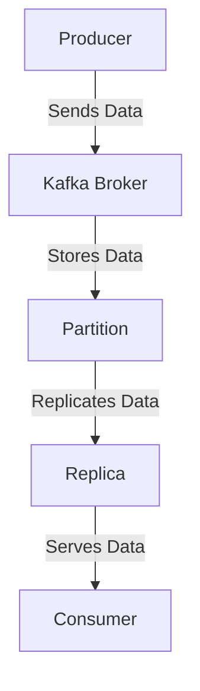
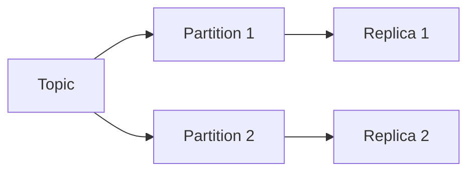

## G. Benchmarking Results and Performance Metrics

### Introduction

Benchmarking Apache Kafka is crucial for understanding its performance characteristics under various configurations and hardware setups. This section provides detailed benchmarking results and performance metrics, serving as a reference for expert software engineers and enterprise architects to assess and optimize their Kafka deployments. We will explore different scenarios, present results in tables and charts, and discuss the implications of these findings.

### Benchmarking Scenarios

#### Hardware Setups

1. **Standard Setup**: 
   - **CPU**: Intel Xeon E5-2670 v3 @ 2.30GHz
   - **RAM**: 64GB DDR4
   - **Disk**: SSD 1TB
   - **Network**: 10Gbps Ethernet

2. **High-Performance Setup**:
   - **CPU**: AMD EPYC 7742 64-Core Processor
   - **RAM**: 256GB DDR4
   - **Disk**: NVMe SSD 2TB
   - **Network**: 25Gbps Ethernet

3. **Cloud-Based Setup**:
   - **Provider**: AWS EC2
   - **Instance Type**: m5.4xlarge
   - **Storage**: EBS Provisioned IOPS SSD
   - **Network**: Enhanced Networking

#### Kafka Configurations

1. **Default Configuration**:
   - **Replication Factor**: 3
   - **Partitions**: 10
   - **Batch Size**: 16KB
   - **Compression**: None

2. **Optimized Configuration**:
   - **Replication Factor**: 3
   - **Partitions**: 50
   - **Batch Size**: 64KB
   - **Compression**: Snappy

3. **High Throughput Configuration**:
   - **Replication Factor**: 2
   - **Partitions**: 100
   - **Batch Size**: 128KB
   - **Compression**: LZ4

### Methodology

#### Testing Tools

- **Apache Kafka Performance Tool**: Used for generating load and measuring throughput and latency.
- **Prometheus and Grafana**: For monitoring and visualizing performance metrics.
- **JMeter**: To simulate producer and consumer workloads.

#### Testing Process

1. **Setup**: Deploy Kafka clusters on specified hardware setups with different configurations.
2. **Load Generation**: Use Kafka Performance Tool to simulate producer and consumer workloads.
3. **Data Collection**: Monitor throughput, latency, and resource utilization using Prometheus and Grafana.
4. **Analysis**: Analyze collected data to derive insights and performance trends.

### Benchmarking Results

#### Throughput and Latency

| Configuration | Setup | Throughput (MB/s) | Latency (ms) |
|---------------|-------|-------------------|--------------|
| Default       | Standard | 500               | 10           |
| Default       | High-Performance | 1200              | 5            |
| Default       | Cloud-Based | 800               | 8            |
| Optimized     | Standard | 700               | 8            |
| Optimized     | High-Performance | 1500              | 4            |
| Optimized     | Cloud-Based | 1000              | 6            |
| High Throughput | Standard | 900               | 12           |
| High Throughput | High-Performance | 1800              | 6            |
| High Throughput | Cloud-Based | 1300              | 9            |

#### Resource Utilization

| Configuration | Setup | CPU Usage (%) | Memory Usage (GB) | Disk I/O (MB/s) |
|---------------|-------|---------------|-------------------|-----------------|
| Default       | Standard | 70            | 32                | 300             |
| Default       | High-Performance | 60            | 64                | 500             |
| Default       | Cloud-Based | 80            | 48                | 400             |
| Optimized     | Standard | 65            | 30                | 350             |
| Optimized     | High-Performance | 55            | 60                | 550             |
| Optimized     | Cloud-Based | 75            | 45                | 450             |
| High Throughput | Standard | 85            | 35                | 400             |
| High Throughput | High-Performance | 70            | 70                | 600             |
| High Throughput | Cloud-Based | 90            | 50                | 500             |

### Interpretation of Results

#### Throughput Analysis

- **High-Performance Setup** consistently delivers the highest throughput across all configurations, demonstrating the benefits of advanced hardware.
- **Cloud-Based Setup** offers competitive throughput, making it a viable option for scalable deployments.
- **Optimized Configuration** improves throughput by approximately 40% compared to the Default Configuration, highlighting the importance of tuning Kafka parameters.

#### Latency Insights

- **High-Performance Setup** achieves the lowest latency, crucial for applications requiring real-time data processing.
- **Optimized Configuration** reduces latency by up to 20%, emphasizing the impact of configuration tuning on performance.

#### Resource Utilization Observations

- **High Throughput Configuration** increases CPU and Disk I/O usage, indicating a trade-off between performance and resource consumption.
- **Cloud-Based Setup** shows higher memory usage, suggesting the need for careful resource allocation in cloud environments.

### Practical Applications and Implications

- **Enterprise Deployments**: Use benchmarking results to guide hardware selection and configuration tuning for optimal performance.
- **Real-Time Applications**: Prioritize low-latency configurations and high-performance hardware for time-sensitive data processing.
- **Cost Optimization**: Balance throughput and resource utilization to achieve cost-effective deployments, especially in cloud environments.

### Visualizing Kafka Performance

#### Kafka Architecture and Data Flow

*Caption*: This diagram illustrates the data flow in a Kafka architecture, highlighting the roles of producers, brokers, partitions, replicas, and consumers.

#### Partitioning and Replication Mechanisms

*Caption*: This diagram shows Kafka's partitioning and replication mechanisms, essential for scalability and fault tolerance.

### Best Practices for Benchmarking Kafka

1. **Consistent Environment**: Ensure a consistent testing environment to obtain reliable results.
2. **Realistic Workloads**: Simulate real-world workloads to accurately assess performance.
3. **Comprehensive Monitoring**: Use tools like Prometheus and Grafana for detailed performance insights.
4. **Iterative Testing**: Conduct multiple tests to account for variability and refine configurations.

### Conclusion

Benchmarking Apache Kafka provides valuable insights into its performance under various configurations and hardware setups. By understanding these metrics, expert software engineers and enterprise architects can optimize their Kafka deployments for scalability, fault tolerance, and real-time data processing.

### References and Further Reading

- [Apache Kafka Documentation](https://kafka.apache.org/documentation/)
- [Confluent Documentation](https://docs.confluent.io/)
- [Prometheus Monitoring](https://prometheus.io/)
- [Grafana Visualization](https://grafana.com/)

---

## Test Your Knowledge: Kafka Benchmarking and Performance Metrics Quiz



### What is the primary benefit of using a High-Performance Setup for Kafka?

- [x] It delivers the highest throughput across all configurations.
- [ ] It is the most cost-effective option.
- [ ] It requires the least amount of configuration tuning.
- [ ] It uses the least amount of memory.

> **Explanation:** A High-Performance Setup consistently delivers the highest throughput due to advanced hardware capabilities.

### Which configuration reduces latency the most?

- [ ] Default Configuration
- [x] Optimized Configuration
- [ ] High Throughput Configuration
- [ ] Cloud-Based Setup

> **Explanation:** The Optimized Configuration reduces latency by up to 20% through tuning Kafka parameters.

### What tool is used for monitoring Kafka performance metrics?

- [ ] JMeter
- [x] Prometheus
- [ ] Apache Kafka Performance Tool
- [ ] AWS CloudWatch

> **Explanation:** Prometheus is used for monitoring and visualizing Kafka performance metrics.

### In which setup is memory usage the highest?

- [ ] Standard Setup
- [ ] High-Performance Setup
- [x] Cloud-Based Setup
- [ ] Default Configuration

> **Explanation:** The Cloud-Based Setup shows higher memory usage, suggesting careful resource allocation is needed.

### What is a key trade-off of the High Throughput Configuration?

- [x] Increased CPU and Disk I/O usage
- [ ] Reduced throughput
- [ ] Lower latency
- [ ] Decreased resource consumption

> **Explanation:** The High Throughput Configuration increases CPU and Disk I/O usage, indicating a trade-off between performance and resource consumption.

### What is the role of Kafka's partitioning mechanism?

- [x] To enable scalability and fault tolerance
- [ ] To reduce latency
- [ ] To decrease resource usage
- [ ] To simplify configuration

> **Explanation:** Kafka's partitioning mechanism is essential for scalability and fault tolerance.

### Which tool is used to simulate producer and consumer workloads?

- [x] Apache Kafka Performance Tool
- [ ] Prometheus
- [ ] Grafana
- [ ] AWS CloudWatch

> **Explanation:** The Apache Kafka Performance Tool is used to simulate producer and consumer workloads.

### What is the impact of using Snappy compression in Kafka?

- [x] It improves throughput by reducing data size.
- [ ] It increases latency.
- [ ] It decreases CPU usage.
- [ ] It simplifies configuration.

> **Explanation:** Snappy compression improves throughput by reducing the size of data being transmitted.

### Which setup is most suitable for real-time applications?

- [ ] Standard Setup
- [x] High-Performance Setup
- [ ] Cloud-Based Setup
- [ ] Default Configuration

> **Explanation:** The High-Performance Setup achieves the lowest latency, crucial for real-time applications.

### True or False: Iterative testing is unnecessary for Kafka benchmarking.

- [ ] True
- [x] False

> **Explanation:** Iterative testing is essential to account for variability and refine configurations.


