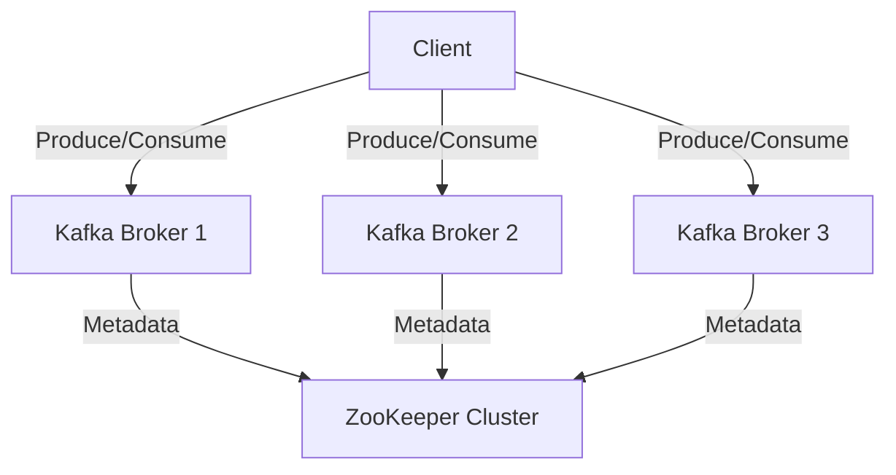

## 3.1.1 Deploying Kafka On-Premises and in the Cloud

Apache Kafka is a powerful distributed event streaming platform, and deploying it effectively is crucial for leveraging its full potential. This section explores the intricacies of deploying Kafka both on-premises and in the cloud, providing expert guidance on infrastructure provisioning, configuration, and operational considerations.

### On-Premises Deployment

Deploying Kafka on-premises involves setting up Kafka clusters within your own data centers. This approach offers complete control over the hardware and network configuration, allowing for tailored optimizations and security measures.

#### Infrastructure Provisioning

1. **Hardware Selection**: Choose servers with high I/O throughput, ample memory, and sufficient CPU resources. SSDs are recommended for storage to enhance performance.

2. **Network Configuration**: Ensure low-latency, high-bandwidth network connections between Kafka brokers. Consider using dedicated network interfaces for Kafka traffic.

3. **Cluster Sizing**: Determine the number of brokers based on expected load, data retention policies, and fault tolerance requirements. A minimum of three brokers is recommended for redundancy.

4. **Zookeeper Setup**: Deploy ZooKeeper on separate nodes to manage Kafka's metadata and ensure high availability. Consider using an odd number of ZooKeeper nodes to maintain quorum.

#### Installation and Configuration

1. **Kafka Installation**: Download and install Kafka from the [Apache Kafka website](https://kafka.apache.org/downloads). Follow the installation guide specific to your operating system.

2. **Configuration Files**: Edit the `server.properties` file to configure broker settings such as `broker.id`, `log.dirs`, `zookeeper.connect`, and `listeners`.

3. **Security Configuration**: Implement SSL/TLS for encryption and SASL for authentication. Configure Access Control Lists (ACLs) to manage permissions.

4. **Monitoring and Management**: Set up monitoring tools like Prometheus and Grafana to track Kafka metrics. Use tools like Kafka Manager for cluster administration.

#### Advantages of On-Premises Deployment

- **Control**: Full control over hardware, network, and security configurations.
- **Customization**: Ability to tailor the environment to specific performance and compliance requirements.
- **Data Sovereignty**: Ensures data remains within organizational boundaries, addressing regulatory concerns.

#### Challenges of On-Premises Deployment

- **Cost**: High upfront costs for hardware and ongoing maintenance expenses.
- **Scalability**: Limited by physical infrastructure, requiring significant effort to scale.
- **Complexity**: Requires in-house expertise for setup, configuration, and management.

### Cloud Deployment

Cloud deployment offers flexibility, scalability, and reduced operational overhead. Kafka can be deployed on Infrastructure as a Service (IaaS) or Platform as a Service (PaaS) offerings from major cloud providers.

#### Infrastructure as a Service (IaaS)

IaaS provides virtualized computing resources over the internet, allowing you to deploy and manage Kafka clusters on virtual machines.

1. **Provider Selection**: Choose a cloud provider such as AWS, Azure, or Google Cloud. Evaluate based on pricing, available services, and regional availability.

2. **Instance Configuration**: Select instance types optimized for high I/O and network performance. Consider using dedicated instances for Kafka brokers.

3. **Storage Options**: Use cloud storage solutions like AWS EBS, Azure Managed Disks, or Google Persistent Disks. Ensure they are configured for high throughput and low latency.

4. **Networking**: Configure Virtual Private Clouds (VPCs) and security groups to manage network access. Use load balancers for distributing traffic across brokers.

5. **Automation**: Leverage Infrastructure as Code (IaC) tools like Terraform or Ansible for automated provisioning and configuration.

#### Platform as a Service (PaaS)

PaaS offerings provide managed Kafka services, abstracting infrastructure management and offering simplified deployment and scaling.

1. **Managed Services**: Consider services like Confluent Cloud, Amazon MSK, or Azure Event Hubs for Kafka. These services handle infrastructure management, scaling, and maintenance.

2. **Configuration**: Use the provider's console or APIs to configure Kafka settings, security, and monitoring.

3. **Integration**: Leverage built-in integrations with other cloud services for data processing, storage, and analytics.

#### Advantages of Cloud Deployment

- **Scalability**: Easily scale up or down based on demand without physical constraints.
- **Cost Efficiency**: Pay-as-you-go pricing models reduce upfront costs and allow for cost optimization.
- **Reduced Complexity**: Managed services simplify deployment and maintenance, freeing up resources for other tasks.

#### Challenges of Cloud Deployment

- **Vendor Lock-In**: Dependence on a single cloud provider can limit flexibility and increase switching costs.
- **Data Security**: Ensuring data security and compliance in a shared environment requires careful configuration.
- **Latency**: Network latency can be higher compared to on-premises deployments, impacting performance.

### Comparing On-Premises and Cloud Deployment

| Aspect               | On-Premises                               | Cloud                                      |
|----------------------|-------------------------------------------|--------------------------------------------|
| **Control**          | Full control over environment             | Limited control, managed by provider       |
| **Scalability**      | Limited by physical infrastructure        | Virtually unlimited, easy to scale         |
| **Cost**             | High upfront and maintenance costs        | Pay-as-you-go, operational expenses        |
| **Security**         | Complete control over security measures   | Shared responsibility model                |
| **Customization**    | Highly customizable                       | Limited customization options              |
| **Compliance**       | Easier to ensure data sovereignty         | Requires careful configuration             |

### Considerations for Choosing Between On-Premises and Cloud

1. **Business Requirements**: Assess your organization's specific needs, including control, compliance, and budget constraints.

2. **Data Sensitivity**: Consider the sensitivity of the data being processed and stored. On-premises may be preferred for highly sensitive data.

3. **Scalability Needs**: Evaluate the expected growth and scalability requirements. Cloud offers more flexibility for dynamic scaling.

4. **Expertise**: Consider the available in-house expertise for managing Kafka deployments. Cloud services can reduce the need for specialized skills.

5. **Cost Analysis**: Perform a detailed cost analysis comparing the total cost of ownership for both deployment models.

### Practical Applications and Real-World Scenarios

- **Financial Services**: On-premises deployments are often preferred for financial institutions due to stringent compliance and data sovereignty requirements.
- **E-commerce**: Cloud deployments offer the scalability needed to handle fluctuating traffic during peak shopping seasons.
- **Healthcare**: On-premises deployments can ensure data privacy and compliance with regulations like HIPAA.
- **Media and Entertainment**: Cloud deployments provide the flexibility to handle large volumes of streaming data and content delivery.

### Code Examples for Deployment

Below are code snippets demonstrating how to deploy Kafka on different platforms using Infrastructure as Code (IaC) tools.

#### Terraform Example for AWS

```hcl
provider "aws" {
  region = "us-west-2"
}

resource "aws_instance" "kafka_broker" {
  ami           = "ami-0abcdef1234567890"
  instance_type = "m5.large"

  tags = {
    Name = "KafkaBroker"
  }
}

resource "aws_security_group" "kafka_sg" {
  name = "kafka-security-group"

  ingress {
    from_port   = 9092
    to_port     = 9092
    protocol    = "tcp"
    cidr_blocks = ["0.0.0.0/0"]
  }
}
```

#### Ansible Playbook for On-Premises Deployment

```yaml
- name: Deploy Kafka on-premises
  hosts: kafka_brokers
  become: yes
  tasks:
    - name: Install Java
      apt:
        name: openjdk-11-jdk
        state: present

    - name: Download Kafka
      get_url:
        url: https://downloads.apache.org/kafka/3.0.0/kafka_2.13-3.0.0.tgz
        dest: /tmp/kafka.tgz

    - name: Extract Kafka
      unarchive:
        src: /tmp/kafka.tgz
        dest: /opt
        remote_src: yes

    - name: Configure Kafka
      template:
        src: templates/server.properties.j2
        dest: /opt/kafka/config/server.properties

    - name: Start Kafka service
      systemd:
        name: kafka
        state: started
        enabled: yes
```

### Visualizing Kafka Deployment Architectures

#### On-Premises Deployment Architecture



*Caption*: This diagram illustrates a typical on-premises Kafka deployment with multiple brokers and a ZooKeeper cluster for metadata management.

#### Cloud Deployment Architecture

```mermaid
graph TD;
    A[Client] -->|Produce/Consume| B[Kafka Broker (AWS EC2)];
    A -->|Produce/Consume| C[Kafka Broker (AWS EC2)];
    A -->|Produce/Consume| D[Kafka Broker (AWS EC2)];
    B -->|Metadata| E[Amazon MSK];
    C -->|Metadata| E;
    D -->|Metadata| E;
```

*Caption*: This diagram shows a cloud-based Kafka deployment using Amazon MSK, with brokers running on EC2 instances.

### Knowledge Check

To reinforce your understanding of Kafka deployment strategies, consider the following questions:

1. What are the key differences between on-premises and cloud deployments of Kafka?
2. How does Infrastructure as a Service (IaaS) differ from Platform as a Service (PaaS) in the context of Kafka deployment?
3. What are the advantages of using managed Kafka services in the cloud?
4. How can Infrastructure as Code (IaC) tools like Terraform and Ansible simplify Kafka deployments?
5. What factors should be considered when choosing between on-premises and cloud deployment models?

### Conclusion

Deploying Kafka on-premises or in the cloud involves careful consideration of various factors, including control, scalability, cost, and compliance. By understanding the strengths and limitations of each deployment model, organizations can make informed decisions that align with their strategic goals and operational requirements.

## Test Your Knowledge: Kafka Deployment Strategies Quiz



### What is a key advantage of deploying Kafka on-premises?

- [x] Full control over hardware and network configurations.
- [ ] Lower upfront costs compared to cloud deployment.
- [ ] Easier scalability.
- [ ] Reduced complexity in setup and management.

> **Explanation:** Deploying Kafka on-premises provides full control over hardware and network configurations, allowing for tailored optimizations and security measures.

### Which cloud deployment model offers managed Kafka services?

- [ ] Infrastructure as a Service (IaaS)
- [x] Platform as a Service (PaaS)
- [ ] Software as a Service (SaaS)
- [ ] Function as a Service (FaaS)

> **Explanation:** Platform as a Service (PaaS) offers managed Kafka services, abstracting infrastructure management and offering simplified deployment and scaling.

### What is a disadvantage of cloud deployment for Kafka?

- [ ] Limited scalability.
- [x] Potential for vendor lock-in.
- [ ] High upfront costs.
- [ ] Lack of automation tools.

> **Explanation:** Cloud deployment can lead to vendor lock-in, as dependence on a single cloud provider can limit flexibility and increase switching costs.

### Which tool is commonly used for Infrastructure as Code (IaC) in cloud deployments?

- [ ] Docker
- [ ] Kubernetes
- [x] Terraform
- [ ] Jenkins

> **Explanation:** Terraform is a popular Infrastructure as Code (IaC) tool used for automating the provisioning and management of cloud resources.

### What should be considered when choosing between on-premises and cloud deployment?

- [x] Business requirements and data sensitivity.
- [ ] Only the cost of hardware.
- [ ] The number of available data centers.
- [ ] The type of network cables used.

> **Explanation:** When choosing between on-premises and cloud deployment, consider business requirements, data sensitivity, scalability needs, and available expertise.

### What is a benefit of using managed Kafka services in the cloud?

- [ ] Full control over the environment.
- [x] Simplified deployment and maintenance.
- [ ] Lower network latency.
- [ ] Unlimited customization options.

> **Explanation:** Managed Kafka services in the cloud simplify deployment and maintenance, freeing up resources for other tasks.

### How does Infrastructure as a Service (IaaS) differ from Platform as a Service (PaaS)?

- [x] IaaS provides virtualized computing resources, while PaaS offers managed services.
- [ ] IaaS is more expensive than PaaS.
- [ ] IaaS is easier to scale than PaaS.
- [ ] IaaS is only available on AWS.

> **Explanation:** Infrastructure as a Service (IaaS) provides virtualized computing resources, allowing you to deploy and manage Kafka clusters on virtual machines, while Platform as a Service (PaaS) offers managed services.

### What is a common challenge of on-premises Kafka deployment?

- [ ] Lack of control over security measures.
- [ ] High network latency.
- [x] High upfront and maintenance costs.
- [ ] Limited data sovereignty.

> **Explanation:** On-premises Kafka deployment involves high upfront and maintenance costs due to the need for physical infrastructure and ongoing management.

### Which cloud provider offers Amazon MSK for Kafka deployment?

- [x] AWS
- [ ] Azure
- [ ] Google Cloud
- [ ] IBM Cloud

> **Explanation:** Amazon MSK (Managed Streaming for Kafka) is a managed Kafka service offered by AWS.

### True or False: On-premises Kafka deployments offer easier scalability compared to cloud deployments.

- [ ] True
- [x] False

> **Explanation:** On-premises Kafka deployments are limited by physical infrastructure, making scalability more challenging compared to the virtually unlimited scalability offered by cloud deployments.


